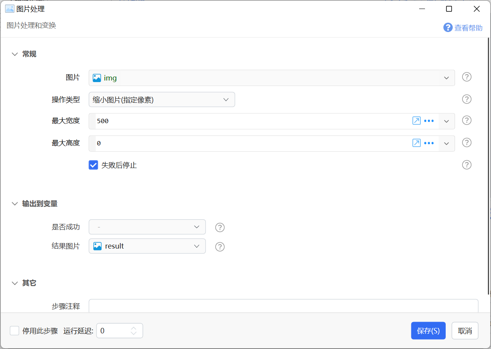
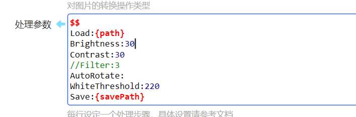
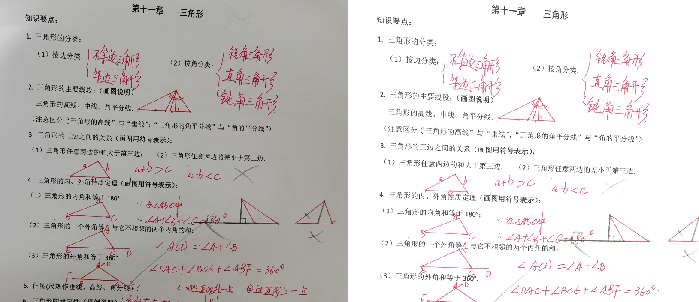
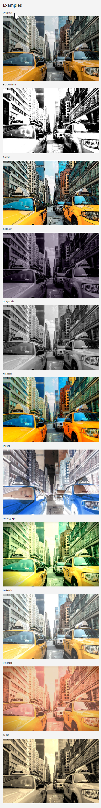
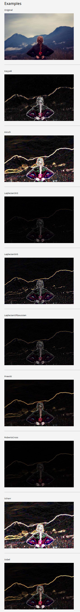
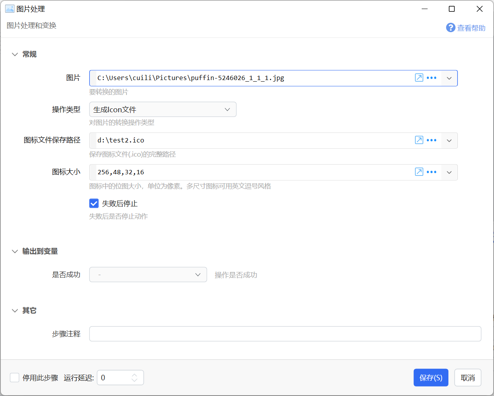

# 图片处理

图片处理和变换

{/* xaction-metadata:start */}
## 当前模块定义

- 模块 Key：`sys:imgProcess`
- 分类：图片处理（`Image`）
- 类型：`Action`
- 风险操作：否
- 专业版：否

## 输入参数

| Key | 名称 | 类型 | 默认值 | 必填 | 变量模式 | 条件 | 说明 |
| --- | --- | --- | --- | --- | --- | --- | --- |
| `img` | 图片 | `Image` |  | 是 | `UseVar` |  | 要转换的图片 |
| `type` | 操作类型 | `Enum` | resize_percent | 是 | `Input` |  | 对图片的转换操作类型 |
| `resizePercent` | 缩放比例 | `Number` | 50 | 否 | `UseVarOrInput` | 仅：resize_percent | 缩小或放大到原来的百分之多少 |
| `maxWidth` | 最大宽度 | `Integer` | 0 | 否 | `UseVarOrInput` | 仅：resize_pixel | 最大宽度(像素数)，0表示自动 |
| `maxHeight` | 最大高度 | `Integer` | 0 | 否 | `UseVarOrInput` | 仅：resize_pixel | 最大高度(像素数)，0表示自动 |
| `rotation` | 旋转方式 | `Integer` | 0 | 否 | `UseVarOrInput` | 仅：Rotate | 顺时针角度。0:不旋转, 1:90°, 2:180°, 3:270°, 其他值请参考模块文档。 |
| `filterParams` | 处理参数 | `Text` |  | 否 | `Input` | 仅：Filters | 每行设定一个处理步骤，具体设置请参考文档 |
| `iconFilePath` | 图标文件保存路径 | `Text` |  | 是 | `UseVarOrInput` | 仅：GenerateIco | 保存图标文件(.ico)的完整路径 |
| `iconSize` | 图标大小 | `Text` | 256,48,32,16 | 是 | `UseVarOrInput` | 仅：GenerateIco | 图标中的位图大小，单位为像素。多尺寸图标可用英文逗号风格 |
| `iconScaling` | 缩放采样 | `Enum` | HighQualityBicubic | 否 | `Input` | 仅：GenerateIco | 自动：整数倍放大使用邻近采样，大比例缩小使用 Lanczos，其余使用高质量双三次 |
| `stopIfFail` | 失败后停止 | `Boolean` | true | 否 | `Input` |  | 失败后是否停止动作 |

## 输出参数

| Key | 名称 | 类型 | 条件 | 说明 |
| --- | --- | --- | --- | --- |
| `isSuccess` | 是否成功 | `Boolean` |  | 操作是否成功 |
| `result` | 结果图片 | `Image` | 仅：Clone, resize_percent, resize_pixel, Filters | 处理后的图片 |

## 选项值

### `type` 操作类型

| Value | 名称 | 说明 |
| --- | --- | --- |
| `resize_percent` | 缩放图片(指定比例) |  |
| `resize_pixel` | 缩小图片(指定像素) |  |
| `Clone` | 复制图片 |  |
| `Invert` | 反色 |  |
| `GrayScale` | 灰度 |  |
| `Rotate` | 旋转 |  |
| `Filters` | 组合处理 |  |
| `GenerateIco` | 生成图标文件(.ico) |  |

### `iconScaling` 缩放采样

| Value | 名称 | 说明 |
| --- | --- | --- |
| `Auto` | 自动 |  |
| `NearestNeighbor` | 像素化（邻近采样） |  |
| `HighQualityBilinear` | 清晰（高质量双线性） |  |
| `HighQualityBicubic` | 平滑（高质量双三次） |  |
| `Lanczos` | 锐利（Lanczos） |  |
| `Box` | 区域平均（Box） |  |
{/* xaction-metadata:end */}

对图片进行变换处理后输出。





## 常规处理

**输入参数**

【图片】要处理的图片变量，或完整的本地图片路径。

【操作类型】对图片进行的操作，可选值为：

-   缩小图片（指定比例）：按比例缩小图片；
-   缩小图片（指定像素）：按最长边像素数缩小图片；
-   复制图片：复制一份新的图片对象。有些图片操作是在参数中提供的图片对象上直接进行，如果不希望原始图片被修改，可以先复制一份出来以后对复制生成的图片进行处理。
-   反色：图片取反色。
-   灰度：图片转换为灰度图片。
-   旋转图片：根据指定的角度和翻转规则旋转或翻转图片。请参考【旋转方式】参数的说明。
-   **组合处理：请参考后面的章节。**
-   生成图标文件：根据图片生成ico文件。详见后面章节。


【缩小比例】按比例缩小图片时，将图片缩小到原始尺寸的百分比。如“50”表示将图片边长缩小到原来的一半。

【最大宽度】【最大高度】按像素缩小图片时，指定宽度和高度的最大值。0表示自动（根据另一边指定的像素数）。图片将保持长宽比进行缩放。可以同时指定最大高度和最大宽度。


【旋转方式】一个指定图片旋转的度数和翻转规则的数字，其值和含义对应如下表所示（度数全部为顺时针方向）：


| 值 | 旋转和翻转方式 |
| --- | --- |
| 0 | -   不旋转<br />-   旋转180度后接水平和垂直翻转 |
| 1 | -   顺时针旋转90度<br />-   旋转270度后接水平和垂直翻转 |
| 2 | -   旋转180度<br />-   直接水平和垂直翻转 |
| 3 | -   旋转270度<br />-   旋转90度后接水平和垂直翻转 |
| 4 | -   旋转180度后接垂直翻转<br />-   水平翻转 |
| 5 | -   旋转270度后接垂直翻转<br />-   旋转90度后接水平翻转 |
| 6 | -   垂直翻转<br />-   旋转180度后接水平翻转 |
| 7 | -   旋转90度后接垂直翻转<br />-   旋转270度后接水平翻转 |
| 99 | 根据图片中Exif中的方向信息自动旋转。 |


**输出**

【结果图片】在一些操作方式下会输出处理后的图片。对于没有此输出的情况，表示直接在原始图片上进行处理。


## 组合图片处理

*本模块为测试状态，可能存在某种bug，欢迎随时反馈*

对图片进行一系列的处理步骤。本功能封装了[ImageProcess](https://github.com/JimBobSquarePants/ImageProcessor)库的相关功能，可以参考该库的文档了解更多内容。您可能需要对图像处理有一定的了解才能有效使用本模块。


使用组合处理时，通过【处理参数】传入要处理的步骤和相应的参数，每行一个。

此时，【图片】参数不是必须的，也可以【处理参数】中通过**Load:**命令从磁盘加载图片；【结果图片】输出参数也可以不需要，而是通过【处理参数】中的**Save:**命令直接保存到磁盘。


**示例**

如下图所示的处理参数（本处理的目的为节约打印机墨粉，[动作网址](https://getquicker.net/sharedaction?code=1a7f485b-bf5d-42f4-6452-08d8ba8b34b3)）：

**$$**

```
$$
Load:{path}
Brightness:30
Contrast:30
//GaussianSharpen:3
//Filter:3
AutoRotate:
WhiteThreshold:220
//ReplaceColor:#edeae1;#FFFFFF;40
Save:{savePath}
```

其含义为：

-   从&#123;path&#125;加载图片
-   亮度增加30%
-   对比对比度增加30%
-   注释掉的行（用于生成灰度图像）
-   自动旋转
-   高于指定亮度的像素修改为白色


处理效果如下图所示：




### 命令与参数


#### 格式约定

-   每行一个命令；
-   命令格式为：**命令单词****:****参数1****;****参数2****;****...** （命令单词后使用**半角冒号**，后面跟随使用半角分号隔开的参数）
-   以//开始的行作为注释，不进行处理


### 命令列表


| **处理** | **命令及说明** |
| --- | --- |
| 更改透明度 | Alpha:图片透明度<br />-   图片透明度：参数范围0-100 |
| 自动旋转图片 | AutoRotate:<br />-   根据图片中的Exif信息，不需要额外参数。<br />-   也可用AutoRotate:0 表示不执行本操作 |
| 更改背景颜色 | BackgroundColor:颜色<br />-   修改图片的背景颜色。<br />（需要在此命令之前添加Format:png以支持透明颜色） |
| 调整亮度 | Brightness:亮度调整值<br />-   调整图片亮度，参数值可选范围-100 到 100<br />-   例如：Brightness:30 表示亮度增加30% |
| 限制图片大小 | Constrain:宽度,高度<br />-   限制图片的最大高度和宽度。**较小的图片也会自动放大到这个尺寸。**<br />-   图片缩小时将保持长宽比例 |
| 调整对比度 | Contrast:对比度调整值<br />-   调整图片对比度，参数值可选范围-100 到 100 |
| 裁切图片 | Crop:左边像素数,顶边像素数,裁切宽度,裁切高度 |
| 倾斜校正 | Deskew:<br />-   用于对扫描的文字文档校正方向。 |
| 边界检测 | DetectEdges:检测器滤镜序号数字;是否转为灰度图片<br />-   检测器滤镜序号：<br />-   0 KayyaliEdgeFilter<br />-   1 KirschEdgeFilter<br />-   2 Laplacian3X3EdgeFilter<br />-   3 Laplacian5X5EdgeFilter<br />-   4 LaplacianOfGaussianEdgeFilter<br />-   5 PrewittEdgeFilter<br />-   6 RobertsCrossEdgeFilter<br />-   7 ScharrEdgeFilter<br />-   8 SobelEdgeFilter<br />-   是否转为灰度：true/false<br />-   示例：DetectEdges:0;true 使用0号滤镜检测，转换为灰度图片 |
| EntropyCrop | EntropyCrop:阈值<br />-   阈值：0-255<br />-   [原始文档](https://imageprocessor.org/imageprocessor/imagefactory/entropycrop/) Crops an image to the area of greatest entropy. This method works best with images containing large areas of a single color or similar colors around the edges. |
| 滤镜 | Filter:滤镜序号数字<br />-   滤镜序号及对应的滤镜：<br />-   0 BlackWhite 黑白<br />-   1 Comic 漫画 <br />-   2 Gotham 哥谭<br />-   3 GreyScale 灰度<br />-   4 HiSatch<br />-   5 Invert 反转<br />-   6 Lomograph<br />-   7 LoSatch<br />-   8 Polaroid 宝丽来<br />-   9 Sepia 棕褐色<br />-   例如：Filter:3 将图片转换为灰度图片。<br />-   [原始文档链接](https://imageprocessor.org/imageprocessor/imagefactory/filter/)（含示例图片），或参考本文下面的预览图。 |
| 翻转图片 | Flip:是否为垂直翻转<br />-   Flip:true   垂直翻转<br />-   Flip:false  水平翻转 |
| 设置Save格式 | Format:格式<br />-   可选png,jpg,tiff,bmp,gif<br />-   需1.22.29版本<br />（使用Format:png以支持在其他处理中使用透明颜色） |
| Gamma调整 | Gamma:调整值<br />-   调整值通常在0.2到0.5之间 |
| 高斯模糊 | GaussianBlur:像素数<br />-   像素数：模糊图像像素的内核大小。越大，图像越模糊 |
| 高斯锐化 | GaussianSharpen:像素数 |
| 色调调整 | Hue:度数;是否旋转<br />-   度数:0-360<br />-   是否旋转(rotate)：是否旋转当前图像的色调以改变每种颜色。默认值为假 |
| 加载图片 | Load:图片文件路径<br />-   可以不通过Quicker读取图片传入，而是直接在步骤中通过本步骤读取图片后进行处理。<br />-   支持常规图片类型：bmp/jpg/png/tiff |
| 遮罩 | Mask:遮罩图片路径;坐标(可为空)<br />-   将给定的图像蒙版应用于当前图像。 蒙版中包含透明度的任何区域都将从原始图像中删除。 如果遮罩大于图像，则将调整其大小以匹配图像尺寸。<br />-   坐标：可选，格式为x,y。用于放置遮罩（如果其尺寸与原始图像不同）。 如果未设置位置，则遮罩将在图像内居中。 |
| 叠加层（图片水印） | Overlay:图片路径;坐标(可为空);尺寸(可为空);不透明度;<br />-   图片路径：要叠加到当前图片上的图片<br />-   坐标：图片叠加位置，可以为空，格式为“x,y”。确定当前图像中渲染叠加的位置。如果为空，那么覆盖将居中。<br />-   尺寸：叠加层的显示大小，可以为空，格式为“宽度,高度”。<br />-   不透明度：叠加图片的不透明度，范围0-100，数值越高越不透明。 |
| 像素化 | Pixelate:像素数<br />-   [参考文档](https://imageprocessor.org/imageprocessor/imagefactory/pixelate/) |
| 替换颜色 | ReplaceColor:旧颜色;新颜色;容差<br />-   旧颜色：需要替换的颜色，格式 #RRGGBB 或 #AARRGGBB 或 rgb(220,220,220) 或 rgba( 240,240,240, 0.3)<br />-   新颜色：要替换为的颜色。<br />-   容差：0-128之间的数字，用于更改旧颜色检测的精确度。<br />（需要在此命令之前添加Format:png以支持透明颜色） |
| 重置 | Reset:<br />-   重置图片为初始状态<br />-   通常用于在一个动作中生成和保存多种处理结果。 |
| 调整大小 | Resize:宽度,高度<br />-   高度或宽度传入0时，忽略该边的尺寸。 |
| 调整大小（高级） | ResizeEx:宽度,高度**;**缩放模式**;**锚点位置**;**是否放大<br />-   需版本1.22.40<br />-   宽度和高度之间使用逗号分隔，共同构成1个尺寸参数。其他位置使用分号分割。<br />-   宽度,高度：目标尺寸像素值；<br />-   缩放模式，可选值：<br />-   0或Pad：填充模式。将一边缩放对齐目标后，填充剩余位置。可以在后面使用BackgroundColor步骤设置填充颜色。<br />-   1或Stretch：拉伸模式。水平垂直分别拉伸，不再保持宽高比。<br />-   2或Crop：裁切模式。等比放大填充整个目标，多出的内容裁切掉。<br />-   3或Max：限制最大边长。等比缩小，使图片不超过目标尺寸。<br />-   4或Min：限制最小边长。调整图像大小，直到最短的一面达到设定的给定尺寸。（原始说明：Resizes the image until the shortest side reaches the set given dimension. Sets `Upscale` to false only allowing downscaling.）<br />-   5或BoxPad：图片比目标小时，不放大图片，而是填充剩余区域。图片比目标大时，与Pad模式行为相同。<br />-   锚点位置：<br />-   0或Center：中心<br />-   1或Top<br />-   2或Bottom<br />-   3或Left<br />-   4或Right<br />-   5或TopLeft<br />-   6或TopRight<br />-   7或BottomRight<br />-   8或BottomLeft<br />-   是否放大：是否允许放大图片，可选值true或false。（仅对缩放模式为非Stretch时有效） |
| 调整分辨率 | Resolution:水平分辨率,垂直分辨率<br />-   用于修改图像中的分辨率信息，不是用来修改图片尺寸的。修改尺寸请使用Resize。 |
| 旋转角度 | Rotate:角度数字<br />-   将图片旋转一个角度。可以为小数。 |
| 圆角 | RoundedCorners:半径<br />RoundedCorners:半径;左上角是否圆角;右上角是否圆角;左下角是否圆角;右下角是否圆角（例如： RoundedCorners:30;true;false;true;false ）<br />-   半径：圆角的半径像素数<br />（需要在此命令之前添加Format:png以及 BackgroundColor:#00000000 以支持透明效果） |
| 调整饱和度 | Saturation:调整比例<br />-   调整比例范围为-100到100 |
| 保存图片 | Save:图片路径 |
| 色调 | Tint:颜色<br />-   将图片修改为某种色调 |
| 暗角 | Vignette:颜色<br />-   [参考文档](https://imageprocessor.org/imageprocessor/imagefactory/vignette/) |
| 文字水印 | Watermark:字体;字体大小;颜色;风格;透明度;位置坐标(可选);是否显示阴影;是否垂直;是否RTL;文字内容....<br />-   参数1：字体名称<br />-   参数2：字体大小（数字）<br />-   参数3：水印颜色<br />-   参数4：文字风格。可以为：Bold 粗体，Italic 斜体，Underline 下划线， Strikeout 删除线。多个风格中间使用半角逗号分隔。<br />-   参数5：不透明度，范围0-100<br />-   参数6：显示位置坐标，格式为`x,y`，如`100,100`；或`x,y,锚点`（v1.39.35+）；或`x,y,锚点,顺时针旋转角度`（v1.40.5+），如`100,100,Center`锚点值请参考上面ResizeEx方法的锚点参数说明；也可以为空（显示在图片中间）。锚点是指文字如何与坐标点对齐，如`BottomRight`表示文字的右下角对齐到指定的坐标点。<br />-   参数7：是否显示阴影，可以为true或false<br />-   参数8：是否垂直显示（官方文档无此参数，可能实际不支持）<br />-   参数9：是否RTL（某些语言从右往左显示，可能实际不支持）<br />-   参数10：要添加的文字内容。可以使用`\r\n`文字拆入换行。如`第一行\r\n第二行`。 |
| 图像二值化（转为黑白） | Threshold:亮度值<br />-   将亮度高于指定值的像素变为白色，亮度低于指定值的像素变为黑色<br />-   亮度值范围0-255 |
| 底色过滤 | WhiteThreshold:亮度值<br />-   将亮度高于指定值的像素变为白色，其它像素不变。<br />-   一般用于将扫描图片中的纸张位置转为白色。 |
| 输出质量 | Quality:质量<br />-   质量：输出为jpeg时的质量，范围0-100<br />-   仅对Save到jpg文件时有效。 |
| 清除Exif数据 | ClearMetaData: |


### 参考图片

（1）Filter 滤镜效果 (2)边界检测滤镜效果

 


## 生成图标文件



**输入**

【图片】用于生成图标文件的图片变量或图片文件路径。

【图标文件保存路径】生成的ico文件存储路径（需要完整路径）。

【图标大小】图标中包含的位图大小，可以只包含一个大小的位图，如`32`，也可以包含多个大小的位图，使用半角逗号隔开，如`256,48,32,16`。Quicker会自动对原始图片缩放生成对应的位图。


## 更新历史

-   1.0.6 增加此模块。
-   1.5.7 增加反色、灰度、旋转等功能。
-   1.22.24 增加组合图片处理。
-   1.33.22 增加生成图标功能。
-   20230712 完善文档：调整大小ResizeEx的是否放大参数仅对非Stretch模式生效。
-   20230817 增加Watermark位置参数格式说明。
-   20231008 水印功能支持锚点。
-   20231029 1.40.5 水印功能支持旋转角度。
-   20240611 修正Constrain指令的说明（对小图，它会放大图片，感谢@Moy）。
-   20240826 增加Watermark指令添加水印中换行的说明。
