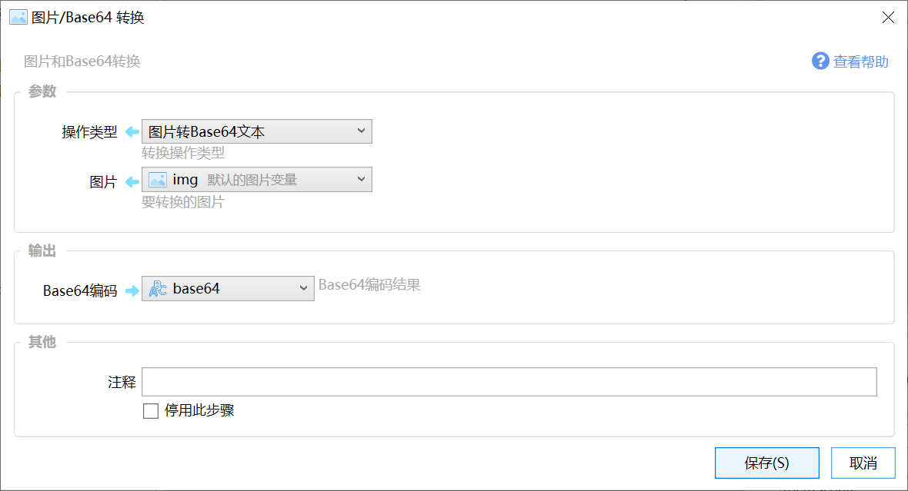

# 图片/Base64 转换

图片和Base64转换

{/* xaction-metadata:start */}
## 当前模块定义

- 模块 Key：`sys:imgToBase64`
- 分类：图片处理（`Image`）
- 类型：`Action`
- 风险操作：否
- 专业版：否

## 输入参数

| Key | 名称 | 类型 | 默认值 | 必填 | 变量模式 | 条件 | 说明 |
| --- | --- | --- | --- | --- | --- | --- | --- |
| `type` | 操作类型 | `Enum` | imgToBase64 | 是 | `Input` |  | 转换操作类型 |
| `img` | 图片 | `Image` |  | 是 | `UseVar` | 仅：imgToBase64 | 要转换的图片（图片变量或文件路径） |
| `base64` | Base64编码 | `Text` |  | 是 | `UseVarOrInput` | 仅：base64ToImg | 要转换的编码文本 |
| `addHeader` | 添加data头 | `Boolean` | false | 否 | `Input` | 仅：imgToBase64 | 是否添加"data:image/png;base64,"头 |

## 输出参数

| Key | 名称 | 类型 | 条件 | 说明 |
| --- | --- | --- | --- | --- |
| `code` | Base64编码 | `Text` | 仅：imgToBase64 | Base64编码结果 |
| `img` | 图片 | `Image` | 仅：base64ToImg | 转换输出的图片 |

## 选项值

### `type` 操作类型

| Value | 名称 | 说明 |
| --- | --- | --- |
| `imgToBase64` | 图片或文件转Base64文本 |  |
| `base64ToImg` | Base64文本转图片 |  |
{/* xaction-metadata:end */}

将图片转换为Base64文本，或者将Base64文本转换为图片。

注意：

请勿将图片Base64保存在动作中（如变量的默认值等）。因为:

1.  Quicker会加载所有的动作到内存，而图片转换为base64后会比较大，如果这类内容比较多，就会占用比较多的内存。
2.  较大的动作和动作页，可能会导致同步超时失败。
3.  也会占用比较多的服务器数据库空间。
4.  后期可能会根据情况增加对单个动作最大尺寸的限制。

如需在多台电脑同步图片文件，请考虑使用同步网盘将图片同步到相同的位置，然后在动作中使用该图片文件进行找图等操作。

请参考：[https://getquicker.net/Forum/ViewTopic/877](https://getquicker.net/Forum/ViewTopic/877)

## 参数

【操作类型】转换操作的类型，可选值：

-   图片转Base64文本：将图片内容转换为Base64编码。
-   Base64文本转图片：将Base64编码的图片数据转换为图片变量。

【图片】（图片转Base64文本时）要编码的图片。

【Base64编码】（Base64文本转图片）需要转换为图片的Base64编码文本。

## 输出

【Base64编码】图片编码后的结果。

【图片】Base64解码生成的位图图片。

## 更新历史

-   1.0.9版本：增加Base64转图片功能。
