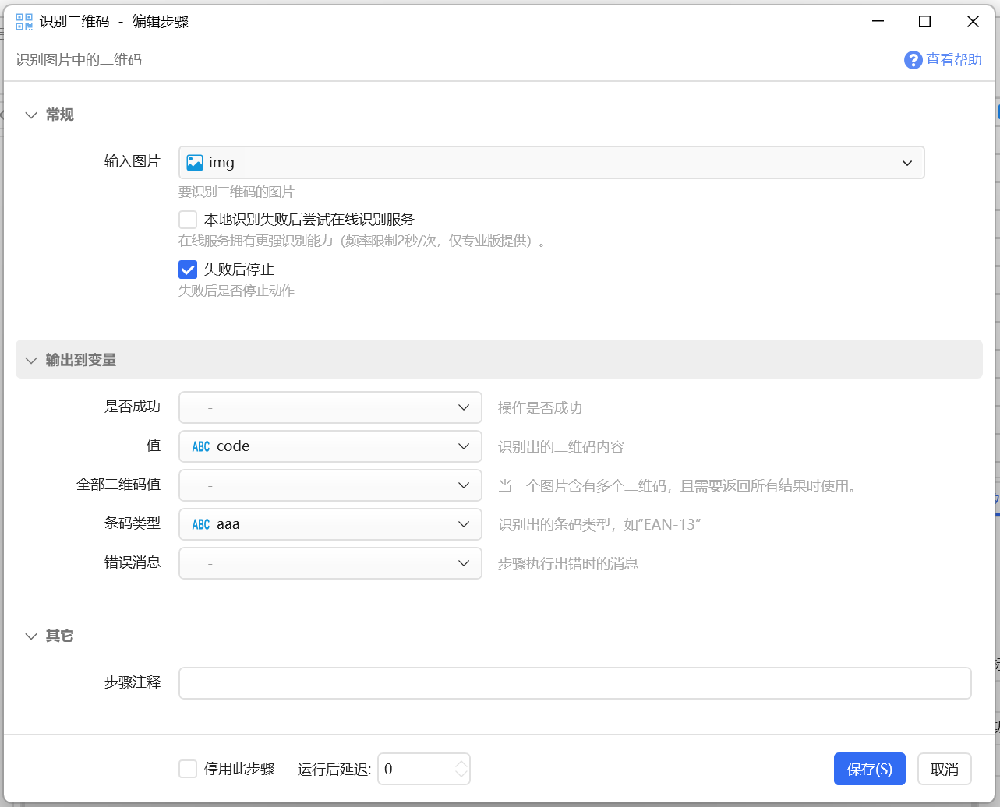

# 识别二维码

识别图片中的二维码

## 当前模块定义

<XActionModuleMeta moduleKey="sys:readQrCode" />

识别图片中的二维码。

## 参数

### 输入

【输入图片】包含二维码的图片。

【本地识别失败后尝试在线识别服务】本地引擎识别失败后，使用Quicker提供的在线服务进行识别。此功能仅面向专业版用户免费使用。

### 输出

【值】识别结果。

【全部二维码值】当图片中有多个二维码时，返回所有识别出的二维码的值的列表。

【条码类型】返回条码的类型，如“EAN-13”等。（1.44.27+版本增加）

## 更新历史

-   20251020 增加条码类型返回说明。
