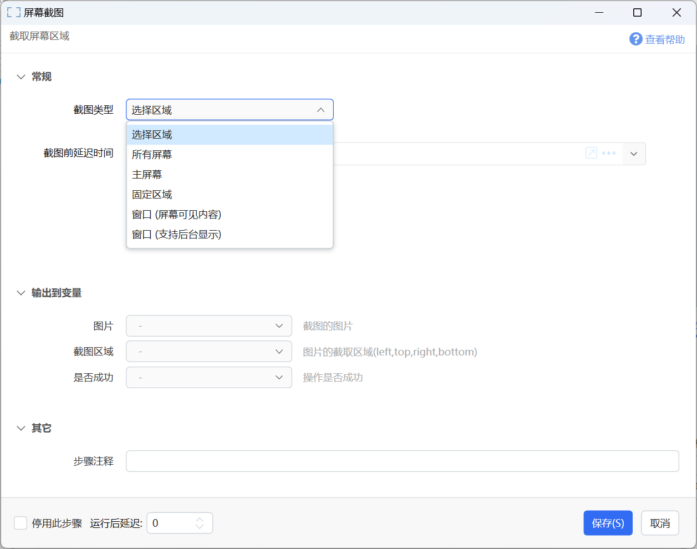
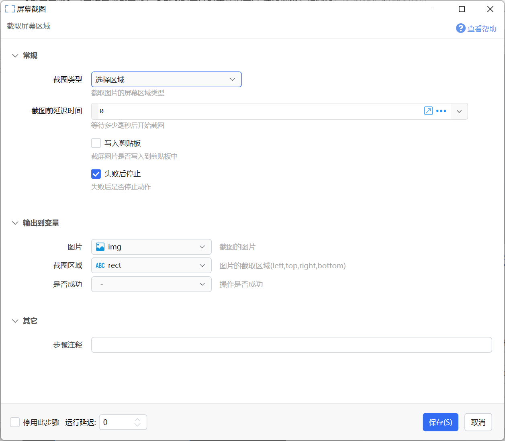
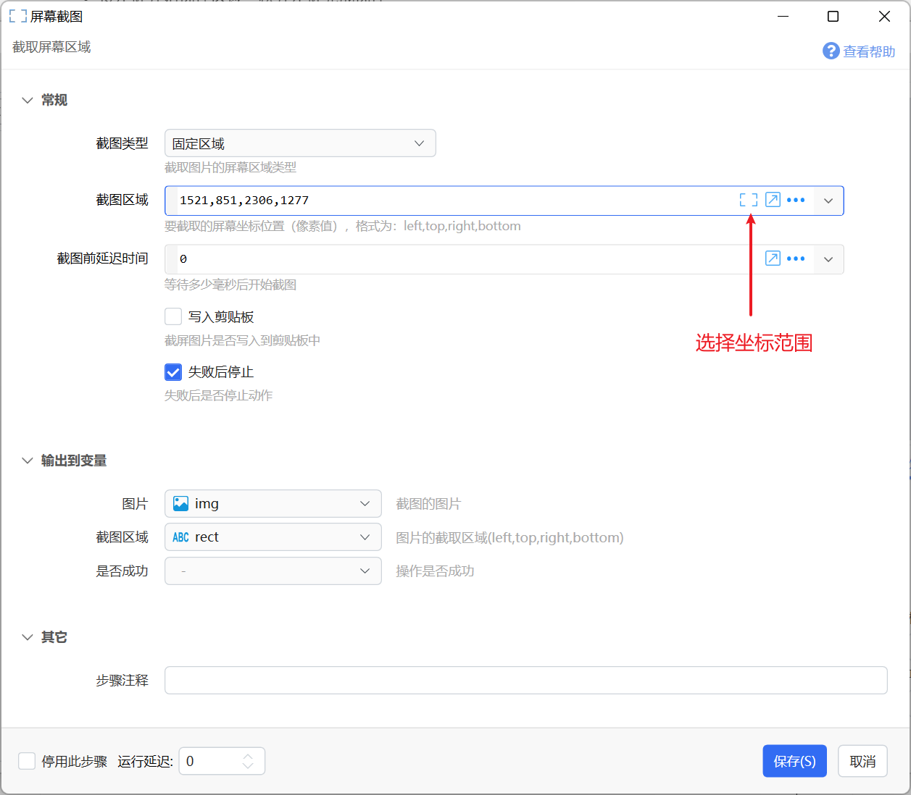
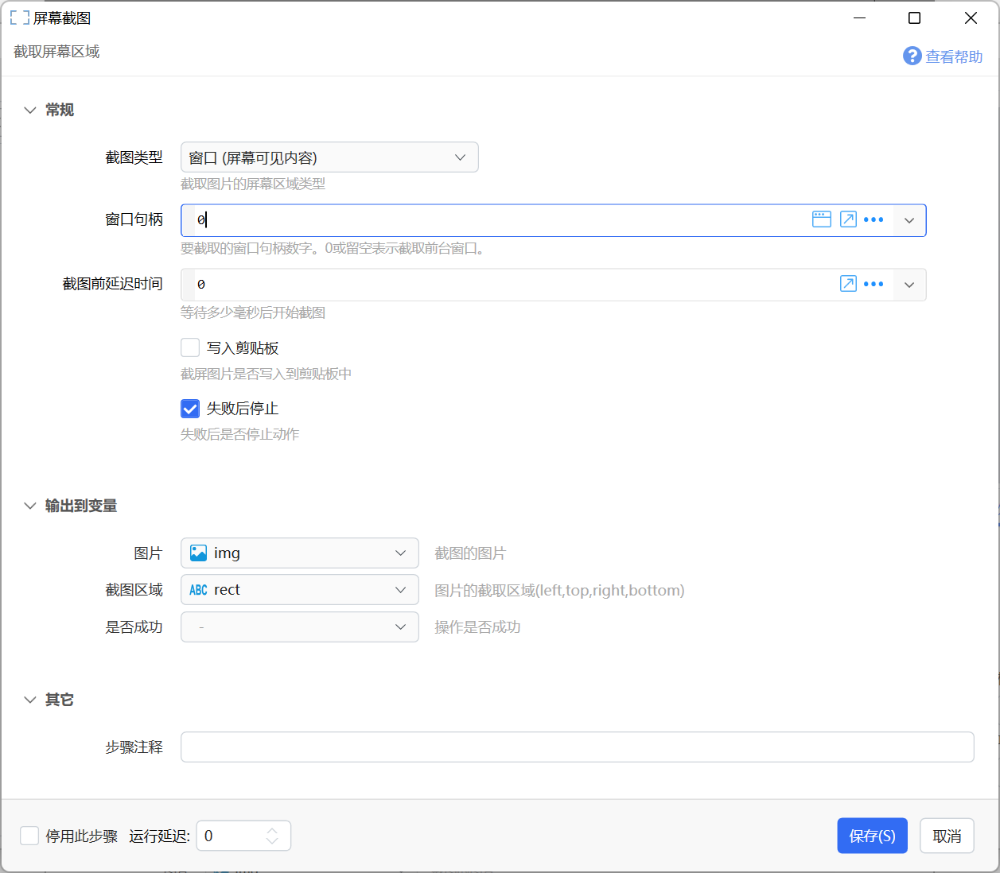

# 屏幕截图

截取屏幕区域

{/* xaction-metadata:start */}
## 当前模块定义

- 模块 Key：`sys:screenCapture`
- 分类：图片处理（`Image`）
- 类型：`Action`
- 风险操作：否
- 专业版：否

## 输入参数

| Key | 名称 | 类型 | 默认值 | 必填 | 变量模式 | 条件 | 说明 |
| --- | --- | --- | --- | --- | --- | --- | --- |
| `type` | 截图类型 | `Enum` | select | 是 | `Input` |  | 截取图片的屏幕区域类型 |
| `area` | 截图区域 | `Text` |  | 否 | `UseVarOrInput` | 仅：fixed_area | 要截取的屏幕坐标位置（像素值），格式为：left,top,right,bottom。默认不包含右边和底边像素。 |
| `preSelectArea` | 预选截图区域 | `Text` |  | 否 | `UseVarOrInput` | 仅：select | 非必要请勿设置。预先选择的截图区域，格式为：left,top,right,bottom。默认不包含右边和底边像素。 |
| `includeRightBottomBorder` | 预选截图区域包含右边和底边像素 | `Boolean` | true | 否 | `Input` | 仅：fixed_area, select | 包含时，当指定 0,0,2,2 的时候，截图的大小为3*3, 否则为2*2 |
| `windowHandle` | 窗口句柄 | `Integer` | 0 | 否 | `UseVarOrInput` | 仅：window, windowBackground | 要截取的窗口句柄数字。0或留空表示截取前台窗口。 |
| `delay` | 截图前延迟时间 | `Integer` | 0 | 是 | `UseVarOrInput` |  | 等待多少毫秒后开始截图 |
| `toClip` | 写入剪贴板 | `Boolean` | false | 否 | `Input` |  | 截屏图片是否写入到剪贴板中 |
| `addToHistory` | 加入截图历史 | `Boolean` | false | 否 | `Input` |  | 显式启用后将结果保存到本机截图历史；默认关闭，避免后台或循环动作持续留存画面。 |
| `stopIfFail` | 失败后停止 | `Boolean` | true | 否 | `Input` |  | 失败后是否停止动作 |

## 输出参数

| Key | 名称 | 类型 | 条件 | 说明 |
| --- | --- | --- | --- | --- |
| `isSuccess` | 是否成功 | `Boolean` |  | 操作是否成功 |
| `img` | 图片 | `Image` |  | 截图的图片 |
| `rect` | 截图区域 | `Text` |  | 图片的截取区域(left,top,right,bottom)。 |

## 选项值

### `type` 截图类型

| Value | 名称 | 说明 |
| --- | --- | --- |
| `select` | 选择区域 |  |
| `full_screen` | 所有屏幕 |  |
| `primary_screen` | 主屏幕 |  |
| `fixed_area` | 固定区域 |  |
| `window` | 窗口 (屏幕可见内容) |  |
| `windowBackground` | 窗口 (支持后台显示) |  |
{/* xaction-metadata:end */}

## 概述

提供手动或自动截图功能，将截取的图片存入变量或写入剪贴板，供后续步骤处理。

注：截图通常会截取到向前一点时间的屏幕图像。因此如果从面板窗口、轮盘菜单触发，可能截取到Quicker界面，可以在截图之前增加一点延迟。

对于“选择区域”操作类型，可以使用第三方截图工具代替Quicker的内置截图：

（如果在动作步骤中输出了坐标范围，则会仍然使用内置截图工具。）

## 常规参数

**输入参数**

【截图类型】截图的区域类型，可选值：

-   选择区域：手工选择要截取的区域。（默认方式）
-   所有屏幕：直接截取所有屏幕合并在一起的大图。
-   主屏幕：截取主屏幕的画面。
-   固定区域：根据坐标范围截取指定的区域。
-   窗口（屏幕可见内容）：截取窗口所在区域的屏幕图像（实际看到的图像，如果窗口被其他窗口遮挡，会截取到遮挡窗口）。
-   窗口（支持后台显示）：截取窗口内容图像。如果窗口被遮挡，仍然截取此窗口的内容而非遮挡窗口的内容。（有些窗口不支持此功能，以实际测试为准）

【截图区域】（固定区域截图时）要截取的图片的坐标范围,单位为像素，格式为：left,top,right,bottom 

【延时】等待多少毫秒后开始截图；

【写入剪贴板】截图的内容是否写入剪贴板一份；

**输出**

【图片】截图的内容输出到图片变量中。

【截图区域】截取图片的坐标范围，格式为：left,top,right,bottom。 此输出可以直接保存后，在后续“固定区域”方式截图时使用。也可以用于获取窗口坐标等用途。

## 截图类型类型

### 选择区域（手动截图）

从屏幕上手动选择截图范围（类似于其它常用截图软件）。

#### 手动截图操作说明

##### 选取模式与调整模式

**选取模式**：松开鼠标后自动完成选择。

使用鼠标左键开始截图，进入选取模式。

截图过程中停住鼠标超过1秒钟，或者点击鼠标侧键、中键，将会进入“调整模式”。

**调整模式**：选区周围显示圆点。松开鼠标后，可以继续调整选区范围。

使用除左键外其它鼠标键开始截图，直接进入调整模式。

调整模式下：

-   在选取内双击，完成截图。
-   在选区外点击并拖动鼠标，调整对应边界。
-   在选区内或选区外滚轮，调整对应边界。
-   按住拖动：移动选区。
-   按Shift拖动：在水平会垂直方向移动选区（v1.44.49+）

##### 鼠标操作

-   开始截图后

-   按左键开始选择区域，松开左键完成选择。
-   如果要截取窗口，也可以鼠标悬浮在窗口上，选区自动选中窗口区域后点击。
-   点右键取消截图。

-   右键取消截图（自1.1.3版本）

##### 键盘操作

-   Esc取消截图
-   回车：完成截图
-   按Shift：截取矩形区域
-   微调鼠标位置

-   左侧键盘：S=左、D=下、F=右、E=上。

键盘微调选区示意：

此处为语雀视频卡片，点击链接查看：[用键盘微调选区.mp4](/v2/xaction/modules/screencapture)

### 整个屏幕

截取整个屏幕。多屏幕时，包含所有屏幕。

### 固定区域

截取固定的屏幕范围。

【截图区域】目标截取范围，格式为“左,上,右,下”的像素值。可以点击输入框右侧的按钮快速选择。

### 窗口（屏幕可见内容）

截取屏幕上某个窗口的坐标范围。如果目标窗口被其他窗口盖住，也会截取到其它窗口的内容。

【窗口句柄】可以通过获取前台窗口等方式得到，为0时表示截取当前屏幕上的前台窗口（拥有输入焦点的窗口）。

### 窗口（支持后台显示）

截取指定窗口的内容，即使它被其它窗口遮盖。

注意：如果窗口被最小化，那么返回的“截图区域”将是一个比较大的负数，类似于`-32000,-32000,-31763,-31961`。此值请勿直接用于显示图片。

## 示例动作

-   截图贴图：[https://getquicker.net/Sharedaction?code=3d9f7fbb-752a-40f5-d827-08d86cbb0005](https://getquicker.net/Sharedaction?code=3d9f7fbb-752a-40f5-d827-08d86cbb0005)
-   截图反色：[https://getquicker.net/Sharedaction?code=77cf03c8-7940-4ca1-82c4-08d9a96a6ccf](https://getquicker.net/Sharedaction?code=77cf03c8-7940-4ca1-82c4-08d9a96a6ccf)
-   截图保存：[https://getquicker.net/Sharedaction?code=2214ddb5-d718-4da5-2c60-08d6c8ffb643](https://getquicker.net/Sharedaction?code=2214ddb5-d718-4da5-2c60-08d6c8ffb643)
-   固定区域截图：[https://getquicker.net/Sharedaction?code=d197881b-f8c5-4ce9-a982-08d8f2798c37](https://getquicker.net/Sharedaction?code=d197881b-f8c5-4ce9-a982-08d8f2798c37)
-   截图：[https://getquicker.net/Sharedaction?code=9bfc34fb-b7f7-40bd-6d0c-08d6c304e16e](https://getquicker.net/Sharedaction?code=9bfc34fb-b7f7-40bd-6d0c-08d6c304e16e)

## 更新历史

-   20230222 增加第三方截图设置说明。
-   20251221 调整模式下shift限制水平或垂直方向移动选区。
