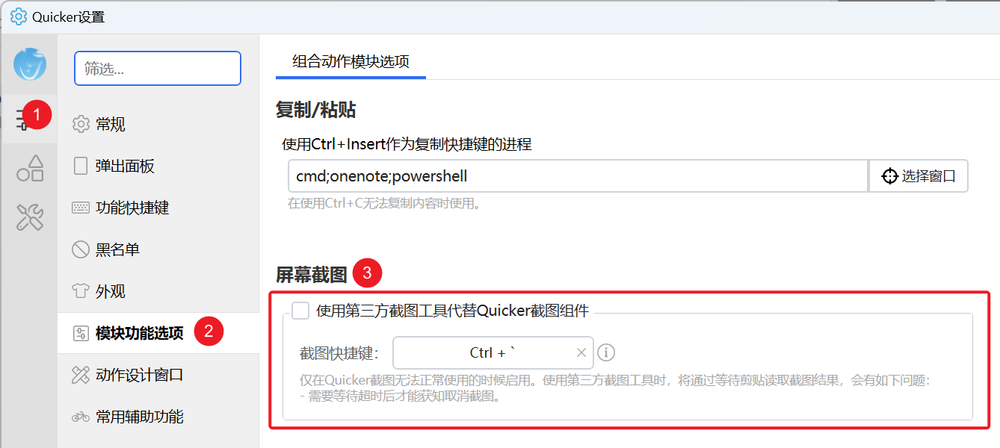
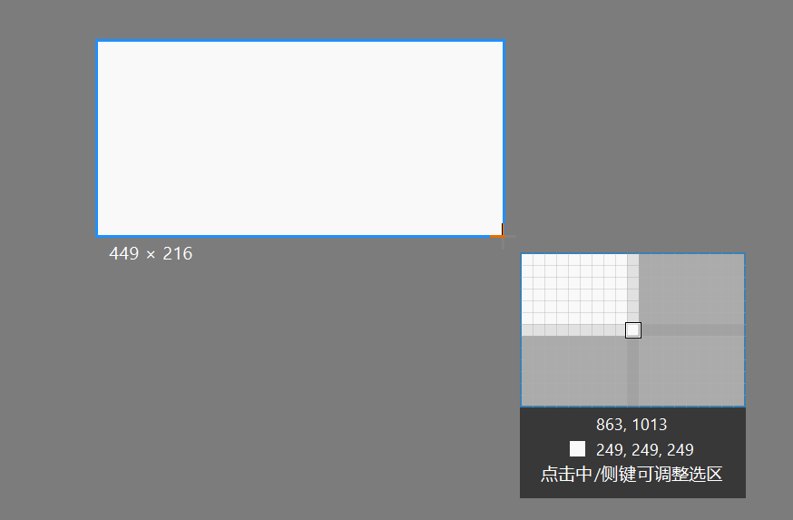
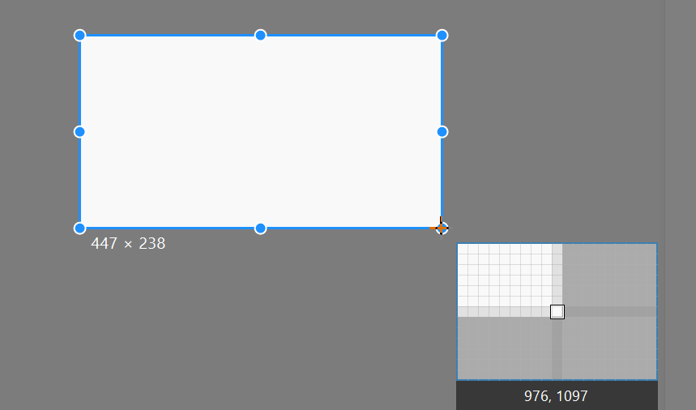

# 屏幕截图

截取一块屏幕，存进图片变量，也可同时写入剪贴板。需要渐进式选区、标注或贴图时，请用 **截图 Pro**：

<RelatedDocs
  layout="cards"
  items={[
    {
      href: '/v2/features/screenshot/capture-pro',
      label: '截图 Pro 功能说明',
      description: '选区、吸附、标注、OCR 与贴图。',
      featured: true,
    },
    {
      href: '/v2/xaction/modules/screen-capture-pro',
      label: '截图 Pro 步骤参数',
      description: '组合动作里的截图 Pro 步骤。',
    },
  ]}
/>

## 当前模块定义

<XActionModuleMeta moduleKey="sys:screenCapture" />

## 概述

从面板或轮盘触发时，截到的往往是稍早一帧，容易带上 Quicker 自己。截图前加一点 [等待时间](/v2/xaction/modules/delay)。

<ModuleParamPreview moduleKey="sys:screenCapture" />

「选择区域」可以用第三方截图工具代替内置选区：**设置 → 模块功能选项 → 屏幕截图**。步骤里如果输出了坐标范围，仍走内置工具。

## 参数说明

**截图类型**：

- 选择区域：手工框选（默认）。
- 所有屏幕：所有显示器拼成一张大图。
- 主屏幕：只截主显示器。
- 固定区域：按坐标截。
- 窗口 (屏幕可见内容)：截窗口所在屏幕范围。被挡住时会截到挡在上面的窗口。
- 窗口 (支持后台显示)：尽量截该窗口自己的内容。有的窗口不支持，以实测为准。

**截图区域**：仅固定区域。格式 `left,top,right,bottom`。默认不包含右边和底边像素。可点输入框右侧按钮在屏幕上框选。

**预选截图区域**：仅选择区域。预先框好的范围，格式同上。非必要不要填。旧稿未写。

**预选截图区域包含右边和底边像素**：固定区域、选择区域。打开时 `0,0,2,2` 是 3×3，关闭时是 2×2。默认开启。旧稿未写。

**窗口句柄**：仅两种窗口类型。`0` 或留空表示前台窗口。

**截图前延迟时间**：等多少毫秒再截。

**写入剪贴板**：是否同时写入剪贴板。默认关闭。

**加入截图历史**：打开后把结果存进本机截图历史。默认关闭，避免后台或循环动作一直留图。旧稿未写。

**失败后停止**：失败或取消是否中止动作。默认开启。

## 输出

- **是否成功**：是否截到了图。
- **图片**：截图内容。
- **截图区域**：实际截到的范围，格式 `left,top,right,bottom`。可存下来给后续「固定区域」用，也可用来取窗口坐标。

## 选择区域

<ModuleParamPreview
  moduleKey="sys:screenCapture"
  focusKeys={['type', 'delay', 'toClip', 'stopIfFail', 'img', 'rect', 'isSuccess']}
  values={{type: 'select', delay: '0', toClip: 'false', stopIfFail: 'true'}}
  outputVars={{img: 'img', rect: 'rect'}}
/>

### 选取模式与调整模式

**选取模式**：松开鼠标就完成选择。左键按下开始框选。

框选时停住鼠标超过 1 秒，或点侧键、中键，进入调整模式。

**调整模式**：选区周围出现圆点。松开鼠标后还能改范围。用左键以外的键开始截图，会直接进入调整模式。

调整模式下：

- 选区内双击：完成截图。
- 选区外点住拖：改对应边界。
- 选区内或外滚轮：改对应边界。
- 按住拖：移动选区。
- Shift + 拖：只沿水平或垂直移动（1.44.49+）。

### 鼠标

- 左键按下开始框选，松开完成。
- 鼠标停在窗口上，选区吸附到窗口后再点，可截整个窗口。
- 右键取消（1.1.3+）。

### 键盘

- Esc：取消。
- 回车：完成。
- Shift：限制为矩形。
- 左侧字母微调指针：`S` 左、`D` 下、`F` 右、`E` 上。

## 固定区域

红箭头指向的是「在屏幕上框选坐标」按钮。

<PreviewMarks marks={[{key: 'area', label: '点击右侧按钮选择坐标范围'}]}>
  <ModuleParamPreview
    moduleKey="sys:screenCapture"
    focusKeys={['type', 'area', 'delay', 'toClip', 'stopIfFail', 'img', 'rect']}
    values={{type: 'fixed_area', area: '1521,851,2306,1277', delay: '0', toClip: 'false', stopIfFail: 'true'}}
    outputVars={{img: 'img', rect: 'rect'}}
  />
</PreviewMarks>

## 窗口

**窗口 (屏幕可见内容)**：截屏幕上这块窗口的范围。被挡住时会截到挡在上面的内容。

<ModuleParamPreview
  moduleKey="sys:screenCapture"
  focusKeys={['type', 'windowHandle', 'delay', 'toClip', 'stopIfFail', 'img', 'rect', 'isSuccess']}
  values={{type: 'window', windowHandle: '0', delay: '0', toClip: 'false', stopIfFail: 'true'}}
  outputVars={{img: 'img', rect: 'rect'}}
/>

**窗口 (支持后台显示)**：尽量截指定窗口自己的内容。窗口最小化时，「截图区域」可能是很大的负数，例如 `-32000,-32000,-31763,-31961`，不要拿去当显示坐标。

## 示例动作

截完后在原位置贴图（3 步）：

<StepProgramView example="3d9f7fbb-752a-40f5-d827-08d86cbb0005" />

<ShareLinkCard
  code="3d9f7fbb-752a-40f5-d827-08d86cbb0005"
  title="截图贴图"
  description="截图后在原位置贴图1"
  author="CL"
/>

其余示例步骤较多，用卡片打开后查看：

<ShareLinkCard
  items={[
    {
      code: '77cf03c8-7940-4ca1-82c4-08d9a96a6ccf',
      title: '截图反色',
      description: '截图后反色/转换为灰度图片',
      author: 'CL',
    },
    {
      code: '2214ddb5-d718-4da5-2c60-08d6c8ffb643',
      title: '截图保存',
      description: '截图并保存到桌面或指定位置',
      author: 'CL',
    },
    {
      code: 'd197881b-f8c5-4ce9-a982-08d8f2798c37',
      title: '固定区域截图',
      description: '按选定的区域自动截图。右键菜单可更改区域。',
      author: 'Marcusx',
    },
    {
      code: '9bfc34fb-b7f7-40bd-6d0c-08d6c304e16e',
      title: '截图',
      description: '截图后自动将图片贴在屏幕上，可拖动、缩放。',
      author: 'Marcusx',
    },
  ]}
/>

## 限制与排障

- 截到 Quicker 面板或轮盘：前面加延时。
- 第三方工具超时或取消：内置选区更稳；输出了坐标范围时本来就不会走第三方。
- 只要剪贴板里的图：用 [获取剪贴板图片](/v2/xaction/modules/getclipboardimage)，可先 [等待剪贴板内容改变](/v2/xaction/modules/waitclipboardchange)。

## 相关步骤

<RelatedDocs
  layout="cards"
  items={[
    {
      href: '/v2/xaction/modules/showimage',
      label: '显示图片',
      description: '把截到的图贴在屏幕上。',
    },
    {
      href: '/v2/xaction/modules/writeimagefile',
      label: '写入图片文件',
      description: '把截图存成文件。',
    },
    {
      href: '/v2/xaction/modules/searchbmp',
      label: '屏幕找图/找色/找字',
      description: '在截到的画面或屏幕上定位目标。',
    },
    {
      href: '/v2/features/screenshot',
      label: '截图与贴图概览',
      description: '截图、贴图、长截图与录屏入口。',
    },
  ]}
/>

## 更新历史

- 20230222：增加第三方截图设置说明。
- 20251221：调整模式下 Shift 限制水平或垂直移动选区。
