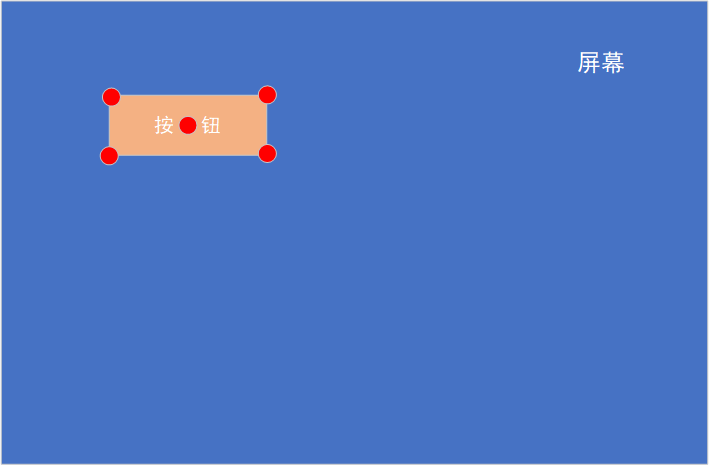
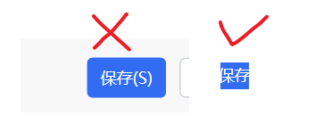
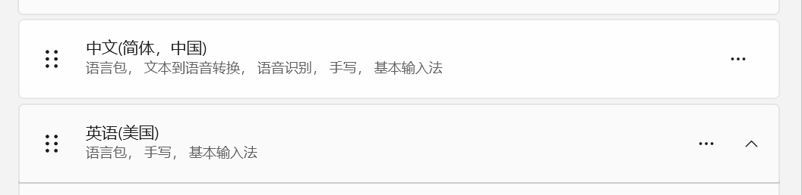

# 屏幕找图/找色/找字

在屏幕或窗口上查找指定图片、颜色或文字，返回匹配点坐标。常用来定位按钮、菜单后再点。

## 当前模块定义

<XActionModuleMeta moduleKey="sys:searchBmp" />

## 概述

例如要点一个按钮：先把按钮截成 png，再用本模块在屏幕上搜，得到坐标。[鼠标输入](/v2/xaction/modules/mouse) 里也有「移动到位图位置」，找到后会直接点，但不返回坐标。本模块只回报位置，不点击。

<ModuleParamPreview moduleKey="sys:searchBmp" />

## 参数说明

**类型**：

- 查找图片(文件)
- 查找图片(变量)
- 查找颜色
- 查找文字

**位图路径**：仅查找图片(文件)。完整路径。可多行，按顺序试，命中一个就停。截图请存 png / bmp，不要用 jpg（有损压缩对不上）。截的时候别把鼠标停在目标上，避免悬浮变色。

**位图变量**：仅查找图片(变量)。事先用截图或读文件加载。

**颜色**：仅查找颜色。如 `#FF0000`。

**文字**：仅查找文字。可多行写多组，命中任意一组即可。

**查找范围**：主屏幕、当前窗口、坐标范围、所有屏幕。旧稿未写「所有屏幕」。

**查找坐标范围**：查找范围为「坐标范围」时填写，格式 `left,top,right,bottom`，例如 `0,0,800,600`。

**定位位置**：仅找图。返回点相对位图的位置（下图红点）：位图中间、左上角、右上角、左下角、右下角。

**X偏移** / **Y偏移**：在定位点上再平移。正值向右、向下。

**颜色容差**：仅找图、找色。每个颜色通道允许的偏差 0–100。`0` 是精确匹配，也最快。默认 `10`。

<ModuleParamPreview
  moduleKey="sys:searchBmp"
  focusKeys={['bmpColorError']}
  values={{bmpColorError: '20'}}
/>

**匹配方式**：仅找图。默认的「颜色容差（快速）」与旧动作行为一致，要求每个像素的各颜色通道都在容差内；「相似度」按整张图片的总体差异评分，能容忍少量抗锯齿、渲染或压缩差异。

**最低相似度**：仅在相似度匹配时使用，范围 `0`–`100`，默认 `90`。数值越高，要求越接近原图。先从 `90` 开始；误匹配时提高，漏匹配时小幅降低。相似度模式不使用「颜色容差」。

**最大匹配**：仅找图。最多找几个匹配，默认 `1`，超过 `1000` 会按 `1000` 处理。只需要第一个位置时保持 `1`，可以减少扫描和排序开销。

**重试次数**：找不到时再试几次，每次间隔 300ms。

**跳过WindowsOCR引擎**：仅找字。旧稿未写。

**忽略背景色**：仅找图。查找图四个顶点颜色一样时，把这种颜色当背景忽略。默认开启。旧稿未写。

**失败后中止动作**：找不到是否停止后续步骤。默认开启。

## 输出

- **是否成功**：是否至少找到一处。
- **第一个匹配点**：从左上往右、往下的第一处，格式 `x,y`。
- **匹配序号**：从多张图或多组文字里查找时，命中的是第几组，从 `0` 起。仅找图(文件)、找字。旧稿未写。
- **所有匹配点**：全部匹配点列表。找色没有这项。
- **最佳相似度**：最佳成功匹配的评分，范围 `0`–`100`；颜色容差模式成功时为 `100`，未找到时为 `0`。仅找图。

## 找图失败时

截图和屏幕不一致：

- 截的时候鼠标造成了悬浮态。先把鼠标移开，开始截图后再框目标。
- 分辨率、软件版本或界面变了。保持环境一致，关掉会动态改色的工具。
- 窗口没对齐到整像素，边缘会有轻微差。
- 存成了 jpg。改存 png。

目标图尽量小，只要能认出特征：

还不稳时先按问题选择调整方式：轻微颜色变化可增大颜色容差；抗锯齿、缩放渲染或压缩造成的整体小差异可改用相似度模式，并从 `90` 附近小幅调整。不要直接把阈值降得很低，否则更容易误命中，扫描也可能变慢。目标还没出现时，前面加等待，或加大重试、放进循环。

若开启「忽略背景色」，而模板图片四角同色且整张图都被判定为背景，步骤会直接失败。此时关闭该选项，或重新截取包含明显前景特征的小图。

社区增强版子程序（容错更高）：

<ShareLinkCard
  href="https://getquicker.net/SubProgram?id=e4af1d5b-143b-4b62-4de5-08d85ac8eddb"
  title="找图增强版"
  description="社区分享的找图子程序，容错更高。"
  author="Cesaryuan"
/>

## 屏幕找色

在屏幕或窗口里找指定颜色第一次出现的位置。

<ModuleParamPreview
  moduleKey="sys:searchBmp"
  focusKeys={[
    'type',
    'color',
    'bmpTargetType',
    'searchRect',
    'x',
    'y',
    'bmpColorError',
    'retryCount',
    'stopIfFail',
    'isSuccess',
    'firstPoint',
  ]}
  values={{
    type: 'locateByColor',
    color: '#352559',
    bmpTargetType: 'AllScreens',
    searchRect: '',
    x: '0',
    y: '0',
    bmpColorError: '0',
    retryCount: '1',
    stopIfFail: 'true',
  }}
  outputVars={{isSuccess: 'isSuccess', firstPoint: 'position'}}
/>

把「第一个匹配点」交给鼠标输入，移动并点击：

<PreviewMarks
  marks={[
    {key: 'type', label: '移动到(x,y 一同指定)'},
    {key: 'xy', label: '使用 firstPoint'},
    {key: 'extAction', label: '移动后左键单击'},
  ]}
>
  <ModuleParamPreview
    moduleKey="sys:mouse"
    focusKeys={['type', 'xy', 'slowMove', 'extAction']}
    values={{type: 'moveToXy', xy: '{firstPoint}', slowMove: 'false', extAction: 'left'}}
  />
</PreviewMarks>

## 屏幕找字

按从上到下、从左到右，找指定文字第一次出现的位置。引擎是 Windows 内置 OCR + [基础OCR](/v2/xaction/modules/basic-ocr)。面向专业版；免费版能用，但半速。

使用条件：

- Windows OCR 需要 Windows 10 / 11，并在系统设置里至少装中、英两种语言包。

- 离线 OCR 只要 64 位系统，CPU 支持 AVX。

注意：目标区域里不要有多处相近文字，必要时用坐标范围收窄；少用标点、空格，OCR 容易认错；找字本身有一定失败率。

<ModuleParamPreview
  moduleKey="sys:searchBmp"
  focusKeys={[
    'type',
    'searchText',
    'bmpTargetType',
    'searchRect',
    'x',
    'y',
    'retryCount',
    'stopIfFail',
    'isSuccess',
    'firstPoint',
  ]}
  values={{
    type: 'locateByText',
    searchText: '行业排名',
    bmpTargetType: 'CurrentWindow',
    searchRect: '',
    x: '0',
    y: '0',
    retryCount: '1',
    stopIfFail: 'true',
  }}
  outputVars={{isSuccess: 'isSuccess', firstPoint: 'firstPoint'}}
/>

## 示例动作

<StepProgramView example="fa6ce878-59d6-4c9a-06b4-08db4d58400e" />

<ShareLinkCard
  code="fa6ce878-59d6-4c9a-06b4-08db4d58400e"
  title="屏幕找字示例"
  description="演示Quicker屏幕找字功能"
  author="CL"
/>

## 相关链接

<RelatedDocs
  items={[
    {
      href: '/v2/xaction/modules/mouse',
      label: '鼠标输入',
      description: '移到匹配点并点击；也可直接「移动到位图位置」。',
    },
    {
      href: '/v2/xaction/modules/screencapture',
      label: '屏幕截图',
      description: '截出要查找的小图。',
    },
    {
      href: '/v2/xaction/modules/basic-ocr',
      label: '基础OCR',
      description: '找字用的离线识别引擎。',
    },
  ]}
/>

## 更新历史

- 2.1.19：找图新增相似度匹配、最低相似度和最佳相似度输出。
- 1.1.4：增加此模块。
- 1.23.4：增加找色。
- 1.38.1：增加找字。
