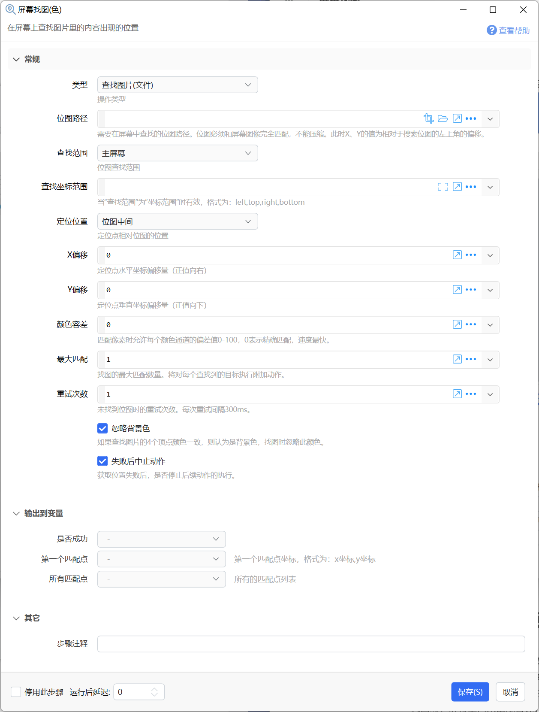
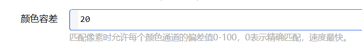
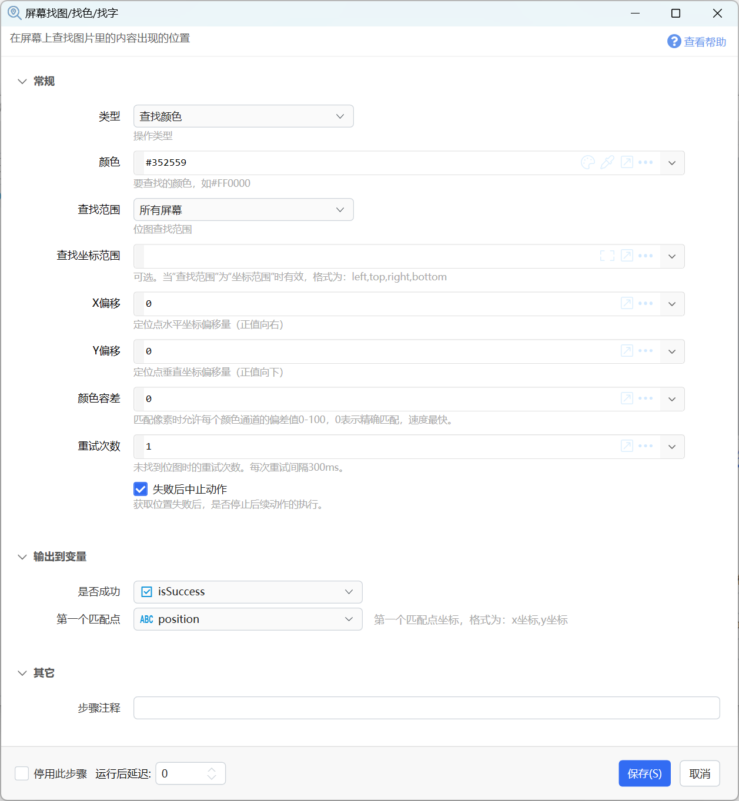
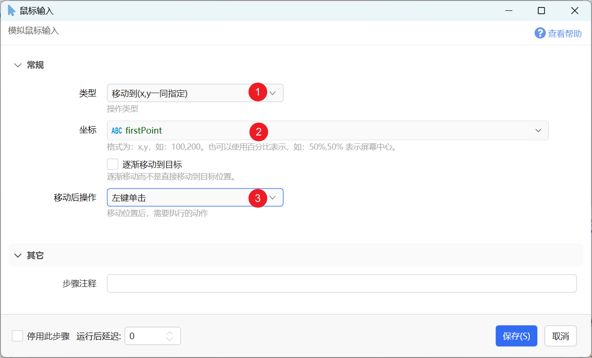

# 屏幕找图/找色/找字

在屏幕上查找图片里的内容出现的位置

{/* xaction-metadata:start */}
## 当前模块定义

- 模块 Key：`sys:searchBmp`
- 分类：图片处理（`Image`）
- 类型：`Action`
- 风险操作：否
- 专业版：否

## 输入参数

| Key | 名称 | 类型 | 默认值 | 必填 | 变量模式 | 条件 | 说明 |
| --- | --- | --- | --- | --- | --- | --- | --- |
| `type` | 类型 | `Enum` | locateByBitmapFile | 是 | `Input` |  | 操作类型 |
| `bmp` | 位图路径 | `Text` |  | 是 | `UseVarOrInput` | 仅：locateByBitmapFile | 需要在屏幕中查找的位图路径。位图必须和屏幕图像完全匹配，不能压缩。此时X、Y的值为相对于搜索位图的左上角的偏移。 |
| `bmpVar` | 位图变量 | `Image` |  | 是 | `UseVar` | 仅：locateByBitmapVar | 需要在屏幕中查找的位图。位图必须和屏幕图像完全匹配，不能压缩。此时X、Y的值为相对于搜索位图的左上角的偏移。 |
| `color` | 颜色 | `Text` | #FF0000 | 是 | `UseVarOrInput` | 仅：locateByColor | 要查找的颜色，如#FF0000 |
| `searchText` | 文字 | `Text` |  | 否 | `UseVarOrInput` | 仅：locateByText | 要查找的文字。可使用多行指定多组可选文字，找到任意一组即可。 |
| `bmpTargetType` | 查找范围 | `Enum` | MainScreen | 否 | `Input` | 仅：locateByBitmapFile, locateByBitmapVar, locateByColor, locateByText | 位图查找范围 |
| `searchRect` | 查找坐标范围 | `Text` |  | 否 | `UseVarOrInput` |  | 可选。当"查找范围"为"坐标范围"时有效，格式为：left,top,right,bottom |
| `bmpPosition` | 定位位置 | `Enum` | Center | 否 | `Input` | 仅：locateByBitmapFile, locateByBitmapVar | 定位点相对位图的位置 |
| `x` | X偏移 | `Integer` | 0 | 是 | `UseVarOrInput` |  | 定位点水平坐标偏移量（正值向右） |
| `y` | Y偏移 | `Integer` | 0 | 是 | `UseVarOrInput` |  | 定位点垂直坐标偏移量（正值向下） |
| `bmpColorError` | 颜色容差 | `Integer` | 10 | 否 | `Input` | 仅：locateByBitmapFile, locateByBitmapVar, locateByColor | 匹配像素时允许每个颜色通道的偏差值0-100，0表示精确匹配，速度最快。 |
| `maxFindCount` | 最大匹配 | `Integer` | 1 | 否 | `Input` | 仅：locateByBitmapFile, locateByBitmapVar | 找图的最大匹配数量。将对每个查找到的目标执行附加动作。 |
| `retryCount` | 重试次数 | `Integer` | 0 | 否 | `Input` | 仅：locateByBitmapFile, locateByBitmapVar, locateByColor, locateByText | 未找到位图时的重试次数。每次重试间隔300ms。 |
| `ignoreWindowsOcr` | 跳过WindowsOCR引擎 | `Boolean` | false | 否 | `UseVarOrInput` | 仅：locateByText |  |
| `ignoreBgColor` | 忽略背景色 | `Boolean` | true | 否 | `Input` | 仅：locateByBitmapFile, locateByBitmapVar | 如果查找图片的4个顶点颜色一致，则认为是背景色，找图时忽略此颜色。 |
| `stopIfFail` | 失败后中止动作 | `Boolean` | true | 否 | `Input` |  | 获取位置失败后，是否停止后续动作的执行。 |

## 输出参数

| Key | 名称 | 类型 | 条件 | 说明 |
| --- | --- | --- | --- | --- |
| `isSuccess` | 是否成功 | `Boolean` |  | 操作是否成功 |
| `firstPoint` | 第一个匹配点 | `Text` |  | 第一个匹配点坐标，格式为：x坐标,y坐标 |
| `imgIndex` | 匹配序号 | `Integer` | 仅：locateByBitmapFile, locateByText | 从多个图片或多组文字中查找时，返回匹配到的图片或文字组序号，从0开始。 |
| `allPoints` | 所有匹配点 | `List` | 仅：locateByBitmapFile, locateByBitmapVar, locateByText | 所有的匹配点列表 |

## 选项值

### `type` 类型

| Value | 名称 | 说明 |
| --- | --- | --- |
| `locateByBitmapFile` | 查找图片(文件) |  |
| `locateByBitmapVar` | 查找图片(变量) |  |
| `locateByColor` | 查找颜色 |  |
| `locateByText` | 查找文字 |  |

### `bmpTargetType` 查找范围

| Value | 名称 | 说明 |
| --- | --- | --- |
| `MainScreen` | 主屏幕 |  |
| `CurrentWindow` | 当前窗口 |  |
| `Rect` | 坐标范围 |  |
| `AllScreens` | 所有屏幕 |  |

### `bmpPosition` 定位位置

| Value | 名称 | 说明 |
| --- | --- | --- |
| `Center` | 位图中间 |  |
| `TopLeft` | 左上角 |  |
| `TopRight` | 右上角 |  |
| `BottomLeft` | 左下角 |  |
| `BottomRight` | 右下角 |  |
{/* xaction-metadata:end */}

在屏幕或窗口上查找指定的图形、颜色或文字，并返回匹配位置的坐标。通常用于定位按钮、菜单等对象的位置。

## 屏幕找图

在屏幕上查找图片里的内容出现的位置。

例如，当需要点击屏幕上一个按钮的时候，可以先使用截图工具，将按钮截图保存到一个png文件中。 然后使用这个模块在屏幕上搜索，返回按钮的位置。

在“鼠标输入”模块中也包含“移动到位图位置”的操作类型，和本模块类似。 只是鼠标输入模块在找到位置以后会自动执行附加操作（如点击左键），但是不会返回找到的位图位置。本模块可以返回找到的位图位置，但不会执行点击等额外操作。

## 参数

### 输入

【类型】操作模式，可选：

-   查找图片（文件）：在屏幕上查找文件中的图片。
-   查找图片（变量）：在屏幕上查找图片变量中的图片。

【位图路径】 类型为“查找图片（文件）”时，指定要查找图片的完整路径。

可以指定多个图片路径，每行一个。 会按顺序尝试匹配，任意一个匹配成功就会停止继续匹配其它图片。

注：在截取要查找的图片时，需要尽量避免界面的变化：

-   截图保存为png或bmp文件，不要保存成jpg文件（jpg是有损压缩，会导致颜色失真无法匹配到）
-   开始截图时避免鼠标移动到目标区域（当鼠标悬浮到按钮之类的元素上时，可能会引起元素变色或变形）

【位图变量】 类型为“查找图片（变量）”时，指定存储了要查找的图片的变量。此变量需要事先通过截图、读取图片文件等方式加载。

【颜色】类型为“查找颜色”时，指定目标颜色值。

【查找范围】指定搜索的范围，可选“主屏幕”，“当前窗口”，“坐标范围”。

【查找坐标范围】当“查找范围”为“坐标范围”时，指定要搜索的屏幕区域的坐标。值的格式为 left,top,right,bottom。比如“0,0,800,600”，意思是说搜索屏幕上 左上角坐标(0,0)，右下角坐标(800,600)的矩形区域。

【定位位置】在屏幕上找到位图以后，返回的坐标点在位图的哪个位置（下图中的红点）。

【X偏移】【Y偏移】：根据需要对【定位位置】计算出的定位点坐标进行一定的偏移。

【颜色容差】比较图片和屏幕时，允许的不相等程度。0表示需要精确匹配。

【最大匹配数量】查找位图时，最多查找多少个匹配。

【重试次数】未找到位图时进行重试的次数。 每次之间延迟300ms。

### 输出

【是否成功】是否找到至少一个匹配。

【第一个匹配点】找到的第一个匹配点的坐标（从左上角开始，从左到右，从上到下的顺序查找），格式为：x,y

【所有匹配点】找到的所有匹配点的坐标列表。每一项的格式为：x,y

### 参考信息

-   您也可以使用Cesaryuan网友分享的子程序进行找图。该子程序具有更高的容错表现。网址为：[https://getquicker.net/SubProgram?id=e4af1d5b-143b-4b62-4de5-08d85ac8eddb](https://getquicker.net/SubProgram?id=e4af1d5b-143b-4b62-4de5-08d85ac8eddb)

### 找图失败的可能原因

-   截取图片和屏幕显示不同

-   截图时，鼠标位置造成了按钮状态变化，比如产生了悬浮效果等。（解决方法：截图时，将鼠标移动到其它位置，开始截图后再移动到目标位置选择区域）
-   屏幕的分辨率、软件版本变化，或者软件界面本身发生了变化，导致图像变化。（解决办法：保持屏幕分辨率、软件版本一致。避免使用第三方屏幕动态调节软件）
-   根据窗口的显示位置不通，也可能导致非像素对齐的窗口内容在两个像素之间产生轻微变化。
-   保存的图片格式为jpg等有损压缩格式，导致信息丢失。（截图保存为png文件）

-   位图没有在限定的范围内

-   改成整个屏幕范围内查找。

-   找图时，屏幕上尚未出现目标。

-   解决办法：在前面增加一些等待时间，确认图片出现后再找图。或设置重复次数、使用循环找图等方式。

-   其它增加成功率的方式：

-   目标图片尽量小一些，只要包含必要的特征能定位到元素即可。
    
-   增加“颜色容差”的数值。
    
-   使用找图增强版子程序：：[https://getquicker.net/SubProgram?id=e4af1d5b-143b-4b62-4de5-08d85ac8eddb](https://getquicker.net/SubProgram?id=e4af1d5b-143b-4b62-4de5-08d85ac8eddb)

## 屏幕找色

在屏幕或窗口中找到指定颜色的首次出现位置。

**输出**

【第一个匹配点】找到的第一个匹配颜色的坐标点，格式为 x,y 。可在后续步骤中使用“鼠标输入模块”移动到该位置并自动进行点击。

## 屏幕找字

在屏幕或窗口中找到指定文字的首次出现位置，按从上到下从左到右的顺序查找。

使用 Windows内置OCR引擎+ [Quicker离线OCR引擎](/v2/xaction/modules/basic-ocr) 进行查找。

示例动作：[屏幕找字示例](https://getquicker.net/Sharedaction?code=fa6ce878-59d6-4c9a-06b4-08db4d58400e)

【注】本功能为专业版用户打造，免费版用户也可使用，但是限制半速运行。

使用条件：

-   Windows内置OCR引擎，限制Windows10 或 Windows11 操作系统。 为了更为准确的查找文字，请在Windows设置中安装至少中英文两种语言包。
    
-   离线OCR引擎仅支持64位操作系统，CPU需支持AVX编码。

注意事项：

-   避免目标区域中出现多个含有类似文字的位置；必要时，使用指定坐标范围的方式限制查找区域；
-   避免出现标点符号、空格，它们容易被OCR错误识别；
-   找字存在一定的失败几率；

**输出**

【第一个匹配点】找到的第一个匹配颜色的坐标点，格式为 x,y 。可在后续步骤中使用“鼠标输入模块”移动到该位置并自动进行点击。

## 更新历史

-   1.1.4 增加此模块
-   1.23.4 增加找色功能
-   1.38.1 增加找字功能
