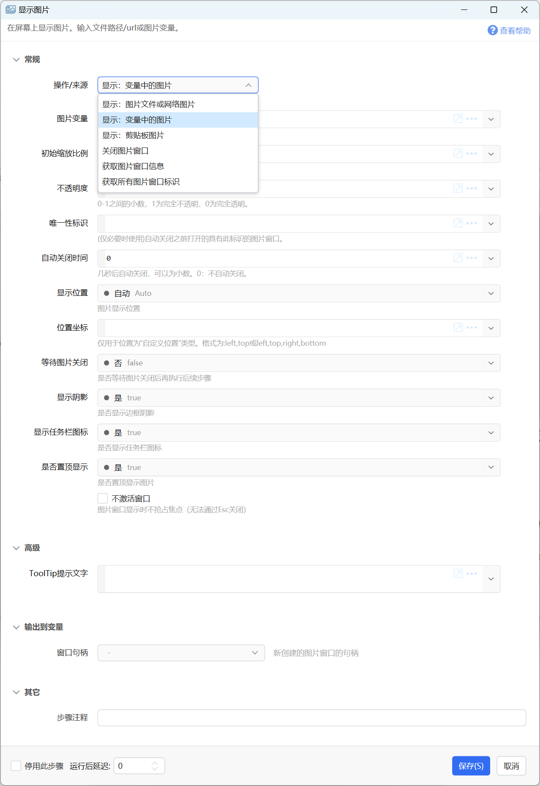
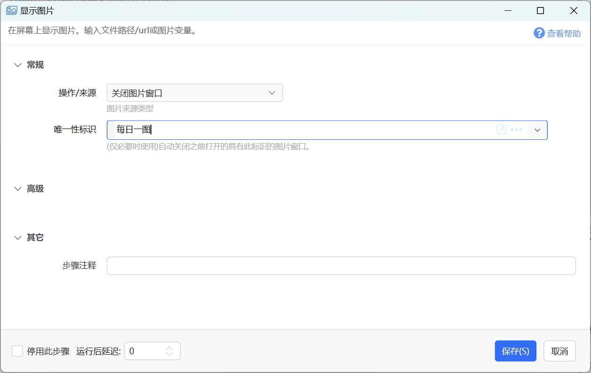
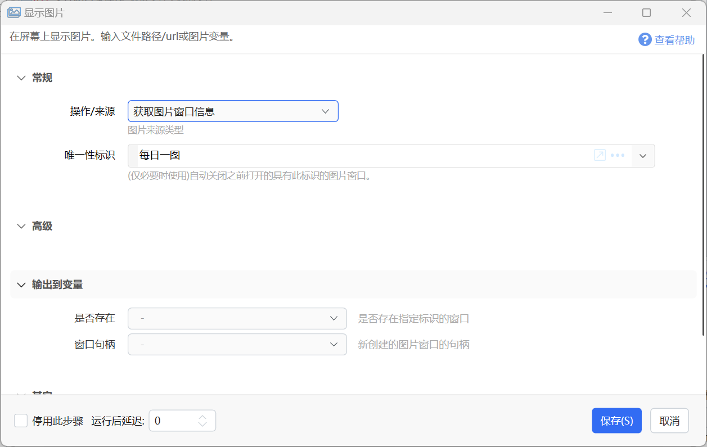
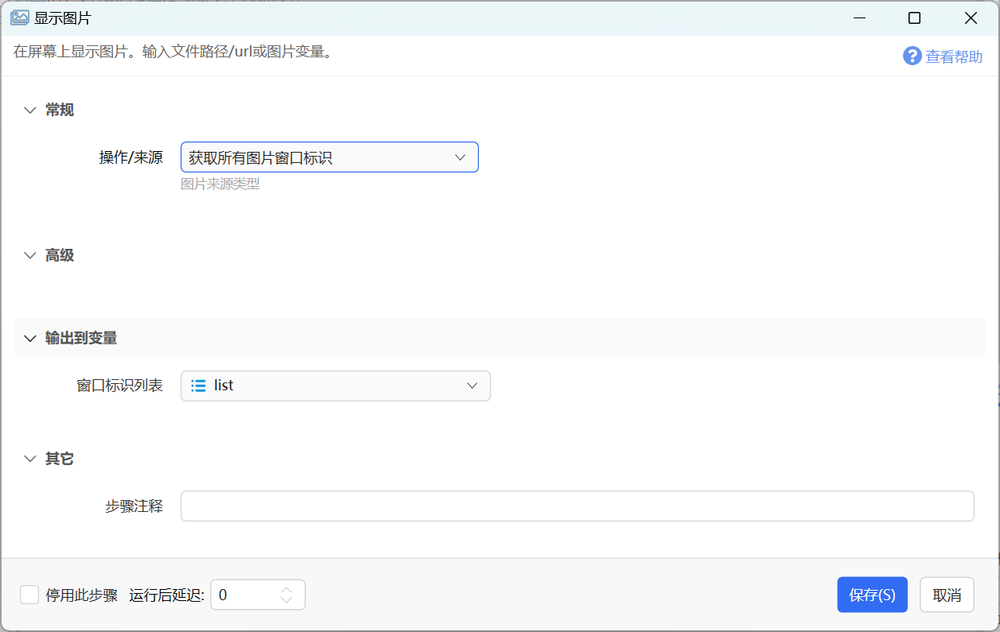
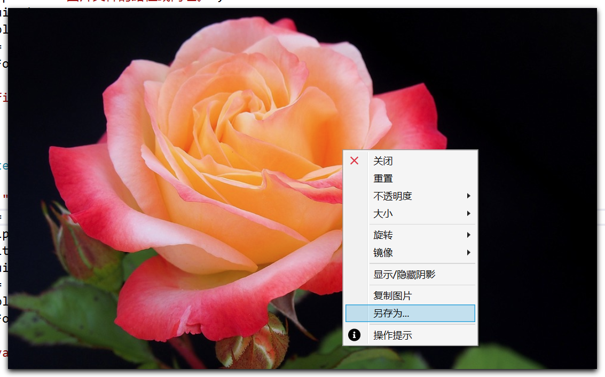
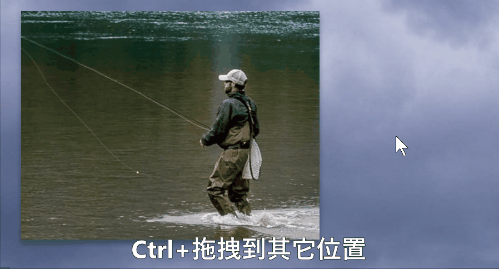
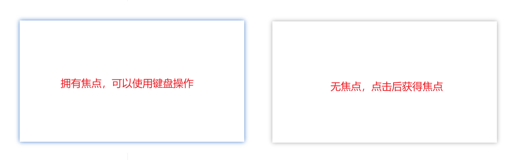
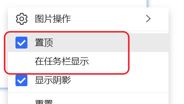

# 显示图片

在屏幕上显示图片。输入文件路径/url或图片变量。

## 当前模块定义

<XActionModuleMeta moduleKey="sys:showImage" />

用于显示文件、变量或剪贴板中的图片。

**支持的操作类型**

-   **显示：图片文件或网络图片**：显示给定的文件路径或图片网址中的图片。
-   **显示：变量中的图片**：通过截图或读取文件生成图片变量后，显示此变量中的图片。
-   **显示：剪贴板图片**：显示剪贴板中的图片。
-   **关闭图片窗口**：根据指定的唯一性标识关闭图片窗口。
-   **获取图片窗口信息**：根据指定的唯一性标识，获取图片窗口信息。
-   **获取所有图片窗口标识**：获取当前打开的所有图片窗口的唯一性标识的列表。示例动作：[关闭所有图片窗口](https://getquicker.net/Sharedaction?code=8e49c374-062d-4824-979c-08db3d4a9dcd)。

## 显示图片

支持3种图片来源：

-   文件路径或图片网址：显示本机图片或者互联网图片。此时需填写“路径/来源”参数，在此参数中传入图片文件的完整路径（如使用获取选中文件方式获得的路径）或网络图片的URL地址。
-   图片变量：显示变量中存储的图片。此时需选择要显示的“图片变量”。
-   剪贴板：显示剪贴板中的图片。

**输入参数**

【初始缩放比例】显示图片时的默认大小。1表示原始大小，0.5表示原始大小（边长）的一半，1.5表示原始大小的1.5倍。-1表示自动。

【唯一性标识】可选，自定义的图片窗口ID，方便后面通过此ID关闭窗口。

【自动关闭时间】设置自动关闭图片的时间。0表示不自动关闭，由用户双击图片或使用右键菜单关闭。

【显示位置】图片的显示位置，可选值：

-   自动：由Windows自动决定图片窗口的显示位置。
-   屏幕中间、左上、右上等：显示在屏幕中心或指定角落。
-   自定义位置：指定显示的具体位置。

【位置坐标】当“显示位置”为“自定义位置”时，指定图片显示的位置坐标。格式为：

-   left,top   如：“100,200”表示屏幕上x=100,y=200的位置。图片阴影部分会占用一定宽度，所以实际显示图片会靠下、靠右一点。
-   left,top,right,bottom 通常是截图得到的坐标范围，实际显示时右下角不会严格执行此数字。
-   参考动作：[截图贴图](https://getquicker.net/Sharedaction?code=3d9f7fbb-752a-40f5-d827-08d86cbb0005)

【等待图片关闭】是否在图片关闭后才运行后续的步骤。

【显示阴影】是否显示图片窗口阴影。

【显示任务栏图标】是否显示任务栏图标。

【是否置顶显示】是否将图片窗口显示在顶层（避免被普通窗口遮挡）。

【不激活窗口】显示时不抢占焦点（此时无法Esc关闭窗口）。

【Tooltip提示】鼠标悬浮在图片窗口上时显示的提示文字。

【关闭窗口回调参数】可选。如果希望在关闭窗口时获知，可以在这里设置回调参数。设置后，在关闭窗口时，将会再次运行动作，并且将此内容作为动作参数传递给动作。（v1.44.8+，[参考需求](https://getquicker.net/Common/Topics/ViewTopic/33091)）

**输出参数**

【窗口句柄】图片窗口的系统句柄。

#### 问题：如何设定显示坐标范围，让图片自适应缩放比例？

（1.42.23+版本）如果希望图片显示在指定的范围内，可以使用如下参数的组合：

-   缩放比例设置为`-1`；
-   显示位置为`自定义`，位置坐标为目标区域坐标，格式为`left,top,right,bottom`，支持数字像素值或屏幕的百分比，如`100,100,500,500`，或`100,100,50%,50%`。

## 其它操作类型

**关闭图片窗口：**关闭具有指定唯一性标识的图片窗口。

**获取图片窗口信息：**用于获取指定唯一性标识的图片窗口是否存在。

**获取所有图片窗口标识：**获取所有已打开的图片窗口的标识列表。

## 图片窗口的使用

#### 右键菜单

-   关闭：关闭图片；
-   重置：恢复默认的图片大小、旋转、透明度等；
-   不透明度：数值越低，图片越透明；
-   大小：图片缩放比例；
-   旋转：将图片旋转某个角度；
-   镜像：将图片左右或上下倒转；
-   显示/隐藏阴影：控制图片阴影的显示；
-   复制图片：将图片复制到剪贴板；
-   另存为：将图片保存到文件里；
-   操作提示：显示鼠标快捷操作提示。

#### 鼠标操作

-   滚轮：调整缩放比例
-   Shift+滚轮：按像素微调图片尺寸
-   Ctrl+滚轮：调整透明度
-   Alt+滚轮：旋转；
-   中键单击：恢复视图（缩放和旋转）；
-   左键双击：关闭图片；

**快速保存**

-   Ctrl+拖拽图片到桌面或资源管理器、其它程序（如Word），可以直接保存图片或将图片内容嵌入文档中。

#### 键盘操作

（1.35.36+版本）**：**

图片创建拥有焦点时，周围会显示蓝色阴影边框。此时可以使用键盘控制图片窗口。

-   `Esc`：关闭图片窗口；
-   `方向键/ESDF键`：移动窗口；
-   `Shift+方向键/ESDF`：更快速移动窗口；
-   `Ctrl+=``Ctrl+-`：缩放图片；
-   `R` 重置图片；
-   `C`或`Ctrl+C`复制图片；
-   `Ctrl+S`另存图片；
-   `Alt+左/右`旋转图片；

#### 其它说明

-   图片窗口在置顶且不显示在任务栏时，将从Alt+Tab切换窗口中隐藏。
    

## 示例动作

-   [显示原始尺寸图片](https://getquicker.net/Sharedaction?code=78e28478-b1ea-421e-75d3-08d692da05cc) : 获得图片网址后，以原始尺寸显示。
-   [批量贴图](https://getquicker.net/sharedaction?code=b1c9e1a0-bb9a-41ad-6798-08d67448baf3)
-   [截图并显示](https://getquicker.net/sharedaction?code=9bfc34fb-b7f7-40bd-6d0c-08d6c304e16e)

## 更新历史

-   1.6.7 增加“位置坐标”参数。
-   增加不在Alt+Tab列出的说明。
-   20240327 支持自适应缩放。
-   20250511 支持关闭窗口时回调动作。
