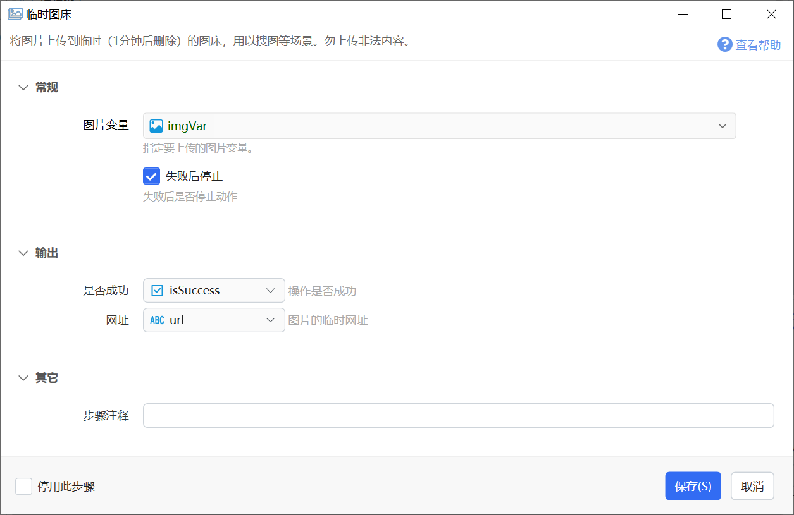

# 临时图床

将图片上传到临时（1分钟后删除）的图床，用以搜图等场景。勿上传非法内容。

## 当前模块定义

<XActionModuleMeta moduleKey="sys:tempImgBed" />

本功能用于以图找图等需要**临时**将截图、图片上传到网络并获得公网地址的场景。

**警告：**请勿使用本服务上传有可能违反国家法律或规定的文件。 文件网址会带有您的用户编号，如果被阿里云或第三方机构警告，我们将会停止您使用本服务的权限。

图片上传后会在1分钟后自动删除。（专业版用户可能会使用阿里云+CDN服务，保持时间更长）

*注：目前本服务对所有用户开放，由于带宽限制，会对图片大小、分辨率及调用频率进行限制。根据资源状况，后续可能会对服务范围有所调整。*

## 参数

### 输入参数

【图片变量】要上传的图片变量。

【失败后停止】操作失败后是否停止动作。

### 输出

【网址】图片上传后生成的临时网址。

【是否成功】操作是否成功。
