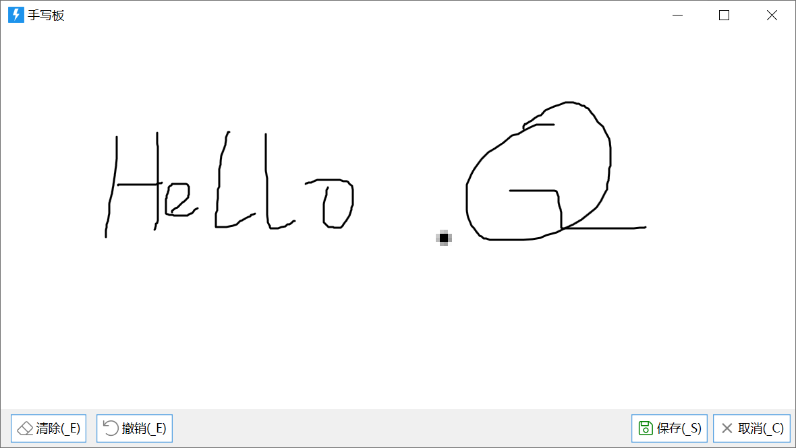
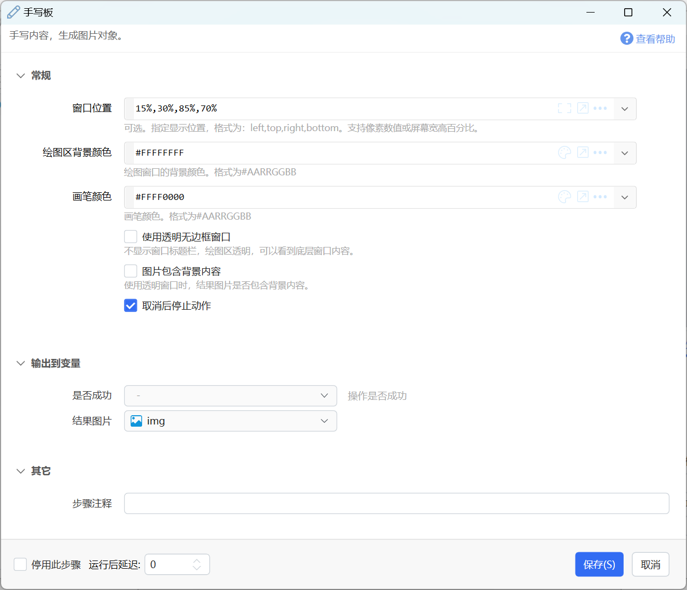

# 手写板

手写内容，生成图片对象。

## 当前模块定义

<XActionModuleMeta moduleKey="sys:whiteboard" />

1.10.8版本提供。

绘制简单图形并获得图片对象。

## 参数

**输入**

【窗口位置】指定手写笔的显示位置。

【绘图区背景颜色】指定绘图区的背景颜色，格式为#AARRGGBB（可以通过AA控制透明度，如#20FFFFFF绘制半透明的白色背景）

【画笔颜色】设定画笔颜色，格式为#AARRGGBB。

【使用透明无边框窗口】是否去除窗口的标题栏和边框。

【图片包含背景内容】输出结果图片时，如果绘图区为具有透明度的背景色，是否截取窗口下面的内容。

【取消后停止动作】点击取消按钮时是否停止动作。

**输出**

【结果图片】绘制的内容图片。

## 更新历史

-   20230524 完善文档。
