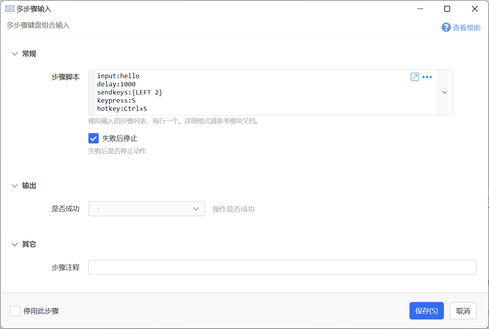

# 多步骤输入

多步骤键盘组合输入

## 当前模块定义

<XActionModuleMeta moduleKey="sys:inputScript" />

用于快速编写连续多个键盘输入步骤。

注意：

-   步骤运行中不支持停止，不适合放置大量步骤。

## 参数

【步骤脚本】

-   每行一个步骤指令。
-   //开始的行作为注释。
-   指令的格式为：命令:参数。
-   特殊情况下无法分行填写时，也可以写在一行，并使用`;;`表示换行。(1.36.17+版本)

支持的命令类型如下：

**键盘命令**

-   **input** 模拟键入纯文本（不受输入法影响）。如：`input:hello world，你好 世界`。
-   **input2** (1.30.0+版本) 模拟键入纯文本，支持使用转义字符。 如`\t内容\r\n换行`中的\\t表示tab，\\r\\n表示换行。
-   **sendkeys** 使用[模拟按键B](/v2/xaction/modules/sendkeys)的语法键入内容。如： `sendkeys:{LEFT 2}` 发送2个向左的方向键用于移动光标位置。
-   **delay** 等待时间（毫秒数）如：`delay:1000` 等待1秒钟
-   **paste** 粘贴内容，如：`paste:hello world` 将hello world写入剪贴板后模拟Ctrl+V进行粘贴。
-   **keydown** 按下按键：如：`keydown:F1` 按下F1键，或`keydown:#175`按下音量增加键(#+键值数字）。 注意应该在后续步骤中使用keyup命令抬起按键。键名可参考：[微软官方文档](https://docs.microsoft.com/zh-cn/dotnet/api/system.windows.forms.keys?view=net-5.0)。
-   **keyup** 抬起按键，格式同上，如：`keyup:F1`。
-   **keypress** 点击（按下并抬起）按键，格式同上。
-   **hotkey** 发送组合快捷键。如：`hotkey:Ctrl+S` ，数字键请使用D+数字表示，如`hotkey:Ctrl+Alt+D1`。

**鼠标命令（1.28.16+版本）**

-   **moveto** 移动鼠标指针到一个绝对坐标。如：`moveto:100,200` 将鼠标指针移动到 (100,200)位置。1.30.0版本开始支持百分比数值，如：`moveto:50%,50%`将鼠标移动到主屏幕中心。
-   **move** 将鼠标指针移动一定距离（相对于当前位置），参数为“水平方向像素数,垂直方向像素数”。如：`move:10,-10` 将指针向右和向上分别移动10个像素。
-   **click** 点击鼠标某个按键。参数为鼠标按键名，可选：left/right/middle/x1/x2。如：`click:left` 点击左键。
-   **dbclick** 双击鼠标某个按键。参数格式同上。
-   **down** 按下某个鼠标按键。参数格式同上。需要特别注意：按下和抬起鼠标按键要完全配对。
-   **up** 抬起某个鼠标按键。参数格式同上。
-   **wheel** 垂直滚动，单位为clicks（可以理解为“行”）。正值表示向前（远离用户，滚动区域内容向下），负值表示向后（朝向用户，滚动区域内容向上）。
-   **wheeldelta** 垂直滚动。单位为1/120 click。更细微的滚动。
-   **hwheel** 水平滚动，单位为clicks（可以理解为“行”）。正值表示滚动区域内容向左，负值表示滚动区域内容向右。
-   **hwheeldelta** 水平滚动，单位为1/120 click。

**组合命令（1.28.12+）**

-   **pastefile** 粘贴文件（将文件写入剪贴板后模拟Ctrl+V）。参数为文件完整路径，多个文件使用英文半角分号隔开。如：`pastefile:d:\test.png` ， `pastefile:d:\test1.png;d:\test2.txt`
-   **pasteimage** 粘贴图片（将图片文件读取为图片后写入剪贴板，然后模拟Ctrl+V，注意写入剪贴板的是图片对象而非图片文件）。如：`pasteimage:d:\test.png` 只支持单个图片。

## 其它

-   辅助生成代码的动作：

-   [多步骤生成 - by IDongYou - 动作信息 - Quicker](https://getquicker.net/Sharedaction?code=82678afc-219e-4e63-a7d1-08dd5143284a)
-   [多步骤生成器 - by EC10010 - 动作信息 - Quicker](https://getquicker.net/Sharedaction?code=52e0112f-076d-4347-df18-08d9db64e6a1)

## 更新历史

-   20230219 增加hotkey中使用数字键的说明。
-   20250221 增加新的辅助动作链接。
