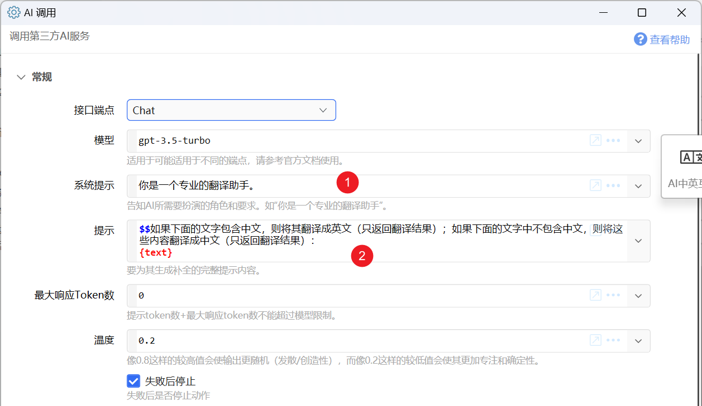
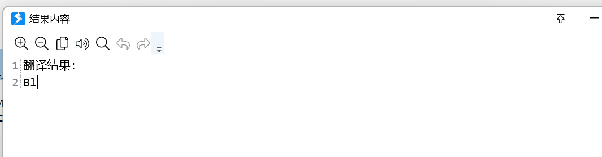
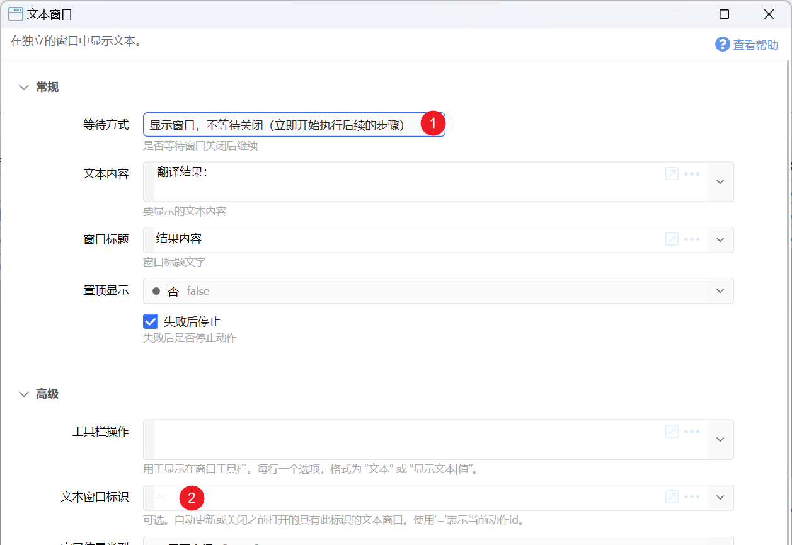
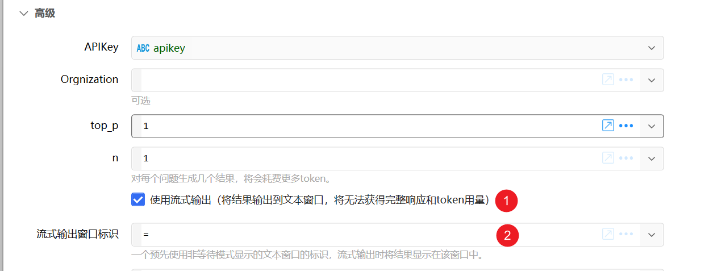
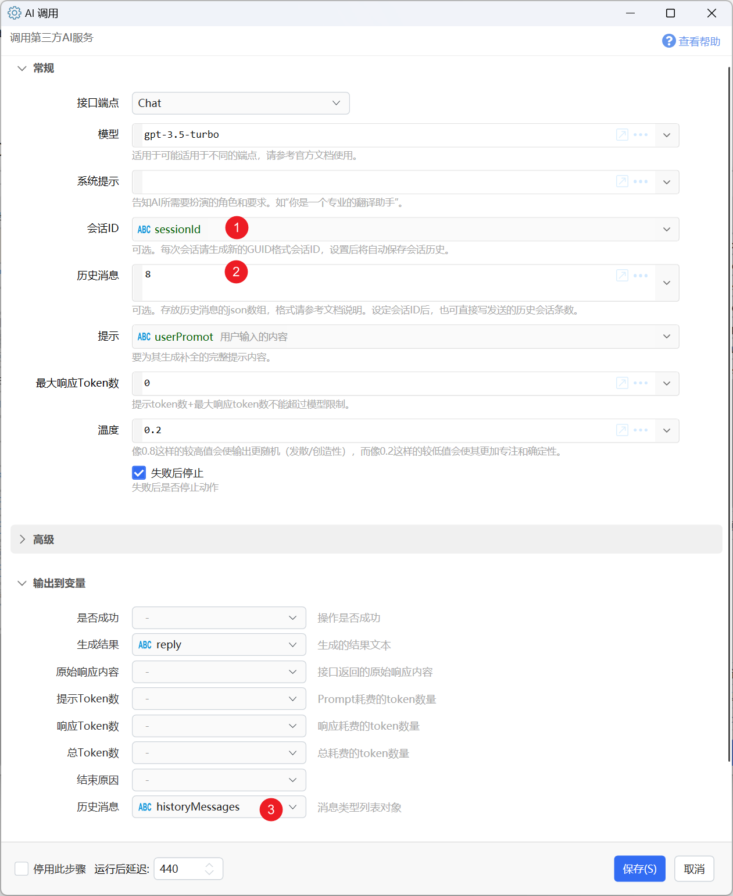

# AI 调用

调用第三方AI服务

## 当前模块定义

<XActionModuleMeta moduleKey="sys:ai" />

注：

-   使用本模块需要您具备一定的网络条件和服务商账号。
-   数据将会发送到国外服务器，请勿发送敏感或隐私信息、法律法规规定不可传输到国外的信息。
-   请勿使用此功能用于可能非法的活动。
-   每种模型和服务端点之间有一定联系，请参考官方文档了解端点可用模型。
-   每个请求的提示和响应token数量受到模型限制。
-   请详细阅读官方文档以了解各方面知识和信息。

## 基本原理

Quicker动作中主要用来处理一些专用的场景，而不是连续的会话。

一般的做法是：

-   在系统提示中，告诉AI需要扮演的角色。
-   使用文本插值等方式拼接出完整的“提示”，告诉AI实际要生成的内容。 这里面包含指令要求和实际待处理的内容。

下面是一个中英互译的翻译动作。提示包含两个部分：

-   `如果下面的文字包含中文，则将其翻译成英文（只返回翻译结果）；如果下面的文字中不包含中文，则将这些内容翻译成中文（只返回翻译结果）：` 告知AI，后面的内容是要翻译的实际内容，翻译的方法是根据内容里是否包含中文。
-   通过插值将`{text}`文本变量的内容放在后面。这部分可能是通过`获取选中文本`或`用户输入`方式得到的。



## 参数

<ModuleParamPreview
  moduleKey="sys:ai"
  values={{
    endpoint: 'chat',
    model: 'gpt-3.5-turbo',
    systemPrompt: '你是一位诗人。',
    prompt: '$$请根据下面的提示词写一首诗歌：\n{text}',
    maxTokens: '0',
    temperature: '0.6',
    topP: '1',
    n: '1',
    stream: 'true',
    streamTo: 'INPUT_TEXT',
    expireSeconds: '30',
    forceProxy: 'true',
  }}
  inputVars={{apiKey: 'apikey'}}
  outputVars={{result: 'result'}}
/>

【端点】目前支持Chat或Completions。

【模型】模型id。

【系统提示】用于告知AI所扮演的角色以及生成内容时的要求。

【提示】用户向AI给出的完整提示文字（提示词）。AI将根据这些提示生成内容。自1.42.21版本起，支持两种形式的内容：

-   纯文本提示词。
-   通过json数组，提供兼容gpt-4-vision的消息内容。示例：

<ModuleParamPreview
  moduleKey="sys:ai"
  focusKeys={['prompt']}
  values={{
    endpoint: 'chat',
    prompt: `[
  {
    "type": "image_url",
    "image_url": {
      "url": "https://cdn-dynmedia-1.microsoft.com/is/image/microsoftcorp/Studio-2-platinum_sprite_thumbnaill?sc=1"
    }
  },
  {
    "type": "text",
    "text": "图像描述了什么？"
  }
]`,
  }}
/>

注意：这里不应当填写完整的请求体json。

【最大响应Token数】token大约等于1个汉字或2/3个英文单词。建议使用0，太短时输出会被截断。每个模型有自己的提示和响应总共token数限制，较新的模型通常为4000。提示内容的token数+最大响应token数不能超过模型限制，否则会失败。

【温度】Temperature，0-1之间的数值。值越小，输出越稳定，倾向于返回置信度更高的回答。值越大，输出越随机，会更发散（创造性）。

【APIKey】从服务商获取的API秘钥。注意此信息为保密信息，

【Orgnization】APIKey对应的组织ID。可选。

【top\_p】请参考官方文档。

【n】输出几个结果，将会加倍耗费token。模块只能输出一个结果，其它结果需要从原始响应中解析。

【使用流式输出】立即看到输出的一种查询方式，可将结果连续输出到文本窗口。此方式下无法获得原始响应内容、耗费的token数等信息。

【流式输出窗口标识】使用流式输出时，用于指定前面步骤打开的文本窗口。设置为INPUT\_TEXT，可将内容直接模拟输入到活动窗口（窗口切换时将停止输出）。

【停止符stop】[官方参考文档](https://help.openai.com/en/articles/5072263-how-do-i-use-stop-sequences)。遇到此内容时，接口停止输出更多结果。留空，使用推荐默认值`<|endoftext|>`或自定义的内容。在使用第三方接口时，请务必设置此值（或使用1.38.35以上版本），建议使用`<|endoftext|>`。

【API网址】自定义API网址，用于使用第三方服务中转请求时使用。

-   使用Azrue的OpenAI服务时，API网址可以设置为：`https://YOUR_RESOURCE_NAME.openai.azure.com/openai/deployments/YOUR_DEPLOYMENT_NAME/{1}?api-version=2023-05-15`
-   `YOUR_RESOURCE_NAME`、`YOUR_DEPLOYMENT_NAME` 替换为实际的值。`{1}`作为接口名称的占位符保持不动。`api-version`的值可根据需要修改。
-   使用第三方网址时，可以按如下格式：`https://api网址/{1}` ，其中`{1}`作为接口名称（如`chat/completions`）的占位符保持不动。

-   1.44.32+版本，也可以直接指定以`chat/completions`结尾的完整网址。对于非`chat/completions`结尾的完整网址，可以在网址前增加`!`强制使用此网址，如`!https://myserver/api/chat`。

-   示例：

-   硅基流动的接口网址为`https://api.siliconflow.cn/v1/{1}`
-   Ollama，本机地址为`http://127.0.0.1:11434/v1/{1}`, 局域网其它服务器，请替换对应的ip地址和端口号。

【超时秒数】超时时间。

【响应格式】文本或`json_object`。json\_object用于指示输出内容为json格式，通常需要结合使用合适的提示词，并且要避免超过token限制被中间截止。请参考OpenAI文档了解此参数的用途。

自1.43.55版本开始支持通过json文本指定自定义的内容，如json\_schema。例如：

```json
{
  "type": "json_schema",
  "json_schema": {
    "name": "math_reasoning",
    "schema": {
      "type": "object",
      "properties": {
        "steps": {
          "type": "array",
          "items": {
            "type": "object",
            "properties": {
              "explanation": { "type": "string" },
              "output": { "type": "string" }
            },
            "required": ["explanation", "output"],
            "additionalProperties": false
          }
        },
        "final_answer": { "type": "string" }
      },
      "required": ["steps", "final_answer"],
      "additionalProperties": false
    },
    "strict": true
  }
}
```

【附加参数】用于为第三方接口提供额外的参数。可传入词典值，json，或匿名对象，如：

```csharp
$= new {参数名 = "参数值"};
```

## 流式响应

流式输出目前无法检测错误。

流式输出有两种方式：

#### 一、通过文本窗口显示



实现方法：

<StepProgramView
  data={{
    steps: [
      {
        key: 'sys:showText',
        note: '显示窗口，不等待关闭（立即开始执行后续的步骤）　翻译结果：',
      },
      {key: 'sys:ai'},
    ],
  }}
/>

1）事先创建一个以非等待模式显示的文本窗口，设置窗口标识（建议使用‘=’作为窗口标识，相当于动作ID，以避免动作之间冲突）。



2）在AI调用模块中，启用流式输出和输出的文本窗口标识。



这样当收到新的内容后，会将内容追加到窗口中。

#### 二、模拟输入到当前活动窗口

将“流式输出窗口标识”设置为`INPUT_TEXT`。此时会将内容通过模拟输入的方式发送到当前焦点窗口。 如果切换了焦点窗口，则输出会停止。

## 历史会话

从1.37.17版本开始支持历史消息自动发送。



可以有2种使用方式：

**1）每次传入历史消息的内容，格式为json数组。**

此时不需要设定会话ID，也不会输出历史消息的内容。需要开发者自行维护历史消息记录。

**2）由Quicker自动保存和回传历史消息。**

数据文件保存在`Quicker数据文件夹\AiLogs`目录中。

此时需设置这些参数：

【会话ID】每次会话前，使用“生成GUID”模块生成一个全球唯一ID作为会话ID。（只能使用GUID格式的会话ID）

【历史消息】参数中设定回传的历史消息个数。因为每次调用来回总token数量有限制，会话太长时需要抛弃更早的消息。

输出参数【历史消息】，返回历史消息对象列表，输出给文本变量时，自动转换为json格式。

建议使用会话ID作为显示会话内容的文本窗口标识，避免一个动作多次运行造成窗口冲突问题。

示例动作：[AI对话测试](https://getquicker.net/Sharedaction?code=fb351711-0941-4816-d9b7-08db2ba80230)。

## 示例动作

-   [AI写诗](https://getquicker.net/Sharedaction?code=2ee54fa9-ad5b-4273-6f9b-08db22290442)
-   [AI中英互译](https://getquicker.net/Sharedaction?code=531dc01c-4b59-42ef-6fbc-08db22290442)
-   [AI对话测试](https://getquicker.net/Sharedaction?code=fb351711-0941-4816-d9b7-08db2ba80230)

## 更新历史

-   20230714 Fix Azure接口地址错误。
-   20240327 增加响应格式和附加参数的说明。增加提示词支持gpt-4-vision请求格式。
-   20241219 增加自定义相应格式的说明。
-   20250307 版本1.43.61版本支持输出reasoning\_content推理过程。当文本窗口设置为Markdown语法高亮时，灰色显示&lt;think&gt;内容。
