# 基础OCR

获取图片中的文字

## 当前模块定义

<XActionModuleMeta moduleKey="sys:basic-ocr" />

识别图片中的文字或表格。

目前支持的接口类型：

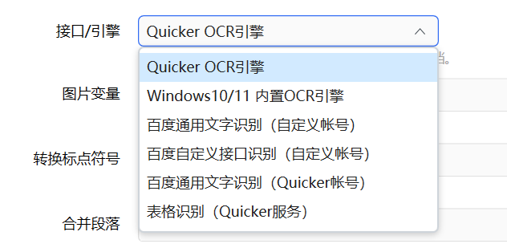

## Quicker OCR引擎

使用Quicker提供的免费**在线OCR识别服务**或**离线OCR引擎**识别文字。本服务23年4月升级后，识别准确度和速度大幅提升。据网友评测，识别效果甚至可媲美某服务商高精度接口；

示例动作：[Quicker OCR](https://getquicker.net/Sharedaction?code=45a0cf34-ca99-494c-4af7-08db410cf70d)

-   在线服务：

-   因服务器资源有限，同时被所有用户共享，因此请在合理范围内使用本服务。
-   免费版最短用户每10秒一次，每日最多100次；专业版用户最短每2秒一次，每日最多1000次；（此限制可能会依据服务器负载情况进行调整）
-   专业版用户可享用我们所提供的专用独享GPU服务器，识别效率更佳；
-   无首次启动延迟，适合偶尔使用；

-   离线引擎：

-   为专业版用户打造，免费版用户也可使用，但是限制半速运行；
-   免费；高速度（省去网络传输时间）；无数量限制；
-   内网离线部署；
-   支持屏幕找字功能；
-   支持更大图片（如整个4k屏幕）的识别；
-   首次使用（或空闲时间超过设定的保活时间后第一次使用），需要一定的额外时间加载模型；
-   注：不支持多线程，请勿多线程方式或同时在多个动作中调用；

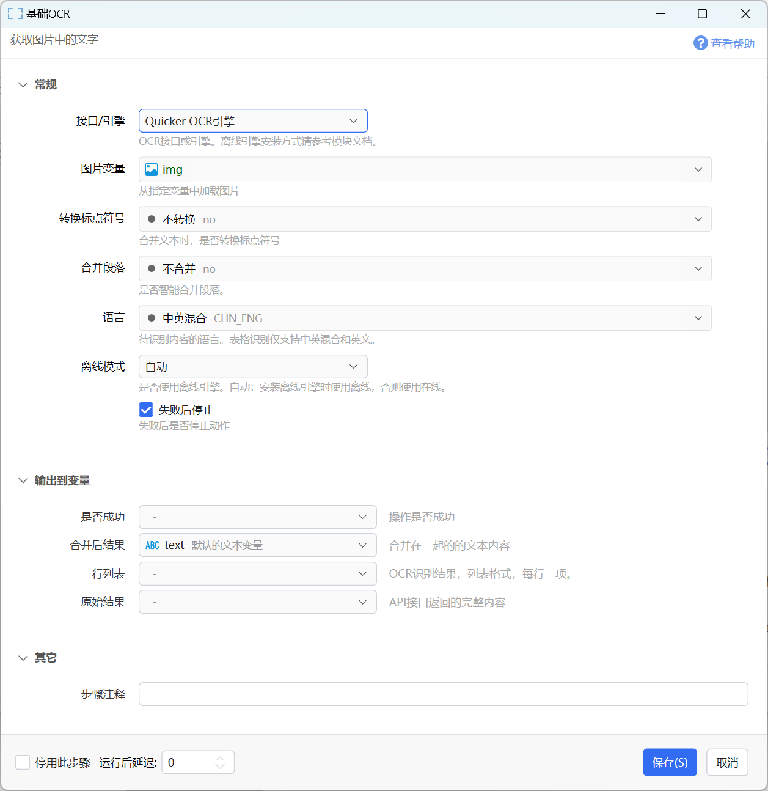

**参数说明**

【图片变量】需要识别的图片。 这里也可以传入图片文件的路径/图片base64编码文本。 越小的图片，识别速度越快。

【转换标点符号】是否转换识别结果中的标点符号为半角、全角，或保持原始识别结果不变。

【合并段落】选择是否将多行合并成一个段落（根据行的末尾是不是有句子结束的标点符号判断）。

【语言】识别语言，支持中英、英文、韩文、日文、繁体中文、拉丁语、阿拉伯语。应该针对要识别的图片中的内容选择合适的语言。

【离线模式】可选值：

-   自动：如果安装了离线引擎，则使用离线识别，否则使用在线识别服务。
-   仅使用在线服务：即使安装了离线识别引擎，也仍然使用在线服务。
-   仅使用离线引擎：强制仅使用离线引擎，如果未安装离线引擎则返回失败。

*设计“离线模式”参数的目的，是给使用者根据动作的使用场景来自由控制所选择的引擎。 对于自动化/循环/频繁使用的这类识别请求，请使用离线引擎；对于偶尔/随机性/少量使用的文字识别需求，可使用在线服务来避免首次启动延迟。*

可以通过调试运行观察实际使用的引擎类型。

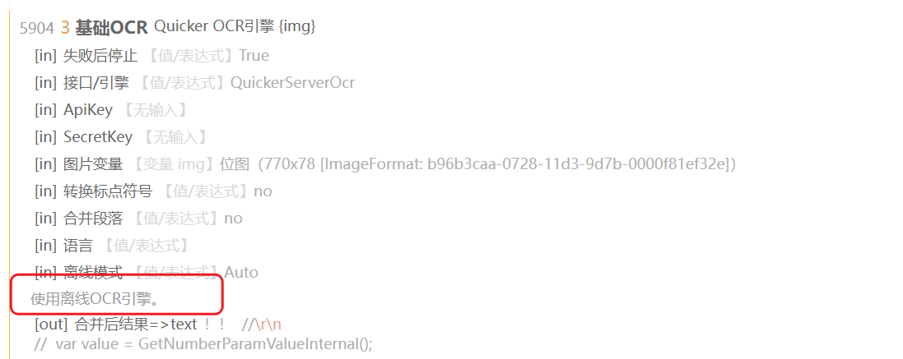

**输出**

【是否成功】是否成功识别。

【合并后的结果】识别结果根据“转换标点符号”“合并段落”选项处理后的结果。

【行列表】表示原始识别结果的文本列表（也可以输出给文本变量）。

【原始结果】原始识别结果的json格式文本。

### 离线识别引擎包

**安装条件：**

-   64位Windows系统。
-   CPU支持AVX指令集。

**什么情况下需要离线识别包：**

-   识别需求比较多；（如果识别需求不多，可以直接使用在线服务，首次识别速度更快。专业版用户独享GPU服务器，性能更好。）
-   需要屏幕找字功能；

**下载网址：**

-   百度网盘：[https://pan.baidu.com/s/19PF\_mVVfnEIXqjJju4I4fA?pwd=rrv4](https://pan.baidu.com/s/19PF_mVVfnEIXqjJju4I4fA?pwd=rrv4)
-   123网盘：[https://www.123pan.com/s/9eOcVv-HsSD3.html](https://www.123pan.com/s/9eOcVv-HsSD3.html)
-   Github：[https://github.com/cuiliang/Quicker/releases/tag/OfflineOCR1.2.1](https://github.com/cuiliang/Quicker/releases/tag/OfflineOCR1.2.1)
-   QQ群文件；

离线包默认支持文字方向的识别。对于较小的图片，可能识别错误。如果您希望完全禁止自动的方向检测，请使用下面的文件解压缩后覆盖到离线包目录中。

-   禁用旋转检测的主程序：[https://files.getquicker.cn/files/quickerocragent\_norotation.zip](https://files.getquicker.cn/files/quickerocragent_norotation.zip) （需先安装完整离线包后，使用此文件解压缩后覆盖完整包中的对应文件）

1.2.1 更新内容：

-   更换底层组件到[PaddleSharp](https://github.com/sdcb/PaddleSharp)，解决长时间运行时不稳定问题；
-   支持多种语言识别；
-   不再支持表格识别；
-   支持屏幕找字功能；
-   支持设定保活时间；

**安装方法：**

-   下载安装包zip文件。
-   解压缩到任意目录。
-   双击目录中的`安装到目标位置.bat`，或手动将解压缩后的目录中的所有内容复制到`Windows我的文档\Quicker\_ocr`目录中。
    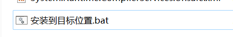
-   最终的效果为：
    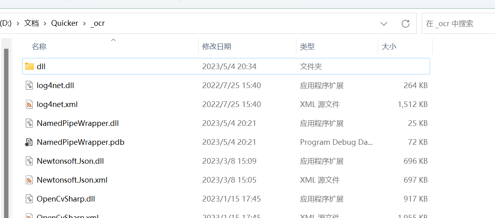

如果在使用时出现“PaddleConfig的类型初始值设定项引发异常”报错（如下图所示），请下载和安装[VisualC++再发布包(Visual C++ Redistributable)](https://aka.ms/vs/17/release/vc_redist.x64.exe)。

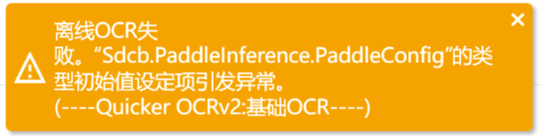

**测试动作：**

[QuickerOCR离线 - by CL - 动作信息 - Quicker](https://getquicker.net/Sharedaction?code=4f27bd92-e6fc-4c48-ad58-08dd15875f2b)

**使用：**

安装离线包后，接选择 `Quicker OCR引擎`（原名“Quicker 免费OCR服务”），离线模式中选择`自动`或`仅使用离线引擎`即可自动使用离线OCR引擎。

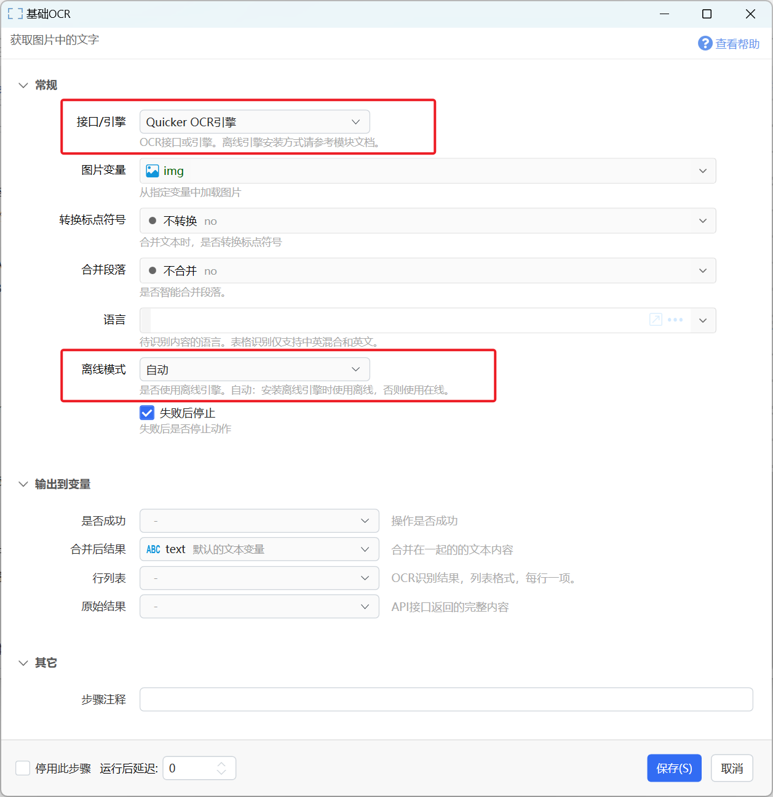

**设置保活时间：**

保活时间是指离线引擎在处理OCR请求后等待一定的时间，没有新的请求再退出。 这样可以避免每次识别重新加载模型，从而可以大幅提升后续识别的效率。

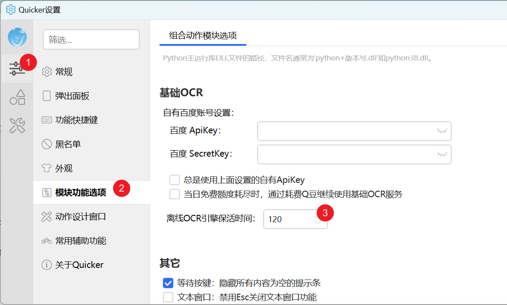

## Windows 10/11 内置OCR

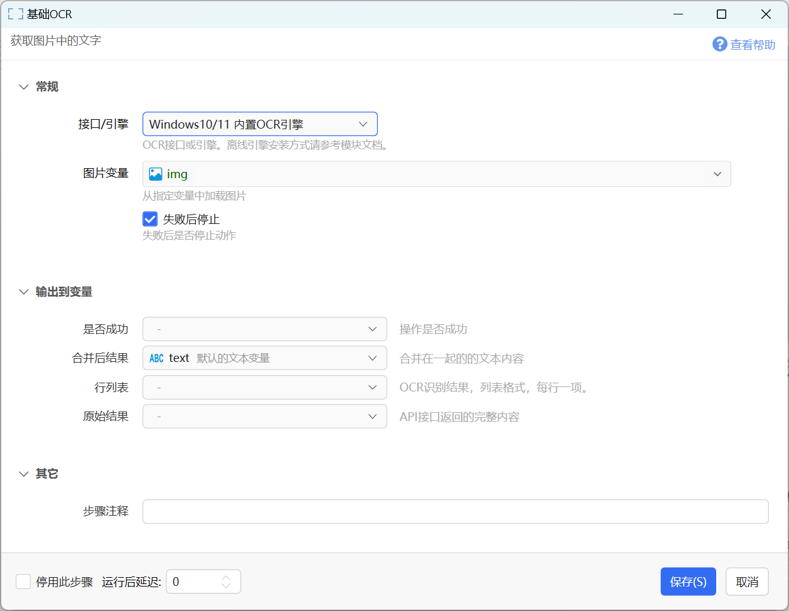

使用Windows自带OCR引擎识别文字。识别时将使用Windows当前语言设置进行识别。

Windows自带OCR引擎识别速度快但是效果比较一般。

参数请参考上文中“Quicker OCR引擎”中的说明。

## 百度OCR识别

使用百度的OCR服务识别文字。支持下面3个接口：

-   百度通用文字识别 (自定义帐号)
-   百度通用文字识别 (Quicker帐号)
-   百度自定义接口识别 (自定义帐号)

### 百度通用文字识别（自定义账号）

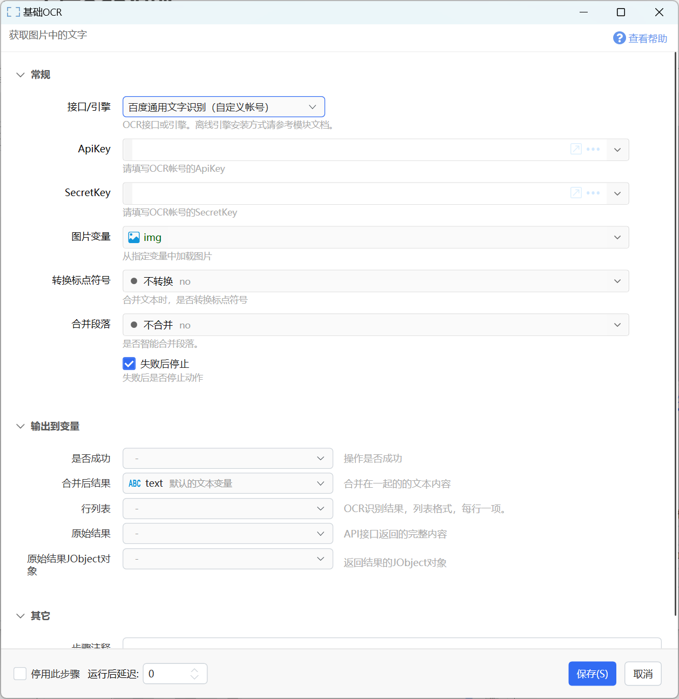

使用自有账号调用百度通用文字识别接口。

**参数**

【ApiKey】自有百度帐号的ApiKey。

【SecretKey】自由百度帐号的SecretKey。

【图片变量】要识别文字的图片。

【转换标点符号】选择是否对识别结果中的标点符号进行转换。

【合并段落】选择是否将多行合并成一个段落（根据行的末尾是不是有句子结束的标点符号判断）。

**输出**

【是否成功】是否识别成功。

【行列表】识别出来的文本行，类型为文本列表。

【合并后结果】将行合并成一段文本。根据“合并段落”参数，如果合并段落，则将可能是一段的内容合并在一行内。否则的话直接将各行合并成一段多行文本。

【原始结果】服务商API返回的原始结果内容。

【原始结果JObject对象】返回的JObject对象，可用于提取内容。

### 百度通用文字识别（Quicker账号）

**Quicker公共帐号**主要目的是消除大家自己申请百度帐号的麻烦。因为所有用户共享百度公司提供的每日5万次免费调用额度，所以此公共帐号会有一定的限制：

-   如果百度公司降低或不再提供免费额度，此服务将会不能使用（据说会长期提供）；
-   仅供日常轻度使用场景，大的需求量请使用自己的百度帐号。
-   为避免某个人占用了过多额度造成大家都使用不了，因此对每个人每日使用次数有如下限制：

-   免费版用户：每日最多20次。
-   专业版用户：每日最多100次。

-   在设置中可选择在免费额度用完以后耗费Q豆继续使用基础OCR服务（请参见下一个章节的截图）。每次OCR的费用为0.005Q豆（1元可用200次）。[什么是Q豆？](https://getquicker.net/KC/Kb/Article/933)

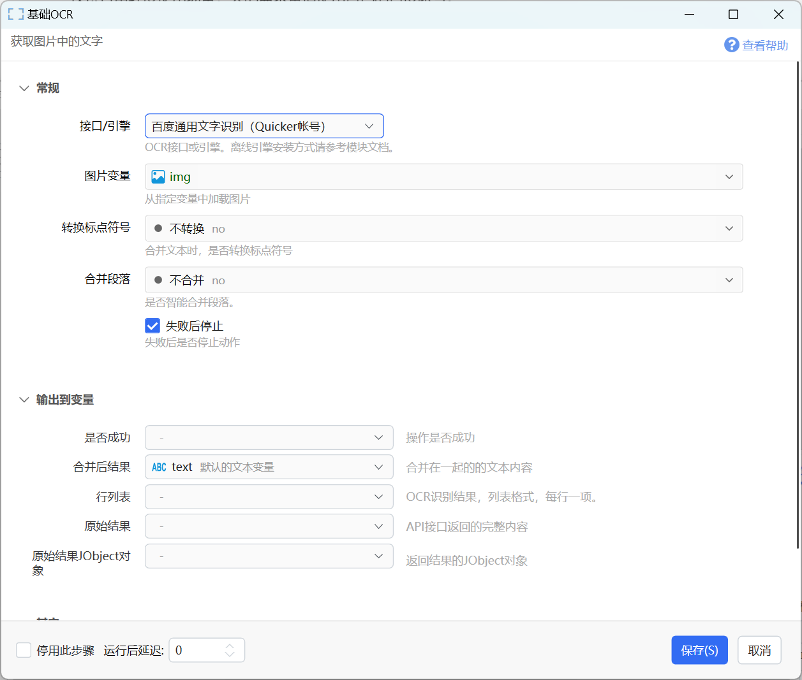

### 使用全局自有OCR账号

设置一个全局的百度OCR账号，以便于在所有使用百度接口识别文字的地方自动使用此全局账号。

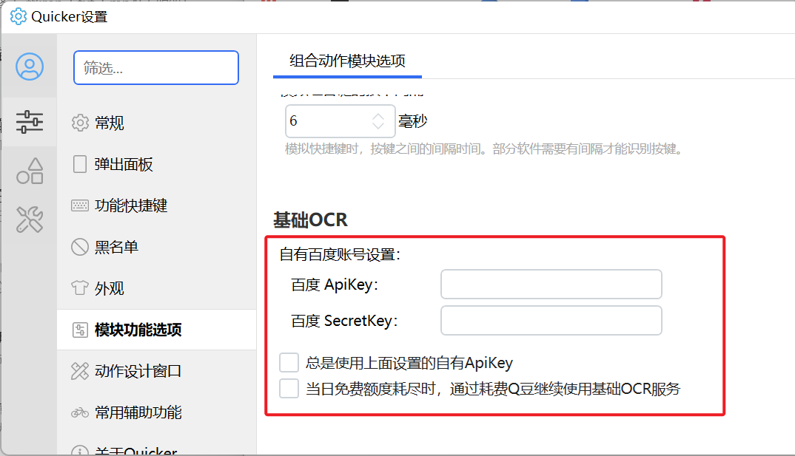

选项说明：

【总是使用上面设置的自有ApiKey】设置自有百度账号后，在Quicker中使用“基础OCR”模块时，自动使用自有账号，即使已经在动作中配置了账号或选择使用Quicker的账号。

### 百度自定义接口识别

使用指定的百度接口识别文字，并返回原始响应内容。

百度文字识别接口文档地址：[https://cloud.baidu.com/doc/OCR/s/1k3h7y3db](https://cloud.baidu.com/doc/OCR/s/1k3h7y3db)

请参考：[百度账号申请教程](https://getquicker.net/KC/Kb/Article/364)，作者@Marcus

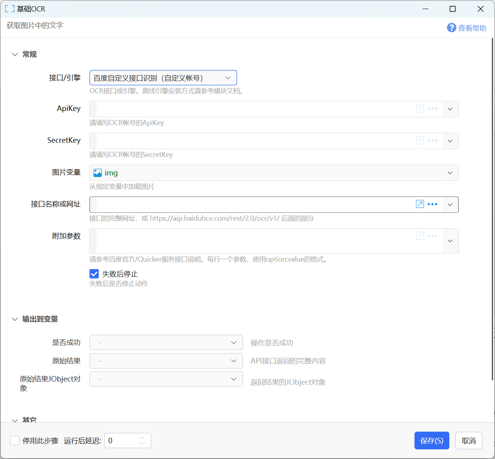

**参数**

【接口名称或网址】接口文档中“请求URL”网址或末尾的接口名部分。

如高精度识别接口：可以用“https://aip.baidubce.com/rest/2.0/ocr/v1/accurate\_basic”或“accurate\_basic”。参数下拉框中预制了几种常用的识别接口关键词可以选择。

注意：个别接口使用了不同的网址类型，这时候需要提供完整网址，并测试是否能正常工作。

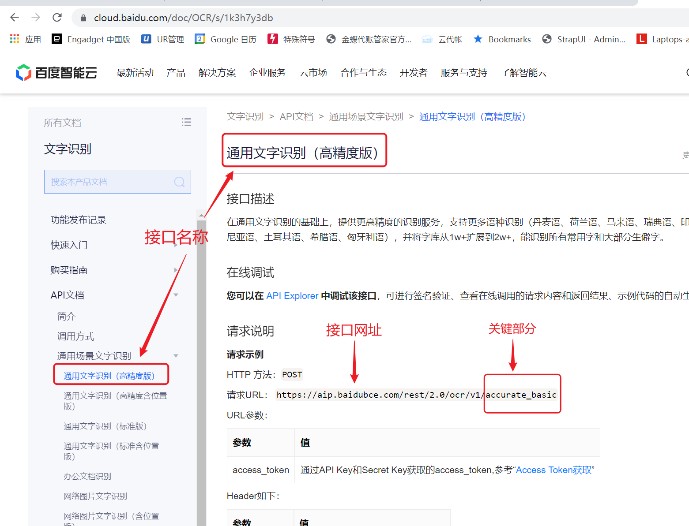

【附加参数】

词典格式的接口附加参数，具体支持的参数请参考百度API文档。可以用 key:value 的形式每行指定一个。

**输出**

【原始结果JObject对象】根据原始响应json内容转换生成的JObject对象。

## 表格识别（Quicker服务）

提取图片中的表格内容，并生成HTML格式的结果。

本功能使用Quicker提供的在线服务，免费版限制10分钟一次，专业版限制10秒钟一次。

参考动作：[表格识别](https://getquicker.net/Sharedaction?code=3fc97b7e-7be1-4a23-3d64-08db3e27302e)

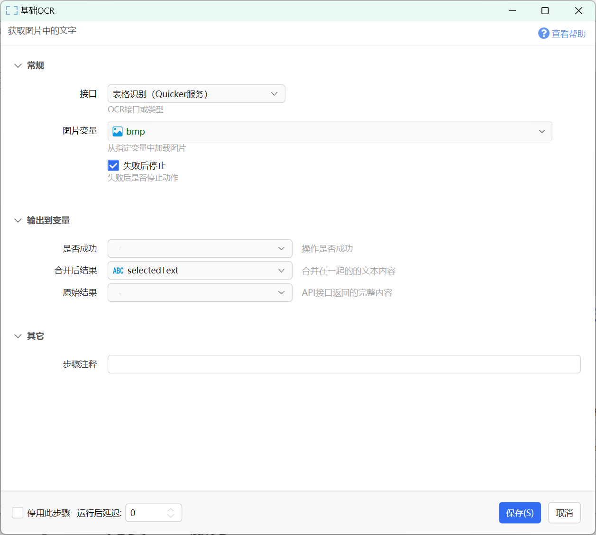

参数：请参考前面其它接口的说明。

输出：

【合并后结果】表格识别结果，为HTML格式的文本。

## 更新历史

-   20230505 整理文档。
-   20241206 增加离线OCR测试动作链接。
