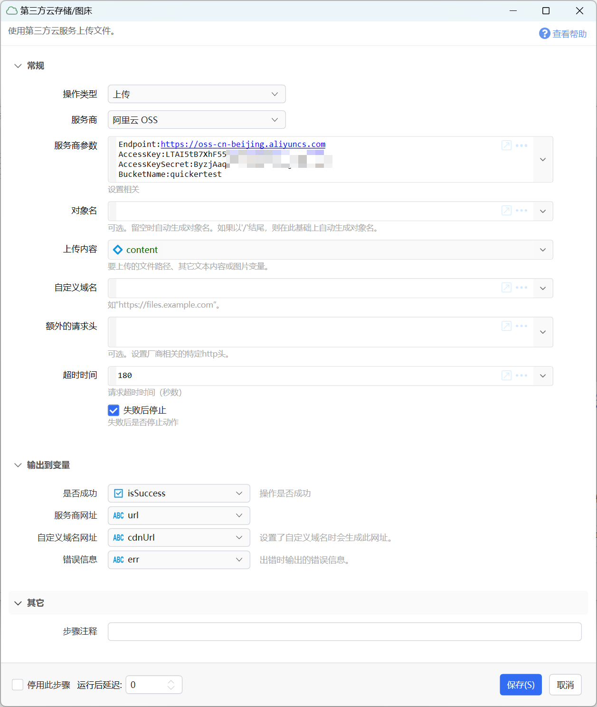

# 第三方云存储/图床

使用第三方云服务上传文件。

{/* xaction-metadata:start */}
## 当前模块定义

- 模块 Key：`sys:cloud_oss`
- 分类：网络服务（`Network`）
- 类型：`Action`
- 风险操作：否
- 专业版：否

## 输入参数

| Key | 名称 | 类型 | 默认值 | 必填 | 变量模式 | 条件 | 说明 |
| --- | --- | --- | --- | --- | --- | --- | --- |
| `operation` | 操作类型 | `Enum` | Upload | 是 | `Input` |  |  |
| `vendor` | 服务商 | `Enum` | Aliyun | 是 | `Input` |  |  |
| `vendorSettings` | 服务商参数 | `Text` |  | 是 | `Input` |  | 设置相关 |
| `key` | 对象名 | `Text` |  | 否 | `Input` | 仅：Upload | 可选。留空时自动生成对象名。如果以'/'结尾，则在此基础上自动生成对象名。 |
| `content` | 上传内容 | `Any` |  | 否 | `Input` | 仅：Upload | 要上传的文件路径、其它文本内容或图片变量。 |
| `customDomain` | 自定义域名 | `Text` |  | 否 | `Input` | 仅：Upload | 如"https://files.example.com"。 |
| `extraHeaders` | 额外的请求头 | `Text` |  | 是 | `Input` |  | 可选。设置厂商相关的特定http头。 |
| `expireSeconds` | 超时时间 | `Number` | 180 | 否 | `UseVarOrInput` |  | 请求超时时间（秒数） |
| `stopIfFail` | 失败后停止 | `Boolean` | true | 否 | `Input` |  | 失败后是否停止动作 |

## 输出参数

| Key | 名称 | 类型 | 条件 | 说明 |
| --- | --- | --- | --- | --- |
| `isSuccess` | 是否成功 | `Boolean` |  | 操作是否成功 |
| `vendorUrl` | 服务商网址 | `Any` | 仅：Upload |  |
| `customUrl` | 自定义域名网址 | `Any` | 仅：Upload | 设置了自定义域名时会生成此网址。 |
| `err` | 错误信息 | `Text` |  | 出错时输出的错误信息。 |

## 选项值

### `operation` 操作类型

| Value | 名称 | 说明 |
| --- | --- | --- |
| `Upload` | 上传 |  |

### `vendor` 服务商

| Value | 名称 | 说明 |
| --- | --- | --- |
| `Aliyun` | 阿里云 OSS |  |
| `Tencent` | 腾讯云 COS |  |
| `Qiniu` | 七牛云 |  |
{/* xaction-metadata:end */}

将文件、图片、文本数据保存到自己的云服务账号中。（1.37.5+版本提供）

本模块为测试状态，欢迎反馈问题。

安全注意事项：

-   请勿分享含有账号信息的动作。
-   请勿将含有账号信息的动作的调试运行文件发送给其他人。


目前支持的服务商：

-   阿里云 OSS
-   腾讯云 COS
-   七牛云 kodo

在使用本模块之前，您需要有云服务商的账号及相关访问凭据、创建好存储桶(Bucket)、设置好自定义域名。每种厂商具有自己特定的设置参数，请参考下面的详细说明。Bucket需要设置为公共可读才能通过浏览器访问。



## 参数

**输入参数**

【操作类型】目前仅支持“上传”。

【服务商】选择厂商。

【服务商参数】针对所选择的服务商，提供上传文件所需要的必要参数。每种厂商所需要的参数请参考本文后续部分的说明。

【对象名】可以理解为文件在服务器端的路径。

如，当对象名为`_sitefiles/home/abc.png`时，如果域名为`https://files.example.com`得到的最终网址就是`https://files.example.com/_sitefiles/home/abc.png`

注意：对象名不要以`/`字符开始。

【上传内容】可以是以下几种类型：

-   文件的完整路径，按原格式上传文件；
-   图片变量，上传为一个图片文件；
-   其它文本内容，上传为一个文本文件；

【自定义域名】当使用自定义域名或CDN时，指定域名（需要带http或https），如`https://files.example.com`。

【额外的请求头】额外发送的http header。每行一个，使用`name:value`的形式填写。

注：仅阿里云、腾讯云 接口支持设置请求头。

【超时时间】请求超时时间。 这里可能需要根据要上传文件的大小做调整。

**输出参数**

【服务商网址】服务商对上传网站所生成的网址（使用服务商所提供的域名）。注：（1）阿里云提供的oss网址通常只能下载。（2）七牛云提供的网址仅供测试使用。

【自定义域名网址】根据自定义域名生成的网址。

【错误信息】出现错误时返回的错误信息。

## 各服务商参数

### 阿里云

```
Endpoint:服务节点网址，如：https://oss-cn-beijing.aliyuncs.com
AccessKey:您的AccessKey（建议设立专用子账号并使用其AccessKey和AccessKeySecret）
AccessKeySecret:您的AccessKeySecret
BucketName:Bucket的名称
```

Bucket管理网址：[https://oss.console.aliyun.com/bucket](https://oss.console.aliyun.com/bucket)


查看EndPoint


### 腾讯云

```
BucketName:存储桶名称，如 test-13005123456
Region:节点名称，如ap-beijing
AppId:账号的AppID，在账号信息中查看，可以为空
SecretId:账号的SecretId（建议使用子账号）
SecretKey:账号的SecretKey
```


查看APPID：


SecretId 和 SecretKey：

-   总账号（不建议使用）：[https://console.cloud.tencent.com/cam/capi](https://console.cloud.tencent.com/cam/capi)
    
-   子账号：[https://console.cloud.tencent.com/cam](https://console.cloud.tencent.com/cam)
    


### 七牛云

```
Zone:存储区域ID，如z2，参见https://developer.qiniu.com/kodo/1671/region-endpoint-fq
UseHttps:true 是否使用https上传
UseCdnDomains:true  是否使用CDN加速上传
AccessKey:你的AccessKey
SecretKey:你的AccessSecret
Bucket:存储空间名称，如quicker-test
AccessUrl:自定义域名，如：http://qiniutest.getquicker.cn
```

存储空间信息：[https://portal.qiniu.com/kodo/bucket](https://portal.qiniu.com/kodo/bucket)


AccessKey查看：[https://portal.qiniu.com/user/key](https://portal.qiniu.com/user/key)


## 更新历史

-   20241206 完善文字。
