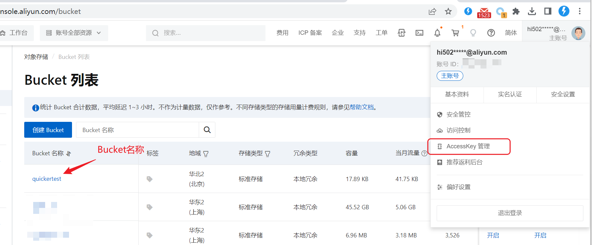
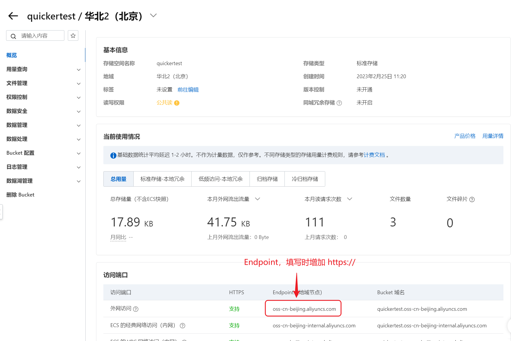
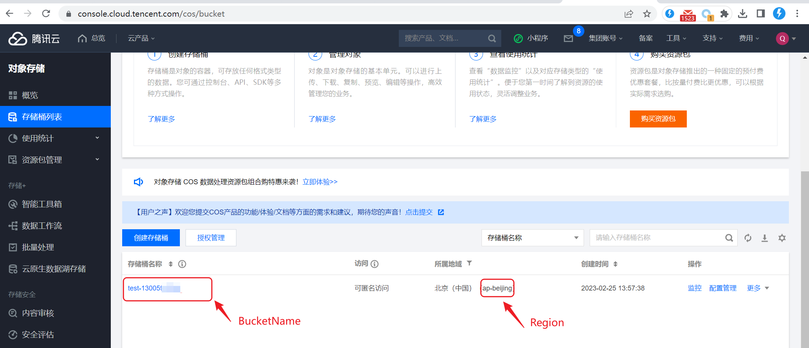
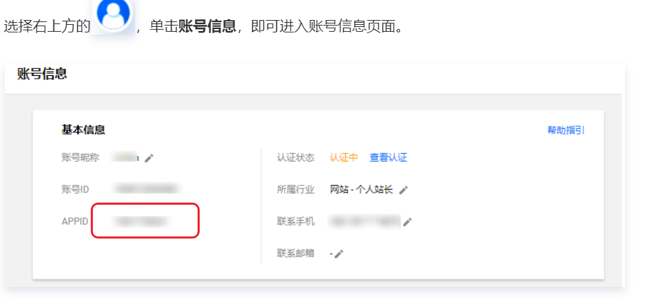
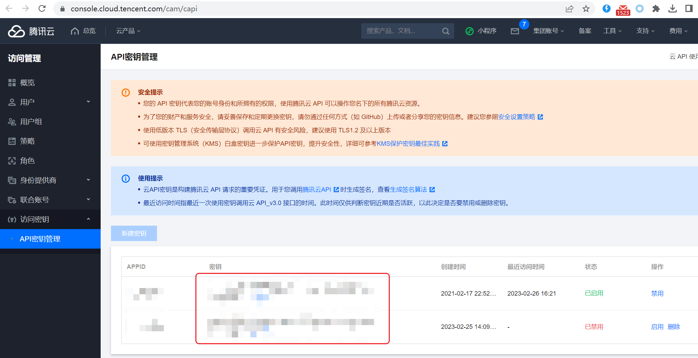
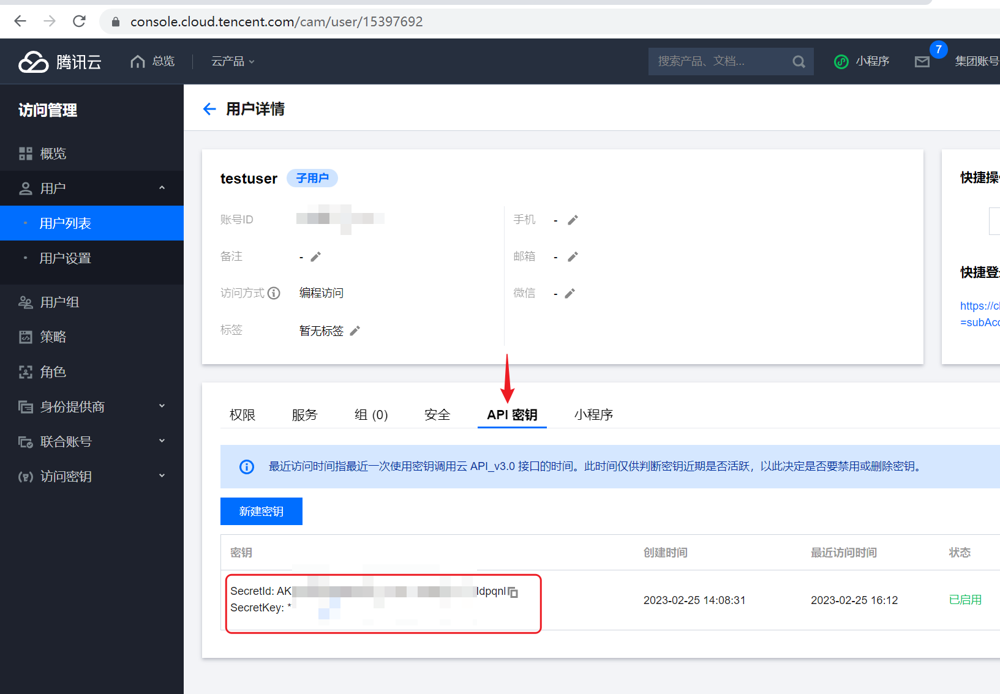
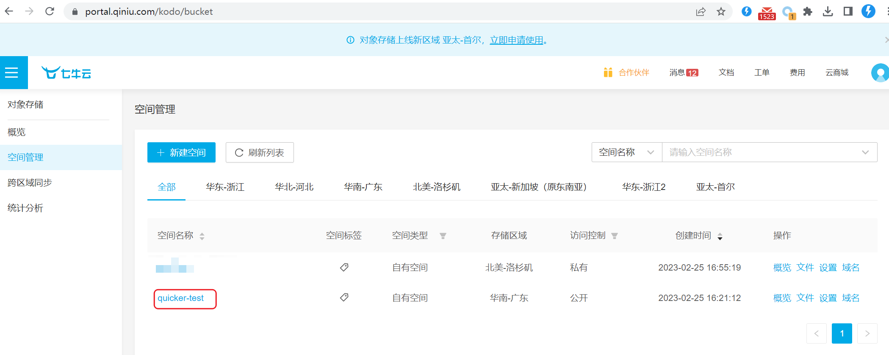
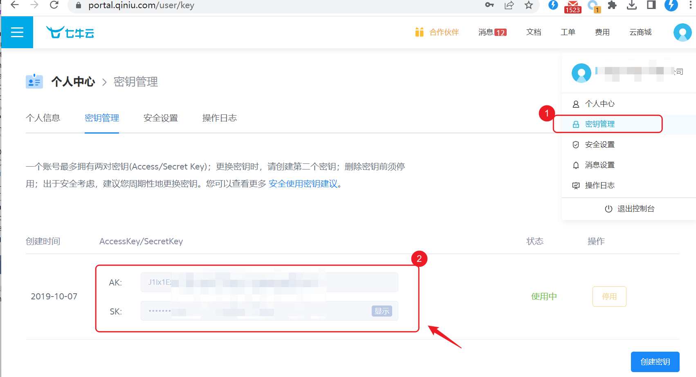

# 第三方云存储/图床

把文件、图片或文本传到你自己的云账号，换回网址。1.37.5+。只要临时链接，用 [临时云存储](/v2/xaction/modules/tempcloudstore)。

## 当前模块定义

<XActionModuleMeta moduleKey="sys:cloud_oss" />

## 概述

本模块仍是测试状态，欢迎反馈。

不要分享带账号信息的动作，也不要把含密钥的调试运行文件发给别人。

使用前需要：云账号和访问凭据、已创建存储桶、按需配好自定义域名。桶要设为公共可读，浏览器才能直接打开。目前支持阿里云 OSS、腾讯云 COS、七牛云。

<ModuleParamPreview moduleKey="sys:cloud_oss" />

## 参数说明

**操作类型**：目前只有 **上传**。

**服务商**：阿里云 OSS、腾讯云 COS、七牛云。

**服务商参数**：按厂商填写，见下文。

**对象名**：服务端路径。例如对象名 `_sitefiles/home/abc.png`、域名 `https://files.example.com`，最终网址是 `https://files.example.com/_sitefiles/home/abc.png`。不要以 `/` 开头。留空则自动生成；以 `/` 结尾时在此前缀下自动生成。

**上传内容**：文件完整路径（按原格式上传）、图片变量，或其它文本（当成文本文件）。

**自定义域名**：使用自定义域或 CDN 时填写，需带 `http` 或 `https`，如 `https://files.example.com`。

**额外的请求头**：每行 `name:value`。仅阿里云、腾讯云支持。

**超时时间**：秒数，默认 `180`。大文件请调大。

**失败后停止**：失败是否中止动作。默认开启。

## 输出

- **是否成功**
- **服务商网址**：厂商域名下的地址。阿里云 OSS 地址通常只能下载；七牛云自带地址仅供测试。
- **自定义域名网址**：填了自定义域名时生成。
- **错误信息**

## 各服务商参数

### 阿里云

```text
Endpoint:服务节点网址，如：https://oss-cn-beijing.aliyuncs.com
AccessKey:您的AccessKey（建议设立专用子账号并使用其AccessKey和AccessKeySecret）
AccessKeySecret:您的AccessKeySecret
BucketName:Bucket的名称
```

桶管理：[OSS 控制台](https://oss.console.aliyun.com/bucket)



查看 Endpoint：



### 腾讯云

```text
BucketName:存储桶名称，如 test-13005123456
Region:节点名称，如ap-beijing
AppId:账号的AppID，在账号信息中查看，可以为空
SecretId:账号的SecretId（建议使用子账号）
SecretKey:账号的SecretKey
```



查看 AppID：



SecretId / SecretKey：

- 总账号（不建议）：[访问密钥](https://console.cloud.tencent.com/cam/capi)



- 子账号：[访问管理](https://console.cloud.tencent.com/cam)



### 七牛云

```text
Zone:存储区域ID，如z2，参见https://developer.qiniu.com/kodo/1671/region-endpoint-fq
UseHttps:true 是否使用https上传
UseCdnDomains:true  是否使用CDN加速上传
AccessKey:你的AccessKey
SecretKey:你的AccessSecret
Bucket:存储空间名称，如quicker-test
AccessUrl:自定义域名，如：http://qiniutest.getquicker.cn
```

存储空间：[对象存储](https://portal.qiniu.com/kodo/bucket)



AccessKey：[密钥管理](https://portal.qiniu.com/user/key)



## 限制与排障

密钥填错、桶不是公共可读、对象名以 `/` 开头，都会导致打不开或上传失败。七牛云请用自定义域名，不要依赖测试域名做正式分发。超时按文件大小加大 **超时时间**。

## 相关链接

<RelatedDocs
  items={[
    {
      href: '/v2/xaction/modules/tempcloudstore',
      label: '临时云存储',
      description: '不自备云账号，只要短时网址。',
    },
    {
      href: '/v2/xaction/modules/http',
      label: 'HTTP请求',
      description: '厂商不在列表里时，自己调上传 API。',
    },
  ]}
/>

## 更新历史

- 20241206 完善文字。
