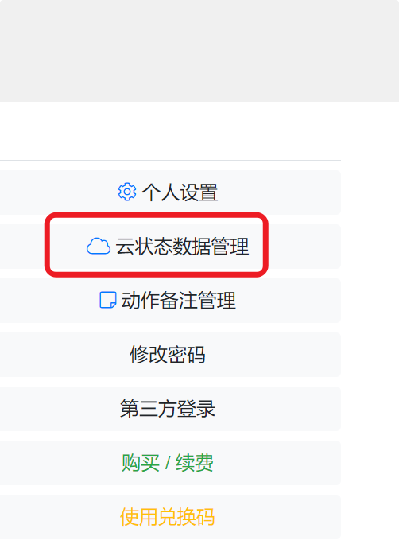
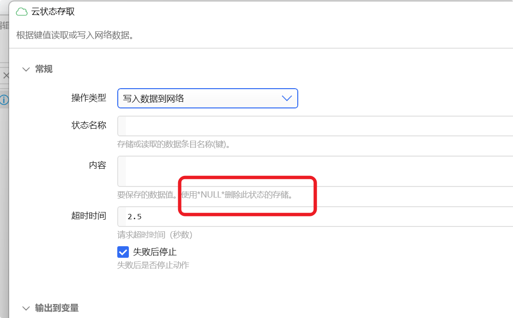
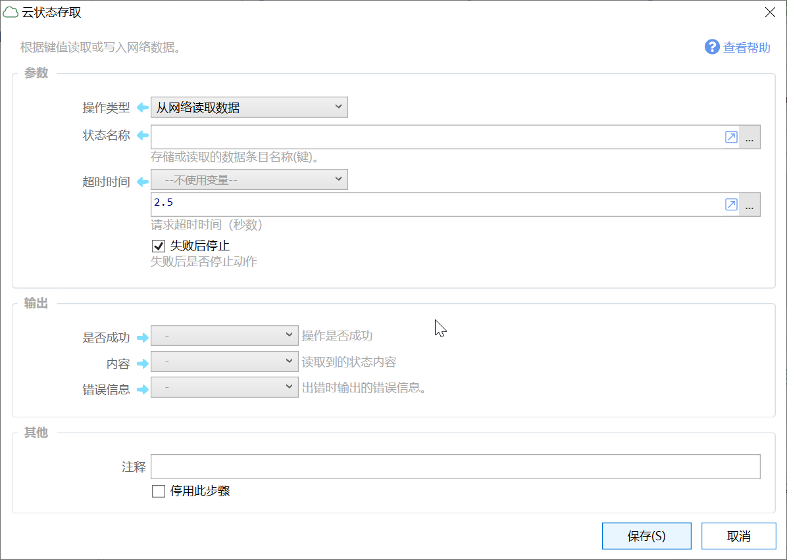

# 云状态存取

根据键值读取或写入网络数据。

## 当前模块定义

<XActionModuleMeta moduleKey="sys:clouddata" />

## 概述

用于将某些特定的内容保存在网络中，以方便在多个电脑上共享信息。

### 功能特点

-   每个用户拥有**独立**的存储空间，（不支持在多个用户之间共享数据）。
-   整个状态存储空间相当于一个网络文件夹。
-   每一个状态相当于文件夹中的一个文件。
-   状态的**名称**相当于文件名，状态的**值**相当于文件内容。
-   状态的名称是全局的。（和动作的本地状态不同，本地状态每个动作是独立的。云状态的名称是全局的，可以多个动作访问相同的云状态条目。）

### 限制

-   本功能因为需要额外的成本，免费版和专业版用户将分别有一定的限制。
-   相对于本地存储，网络存取需要一定的时间，可能造成动作运行有一定的延迟。
-   仅支持文本内容（除图片外，其他变量类型会自动转换为文本）。
-   单个条目最大存储免费版用户100KB，专业版用户1000KB。
-   最大存储空间：免费版用户：50MB、专业版用户1000MB。
-   每日最大存取次数：免费版用户500次，专业版用户5000次。千万不要在循环中使用网络状态存取，那样很容易耗尽资源！！。
-   内容的存储空间、存取操作次数、网络带宽，都会给Quicker运营带来一定的成本，请本着合理使用的原则在满足功能的情况下尽量节约使用。
-   本服务使用阿里云OSS存储，其稳定性依赖于阿里云服务的稳定性。

### 安全么？

应该是比较安全的。

-   每个用户使用不同的凭据存取数据，有严格的权限控制。
-   https传输。
-   数据在本地加密后传输，云服务保存加密后的内容。读取后在本地解密。每个用户密钥独立。

### 如何删除云状态数据

1）网页端删除

登录到会员中心以后，这里删除。

也可以写动作使用模块删除，具体参见下模块文档。

2）通过动作删除：设置指定状态名称对应的内容为`*NULL*`

## 参数

### 输入参数

【操作类型】写入数据到网络，或从网络读取数据。

【状态名称】要写入哪个状态中。网络状态对每个用户来说是全局对象，可以用在多个动作中使用相同的状态名读写同一份数据。如果不希望冲突的发生，请设置较为复杂的状态名以避免重复，如“作者\_Everything搜索动作\_路径”。

【内容】（写入数据时）要读取或写入的状态内容。

### 输出参数

【是否成功】操作是否成功。

【内容】（读取数据时）返回读取到的状态值。

【错误信息】出错时，返回错误提示信息。可以根据消息内容是否包含 "specified key does not exist" 判断出错原因是否为键值不存在。

## 更新历史

-   1.5.7 从仅专业版用户可用改为所有用户可用。更改额度限制。
-   增加删除状态数据的说明
