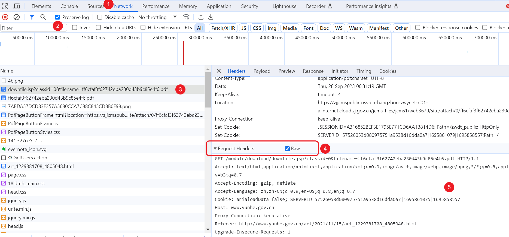

# 下载文件

从网络下载较小的、可公开访问的文件。不要用来下大文件。需要自定义方法、请求体或拿响应头时，用 [HTTP请求](/v2/xaction/modules/http)。

## 当前模块定义

<XActionModuleMeta moduleKey="sys:download" />

## 概述

<ModuleParamPreview moduleKey="sys:download" />

## 参数说明

**网址**：文件地址。

**保存文件夹**：保存位置。不填则用系统「下载」文件夹。

**保存文件名**：不填时按响应文件名或 URL 推断；再不行就用时间生成。已存在时可能覆盖或失败，除非打开自动重命名。

**UserAgent**：可选。

**请求头**：通常不用。每行 `Name:Value`。从浏览器复制后请删掉不必要的头。

```text
Accept: text/html,application/xhtml+xml,application/xml;q=0.9,*/*;q=0.8
Accept-Language: zh-CN,zh;q=0.9
Referer: https://example.com/
```

**Cookie**：通常不用。例如 `name=value; other=value`。

**超时秒数**：长时间收不到数据就中止。默认 `10`。

**忽略HTTPS证书验证**：是否忽略无效证书。默认关闭。

**显示进度条**：是否显示下载进度。默认关闭。

**如果文件已存在，自动重命名下载的文件**：在文件名后加 `_序号`。关掉则会覆盖。

**失败后停止**：失败是否中止动作。默认开启。

## 输出

- **是否成功**
- **文件路径**：完整保存路径。
- **内容MD5**：响应 `Content-MD5`。不是每个服务器都给（1.42.23+）。
- **ETag**：响应 `ETag`，会去掉前后双引号。通常与文件 MD5 一致，但不是每个服务器都给（1.42.23+）。
- **下载大小**：字节数。旧稿未写。

## 如何从浏览器获取请求头或 Cookie

**Cookie**

- 方法 1：用下面的动作复制当前网页 Cookie。
- 方法 2：按下面步骤从开发者工具里复制。

<StepProgramView example="bbf0a162-6f95-46fb-1e7a-08dbbf546dec" />

<ShareLinkCard
  code="bbf0a162-6f95-46fb-1e7a-08dbbf546dec"
  title="复制当前网页Cookie"
  description="用扩展取出当前页 Cookie，方便填进下载或 HTTP 请求"
  author="CL"
/>

**请求头**



1. F12 打开开发者工具，切到 Network（网络）。
2. 勾选 Preserve log（保留日志）。
3. F5 或再点一次链接。
4. 选状态码 200、类型为 document 的请求。
5. 右侧 Headers 里找到 Request Headers，切到 Raw。
6. 复制需要的行，删掉多余头，贴进本模块或 HTTP 请求。

## 限制与排障

只适合小文件。证书报错可临时打开 **忽略HTTPS证书验证**。需要登录态时补 **Cookie** / **请求头**。同名文件被覆盖时，打开自动重命名。

## 相关链接

<RelatedDocs
  items={[
    {
      href: '/v2/xaction/modules/http',
      label: 'HTTP请求',
      description: '要 POST、自定义请求体或拿完整响应时用这个。',
    },
  ]}
/>

## 更新历史

- 1.1.37 开始提供。
- 1.42.23 增加内容 MD5、ETag。
