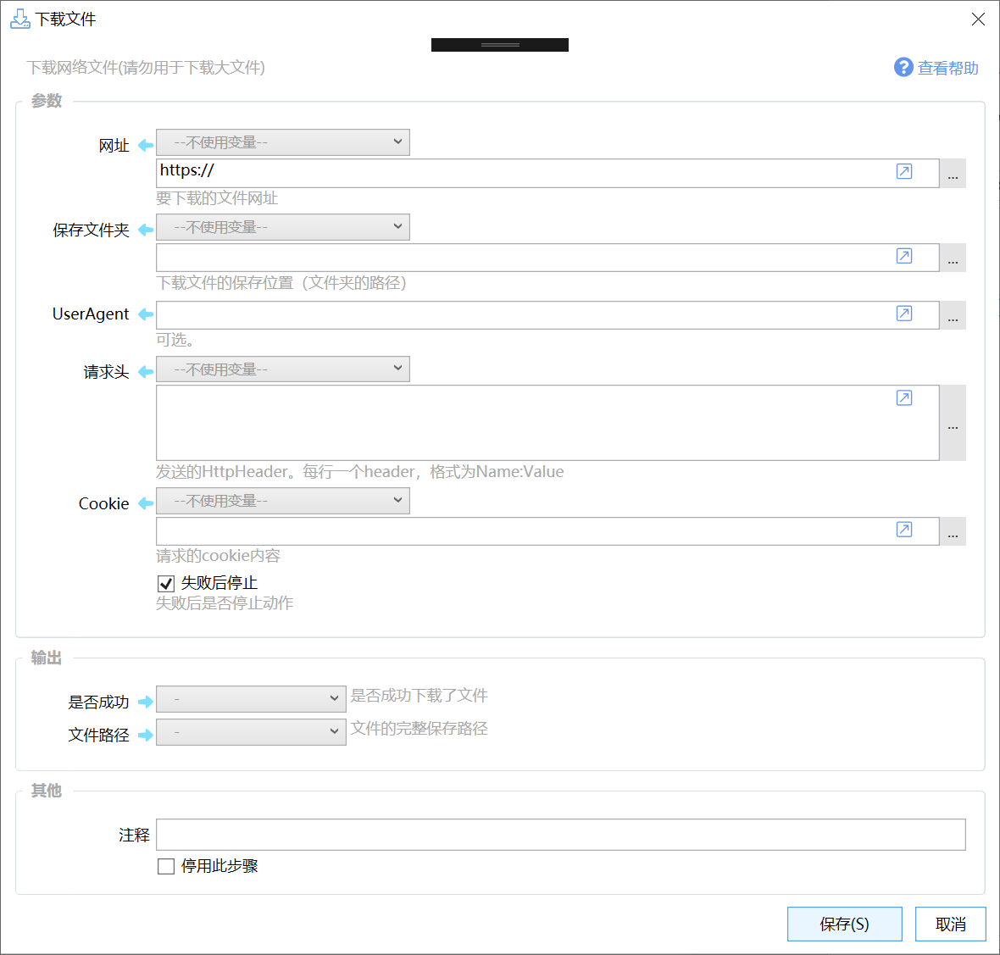

# 下载文件

下载网络文件(请勿用于下载大文件)

{/* xaction-metadata:start */}
## 当前模块定义

- 模块 Key：`sys:download`
- 分类：网络服务（`Network`）
- 类型：`Action`
- 风险操作：是
- 专业版：否

## 输入参数

| Key | 名称 | 类型 | 默认值 | 必填 | 变量模式 | 条件 | 说明 |
| --- | --- | --- | --- | --- | --- | --- | --- |
| `url` | 网址 | `Text` | https:// | 是 | `UseVarOrInput` |  | 要下载的文件网址 |
| `savePath` | 保存文件夹 | `Text` |  | 是 | `UseVarOrInput` |  | 下载文件的保存位置（文件夹的路径） |
| `saveName` | 保存文件名 | `Text` |  | 是 | `UseVarOrInput` |  | 可选。为空时自动判断文件名。 |
| `ua` | UserAgent | `Text` |  | 否 | `Input` |  | 可选。 |
| `header` | 请求头 | `Text` |  | 否 | `UseVarOrInput` |  | 发送的HttpHeader。每行一个header，格式为Name:Value |
| `cookie` | Cookie | `Text` |  | 否 | `UseVarOrInput` |  | 请求的cookie内容 |
| `expireSeconds` | 超时秒数 | `Number` | 10 | 否 | `Input` |  | 长时间未接收到数据时，中止下载。 |
| `showProgress` | 显示进度条 | `Boolean` | false | 否 | `Input` |  | 是否显示下载进度条 |
| `skipCertVerify` | 忽略HTTPS证书验证 | `Boolean` | false | 否 | `Input` |  |  |
| `autoRename` | 如果文件已存在，自动重命名下载的文件 | `Boolean` | false | 否 | `Input` |  | 在文件名后面增加"_序号"避免重复。否则将会覆盖已有文件。 |
| `stopIfFail` | 失败后停止 | `Boolean` | true | 否 | `Input` |  | 失败后是否停止动作 |

## 输出参数

| Key | 名称 | 类型 | 条件 | 说明 |
| --- | --- | --- | --- | --- |
| `isSuccess` | 是否成功 | `Boolean` |  | 是否成功下载了文件 |
| `savedPath` | 文件路径 | `Text` |  | 文件的完整保存路径 |
| `contentMd5` | 内容MD5 | `Text` |  | 内容MD5值，不是所有请求都会返回此内容。 |
| `downloadSize` | 下载大小 | `Text` |  | 下载文件的大小（字节数） |
| `eTag` | ETag | `Text` |  | 响应头Etag值，不是所有请求都会返回此内容。 |
{/* xaction-metadata:end */}

用于从网络下载较小的可公开下载的文件。





## 参数

【网址】要下载文件的地址。

【保存文件夹】下载文件的保存位置。可选，未指定时，自动保存到系统“下载”文件夹。

【保存文件名】指定要保存的文件名。如果不指定，文件名会自动根据返回的文件名或URL中的文件名确定。如果无法从这些信息中获取文件名，则会使用时间自动生成一个。 如果指定了，则会使用此文件名。如果文件已经存在，在可能会失败或覆盖已有文件。

【UserAgent】Http请求的UserAgent信息。可选。

【请求头】Http请求头信息，通常不需要提供。

格式示例：（实际需要去除不必要的请求头。）

```
Accept: text/html,application/xhtml+xml,application/xml;q=0.9,image/avif,image/webp,image/apng,*/*;q=0.8,application/signed-exchange;v=b3;q=0.7
Accept-Encoding: gzip, deflate
Accept-Language: zh,zh-CN;q=0.9,en-US;q=0.8,en;q=0.7
Cookie: arialoadData=false; SERVERID=57526053d080975751a9538d16dda0a7|1695861075|1695858557
Proxy-Connection: keep-alive
Referer: http://www.yunhe.gov.cn/art/2021/11/15/art_1229381708_4805048.html
Upgrade-Insecure-Requests: 1
User-Agent: Mozilla/5.0 (Windows NT 10.0; Win64; x64) AppleWebKit/537.36 (KHTML, like Gecko) Chrome/117.0.0.0 Safari/537.36
```


【Cookie】Http的Cookie信息，通常不需要提供。

格式示例：`arialoadData=false; SERVERID=57526053d080975751a9538d16dda0a7|1695861075|1695858557`

【超时秒数】长时间未收到数据时，中止下载。

【忽略https证书验证】是否忽略无效的服务器https证书。

【显示进度条】是否显示下载进度条。

【如果文件已存在，自动重命名下载的文件】是否自动重命名文件。

## 输出

【文件路径】下载文件的完整保存路径。

【内容MD5】从HTTP响应中获取的Content-MD5头的内容。此内容由服务端提供，个别服务端可能会不提供此信息。（v1.42.23+）

【ETag】从HTTP响应中获取的ETag头的内容，会自动去除前后的双引号。 不是所有服务端都提供此信息。通常此信息与文件md5一致。（v1.42.23+）

### 如何从浏览器获取请求头或Cookie

**获取Cookie**

-   方法1：使用动作 [https://getquicker.net/Sharedaction?code=bbf0a162-6f95-46fb-1e7a-08dbbf546dec](https://getquicker.net/Sharedaction?code=bbf0a162-6f95-46fb-1e7a-08dbbf546dec)
-   方法2：按下面的方式找到请求头中的Cookie内容并复制。

**获取Http请求头**


-   F12 打开浏览器控制台。
-   切换至 Network（网络）标签页。
-   选中 “Preserve log（保留历史）”选项。
-   按F5或点击链接，再次发起请求。
-   选中响应状态码Status为200，类型Type为document的请求。
-   在右侧，打开Headers选项卡。
-   找到Request Headers块，切换为Raw模式
-   选中并复制需要的内容。
-   清理掉不需要的请求头，放入下载或http请求模块中。

## 输出

【是否成功】是否成功下载了文件。

【文件路径】下载文件的完整保存路径。


## 历史

-   从1.1.37版本开始提供。
