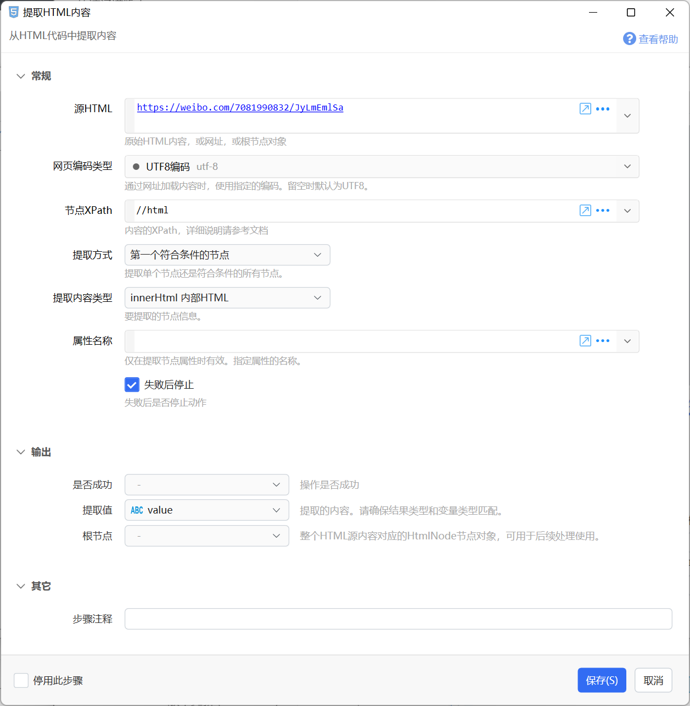

# 提取HTML内容

从HTML代码中提取内容

## 当前模块定义

<XActionModuleMeta moduleKey="sys:htmlExtract" />

概述

从HTML代码中提取内容，在一定程度上也可以支持XML文档内容的提取。

本模块在内部使用[HtmlAgilityPack](https://html-agility-pack.net/)组件，深入使用可以参考其[文档](https://html-agility-pack.net/documentation)。

## 注意

此模块对完全相同的链接在短时间内多次提取会使用缓存数据！因此对于更新频繁的html链接请使用“http请求+提取”两步骤实现！避免目标数据不能及时更新的bug。

## 参数

【源HTML】要从中提取内容的HTML代码或网址(http、https)。如果是网址，模块将自动下载HTML代码。

【网页编码类型】在指定网址获取HTML内容时，设定网页的编码类型，通常用于解决某些网页读取后汉字乱码的问题。默认（留空时）为UTF8编码。指定值为“auto”时，将会请求两次，先获取编码后再重新请求并根据编码解析内容。

【节点XPath】要提取内容的XPath。例如：

-   网页的标题：html/head/title

如果无法找到节点，可以尝试使用**小写字母**的节点名；

【提取方式】提取单个值还是多个值。

-   第一个符合条件的节点：只返回第一个符合xpath条件的节点的内容。
-   所有符合条件的节点：返回所有符合xpath条件的节点的内容。此时，提取的值类型将是一个列表类型。

【提取内容】提取的节点具体内容，根据提取方式的不同，返回的结果也不太一样。当提取方式为“第一个符合条件的节点”时，返回该节点的内容；当提取方式是“所有符合条件的节点”时，返回每个符合条件节点的指定内容的**列表**。

| **提取内容** | 说明 | 备注 |
| --- | --- | --- |
| InnerHtml | 此节点**内部**的HTML代码 |  |
| InnerText | 此节点**内部**的纯文本内容 |  |
| OuterHtml | 节点本身的HTML代码 |  |
| 节点对象 | 返回节点对应的HtmlNode对象 |  |
| 节点的某个属性 | 返回节点的某个属性的值。 |  |

【属性名称】当“提取内容”为“节点的某个属性”时，指定要返回节点的属性名。

【失败后停止动作】失败时是否停止动作。

## 输出

【值】返回提取的内容。

## 示例动作：

-   将浏览器当前网址生成MarkDown链接 [https://getquicker.net/sharedaction?code=bf4e796f-e1a5-41ba-1925-08d7b02d7fd4](https://getquicker.net/sharedaction?code=bf4e796f-e1a5-41ba-1925-08d7b02d7fd4)

## 历史

-   1.4.17 开始提供此模块。
-   20230704 增加支持XML，以及使用小写xpath的说明。

## 参考

-   XPath教程：

-   [https://www.w3school.com.cn/xpath/index.asp](https://www.w3school.com.cn/xpath/index.asp)
-   [https://zhuanlan.zhihu.com/p/29436838](https://zhuanlan.zhihu.com/p/29436838)

-   XPath测试工具

-   [http://xpather.com/](http://xpather.com/)
