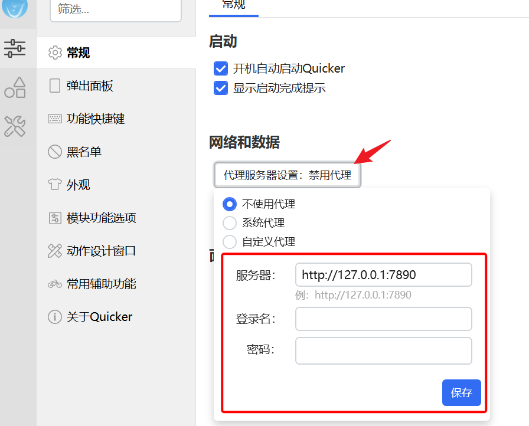

# HTTP请求

发送 HTTP 请求并拿到返回结果。调用网页接口、上传文件、接非 OpenAI 兼容的大模型，都可以用它。OpenAI 兼容接口优先用 [AI 调用](/v2/xaction/modules/ai)。

## 当前模块定义

<XActionModuleMeta moduleKey="sys:http" />

## 概述

使用本模块需要了解 HTTP 的基本概念（方法、请求头、状态码）。

<ModuleParamPreview moduleKey="sys:http" />

## 参数说明

**网址**：要调用的 URL。

**方法**：GET、POST、PUT、DELETE、PATCH、HEAD、OPTIONS。

**请求头**：每行 `Name:Value`。不要在这里写 `Content-Type`，放到 **内容类型**。

**Cookie**：请求附带的 Cookie。要把词典转成 Cookie 文本（1.9.5+）：

```csharp
$= String.Join(" ", {dict}.Select(x => x.Key + "=" + x.Value + ";"))
```

也可以用动作从当前网页复制：

<StepProgramView example="bbf0a162-6f95-46fb-1e7a-08dbbf546dec" />

<ShareLinkCard
  code="bbf0a162-6f95-46fb-1e7a-08dbbf546dec"
  title="复制当前网页Cookie"
  description="用扩展取出当前页 Cookie"
  author="CL"
/>

**请求体类型**：方法不是 GET / HEAD / OPTIONS 时出现。JSON、文本表单、MultiPart表单、单个文件或图片变量（二进制）、纯文本。

**请求体**：按类型填，见下文。

**内容类型**：对应 `Content-Type`。对 JSON、纯文本、单个文件或图片变量有效（1.38.14 之前仅二进制有效）。

**结果类型**：文本、图片、文件。要和接口实际返回的类型一致。

**UserAgent**：模拟浏览器。

**超时时间**：秒数，默认 `100`。

**禁止重定向**：禁止自动跟随 HTTP 跳转。默认关闭。

**显示进度条**：上传/下载进度。默认关闭。

**忽略HTTPS证书验证**：忽略证书异常。默认关闭。

**强制使用代理**：本步骤启用代理。优先用软件里配置的代理；没配则用系统代理。下面是软件设置里的相关项：



**启用SSE流式响应**：用子程序处理流式响应。打开后应指定处理子程序。

**SSE流式响应处理子程序**：每次收到一行就调用一次。子程序需要有名为 `data` 的输入变量。

**失败后停止**：失败是否中止动作。默认开启。

## 输出

- **是否成功**
- **状态码**：HTTP 状态码。
- **响应头**：词典。
- **响应Cookies**：词典。
- **文本结果**：结果类型为文本时是响应正文；为文件时是临时文件路径（1.31.1+）。
- **图片结果**：结果类型为图片时。

## 请求体格式

### JSON

`Content-Type` 为 `application/json`。请求体应是合法 JSON：

```json
{"title":"test","sub":[1,2,3]}
```

用表达式生成：

```csharp
$= JsonConvert.SerializeObject(
  new {
    字段1 = {变量1},
    字段2 = {变量2}
  }
)
```

1.29.0+ 也可以直接把词典或匿名对象交给请求体，Quicker 会转成 JSON：`$= {词典变量}`、`$= new { name = "张三", age = 20 }`。更多写法见 [词典类型](/v2/xaction/concepts/var-dict)、[表达式](/v2/xaction/concepts/expression)。

### 文本表单

`Content-Type` 为 `application/x-www-form-urlencoded`，类似网页 `<form>`：

```text
id=3&name=Hello&param1=value1
```

### MultiPart表单

`Content-Type` 为 `multipart/form-data`。每行一个参数：`参数名=值`，或 `参数名=FILE:文件路径` / `参数名=IMG:图片变量名`：

```text
param1=value1
param2=value2
FileParam=FILE:文件完整路径
ImgFileParam=IMG:图片变量名
```

### 单个文件或图片变量（二进制）

上传文件：`FILE:完整文件路径`（冒号小写）。上传图片变量：`IMG:变量名`。

```text
FILE:C:\Users\Leal\Pictures\jiupian.PNG
```

```text
IMG:img
```

## SSE 流式输出

不少大模型用 SSE 推结果。OpenAI 兼容接口用 [AI 调用](/v2/xaction/modules/ai)；其它厂商可以用本模块自己处理。

先做处理子程序，定义一个 **data** 输入，用来接收每一行。通常只处理以 `data:` 开头的行，后面多半是 JSON。

<VariableDefPreview
  name="data"
  typeLabel="文本"
  remark="SSE 每次收到的文本行"
/>

`data:` 后面按接口解析出正文，再写到文本窗口或发送到前台。有的接口每次只给新增字，有的给到目前为止的全文（通义千问属于后者），输出时要自己去重。

然后打开 **启用SSE流式响应**，填子程序名。接口若要求在头或请求体里声明流式，也一并加上。

<ModuleParamPreview
  moduleKey="sys:http"
  focusKeys={['url', 'method', 'header', 'useSSE', 'sseSpName']}
  values={{
    method: 'POST',
    url: 'https://dashscope.aliyuncs.com/api/v1/services/aigc/text-generation/generation',
    header: '$$Authorization:Bearer {apiKey}',
    useSSE: 'true',
    sseSpName: 'sse',
  }}
/>

<StepProgramView example="0c8ab8ca-b721-407a-11da-08dc5ee89ca7" />

<ShareLinkCard
  code="0c8ab8ca-b721-407a-11da-08dc5ee89ca7"
  title="通义千问测试"
  description="用 HTTP 请求处理大模型 SSE 流式响应"
  author="CL"
/>

## 乱码问题

抓某些网页出现乱码时，可试这个子程序：

<ShareLinkCard
  href="https://getquicker.net/subprogram?id=c1cbb130-e2b3-4260-f84a-08d8e37a0602"
  title="网页解码子程序"
  description="处理 HTTP 请求结果乱码"
/>

## 限制与排障

- 证书报错可临时打开 **忽略HTTPS证书验证**。
- 需要登录态时补 Cookie / 请求头；不要把 `Content-Type` 写进请求头。
- SSE 子程序必须有 `data` 输入；没指定子程序时流式选项无效。
- 结果类型和真实响应不一致时，**文本结果** / **图片结果** 会空。

## 示例动作

<ShareLinkCard
  code="18fdf83e-048e-46c7-185a-08d69d1d124b"
  title="SM.MS图床"
  description="上传图片文件、剪贴板或截图到图床"
  author="CL"
/>

## 相关链接

<RelatedDocs
  items={[
    {
      href: '/v2/xaction/modules/ai',
      label: 'AI 调用',
      description: 'OpenAI 兼容接口不必自己拼 SSE。',
    },
    {
      href: '/v2/xaction/modules/download',
      label: '下载文件',
      description: '只是把文件存到磁盘时更简单。',
    },
    {
      href: '/v2/xaction/modules/htmlextract',
      label: '提取HTML内容',
      description: '拿到 HTML 后再按 XPath 取字段。',
    },
  ]}
/>

## 更新历史

- 20230312 增加强制使用代理。
- 20230602 1.38.14：文本、JSON 请求体可通过 **内容类型** 设定 `Content-Type`。
- 20240418 1.42.32 增加流式输出。
