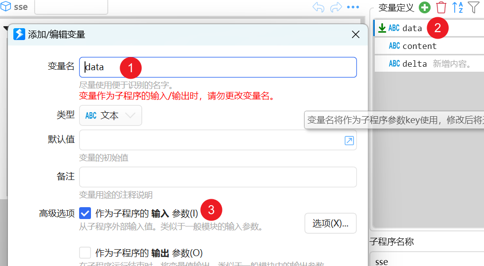
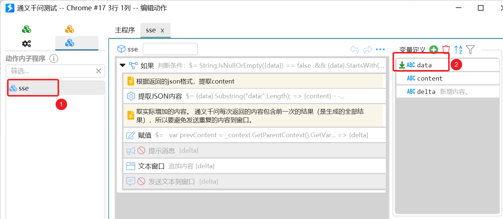
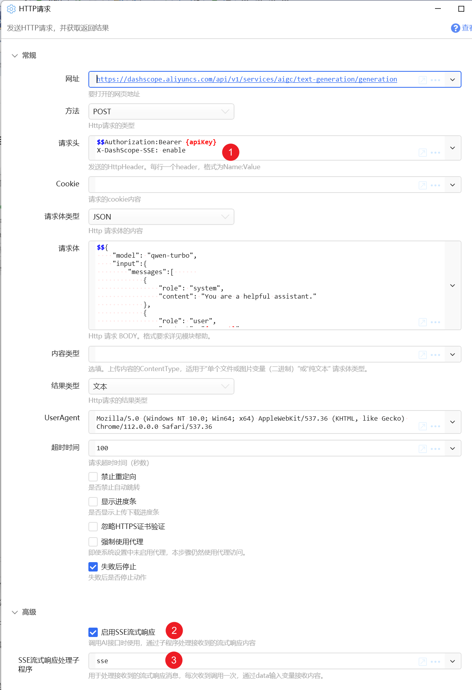

# HTTP请求

发送HTTP请求，并获取返回结果

## 当前模块定义

<XActionModuleMeta moduleKey="sys:http" />

## 概述

发送Http请求，调用网络服务。

使用此模块需要您了解http协议的有关内容。

<ModuleParamPreview moduleKey="sys:http" />

##  参数

【网址】要调用的URL。

【方法】HTTP Method。支持：GET、POST等。

【请求头】Http Header。格式为多行文本，每行内容格式为 Name:Value。

请勿在请求头中增加`Content-Type`，而是将其放入【内容类型】参数中。

【Cookie】请求的Cookie内容。

注：如果希望将词典转换成cookie内容，可以在1.9.5+以上版本上使用表达式转换：$\= String.Join(" ", &#123;dict&#125;.Select(x \=&gt; x.Key+ "=" + x.Value +";"))

也可以使用动作复制网页cookie：[复制当前网页Cookie - by CL - 动作信息 - Quicker](https://getquicker.net/Sharedaction?code=bbf0a162-6f95-46fb-1e7a-08dbbf546dec)

【请求体类型】Http方法为“Post”时，指示请求体内容类型。可选为：

-   JSON：请求体的内容为JSON数据。
-   表单：发送表单数据。
-   Multipart表单：发送带文件的表单，类似于网页中的上传文件表单。
-   单个文件或图片变量（二进制）：发送文件或图片变量中的内容。
-   纯文本：纯文本内容。

【请求体】实际要发送的内容。 根据请求体类型不同传入不同格式的内容，详见本文后续章节。

【内容类型】请求体的内容类型，对应于http请求的`Content-Type`请求头。本参数仅在请求体类型为`JSON``单个文件或图片变量``纯文本`时有效。（1.38.14之前版本仅对`单个文件或图片变量`类型有效。）

【结果类型】返回值的类型，可选“文本”“图片”“文件”。要和实际调用返回的类型匹配。

【UserAgent】模拟浏览器的UserAgent参数。

【超时时间】请求超时秒数。

【禁止重定向】是否禁止自动进行http redirect。

【显示进度条】是否显示上传下载进度条。

【忽略HTTPS证书验证】是否忽略证书异常情况。

【强制使用代理】忽略软件设置中的代理服务设置，而在本步骤中启用代理。将会优先使用软件中设置的代理服务器，如果未设置，则会使用系统默认代理设置。


【使用SSE流式输出响应】开启自定义处理流式响应。 此时应该指定【SSE流式响应处理子程序】。

【SSE流式响应处理子程序】指定处理流式响应消息的子程序。 该子程序需要有一个data输入变量用于接收每次收到的文本行。



在子程序内部，通常只需要处理`data:`开始的消息内容。 `data:`后面通常为json格式的文本。

可以根据需要显示在文本窗口，或发送文本到前台窗口。

请参考本文后面的流式输出说明及示例。

## 输出

【是否成功】请求是否成功。

【状态码】http响应状态码。

【响应头】响应消息的Http Header。

【响应Cookie】响应内容的cookie信息。返回的是词典类型。

【文本结果】

-   结果类型为“文本”时，响应内容结果。
-   结果类型为“文件”时，输出生成的临时文件路径。(1.31.1+)

【图片结果】结果类型为“图片”时，将图片转换为变量。

## Post数据格式说明

### JSON

ContentType设置为application/json。此时请求体内容应该为一个合法的json数据文本。如：

```json
{"title":"test","sub":[1,2,3]}
```

#### 使用表达式得到json格式的请求体内容

```csharp
$= JsonConvert.SerializeObject(
new
  {
    字段1={变量1},
        字段2={变量2}
  }
)
```

这段代码创建了一个临时c#对象，并使用 `JsonConvert.SerializeObject` 将临时对象序列化为json内容。

自1.29.0+ 版本以后，也可以直接将词典变量或匿名对象传递给请求体参数。Quicker会自动转换为json。

`$= {词典变量}` `$=new {name="张三", age=20}`

更多获取合法json的方式请参考[此文档](https://getquicker.net/KC/Kb/Article/909)。

### 文本表单

ContentType设置为x-www-form-urlencoded。类似于浏览器中的&lt;form&gt;表单。请求体数据格式类似于：

```text
id=3&name=Hello&param1=value1
```

### Multipart表单

ContentType设置为multipart/form-data。数据格式为：

-   每行一个参数：参数名=参数值 或 参数名=FILE:文件路径的形式

类似于：

```text
param1=value1
param2=value2
FileParam=FILE:文件完整路径
ImgFileParam=IMG:图片变量名
```

### 单个文件或图片变量（二进制）

如果需要上传文件，格式为：“FILE:完整文件路径”。注意冒号要小写。

```text
FILE:C:\Users\Leal\Pictures\jiupian.PNG
```

如需上传图片变量，格式为：“IMG:变量名”，冒号要小写。

```text
IMG:img
```

## SSE 流式输出

很多大语言模型通过SSE流式输出方式返回响应结果，如：[阿里云通义千问](https://help.aliyun.com/zh/dashscope/developer-reference/api-details?spm=a2c4g.11186623.0.0.2426140b44HlLH#90ebe270f8rte)等。对于OpenAI兼容接口，Quicker封装了[AI调用模块](/v2/xaction/modules/ai)，对于其它厂商接口，可以通过HTTP请求模块以自定义方式处理响应结果。

参考动作：[通义千问测试](https://getquicker.net/Sharedaction?code=0c8ab8ca-b721-407a-11da-08dc5ee89ca7)

在动作中，首先创建处理流式响应消息的子程序。该子程序应该定义一个data输入参数，用于接收服务端传回的文本，每行内容会调用一次子程序。 通常只需要处理以 “data:” 开始的内容。



从文本内容中解析出主要消息内容，然后显示在文本窗口或发送到前台窗口即可。

根据接口不同，服务端每次返回的内容可能是新生成的文本，也可能是当前已经生成的所有文本（通义千问就是这种情况）。在输出文本结果时，需要做相应的处理（如只输出新生成的文本）。

然后在http请求中开启SSE流式响应选项，并且指定处理流式响应的子程序名称。根据接口的规定，可能需要在http头或请求体中增加标记告知服务器端开启SSE方式输出。



## 乱码问题

如果通过本模块获取某些网页后有乱码，可以尝试使用这个子程序：

[https://getquicker.net/subprogram?id=c1cbb130-e2b3-4260-f84a-08d8e37a0602](https://getquicker.net/subprogram?id=c1cbb130-e2b3-4260-f84a-08d8e37a0602)

## 示例

-   [上传SMMS图床](https://getquicker.net/sharedaction?code=18fdf83e-048e-46c7-185a-08d69d1d124b) 

## 更新说明

-   20230312 增加强制使用代理参数；
-   20230602 1.38.14 对文本、JSON 请求体类型，支持通过【内容类型】参数设定`Content-Type`请求头的值。
-   20240418 1.42.32 增加流式输出。
