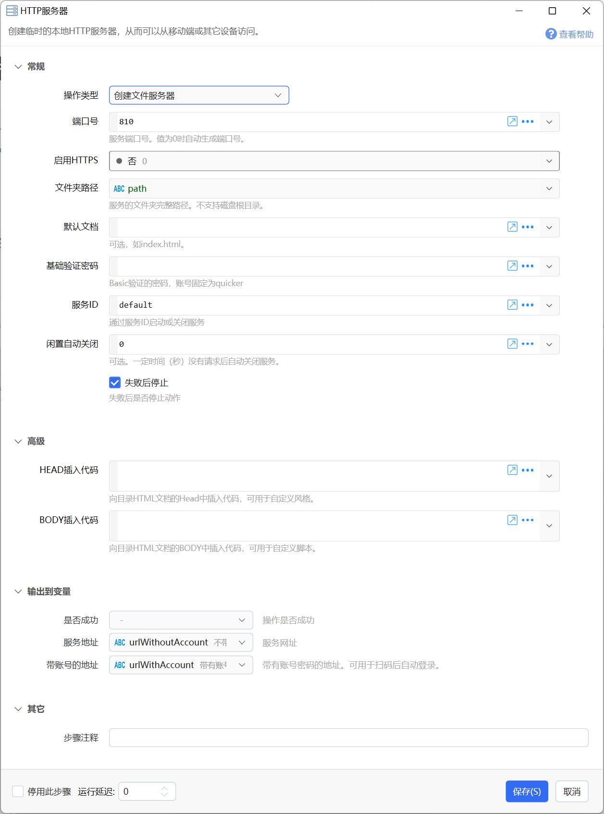
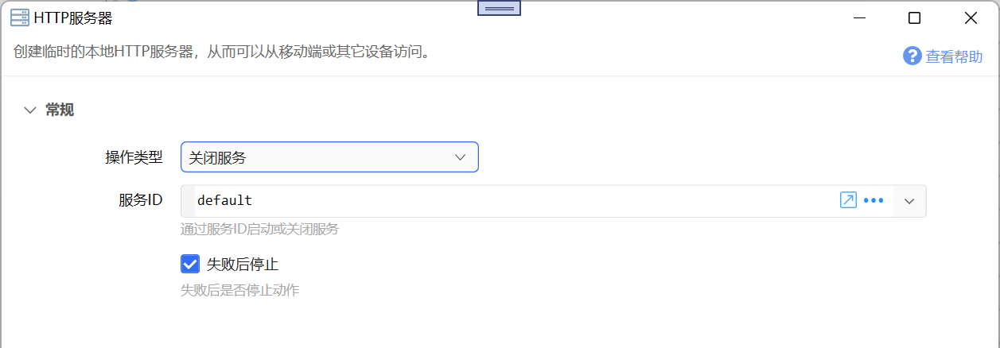
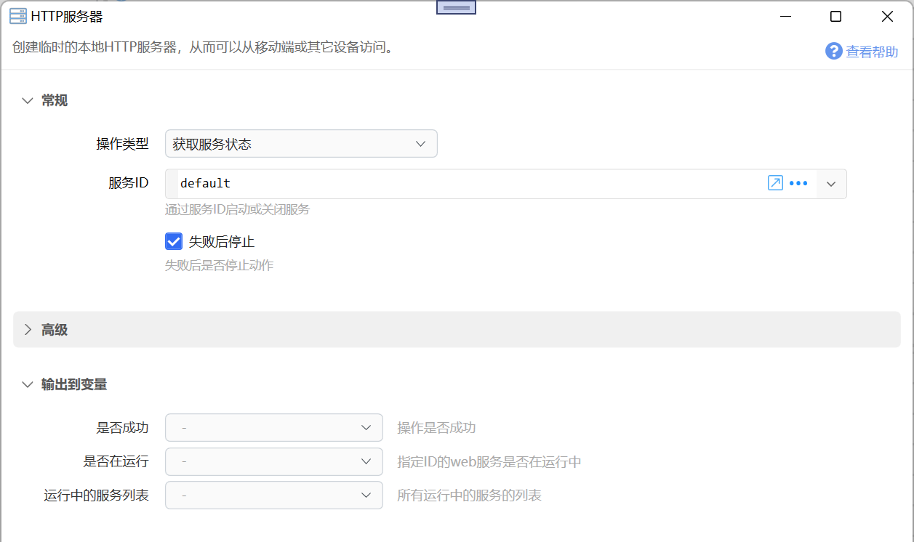
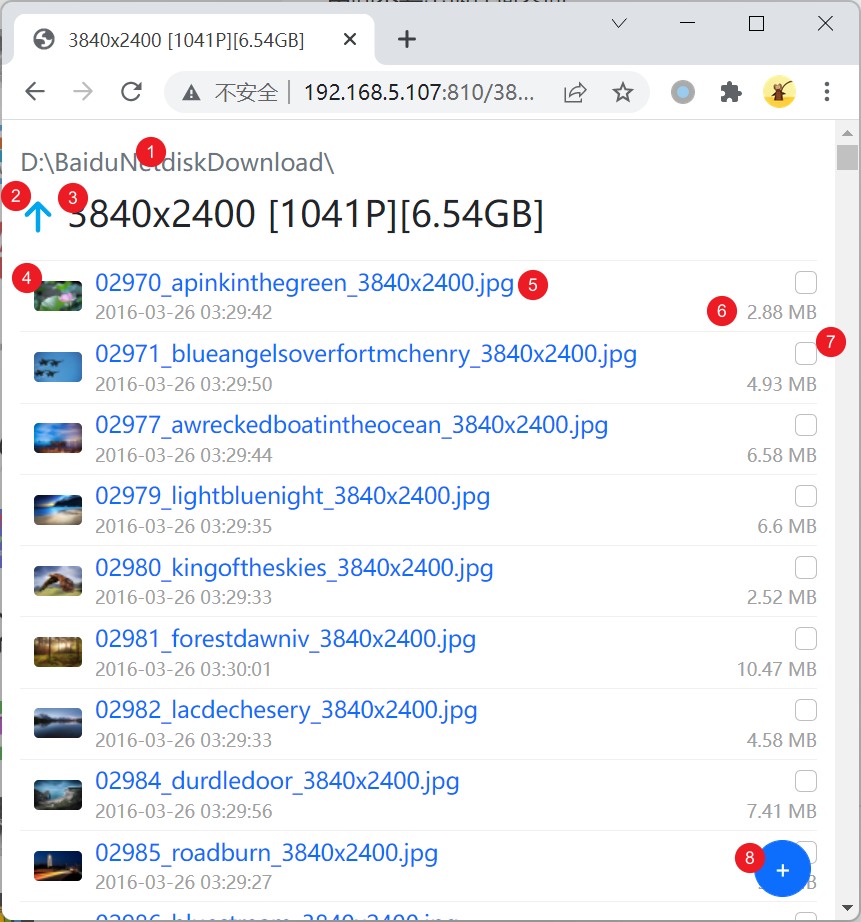
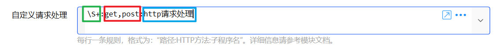
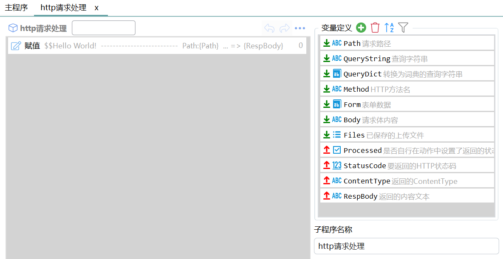

# HTTP服务器

创建临时的本地HTTP服务器，从而可以从移动端或其它设备访问。

{/* xaction-metadata:start */}
## 当前模块定义

- 模块 Key：`sys:httpserver`
- 分类：网络服务（`Network`）
- 类型：`Action`
- 风险操作：否
- 专业版：否

## 输入参数

| Key | 名称 | 类型 | 默认值 | 必填 | 变量模式 | 条件 | 说明 |
| --- | --- | --- | --- | --- | --- | --- | --- |
| `operation` | 操作类型 | `Enum` | CreateFileServer | 是 | `Input` |  |  |
| `port` | 端口号 | `Integer` | 8080 | 否 | `UseVarOrInput` | 仅：CreateFileServer | 服务端口号。值为0时自动生成端口号。 |
| `enableHttps` | 启用HTTPS | `Boolean` | true | 否 | `UseVarOrInput` | 仅：CreateFileServer |  |
| `docPath` | 文件夹路径 | `Text` |  | 否 | `UseVarOrInput` | 仅：CreateFileServer | 服务的文件夹完整路径。不支持磁盘根目录。 |
| `defaultDoc` | 默认文档 | `Text` |  | 否 | `UseVarOrInput` | 仅：CreateFileServer | 可选，如index.html。 |
| `password` | 基础验证密码 | `Text` |  | 否 | `UseVarOrInput` | 仅：CreateFileServer | Basic验证的密码，账号固定为quicker |
| `serviceId` | 服务ID | `Text` | default | 否 | `UseVarOrInput` |  | 通过服务ID启动或关闭服务。同一服务ID再次创建时会先关闭旧服务。 |
| `customRequest` | 自定义请求处理 | `Text` |  | 否 | `UseVarOrInput` | 仅：CreateFileServer | 每行一条规则，格式为："路径:HTTP方法:子程序名"。详细信息请参考模块文档。 |
| `headCode` | HEAD插入代码 | `Text` |  | 否 | `UseVarOrInput` | 仅：CreateFileServer | 向目录HTML文档的Head中插入代码，可用于自定义风格。 |
| `bodyCode` | BODY插入代码 | `Text` |  | 否 | `UseVarOrInput` | 仅：CreateFileServer | 向目录HTML文档的BODY中插入代码，可用于自定义脚本。 |
| `autoShutdownSeconds` | 闲置自动关闭 | `Number` | 0 | 否 | `UseVarOrInput` | 仅：CreateFileServer | 可选。一定时间（秒）没有请求后自动关闭服务。 |
| `showNotifyWhenAutoClose` | 自动关闭时显示通知 | `Boolean` | false | 否 | `UseVarOrInput` | 仅：CreateFileServer | 闲置超时关闭时，是否显示通知。 |
| `stopIfFail` | 失败后停止 | `Boolean` | true | 否 | `Input` |  | 失败后是否停止动作 |

## 输出参数

| Key | 名称 | 类型 | 条件 | 说明 |
| --- | --- | --- | --- | --- |
| `isSuccess` | 是否成功 | `Boolean` |  | 操作是否成功 |
| `serverUrl` | 服务地址 | `Text` | 仅：CreateFileServer | 服务网址 |
| `serverUrlWithAccount` | 带账号的地址 | `Text` | 仅：CreateFileServer | 带有账号密码的地址。可用于扫码后自动登录。 |
| `isRunning` | 是否在运行 | `Boolean` | 仅：GetServerState | 指定ID的web服务是否在运行中 |
| `serverList` | 运行中的服务列表 | `List` | 仅：GetServerState | 所有运行中的服务的列表 |

## 选项值

### `operation` 操作类型

| Value | 名称 | 说明 |
| --- | --- | --- |
| `CreateFileServer` | 创建文件服务器 |  |
| `CloseServer` | 关闭服务 |  |
| `GetServerState` | 获取服务状态 |  |
{/* xaction-metadata:end */}

对指定的文件夹创建临时http服务器（Web服务器），供文件浏览和传输。

参考动作：[https://getquicker.net/Sharedaction?code=7a49ca6b-d243-4478-1e87-08d9f1ba2358](https://getquicker.net/Sharedaction?code=7a49ca6b-d243-4478-1e87-08d9f1ba2358)

使用场景：

-   临时的文件传输；
-   用手机观看视频；
-   自动化：启动服务后在手机端使用自动化工具传输文件；

注：如果遇到https证书过期的情况，请更新Quicker版本解决。

## 操作类型

### 创建文件服务器

对指定的目录开启一个网页服务器，可用于浏览或下载目录中的内容或向目录中上传文件。

【端口号】网页服务的端口号。

-   端口的可用范围为1-65535。
-   不能使用被占用的端口。
-   设置为0时，Quicker会自动找到一个可用端口。
-   Windows防火墙需要将quicker假如白名单或开放此端口的入连接。

【启用HTTPS】是否开启https访问。

-   开启时，将使用`https://转换后的本机局域网ip地址.lan.quicker.cc:端口号`格式的域名访问。其中“转换后的ip地址”为本机局域网IP地址将点`.`替换为`-`得到的值。如本机ip为192.168.1.56，端口为8080，那么开启https时，访问地址为：`https://192-168-1-56.lan.quicker.cc:8080`。注意此域名仅仅是ip地址的别名，就像不同的局域网会有相同的192.168.\*.\*的内网地址，您并不能通过这个域名访问到别人局域网里的ip，别人也不能通过这个域名访问到您的电脑。
-   关闭时，可以使用`http://本机局域网IP地址:端口`的网址访问。如`http://192.168.1.56:8080`

【文件夹路径】web服务的根目录。打开网址时，自动列出此目录中的文件夹和文件。

此目录留空时（在Http服务用于纯的自定义请求处理时使用），自动在Windows临时目录中创建一个空目录。

【默认文档】用作网页浏览功能时，可设置默认文档，通常为“index.html”。当浏览某个目录时，如果目录下有此名称的文档，将自动加载此文档而不是列出目录中的内容。

【基础验证密码】对http服务开启Basic Authentication时，所对应的密码（账号固定为quicker）。如果您和其他人共享网络，建议开启密码以避免意外的访问。 如果在家里等安全网络，也可以不开启密码验证。

【服务id】为服务设定一个标识。可在后续步骤中更新服务、关闭服务时使用。如果在创建服务时已经有相同id的服务，则会自动关闭前面的服务。

【闲置自动关闭】如果一段时间（秒数）后没有新的请求，自动关闭此服务。0为不自动关闭。

【自定义请求处理】通过子程序自助处理请求。定义方式请参考下面章节。

【HEAD 插入代码】生成浏览目录网页时，自动在`<head>`末尾插入代码（替换默认代码中的`<!--HEAD-CODE-->`）。可用于加载自定义的css库引用等。

【BODY 插入代码】在生成浏览目录网页时，自动在`<body>`末尾插入代码（替换默认代码中的`<!--BODY-CODE-->`）。可用于加载自定义的js脚本。

**输出变量**

【服务地址】根据ip、端口号以及是否启用https生成的用于访问此Web服务的网址。

【带账号的地址】当启用访问密码时，将账号和密码放入网址。格式为：`https://quicker:密码@网址:端口` （账号统一为quicker）。可以将此网址生成二维码，在手机端扫码直接访问。

-   注：有一些浏览器不支持此网址格式。如iOS上的Safari浏览器（但是微信和Chrome支持）。有一些PC端浏览器也不支持，如360浏览器。

### 关闭服务

关闭指定id的服务。

参考使用方式：

-   开启服务后，显示等待窗口，待关闭等待窗口后关闭服务。
-   添加右键菜单用于关闭服务。

### 获取服务状态

用于获取某个http服务是否在运行中，或得到所有当前运行中的web服务。

【服务ID】要获取状态的http服务的标识（在创建服务时指定）。

## 文件服务网页使用

1）当前路径上级路径

2）返回上级目录

3）当前文件夹名称

4）缩略图。对图片、视频等，可点击缩略图进入浏览模式。

5）文件名。点击可使用浏览器默认形式打开或下载。

6）文件大小。点击可作为附件下载。

7）选择文件或文件夹，以打包下载。选中某项后，会显示“全选”“下载”按钮。

8）上传文件到当前文件夹。

9）全选当前文件夹内的所有子文件夹和文件。

10）打包下载所选择的子文件夹和文件。 这里只是简单打包成一个zip文件，不会压缩。

## 自定义请求处理

在必要时，可以通过子程序自定义实现HTTP请求的处理。

实现步骤：

1）定义路由规则：哪些请求 使用 哪个子程序 处理。

2）按规定的输入输出参数模板定义子程序。

参考动作：[自定义HTTP](https://getquicker.net/Sharedaction?code=b89f2926-96a1-4c81-fad4-08d9f7308243)

### 路由规则定义

在【自定义请求处理】参数中设置路由规则：

-   每行一条路由规则。所有规则将按照从上到下的顺序匹配执行，有一项匹配到以后，后面的规则就会被忽略。
-   每条路由规则格式为：`路径:HTTP方法列表:处理请求的子程序名称`
-   路径：URI的[AbsolutePath](https://docs.microsoft.com/en-us/dotnet/api/system.uri.absolutepath?view=net-6.0)值的匹配字符串。可以完整匹配或使用正则。 例如：`/api`可用于匹配`http://192.168.1.20:8080/api`、`\S+`则可以匹配所有请求。
-   HTTP方法列表：哪些HTTP Method使用此规则处理。支持的方法有 GET, POST, PUT, DELETE, HEAD。可使用`*`表示匹配所有Http Method。示例：`GET`、`GET,POST`、`*`
-   处理需求的子程序名称：指定使用哪个子程序处理此需求。子程序需按规定的方式定义输入和输出参数，可参考此[模板子程序](https://getquicker.net/subprogram?id=c6f51262-75ca-4a39-fab7-08d9f7308243)及本文的后面章节。

下图所示的规则：将任何路径的 GET 和 POST 请求都使用动作内名称为“http请求处理”的子程序处理。

### 实现需求处理子程序

要点：

-   子程序需要按规定定义输入和输出参数。可以导入此[模板子程序](https://getquicker.net/subprogram?id=c6f51262-75ca-4a39-fab7-08d9f7308243)后修改使用。
-   子程序会被直接执行。动作内主程序的步骤不会被执行，子程序也不需要添加到动作步骤列表中。
-   子程序内部应当只处理数据并快速返回结果，不应该有任何界面交互的步骤。

#### 子程序的输入

在遇到符合条件的HTTP请求时，Quicker会解析请求内容，并将数据传入子程序变量中。

【Path】请求网址的[路径](https://docs.microsoft.com/en-us/dotnet/api/system.uri.absolutepath)部分。例如对于网址`http://192.168.5.114:810/2022年文件/系统设计?action=copy`，其路径为`/2022年文件/系统设计`

【QueryString】查询字符串（网址中问号开始的内容，不一定有）。网址`http://192.168.5.114:810/2022年文件/系统设计?action=copy`的查询字符串为`?action=copy`

【QueryDict】转换为词典的查询字符串。

【Method】请求的HTTP Method。可能为GET、POST、PUT、DELETE、HEAD。不支持其他HTTP方法。

【FORM】表单数据词典。当POST请求内容类型为 x-www-form-urlencoded 或 multipart/form-data 时，解析出的表单数据。

【BODY】请求内容类型为 application/json 或 x-www-form-urlencoded 时，返回完整的请求体内容文本。其他内容类型时为空。

【Files】通过 multipart/form-data 表单数据传输文件时，Quicker会自动将文件保存在服务目录中，并返回这些文件的完整路径。可以在后续步骤中根据这些步骤自行处理文件。

同时，也可以在表达式中通过 `_context.ExtraData.HttpRequestEventArgs` 访问到[请求上下文对象](https://github.com/sta/websocket-sharp/blob/master/websocket-sharp/Server/HttpRequestEventArgs.cs)。可以使用此对象访问到请求信息并直接返回响应。

#### 子程序的输出

子程序结束时，Quicker将根据子程序的输出变量返回结果到HTTP请求。

【Processed】请求是否已经在子程序内部通过使用 `_context.ExtraData.HttpRequestEventArgs`响应过了。 如果已经响应过了，将此变量赋值为true，Quicker就不会再进行输出处理。

【StatusCode】需要返回的Http请求状态码。

【ContentType】返回的内容类型（MIME Type）。

【RespBody】返回的内容文本。

## 更新说明

-   20240701 增加https证书过期的说明。
