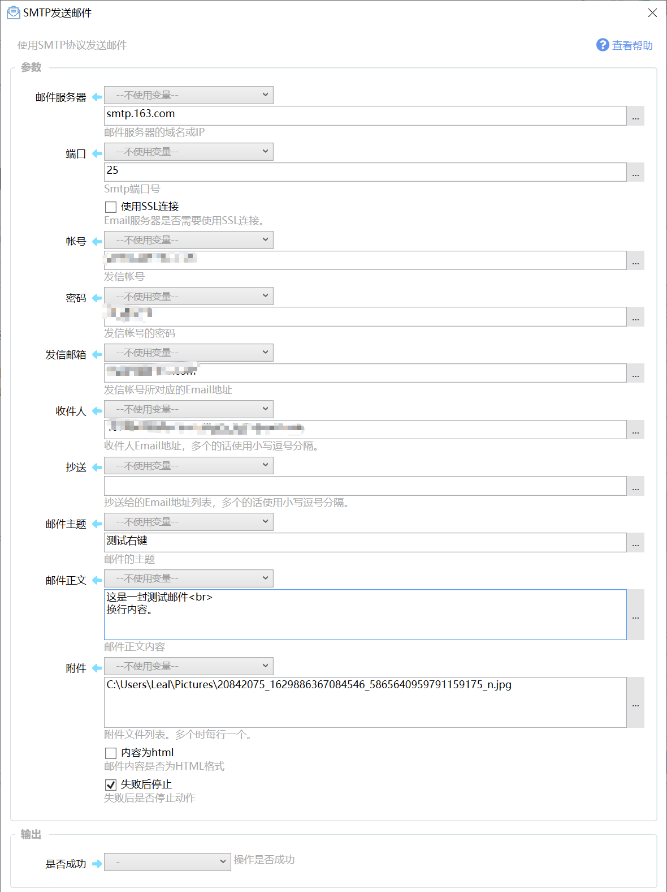

# SMTP发送邮件

使用SMTP协议发送邮件

{/* xaction-metadata:start */}
## 当前模块定义

- 模块 Key：`sys:smtp`
- 分类：网络服务（`Network`）
- 类型：`Action`
- 风险操作：否
- 专业版：否

## 输入参数

| Key | 名称 | 类型 | 默认值 | 必填 | 变量模式 | 条件 | 说明 |
| --- | --- | --- | --- | --- | --- | --- | --- |
| `server` | 邮件服务器 | `Text` |  | 是 | `UseVarOrInput` |  | 邮件服务器的域名或IP |
| `port` | 端口 | `Integer` | 25 | 是 | `UseVarOrInput` |  | Smtp端口号 |
| `useSsl` | 使用加密连接 | `Boolean` | false | 否 | `UseVarOrInput` |  | 是否使用TLS连接（通常为587端口）。 |
| `account` | 帐号 | `Text` |  | 是 | `UseVarOrInput` |  | 发信帐号 |
| `password` | 密码 | `Text` |  | 是 | `UseVarOrInput` |  | 发信帐号的密码 |
| `sender` | 发信邮箱 | `Text` |  | 是 | `UseVarOrInput` |  | 发信帐号所对应的Email地址 |
| `senderName` | 发件人名称 | `Text` |  | 是 | `UseVarOrInput` |  | 发件人的显示名称（可选） |
| `to` | 收件人 | `Text` |  | 是 | `UseVarOrInput` |  | 收件人Email地址，多个的话使用小写逗号分隔。 |
| `cc` | 抄送 | `Text` |  | 是 | `UseVarOrInput` |  | 抄送给的Email地址列表，多个的话使用小写逗号分隔。 |
| `bcc` | 密送 | `Text` |  | 是 | `UseVarOrInput` |  | 密送给的Email地址列表，多个的话使用小写逗号分隔。 |
| `subject` | 邮件主题 | `Text` |  | 是 | `UseVarOrInput` |  | 邮件的主题 |
| `content` | 邮件正文 | `Text` |  | 否 | `UseVarOrInput` |  | 邮件正文内容 |
| `attachList` | 附件 | `Text` |  | 否 | `UseVarOrInput` |  | 附件文件列表。多个时每行一个。 |
| `isHtml` | 内容为html | `Boolean` | false | 否 | `UseVarOrInput` |  | 邮件内容是否为HTML格式 |
| `stopIfFail` | 失败后停止 | `Boolean` | true | 否 | `Input` |  | 失败后是否停止动作 |

## 输出参数

| Key | 名称 | 类型 | 条件 | 说明 |
| --- | --- | --- | --- | --- |
| `isSuccess` | 是否成功 | `Boolean` |  | 操作是否成功 |
{/* xaction-metadata:end */}

使用SMTP协议发送邮件。

此模块会需要使用敏感信息（如Email帐号和密码），请勿分享并谨慎使用。如需分享请使用状态存取模块将敏感信息保存在本地。

请勿使用此模块大量发送邮件，容易被邮件服务商认定为垃圾邮件发送者，造成帐号停用或其他损失。

## 参数

### 输入

-   【邮件服务器】Email服务器的域名或IP地址。保证Quicker所在电脑可以正常访问到邮件服务器。
-   【端口】SMTP发送端口。通常不使用SSL连接方式时端口为25。 Gmail邮箱的端口为587，需开启SSL。

-   【帐号】发信使用的Email帐号。
-   【密码】发信使用帐号的密码。

-   【发信邮箱】与帐号匹配的发信email地址。
-   【收件人】要发送给的Email地址，多个邮件地址使用半角小写逗号分隔。次参数不能为空。

-   【抄送】要抄送给的Email地址，多个邮件地址使用半角小写逗号分隔。
-   【邮件主题】邮件的主题。

-   【邮件正文】邮件的正文内容。
-   【附件】要发送的附件文件路径。 多个文件每个一行。请勿发送太大的文件，可能会失败。

-   【内容为html】邮件正文的内容格式。

### 输出

-   【是否成功】是否成功发送邮件到邮件服务器。

## 示例动作

-   发送到QQ邮箱 [https://getquicker.net/sharedaction?code=4943c94a-0437-4b98-20f1-08d742f11f76](https://getquicker.net/sharedaction?code=4943c94a-0437-4b98-20f1-08d742f11f76)

## 参考信息

-   常用邮箱的SMTP服务器信息：[https://blog.csdn.net/ning521513/article/details/79217203](https://blog.csdn.net/ning521513/article/details/79217203)

## 更新历史

-   *本模块自1.1.12版本开始提供。*
