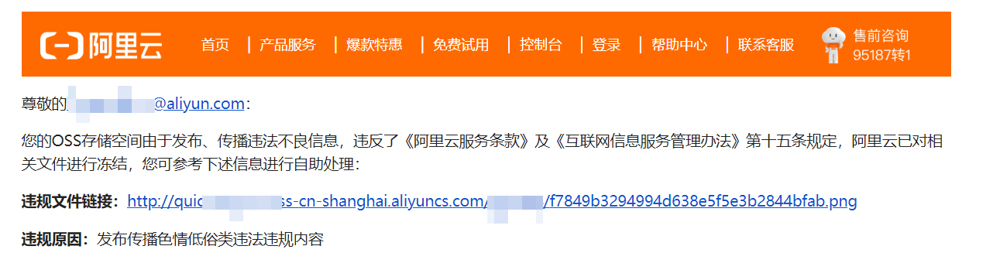

# 临时云存储

把文本、图片或文件临时存到云端，拿到一个短时有效的网址。常用来给手机扫码查看截图。要长期放在自己的桶里，用 [第三方云存储/图床](/v2/xaction/modules/cloud_oss)。

## 当前模块定义

<XActionModuleMeta moduleKey="sys:tempcloudstore" />

## 概述

文件直接上传到阿里云，不经过 Quicker 服务器中转。网址由 **用户 ID + GUID** 生成，不可猜测。本服务为试运行，后期可能调整或取消。

**不要上传违法内容。** 网址带有你的用户编号；若被阿里云或监管警告，会停用本服务，情节严重时会按要求提供相关信息。

仅限个人临时使用，不可用来分发给很多人下载。文本最长 1MB，文件最大 10MB。专业版上传间隔 5 秒，免费版 10 分钟。

<ModuleParamPreview
  moduleKey="sys:tempcloudstore"
  values={{dataType: 'file', expireSeconds: '2.5'}}
  inputVars={{file: 'textValue'}}
  outputVars={{url: 'url'}}
/>

## 参数说明

**数据类型**：文本内容、图片变量、文件。

**文本内容**：仅数据类型为文本。

**图片变量**：仅数据类型为图片变量。可来自截图等步骤。

**文件路径**：仅数据类型为文件。填完整路径。

**超时时间**：请求超时秒数，默认 `2.5`。

**生成随机文件名**：仅上传文件时有效。默认关闭。

**失败后停止**：上传失败是否中止动作。默认开启。

## 输出

- **是否成功**：是否上传成功。
- **网址**：访问地址，有效期约 10 分钟。

## 限制与排障

流量成本较高（约 0.5 元/GB），用量过大可能被停用。失败时看 **是否成功**，并确认文件没超过大小限制、间隔没太短。

## 相关链接

<RelatedDocs
  items={[
    {
      href: '/v2/xaction/modules/cloud_oss',
      label: '第三方云存储/图床',
      description: '传到自己的阿里云 / 腾讯云 / 七牛账号。',
    },
    {
      href: '/v2/xaction/modules/createqrcode',
      label: '生成二维码',
      description: '把返回的网址做成二维码给手机扫。',
    },
  ]}
/>

## 更新历史

- 1.11.2 开始提供。
