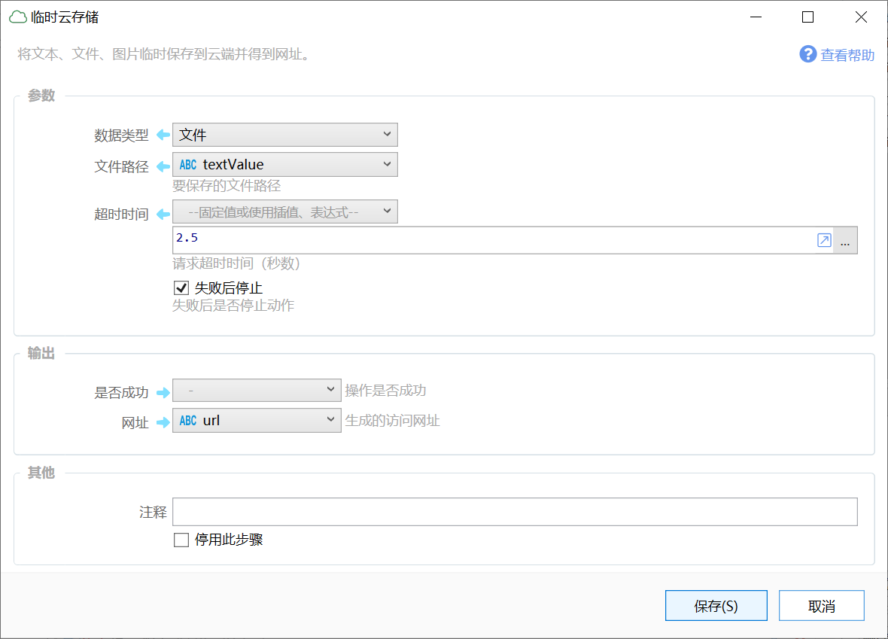

# 临时云存储

将文本、文件、图片临时保存到云端并得到网址。

{/* xaction-metadata:start */}
## 当前模块定义

- 模块 Key：`sys:tempcloudstore`
- 分类：网络服务（`Network`）
- 类型：`Action`
- 风险操作：否
- 专业版：否

## 输入参数

| Key | 名称 | 类型 | 默认值 | 必填 | 变量模式 | 条件 | 说明 |
| --- | --- | --- | --- | --- | --- | --- | --- |
| `dataType` | 数据类型 | `Enum` | text | 是 | `Input` |  |  |
| `text` | 文本内容 | `Text` |  | 是 | `UseVarOrInput` | 仅：text | 要保存的文本内容 |
| `imageVar` | 图片变量 | `Image` |  | 否 | `UseVar` | 仅：imageVar | 要保存的图片变量 |
| `file` | 文件路径 | `Text` |  | 是 | `UseVarOrInput` | 仅：file | 要保存的文件路径 |
| `expireSeconds` | 超时时间 | `Number` | 2.5 | 否 | `UseVarOrInput` |  | 请求超时时间（秒数） |
| `useRandomFileName` | 生成随机文件名 | `Boolean` | false | 否 | `Input` |  | 是否使用随机的文件名（仅适用于上传文件的情况） |
| `stopIfFail` | 失败后停止 | `Boolean` | true | 否 | `Input` |  | 失败后是否停止动作 |

## 输出参数

| Key | 名称 | 类型 | 条件 | 说明 |
| --- | --- | --- | --- | --- |
| `isSuccess` | 是否成功 | `Boolean` |  | 操作是否成功 |
| `url` | 网址 | `Text` |  | 生成的访问网址 |

## 选项值

### `dataType` 数据类型

| Value | 名称 | 说明 |
| --- | --- | --- |
| `text` | 文本内容 |  |
| `file` | 文件 |  |
| `imageVar` | 图片变量 |  |
{/* xaction-metadata:end */}

将文本、图片或文件保存到网络并获得网址（一段时间后自动删除）。

**警告：**请勿使用本服务上传有可能违反国家法律或规定的文件。 文件网址会带有您的用户编号，如果被阿里云或第三方机构警告，我们将会停止您使用本服务的权限。情节严重的，将会根据有关部门要求提供您的相关信息。

示例场景：

-   将图片上传后获得网址，通过二维码模块显示网址二维码，手机扫码后可直接查看或下载图片。

说明：

-   本服务为试运行状态，后期根据情况可能会有调整或取消。
-   文件直接上传到阿里云，不经过Quicker服务器中转。
-   网址是通过**用户ID+GUID全局唯一ID**动态生成的，可以保证唯一性和不可猜测性。
-   因下载流量成本较高（0.5元/G），**仅限个人临时使用**，不可用于传输大量内容，不可进行内容分发（比如上传一个文件后给较多人下载）。如果有流量较大浪费，将停止为您提供服务。
-   文本长度限制1MB，文件大小限制10MB。
-   专业版用户：上传间隔限制5秒。 免费版用户：上传间隔限制10分钟。

## 参数

【数据类型】可选文本、图片变量、文件。

【文本内容】适用于文本类型，要上传的文本内容。

【图片变量】从截图或其他地方获取的图片变量。

【文件路径】文件的完整路径。

【失败后停止】上传失败后是否停止动作。

## 输出

【是否成功】是否上传成功。

【网址】文件的访问网址，有效期限10分钟。

## 更新历史

-   自1.11.2版本开始提供。
