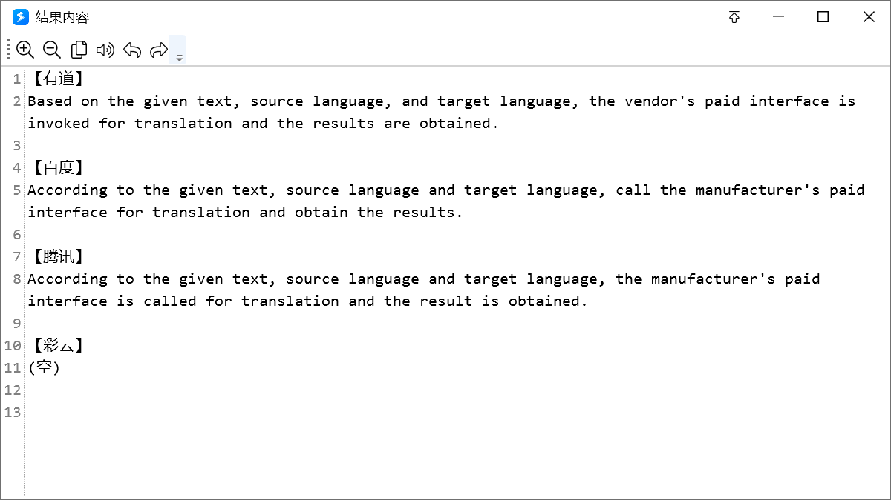
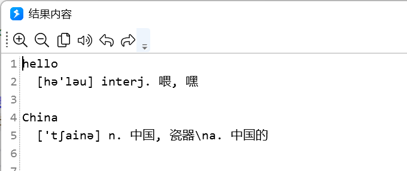
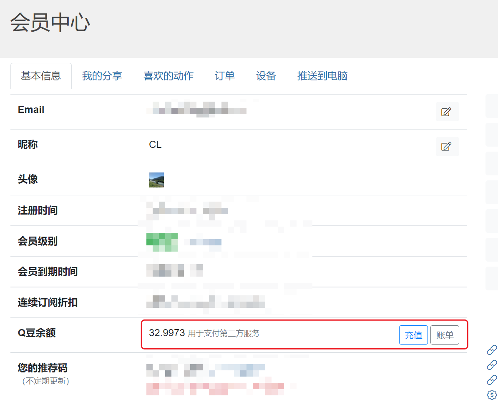

# 机器翻译/词典

按源语言、目标语言调用厂商接口翻译一段文字，或查英汉词典。OpenAI 兼容的翻译提示也可以用 [AI 调用](/v2/xaction/modules/ai)。

## 当前模块定义

<XActionModuleMeta moduleKey="sys:translation" />

## 概述

翻译走付费接口，按字符扣 Q豆（Quicker 自有翻译对专业版免费）。[购买 Q豆](https://getquicker.net/Member/Buy?productId=3)。需要联网，Quicker 1.25.11+。

专业版日常轻量使用会赠送一些 Q豆：

- 2021-07-23 起：在**官网**续费/购买专业版，赠送实付金额的 5%。
- 2021-07-23 前的专业版账号：剩余天数 × 0.008，最多 30 个。
- 2025-03-17 起：专业版翻译消耗按 5 折计费。

<ModuleParamPreview moduleKey="sys:translation" />

## 参数说明

**操作类型**：单厂商文字翻译、多厂商文字翻译、英汉词典。

**待翻译文本内容或单词。**：要翻译的正文，或词典查询的单词。

**源语言** / **目标语言**：翻译时用。`Auto` 会按是否含中文判断（含中文则源为中文、目标为英文，反之亦然）。词典操作不显示这两项。

**厂商**：仅单厂商。见下方列表。

**厂商列表**：仅多厂商。英文逗号分隔的厂商标识。

**失败后停止**：失败是否中止动作。默认开启。

## 输出

- **是否成功**
- **结果文本**：译文。多厂商时会拼在一起。
- **原始响应**：仅单厂商、词典。厂商返回的原始内容，通常是 JSON。
- **各厂商翻译结果**：仅多厂商。词典，Key 是厂商标识。
- **各厂商原始响应**：仅多厂商。词典，Value 通常是 JSON。
- **消耗点数**：仅翻译。单位是 0.0001 Q豆。旧稿未写。

## 单厂商翻译

调用一家接口。

<ModuleParamPreview
  moduleKey="sys:translation"
  focusKeys={['operation', 'text', 'srcLang', 'dstLang', 'vendor', 'resultText', 'rawData', 'costPoints']}
  values={{operation: 'single', vendor: 'Youdao'}}
  outputVars={{resultText: 'text'}}
/>

## 多厂商翻译

<ModuleParamPreview
  moduleKey="sys:translation"
  focusKeys={['operation', 'text', 'srcLang', 'dstLang', 'vendorList', 'resultText', 'vendorResult']}
  values={{
    operation: 'multiple',
    text: '获取本月剩余天数或本月已过去天数_今天菜里有肉...',
    srcLang: 'Auto',
    dstLang: 'Auto',
    vendorList: 'Youdao,Baidu,Tencent,Caiyun',
  }}
  outputVars={{resultText: 'text'}}
/>

**厂商列表** 可用标识：

- `Baidu` 百度
- `Tencent` 腾讯
- `Youdao` 有道
- `Aliyun` 阿里云
- `Google` 谷歌
- `Caiyun` 彩云
- `Xunfei` 讯飞（旧稿写已不支持，不建议再用）
- `XunfeiNiutrans` 讯飞 2 代（小牛）
- `Quicker` Quicker 自有服务（专业版免费）

**结果文本** 会按厂商分段拼在一起，例如：

## 英汉词典

查一个英文单词，或用英文逗号分隔多个单词（一个和多个的返回格式不同）。数据来自 [ECDICT](https://github.com/skywind3000/ECDICT)。本接口免费。

<ModuleParamPreview
  moduleKey="sys:translation"
  focusKeys={['operation', 'text', 'resultText', 'rawData']}
  values={{operation: 'en2zh_dict', text: 'Quick'}}
/>

查一个单词时，**原始响应** 是该词的 JSON，常见字段：

| 字段 | 含义 |
| --- | --- |
| word | 单词 |
| phonetic | 音标 |
| definition | 英文释义，每行一条 |
| translation | 中文释义，每行一条 |
| pos | 词性，用 `/` 分隔 |
| tag | 标签，如 zk/gk/cet4，空格分隔 |
| bnc / frq | 词频顺序 |
| exchange | 时态、复数等，用 `/` 分隔 |

查多个单词（如 `hello,China`）时，**结果文本** 类似：

**原始响应** 是各单词信息的 JSON 数组。

## 费用与购买

- 计费单位是 Q豆，约 1 元 ≈ 1 Q豆。
- 每个字符（含空格、标点）计 1 个字符。多厂商时每家都计。
- 最多可欠费 0.1 Q豆。
- 谷歌：1 Q豆 = 5000 字符；彩云：1 Q豆 = 20000 字符；其它：1 Q豆 = 10000 字符。
- 最低计费 0.0001 Q豆。失败偶尔也会扣费。
- Quicker 翻译：专业版免费，免费版按「其它厂商」的 10%。
- 2025-03-17 起专业版 5 折。

在会员中心看余额；需要时 [单独购买 Q豆](https://getquicker.net/Member/Buy?productId=3)。历史账单保留 30 天。

## 厂商限制

各家对语言组合、单次字符数有自己的上限，请查官方文档。

Quicker 翻译基于 [MTranServer](https://github.com/xxnuo/MTranServer)，效果中等，语言较多。不直接支持的组合会经英文中转（如中译日 = 中译英再英译日）。

<StepProgramView example="a10d3f7c-6eca-4a4e-16a8-08dd656169a1" />

<ShareLinkCard
  code="a10d3f7c-6eca-4a4e-16a8-08dd656169a1"
  title="简单翻译"
  description="用 Quicker 接口翻译选中文本"
  author="CL"
/>

## 隐私

Quicker 服务器只中转请求，不记录、不存储请求内容和厂商响应。

## 示例动作

<ShareLinkCard
  items={[
    {
      code: '3b4e1cbc-9fbc-4686-764f-08d950c2afd2',
      title: '一译',
      description: '单引擎翻译',
      author: 'CL',
    },
    {
      code: '2376e6a5-b5d9-4afb-7655-08d950c2afd2',
      title: '多译',
      description: '多引擎翻译',
      author: 'CL',
    },
    {
      code: '9fdf152f-dd42-482e-767a-08d950c2afd2',
      title: '查词',
      description: '查询英文单词含义',
      author: 'CL',
    },
    {
      code: '7d6dcc8c-2a1f-41d3-35e5-08d95890efa9',
      title: '有道翻译',
      description: '有道词典 API 翻译或查词',
      author: 'CL',
    },
  ]}
/>

## 限制与排障

余额不足会失败。多厂商时每家都扣费，列表不要随便加很多家。讯飞一代接口旧稿已标明不支持。

## 相关链接

<RelatedDocs
  items={[
    {
      href: '/v2/xaction/modules/ai',
      label: 'AI 调用',
      description: '用提示词做翻译，走 OpenAI 兼容接口。',
    },
  ]}
/>

## 更新历史

- 2023-07-15 去除 Xunfei 接口支持。
- 2025-03-17 专业版翻译 5 折。
