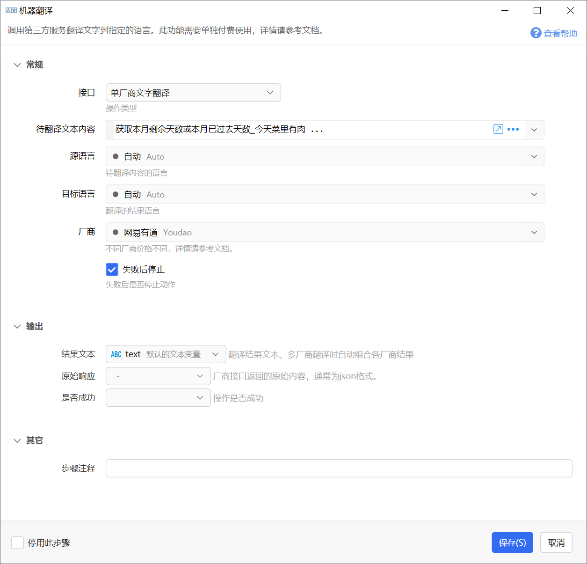
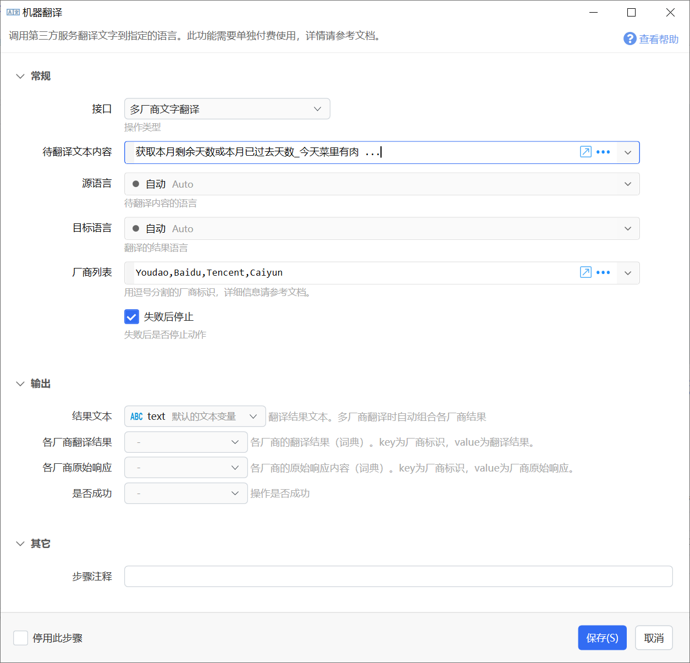
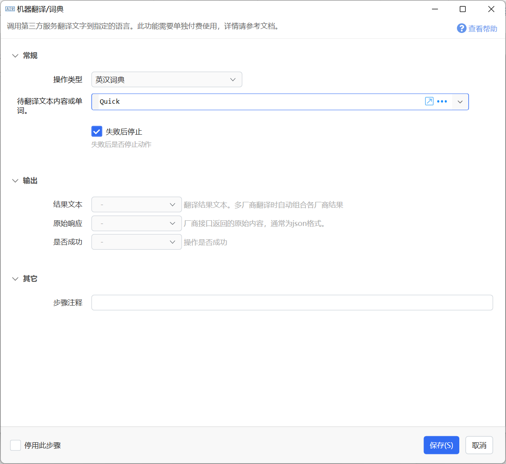

# 机器翻译/词典

调用第三方服务翻译文字到指定的语言。此功能需要单独付费使用，详情请参考文档。

## 当前模块定义

<XActionModuleMeta moduleKey="sys:translation" />

## 概述

根据给定的文本、源语言与目标语言，调用厂商的付费接口进行翻译并获得结果。

本功能需要额外的成本，需要按使用量购买Q豆（Quicker自有翻译服务免费向专业版用户提供）。[购买链接](https://getquicker.net/Member/Buy?productId=3)

为方便专业版用户日常轻量使用，将赠送一定金额的Q豆：

-   2021年7月23日起：**官网**续费/购买专业版，赠送实际支付金额的 5% Q豆数量。
-   2021年7月23日前的专业版账号，赠送Q豆：剩余天数 \* 0.008，最多赠送30个Q豆。
-   2025年3月17日起：专业版用户翻译服务Q豆消耗按5折优惠计费。

本功能需要联网实现。Quicker1.25.11+版本。

## 参数

通用参数：

【操作类型】选择单厂商或多厂商翻译。

【待翻译文本内容】需要翻译的内容。

【源语言】需要翻译内容的语言类型。设置为Auto可自动识别（如果包含中文字符则认为是中文，否则认为是英文）。

【目标语言】翻译的目标语言类型。设置为Auto可自动识别，如果待翻译内容包含中文，则翻译为英文，否则翻译为中文。

### 单厂商翻译

调用某个厂商的翻译接口。

输出参数：

【结果文本】翻译得到的结果内容。

【原始相应】厂商接口返回的原始内容，通常为一段JSON文本。

### 多厂商翻译

【厂商列表】需要选用的厂商接口标识，以英文逗号分隔。支持的接口如下：

-   Baidu 百度
-   Tencent 腾讯
-   Youdao 有道
-   Aliyun 阿里云
-   Google 谷歌
-   Caiyun 彩云
-   Xunfei 讯飞（不建议使用）（已不支持）
-   XunfeiNiutrans 讯飞2代（小牛翻译引擎）
-   Quicker Quicker自有服务（专业版免费使用）

输出参数

【结果文本】将各厂商翻译结果合并，格式如下：

【各厂商翻译结果】以词典形式返回每个厂商的**翻译结果**文本。Key为厂商标识，Value为翻译后的结果文本。

【各厂商原始相应】以词典形式返回每个厂商的**原始相应**内容。Key为厂商标识，Value为原始相应内容，通常为JSON文本。

### 英汉词典

获取一个英文单词或使用英文逗号分隔的多个英文单词的汉语解释（1个单词与多个单词返回格式不同）。

数据来源与返回结果请参考：[https://github.com/skywind3000/ECDICT](https://github.com/skywind3000/ECDICT)。

本接口免费。

**查询一个单词：**

【待翻译文本内容或单词】中传入单个单词。

【结果文本】输出该单词的汉语解释。

【原始响应】该单词信息的json数据，各字段结果：

| **字段** | **解释** |
| --- | --- |
| word | 单词名称 |
| phonetic | 音标，以英语英标为主 |
| definition | 单词释义（英文），每行一个释义 |
| translation | 单词释义（中文），每行一个释义 |
| pos | 词语位置，用 "/" 分割不同位置 |
| tag | 字符串标签：zk/中考，gk/高考，cet4/四级 等等标签，空格分割 |
| bnc | 英国国家语料库词频顺序 |
| frq | 当代语料库词频顺序 |
| exchange | 时态复数等变换，使用 "/" 分割不同项目 |

来源：[https://github.com/skywind3000/ECDICT](https://github.com/skywind3000/ECDICT)

**查询多个单词：**

【待翻译文本内容或单词】用半角逗号隔开多个单词，如“hello,China”

【结果文本】输出拼接后的各单词解释，格式如下：

【原始响应】包含各单词信息的**JSON数组**文本。

## 费用与购买

**注意事项：**

-   计费单位：“Q豆”，1元 ≈ 1Q豆。
-   待翻译内容的每个字符，包括空格和其他标点符号，都会按1个字符计费。
-   多厂商翻译，每个厂商都会计费。
-   最多可欠费0.1Q豆。

**机器翻译服务价格：**

-   谷歌翻译：每1Q豆=5000字符。
-   彩云小译：每1Q豆=20000字符。
-   其它厂商价格：每1Q豆=10000字符。
-   最低计费 0.0001 Q豆。
-   翻译失败的情况也可能会被计费（极少发生）。
-   Quicker翻译服务：专业版用户免费使用，免费版用户按“其它厂商价格”的10%计费。
-   自2025年3月17日起，专业版用户按5折计费。

**查看余额、账单与购买Q豆：**

-   在会员中心网页中查看余额。
    

-   需要时，可[单独购买Q豆：链接](https://getquicker.net/Member/Buy?productId=3)

-   因数据量较大，历史账单保留30天。

## 各厂商的接口限制

主要限制：

-   源语言与目标语言以及它们的组合方式。
-   单次翻译的字符数量。

具体限制请搜索各厂商官方文档。

#### 关于Quicker翻译服务

Quicker翻译服务基于 [https://github.com/xxnuo/MTranServer](https://github.com/xxnuo/MTranServer) 开源项目实现，效果中等。支持语言较多，并且支持通过英文作为桥梁的转换，如中译日的过程是先中译英，再英译日。

测试动作：

-   [简单翻译 - by CL - 动作信息 - Quicker](https://getquicker.net/Sharedaction?code=a10d3f7c-6eca-4a4e-16a8-08dd656169a1)

## 隐私声明

Quicker服务器仅用于中转请求，不会记录和存储请求内容以及服务商的响应内容。

## 示例动作

单引擎翻译: [https://getquicker.net/Sharedaction?code=3b4e1cbc-9fbc-4686-764f-08d950c2afd2](https://getquicker.net/Sharedaction?code=3b4e1cbc-9fbc-4686-764f-08d950c2afd2)

多引擎翻译: [https://getquicker.net/sharedaction?code=2376e6a5-b5d9-4afb-7655-08d950c2afd2](https://getquicker.net/sharedaction?code=2376e6a5-b5d9-4afb-7655-08d950c2afd2)

单词查询：[https://getquicker.net/sharedaction?code=9fdf152f-dd42-482e-767a-08d950c2afd2](https://getquicker.net/sharedaction?code=9fdf152f-dd42-482e-767a-08d950c2afd2)

有道翻译：[https://getquicker.net/sharedaction?code=7d6dcc8c-2a1f-41d3-35e5-08d95890efa9](https://getquicker.net/sharedaction?code=7d6dcc8c-2a1f-41d3-35e5-08d95890efa9)

## 更新说明

-   2023-7-15 去除Xunfei接口支持。

\_
