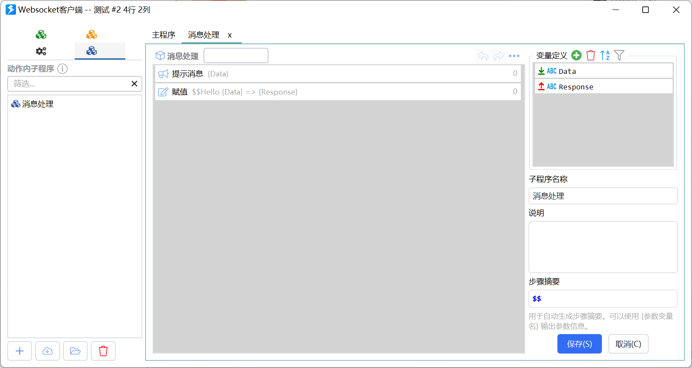

# Websocket

作为客户端连接第三方 WebSocket 服务，或向连到 [本机 Websocket 服务](https://getquicker.net/KC/Manual/Doc/websocketservice) 的客户端发数据。

## 当前模块定义

<XActionModuleMeta moduleKey="sys:websocket" />

## 概述

<ModuleParamPreview moduleKey="sys:websocket" />

## 参数说明

**操作类型**：

- 客户端：连接到 Websocket 服务
- 客户端：向 Websocket 服务发送消息
- 客户端：获取连接状态
- 客户端：关闭连接
- 服务器：向连接的客户端发送文本
- 服务器：向连接的客户端发送文件（二进制）
- 服务器：向连接的客户端发送文件（Base64）

**服务器地址**：仅创建连接。第三方 `ws://` / `wss://` 地址。

**连接ID**：标识一条连接。后续发送、查状态、关闭都靠它。再次用同一 ID 创建时，会先关掉旧连接。

**消息处理子程序**：仅创建连接。收到文本消息时调用。详见下文。

**消息内容**：创建连接后立刻发送的文本；向服务端或客户端发送时填正文；发文件时填完整路径。

**账号密码**：仅创建连接。支持 Basic / Digest。第一行用户名，第二行密码。

**Cookie**：仅创建连接。每行 `name:value`。

**Origin**：仅创建连接。需要时再填 HTTP Origin。

**服务断开时通知动作(调用动作并传入参数:websocket__closed)**：仅创建连接。默认开启。旧稿未写。

**失败后停止**：失败是否中止动作。默认开启。

## 输出

- **是否成功**
- **是否连接**：仅获取连接状态。指定 ID 是否连着远程服务器。

## 创建 Websocket 连接

Quicker 当客户端连第三方服务时用。大致流程：

1. 先写好接收消息的子程序。
2. 连接并指定 **连接ID** 和子程序。连接会保持，即使动作已经结束。
3. 之后用同一 **连接ID** 发消息。
4. 收到消息后调用子程序；若子程序的 Response 输出非空，会回给服务器。

### 设计接收消息处理子程序

目前只支持文本消息。Quicker 把详情放进子程序的 `Data` 输入。处理完后赋给 `Response` 输出；非空就会发回服务器。

子程序会被直接调用，不必加进主程序步骤，主程序步骤也不会因此执行。

### 连接到 Websocket 服务

<ModuleParamPreview
  moduleKey="sys:websocket"
  focusKeys={[
    'operation',
    'server',
    'clientId',
    'spName',
    'content',
    'account',
    'cookie',
    'origin',
    'callbackOnClose',
    'isSuccess',
  ]}
  values={{
    operation: 'CreateClient',
    server: 'wss://socketsbay.com/wss/v2/2/demo/',
    clientId: 'test',
    spName: '消息处理',
  }}
  outputVars={{isSuccess: 'isSuccess'}}
/>

### 向 Websocket 服务发送消息

<ModuleParamPreview
  moduleKey="sys:websocket"
  focusKeys={['operation', 'clientId', 'content', 'isSuccess']}
  values={{operation: 'SendMsgToServer', clientId: 'test'}}
  outputVars={{isSuccess: 'isSuccess'}}
/>

### 获取连接状态 / 关闭连接

获取指定 ID 是否已连接，或关掉它。

`https://tools.getquicker.cn/ws` 提供回显服务，可用来试。

<ShareLinkCard
  code="16cd6907-13d1-45bb-9c56-08d9f836c603"
  title="Websocket操作"
  description="连接 echo 测试服务"
  author="CL"
/>

## 向本机服务的客户端发送

向已连接到 [本机 Websocket 服务](https://getquicker.net/KC/Manual/Doc/websocketservice) 的客户端发内容。可选文本、二进制文件或 Base64 文件。消息格式见该文档。

<ModuleParamPreview
  moduleKey="sys:websocket"
  focusKeys={['operation', 'content', 'isSuccess']}
  values={{
    operation: 'SendTextToClient',
    content: '{"type":"msg", "Data":"Hello From Quicker"}',
  }}
  outputVars={{isSuccess: 'isSuccess'}}
/>

## 限制与排障

接收处理目前只支持文本。连接断开后，若打开了断开通知，动作会收到参数 `websocket__closed`。同一 **连接ID** 再次创建会顶掉旧连接。

## 相关链接

<RelatedDocs
  items={[
    {
      href: '/v2/xaction/modules/http',
      label: 'HTTP请求',
      description: '一次性请求/响应，不是长连接。',
    },
    {
      href: '/v2/xaction/modules/httpserver',
      label: 'HTTP服务器',
      description: '在本机开临时网页服务。',
    },
  ]}
/>
