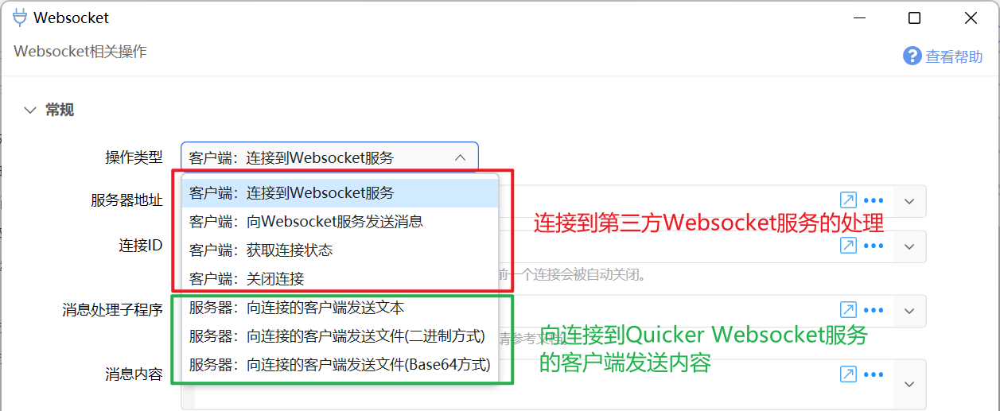
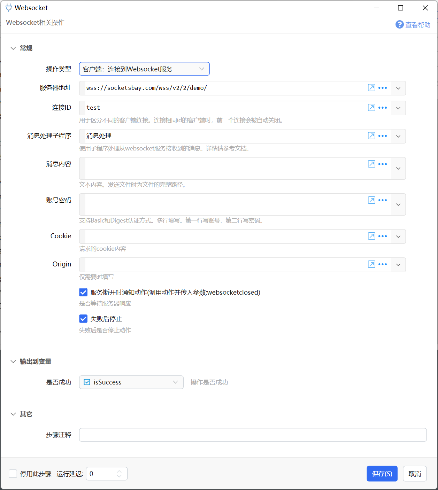
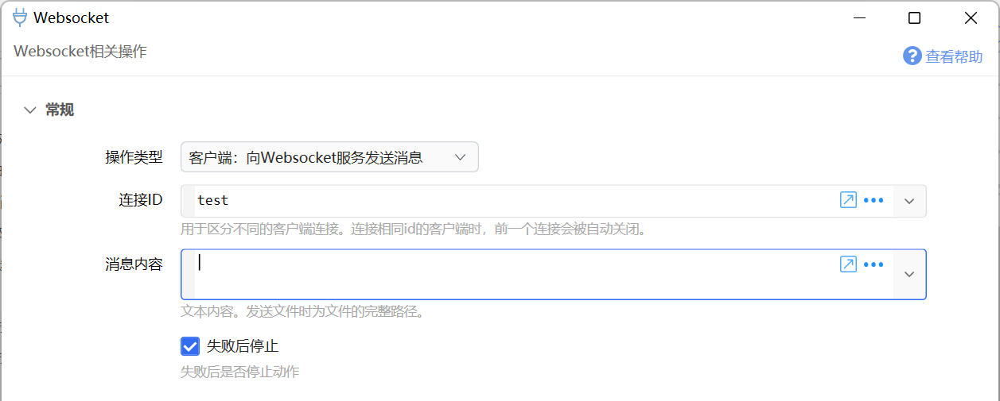
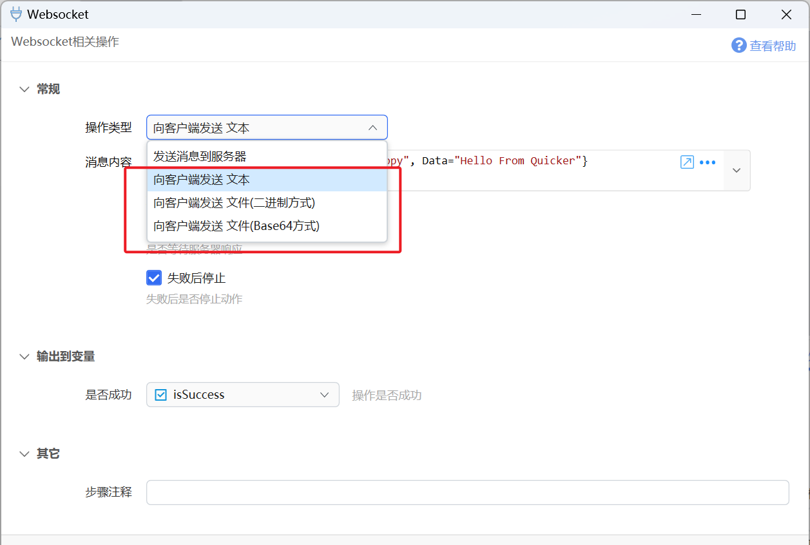

# Websocket

Websocket相关操作

## 当前模块定义

<XActionModuleMeta moduleKey="sys:websocket" />

主要有2个功能：

-   创建WebSocket客户端以连接第三方websocket服务。
-   向连接到[本机Websocket服务](https://getquicker.net/KC/Manual/Doc/websocketservice)的客户端发送数据。

## 创建Websocket连接

当Quicker作为websocket客户端连接第三方服务时使用。

大概的使用流程：

-   先设计好接收消息处理子程序。
-   连接到Websocket服务，并指定“连接ID”和接收消息处理子程序。连接将会建立并保持（即使动作已经结束）。

-   需要时，通过指定 “连接ID” 向Websocket服务器发送消息。
-   接收到消息后，Quicker会调用创建连接时指定的子程序，并将子程序的输出发送给Websocket服务器。

### 设计接收消息处理子程序

在收到消息时（仅支持文本消息），Quicker将会调用设定的子程序，并将详细内容传入Data参数变量中。

处理完成后，将要返回的结果赋值给Response输出变量。 如果Response变量内容不为空，Quicker会将此内容返回给Websocket服务器。

子程序会被直接调用，因此不需要将其添加到主程序步骤中。 主程序的步骤也不会被执行。

### 连接到Websocket服务

向指定的服务器建立连接并保持。

【服务器地址】第三方websocket服务器地址。

【连接ID】标识一个连接。可在后续步骤中通过指定此id向对端服务器发送消息，也可用于获取连接状态或关闭连接。

【消息处理子程序】设定用于处理接收到的消息的子程序。

【消息内容】连接后立即发送的消息内容。

【账号密码】支持Basic Authentication、Digest Authentication。第一行写用户名，第二行写密码。

【cookie】请求附带的cookie内容。格式为每行一个，每个为 name:value 的形式。

【origin】可选。请求的http来源信息。

### 向Websocket服务发送消息

### 获取连接状态

获取连接是否建立的信息。

### 关闭连接

关闭指定ID的连接。

### 示例动作

在 `https://tools.getquicker.cn/ws` 提供websocket了“回显”（返回客户端所发送的数据）服务可供测试。

-   [WebSocket操作](https://getquicker.net/Sharedaction?code=16cd6907-13d1-45bb-9c56-08d9f836c603)

## 通过Webscoekt服务向客户端发送内容

向连接到 [webscoket服务](https://getquicker.net/KC/Manual/Doc/websocketservice) 的所有客户端发送内容。

操作类型可选：发送文本、二进制方式或Base64方式发送文件。

具体消息格式要求请参考[websocket服务文档](https://getquicker.net/KC/Manual/Doc/websocketservice)中的内容。
