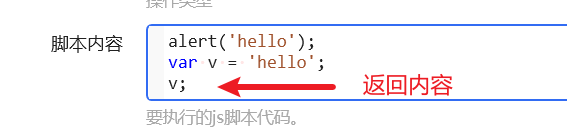
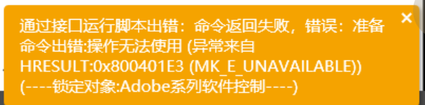
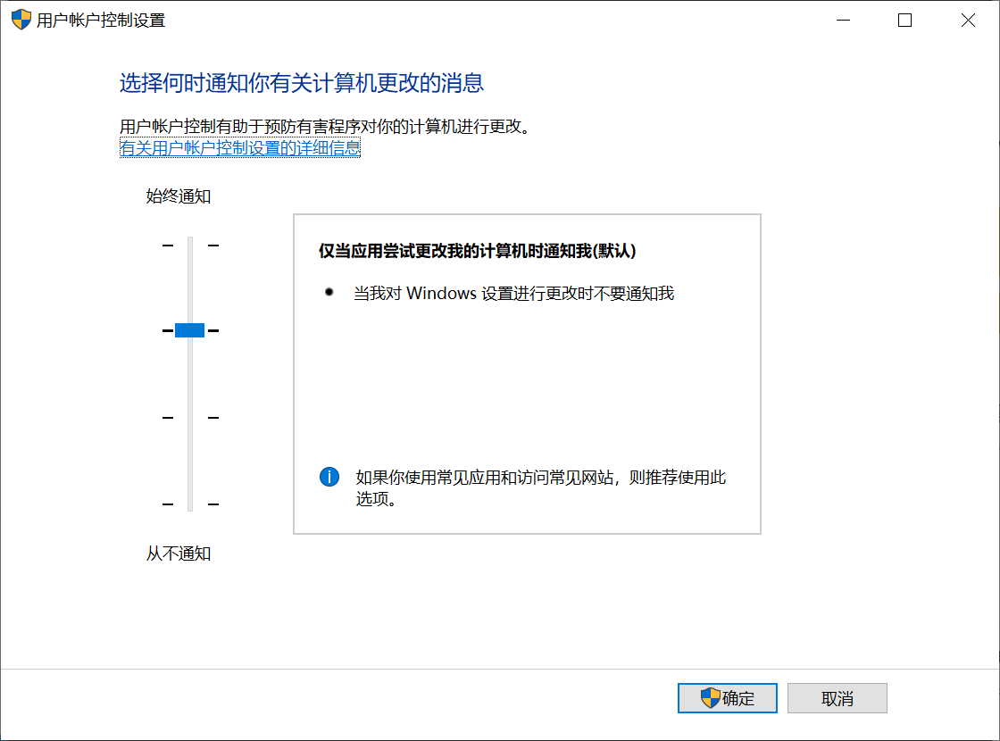
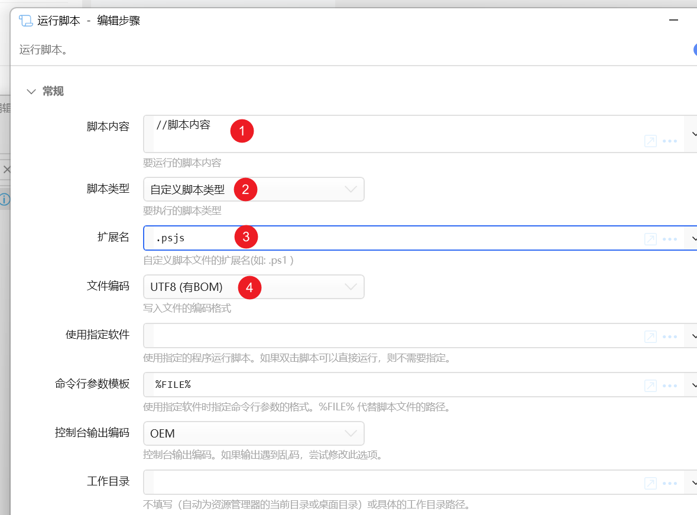

# Adobe系列软件控制

向已启动的 Photoshop、Illustrator 或 After Effects 运行 JSX 脚本。软件必须先打开。

## 当前模块定义

<XActionModuleMeta moduleKey="sys:adobesoftscontrol" />

## 概述

<ModuleParamPreview moduleKey="sys:adobesoftscontrol" />

同时装了多个版本时，只能控制其中一个。在其它版本上会报 `操作无法使用 (异常来自 HRESULT:0x800401E3 (MK_E_UNAVAILABLE))`。

## 参数说明

**软件名称**：Photoshop、Illustrator、After Effects。

**操作类型**：

- **执行js脚本**：在「脚本内容」里写 JSX。
- **执行js脚本文件**：在「脚本文件路径」里给 jsx 路径。

**脚本内容**：JSX 代码。仅「执行js脚本」。

**脚本文件路径**：jsx 完整路径。仅「执行js脚本文件」。

**等待执行结束**：是否等脚本跑完再继续。默认开启。

**最长等待时间(ms)**：等待上限，默认 10000。

**接口失败后，尝试使用程序exe运行脚本文件**：接口不可用时改用 `photoshop.exe -r path.jsx`。这时无法知道成败，也无法等待结束。

**失败后停止**：失败后是否中止动作。默认开启。

## 输出

- **是否成功**：是否执行成功。
- **脚本输出**：从脚本返回的内容。仅接口 + 等待执行结束时可用；只支持 PS、Illustrator；只支持简单类型，不能返回 object。

## 示例动作

<StepProgramView example="f757e64d-dff9-4bc1-6b82-08da4f3f8574" />

<ShareLinkCard
  code="f757e64d-dff9-4bc1-6b82-08da4f3f8574"
  title="右转90度"
  description="将当前画布向右旋转 90 度"
  author="CL"
/>

<StepProgramView example="56fba2f1-898e-403a-6b87-08da4f3f8574" />

<ShareLinkCard
  code="56fba2f1-898e-403a-6b87-08da4f3f8574"
  title="生成不同尺寸图标"
  description="使用脚本批量生成图标"
  author="CL"
/>

参考：[Photoshop 脚本教程](https://github.com/Adobe-CEP/CEP-Resources/blob/master/Documentation/Product%20specific%20Documentation/Photoshop%20Scripting/photoshop-scripting-guide-2020.pdf)。

## 限制与排障

### 0x800401E3 / 0x800401E1 (MK_E_UNAVAILABLE)

1. 确认安装的是完整版 PS，不是绿色版。
2. 系统 UAC 保持默认；改过的改回默认后重启 Windows。

### 执行 psjs

PS 尚未提供执行 psjs 的接口。可用「运行脚本」步骤，把脚本类型设成自定义并指定扩展名：

## 相关链接

<RelatedDocs
  items={[
    {
      href: '/v2/xaction/modules/runscript',
      label: '运行脚本',
      description: '执行 psjs 等其它脚本类型。',
    },
  ]}
/>

## 更新历史

- 20230914 增加返回内容的功能。
- 20230923 1.39.33 支持同时安装多个 Photoshop、AI 的情况。
