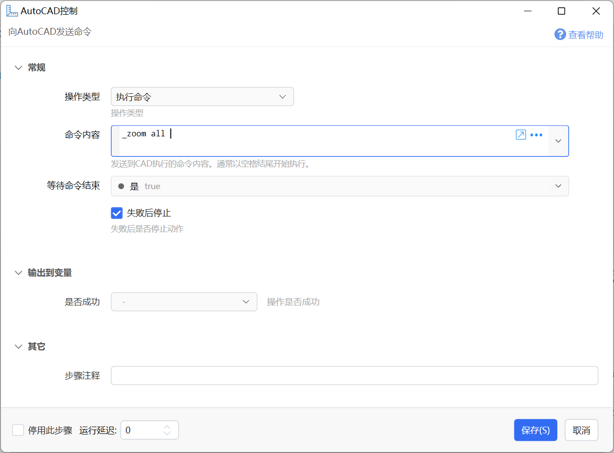

# AutoCAD控制

向AutoCAD发送命令

{/* xaction-metadata:start */}
## 当前模块定义

- 模块 Key：`sys:autocadcontrol`
- 分类：第三方软件交互（`SoftInteraction`）
- 类型：`Action`
- 风险操作：否
- 专业版：否

## 输入参数

| Key | 名称 | 类型 | 默认值 | 必填 | 变量模式 | 条件 | 说明 |
| --- | --- | --- | --- | --- | --- | --- | --- |
| `operation` | 操作类型 | `Enum` | SendCommand | 是 | `Input` |  | 操作类型 |
| `command` | 命令内容 | `Text` |  | 否 | `UseVarOrInput` | 仅：SendCommand | 发送到CAD执行的命令内容。通常以空格结尾开始执行。 |
| `varList` | 变量列表 | `Text` |  | 否 | `UseVarOrInput` | 仅：ReadVariable | 每行一个变量名称 |
| `waitResp` | 等待命令结束 | `Boolean` | true | 否 | `UseVarOrInput` | 仅：SendCommand |  |
| `waitMs` | 最长等待时间(ms) | `Number` | 10000 | 是 | `Input` |  | 最长的等待返回结果的，毫秒数 |
| `stopIfFail` | 失败后停止 | `Boolean` | true | 否 | `Input` |  | 失败后是否停止动作 |

## 输出参数

| Key | 名称 | 类型 | 条件 | 说明 |
| --- | --- | --- | --- | --- |
| `isSuccess` | 是否成功 | `Boolean` |  | 操作是否成功 |
| `output` | 变量值 | `Text` | 仅：ReadVariable | 从当前文档读取的变量值，多个变量时每行一个，和变量名顺序对应。 |

## 选项值

### `operation` 操作类型

| Value | 名称 | 说明 |
| --- | --- | --- |
| `SendCommand` | 执行命令 |  |
| `ReadVariable` | 读取变量 |  |
{/* xaction-metadata:end */}

## 概述

向AutoCAD软件发送命令或脚本。

【操作类型】

可选的操作类型，目前仅支持“执行命令”。

【命令内容】

AutoCAD命令或AutoLisp脚本。请确保脚本内容的合法性。

通常在命令末尾增加空格或回车表示开始执行命令。如果有多余的空格或回车，可能会多次执行命令。

**示例动作**

-   [ZoomAll](https://getquicker.net/Sharedaction?code=837633b1-cbea-4156-0c36-08da45d22d56)：运行`_zoom all` 命令。
-   [LispHelloWorld](https://getquicker.net/Sharedaction?code=2de554cd-f7f6-417c-6b7c-08da4f3f8574)：使用AutoLisp显示Hello World消息。

**参考文档**

-   [AutoLisp入门实例教程（上）](http://www.hanlindong.com/2017/autolisp-beginner-1/)
-   [AutoLisp入门实例教程（下）](http://www.hanlindong.com/2017/autolisp-beginner-2/)

## 通过手势、轮盘等执行命令或脚本

因为轮盘等快速触发不能直接向CAD发送命令，需要通过一个单独的动作来中转。实现步骤如下：

（1）先在合适的位置安装此动作：[参数传递CAD命令](https://getquicker.net/Sharedaction?code=3dfd19f5-7e33-4864-5286-08da4e691004)

（2）在轮盘、手势等位置，使用下面的设定方式调用动作，并将要执行的命令作为参数传递给动作。

设置方法：1、操作类型选择“运行Quicker动作”。2、输入动作名称“参数传递CAD命令”。3、动作参数中输入要执行的命令。 注意末尾加空格开始执行。

## 更新历史

-   20250120 更新文档标题，以匹配实际功能。
