# 浏览器控制

与Chrome/Edge/Firefox等浏览器通信，控制网页或浏览器。

{/* xaction-metadata:start */}
## 当前模块定义

- 模块 Key：`sys:chromecontrol`
- 分类：第三方软件交互（`SoftInteraction`）
- 类型：`Action`
- 风险操作：否
- 专业版：否

## 输入参数

| Key | 名称 | 类型 | 默认值 | 必填 | 变量模式 | 条件 | 说明 |
| --- | --- | --- | --- | --- | --- | --- | --- |
| `operation` | 操作类型 | `Enum` |  | 是 | `Input` |  | 操作类型 |
| `url` | 网址 | `Text` |  | 是 | `UseVarOrInput` | 仅：OpenUrl, ActivateTab | 要打开的网页地址。激活标签页时有多种使用方法，请参考模块文档。 |
| `windowId` | 窗口Id | `Number` |  | 是 | `UseVarOrInput` | 仅：OpenUrl | 使用哪个窗口打开网址。可以使用选项或指定窗口id。 |
| `tabId` | 标签页Id | `Text` |  | 是 | `UseVarOrInput` | 仅：GetTabInfo, CloseTab, RunScript, WaitTabComplete, GetElementInfo, UpdateElement, TriggerEvent, PickElement, Wait, ActivateTab | 留空表示当前活动标签页。 |
| `selector` | 选择器 | `Text` |  | 是 | `UseVarOrInput` | 仅：GetElementInfo, UpdateElement, TriggerEvent, Wait | 要操作的元素选择器，请参考文档。 |
| `fixSelector` | 修正选择器文本 | `Enum` | auto | 是 | `Input` | 仅：GetElementInfo, UpdateElement, TriggerEvent | 仅MV2版本扩展有效。 |
| `elementInfo` | 元素信息类型 | `Enum` | Value | 是 | `Input` | 仅：GetElementInfo |  |
| `updateElementInfo` | 元素信息类型 | `Enum` | Value | 是 | `Input` | 仅：UpdateElement |  |
| `triggerEventType` | 触发事件类型 | `Enum` | click | 是 | `UseVarOrInput` | 仅：TriggerEvent |  |
| `updateElementValue` | 值 | `Text` |  | 是 | `UseVarOrInput` | 仅：UpdateElement | 要更新的元素信息值 |
| `attrName` | 属性名 | `Text` |  | 是 | `UseVarOrInput` | 仅：GetElementInfo, UpdateElement | 设置或读取Attribute属性/Property属性时，置顶Attribute或Property的名称。 |
| `windowInfo` | 窗口/标签参数 | `Text` |  | 否 | `UseVarOrInput` | 仅：OpenUrl | 创建窗口或标签时的额外参数（json格式）。 |
| `script` | 脚本内容 | `Text` | //.js <br /> | 否 | `UseVarOrInput` | 仅：RunScript, BackgroundScript |  |
| `command` | 命令 | `Text` |  | 否 | `UseVarOrInput` | 仅：BackgroundCommand | 请参考模块文档获取支持的命令列表。需MV3版浏览器扩展与Chrome135+版本。 |
| `commandParams` | 命令参数 | `Object` |  | 否 | `UseVarOrInput` | 仅：BackgroundCommand | 后台脚本命令的参数。每个命令参数不同，详情请参考模块文档。 |
| `valueFilter` | 返回值过滤器 | `Text` |  | 否 | `UseVarOrInput` | 仅：BackgroundCommand | 用于从API返回的结果中提取单个属性。格式为属性名，多个时使用分号隔开。 |
| `timeoutMs` | 超时时间(ms) | `Number` | 3000 | 是 | `Input` | 仅：OpenUrl, WaitTabComplete, BackgroundScript, GetTabInfo, RunScript, GetElementInfo, UpdateElement, TriggerEvent, PickElement, BackgroundCommand, Wait | 超时等待时间，毫秒数 |
| `frame` | 运行脚本的框架 | `Text` | all | 是 | `Input` | 仅：RunScript, GetElementInfo, UpdateElement, TriggerEvent | all:所有框架，0：顶层框架，其它数字：框架id |
| `executionWorld` | 执行环境 | `Text` |  | 是 | `Input` | 仅：RunScript | 自定义脚本的执行环境(ExecutionWorld)，默认为USER_SCRIPT。MAIN表示网页自身的执行环境。仅MV3版本扩展支持。 |
| `waitManualReturn` | 从脚本手动返回数据 | `Boolean` | false | 否 | `Input` | 仅：RunScript | 在脚本中使用sendReplyToQuicker函数手动返回数据 |
| `waitComplete` | 等待操作完成或返回数据 | `Boolean` | false | 否 | `Input` | 仅：OpenUrl, BackgroundScript, BackgroundCommand |  |
| `browser` | 浏览器 | `Text` | auto | 是 | `UseVarOrInput` | 仅：SetBrowser | 设置本动作连接的浏览器进程名（需安装Quicker浏览器扩展） |
| `mainProcessId` | 主进程ID | `Integer` | 0 | 否 | `UseVarOrInput` | 仅：SetBrowser | 可选。指定要连接的浏览器主进程ID。当同一个浏览器通过user-data-dir参数运行多个实例时使用。 |
| `envName` | 自定义环境名 | `Text` | * | 否 | `UseVarOrInput` | 仅：SetBrowser | 指定要连接的浏览器扩展环境名称。用于区分同一个浏览器的不同Profile环境（需在扩展中设置环境名称）。*表示不判断环境名。 |
| `stopIfFail` | 失败后停止 | `Boolean` | true | 否 | `Input` |  | 失败后是否停止动作 |
| `waitEventType` | 事件类型 | `Enum` |  | 是 | `UseVarOrInput` | 仅：Wait |  |
| `waitEventParams` | 参数 | `Text` |  | 否 | `UseVarOrInput` | 仅：Wait | 不同事件的参数不同，请参考模块文档。 |

## 输出参数

| Key | 名称 | 类型 | 条件 | 说明 |
| --- | --- | --- | --- | --- |
| `isSuccess` | 是否成功 | `Boolean` |  | 操作是否成功 |
| `tabId` | 标签页ID | `Integer` | 仅：OpenUrl, GetTabInfo, ActivateTab | 网页所在标签页ID |
| `windowId` | 窗口ID | `Integer` | 仅：OpenUrl, GetTabInfo, ActivateTab | 网页所在窗口的ID |
| `groupId` | 分组ID | `Integer` | 仅：GetTabInfo, ActivateTab | 标签页所属分组ID |
| `url` | 网址 | `Text` | 仅：GetTabInfo, ActivateTab | 标签页当前网址 |
| `title` | 网页标题 | `Text` | 仅：GetTabInfo, ActivateTab | 标签页网页标题 |
| `favicon` | Favicon图标网址 | `Text` | 仅：GetTabInfo, ActivateTab | 标签页网页图标网址 |
| `firstValue` | 第一个值 | `Text` | 仅：GetElementInfo | 获取的第一个元素的信息结果 |
| `allValues` | 所有值的列表 | `List` | 仅：GetElementInfo | 所有元素信息结果的列表 |
| `browser` | 浏览器 | `Text` | 仅：GetTabInfo | 当前访问的浏览器 |
| `extVersion` | 插件版本 | `Text` | 仅：GetTabInfo | 浏览器插件版本号 |
| `manifestVersion` | Manifest版本 | `Integer` | 仅：GetTabInfo | 浏览器插件的Manifest版本号 |
| `envName` | 环境名称 | `Text` | 仅：GetTabInfo | 浏览器Profile的自定义环境名称 |
| `selector` | CSS选择器 | `Text` | 仅：PickElement | 所选择元素的CSS选择器 |
| `rawResponse` | 原始返回结果 | `Any` |  | 从插件返回的原始jToken对象 |

## 选项值

### `operation` 操作类型

| Value | 名称 | 说明 |
| --- | --- | --- |
| `OpenUrl` | 打开网址 |  |
| `WaitTabComplete` | 等待加载完成 |  |
| `ActivateTab` | 激活标签页 |  |
| `CloseTab` | 关闭标签页 |  |
| `GetTabInfo` | 获得标签页信息 |  |
| `RunScript` | 对标签页运行脚本 (扩展需开启“允许运行用户脚本”选项) |  |
| `PickElement` | 选择元素 (返回CSS选择器) |  |
| `GetElementInfo` | 获取元素信息 |  |
| `UpdateElement` | 更新元素信息 |  |
| `TriggerEvent` | 触发事件 |  |
| `Wait` | 等待网页变化 (MV3版扩展) |  |
| `SetBrowser` | 浏览器：设置连接的浏览器 |  |
| `BackgroundScript` | 浏览器：运行后台脚本 |  |
| `BackgroundCommand` | 浏览器：运行后台命令 (MV3版扩展) |  |

### `windowId` 窗口Id

| Value | 名称 | 说明 |
| --- | --- | --- |
| `Current` | 当前窗口 |  |
| `New` | 新窗口 |  |

### `fixSelector` 修正选择器文本

| Value | 名称 | 说明 |
| --- | --- | --- |
| `auto` | 自动 |  |
| `noFix` | 不修正 |  |
| `replaceBackslash` | \替换为\\ |  |

### `elementInfo` 元素信息类型

| Value | 名称 | 说明 |
| --- | --- | --- |
| `Value` | 值 |  |
| `Attribute` | 某Attribute属性 |  |
| `Property` | 某Property属性 |  |
| `InnerText` | innerText 内部文本 |  |
| `InnerHtml` | innerHTML 内部HTML |  |
| `OuterHtml` | outerHTML 全部HTML |  |

### `updateElementInfo` 元素信息类型

| Value | 名称 | 说明 |
| --- | --- | --- |
| `Value` | 值 |  |
| `ArrayValue` | 数组值 |  |
| `Attribute` | 某Attribute属性 |  |
| `Property` | 某Property属性 |  |
| `InnerText` | InnerText 内部文本 |  |
| `InnerHtml` | InnerHtml 内部HTML |  |

### `triggerEventType` 触发事件类型

| Value | 名称 | 说明 |
| --- | --- | --- |
| `click` | 点击 |  |
| `submit` | 提交表单 |  |
| `focus` | 获得焦点 |  |
| `blur` | 失去焦点 |  |
| `dblclick` | 双击 |  |
| `change` | 值改变 |  |

### `command` 命令

| Value | 名称 | 说明 |
| --- | --- | --- |
| `api_bookmarks_getTree` | API: 获取书签树 |  |
| `api_bookmarks_get` | API: 获取指定ID的书签 |  |
| `api_bookmarks_getChildren` | API: 获取指定ID的书签的子书签 |  |
| `api_bookmarks_getRecent` | API: 获取最近添加的书签 |  |
| `api_bookmarks_search` | API: 搜索书签 |  |
| `api_bookmarks_create` | API: 创建书签 |  |
| `api_bookmarks_move` | API: 移动书签 |  |
| `api_bookmarks_update` | API: 更新书签 |  |
| `api_bookmarks_remove` | API: 删除书签 |  |
| `api_bookmarks_removeTree` | API: 删除书签文件夹及其内容 |  |
| `api_browsingData_remove` | API: 删除浏览数据 |  |
| `api_browsingData_removeAppcache` | API: 删除应用缓存 |  |
| `api_browsingData_removeCache` | API: 删除缓存 |  |
| `api_browsingData_removeCookies` | API: 删除Cookie |  |
| `api_browsingData_removeDownloads` | API: 删除下载记录 |  |
| `api_browsingData_removeFileSystems` | API: 删除文件系统 |  |
| `api_browsingData_removeFormData` | API: 删除表单数据 |  |
| `api_browsingData_removeHistory` | API: 删除历史记录 |  |
| `api_browsingData_removeIndexedDB` | API: 删除IndexedDB |  |
| `api_browsingData_removeLocalStorage` | API: 删除本地存储 |  |
| `api_browsingData_removePasswords` | API: 删除密码 |  |
| `api_browsingData_removePluginData` | API: 删除插件数据 |  |
| `api_browsingData_removeServiceWorkers` | API: 删除Service Workers |  |
| `api_browsingData_removeWebSQL` | API: 删除WebSQL |  |
| `api_browsingData_settings` | API: 浏览数据设置 |  |
| `api_cookies_get` | API: 获取Cookie |  |
| `api_cookies_getAll` | API: 获取所有Cookie |  |
| `api_cookies_set` | API: 设置Cookie |  |
| `api_cookies_remove` | API: 删除Cookie |  |
| `api_cookies_getAllCookieStores` | API: 获取所有Cookie存储 |  |
| `api_debugger_attach` | API: 附加调试器 |  |
| `api_debugger_detach` | API: 分离调试器 |  |
| `api_debugger_sendCommand` | API: 发送调试命令 |  |
| `api_debugger_getTargets` | API: 获取调试目标 |  |
| `api_downloads_download` | API: 下载文件 |  |
| `api_downloads_search` | API: 搜索下载 |  |
| `api_downloads_pause` | API: 暂停下载 |  |
| `api_downloads_resume` | API: 恢复下载 |  |
| `api_downloads_cancel` | API: 取消下载 |  |
| `api_downloads_erase` | API: 清除下载记录 |  |
| `api_downloads_removeFile` | API: 删除下载文件 |  |
| `api_downloads_open` | API: 打开下载文件 |  |
| `api_downloads_show` | API: 显示下载文件 |  |
| `api_downloads_showDefaultFolder` | API: 显示默认下载文件夹 |  |
| `api_downloads_getFileIcon` | API: 获取文件图标 |  |
| `api_downloads_setShelfEnabled` | API: 设置下载栏启用状态 |  |
| `api_history_search` | API: 搜索历史记录 |  |
| `api_history_getVisits` | API: 获取访问记录 |  |
| `api_history_addUrl` | API: 添加URL到历史记录 |  |
| `api_history_deleteUrl` | API: 从历史记录删除URL |  |
| `api_history_deleteRange` | API: 删除时间范围内的历史记录 |  |
| `api_history_deleteAll` | API: 删除所有历史记录 |  |
| `api_pageCapture_saveAsMHTML` | API: 保存为MHTML |  |
| `api_readingList_add` | API: 添加到阅读列表 |  |
| `api_readingList_query` | API: 查询阅读列表条目 |  |
| `api_readingList_remove` | API: 从阅读列表移除 |  |
| `api_readingList_update` | API: 更新阅读列表条目 |  |
| `api_tabGroups_get` | API: 获取标签组 |  |
| `api_tabGroups_update` | API: 更新标签组 |  |
| `api_tabGroups_move` | API: 移动标签组 |  |
| `api_tabGroups_query` | API: 查询标签组 |  |
| `api_tabs_captureVisibleTab` | API: 捕获可见标签页 |  |
| `api_tabs_create` | API: 创建标签页 |  |
| `api_tabs_detectLanguage` | API: 检测标签页语言 |  |
| `api_tabs_discard` | API: 丢弃标签页 |  |
| `api_tabs_duplicate` | API: 复制标签页 |  |
| `api_tabs_get` | API: 获取标签页 |  |
| `api_tabs_getCurrent` | API: 获取当前标签页 |  |
| `api_tabs_getZoom` | API: 获取缩放级别 |  |
| `api_tabs_getZoomSettings` | API: 获取缩放设置 |  |
| `api_tabs_goBack` | API: 后退 |  |
| `api_tabs_goForward` | API: 前进 |  |
| `api_tabs_group` | API: 组合标签页 |  |
| `api_tabs_highlight` | API: 高亮标签页 |  |
| `api_tabs_move` | API: 移动标签页 |  |
| `api_tabs_query` | API: 查询标签页 |  |
| `api_tabs_reload` | API: 重新加载标签页 |  |
| `api_tabs_remove` | API: 删除标签页 |  |
| `api_tabs_sendMessage` | API: 发送消息到标签页 |  |
| `api_tabs_setZoom` | API: 设置缩放级别 |  |
| `api_tabs_setZoomSettings` | API: 设置缩放设置 |  |
| `api_tabs_toggleMuteState` | API: 切换静音状态 |  |
| `api_tabs_ungroup` | API: 取消标签页组合 |  |
| `api_tabs_update` | API: 更新标签页 |  |
| `api_sessions_getRecentlyClosed` | API: 获取最近关闭的标签页和窗口 |  |
| `api_sessions_getDevices` | API: 获取连接的设备及其会话信息 |  |
| `api_sessions_restore` | API: 恢复已关闭的标签页或窗口 |  |
| `api_tts_speak` | API: 朗读文本 |  |
| `api_tts_stop` | API: 停止朗读 |  |
| `api_tts_pause` | API: 暂停朗读 |  |
| `api_tts_resume` | API: 恢复朗读 |  |
| `api_tts_isSpeaking` | API: 是否正在朗读 |  |
| `api_tts_getVoices` | API: 获取语音列表 |  |
| `api_windows_create` | API: 创建窗口 |  |
| `api_windows_get` | API: 获取窗口 |  |
| `api_windows_getAll` | API: 获取所有窗口 |  |
| `api_windows_getCurrent` | API: 获取当前窗口 |  |
| `api_windows_getLastFocused` | API: 获取最后聚焦的窗口 |  |
| `api_windows_remove` | API: 删除窗口 |  |
| `api_windows_update` | API: 更新窗口 |  |
| `scripts_closeOtherTabs` | 脚本: 关闭其他标签页 |  |
| `scripts_closeLeftTabs` | 脚本: 关闭左侧标签页 |  |
| `scripts_closeRightTabs` | 脚本: 关闭右侧标签页 |  |
| `scripts_closeDuplicateTabs` | 脚本: 关闭重复标签页 |  |
| `scripts_switchToLeftTab` | 脚本: 切换到左侧标签页 |  |
| `scripts_switchToRightTab` | 脚本: 切换到右侧标签页 |  |
| `scripts_switchToFirstTab` | 脚本: 切换到第一个标签页 |  |
| `scripts_switchToLastTab` | 脚本: 切换到最后一个标签页 |  |
| `scripts_moveTabToStart` | 脚本: 移动标签页到开头 |  |
| `scripts_moveTabToEnd` | 脚本: 移动标签页到末尾 |  |
| `scripts_moveTabRight` | 脚本: 向右移动标签页 |  |
| `scripts_moveTabLeft` | 脚本: 向左移动标签页 |  |
| `scripts_toggleTabMute` | 脚本: 切换标签页静音状态 |  |
| `scripts_toggleTabPin` | 脚本: 切换标签页固定状态 |  |
| `scripts_pinCurrentTab` | 脚本: 固定当前标签页 |  |
| `scripts_addBookmarkForCurrentTab` | 脚本: 为当前标签页添加书签 |  |
| `scripts_removeBookmarkForCurrentTab` | 脚本: 删除当前标签页的书签 |  |
| `scripts_goToParentDirectory` | 脚本: 转到父目录 |  |
| `scripts_scrollUp` | 脚本: 向上滚动 |  |
| `scripts_scrollDown` | 脚本: 向下滚动 |  |
| `scripts_scrollToTop` | 脚本: 滚动到顶部 |  |
| `scripts_scrollToBottom` | 脚本: 滚动到底部 |  |
| `scripts_scrollLeft` | 脚本: 向左滚动 |  |
| `scripts_scrollRight` | 脚本: 向右滚动 |  |
| `scripts_reloadTab` | 脚本: 重新加载标签页 |  |
| `scripts_forceReloadTab` | 脚本: 强制重新加载标签页 |  |
| `scripts_reloadAllTabs` | 脚本: 重新加载所有标签页 |  |
| `scripts_reopenClosedTab` | 脚本: 重新打开关闭的标签页 |  |
| `scripts_createNewTab` | 脚本: 创建新标签页 |  |
| `scripts_duplicateCurrentTab` | 脚本: 复制当前标签页 |  |
| `scripts_detachCurrentTab` | 脚本: 分离当前标签页 |  |
| `scripts_createNewWindow` | 脚本: 创建新窗口 |  |
| `scripts_createNewIncognitoWindow` | 脚本: 创建新隐身窗口 |  |
| `scripts_createNewWindowWithUrls` | 脚本: 使用URL创建新窗口 |  |
| `scripts_closeOtherWindows` | 脚本: 关闭其他窗口 |  |
| `scripts_mergeAllWindows` | 脚本: 合并所有窗口 |  |
| `scripts_closeLastFocusedWindow` | 脚本: 关闭最后聚焦的窗口 |  |
| `scripts_closeAllWindows` | 脚本: 关闭所有窗口 |  |
| `scripts_toggleFullscreen` | 脚本: 切换全屏模式 |  |
| `scripts_closeCurrentTabAndActivateLeft` | 脚本: 关闭当前标签页并激活左侧 |  |
| `scripts_openCurrentTabInIncognito` | 脚本: 在隐身模式打开当前标签页 |  |
| `scripts_pageZoomIn` | 脚本: 页面放大 |  |
| `scripts_pageZoomOut` | 脚本: 页面缩小 |  |
| `scripts_injectCss` | 脚本: 向页面注入CSS代码 |  |
| `scripts_openDownloadsFolder` | 脚本: 打开下载文件夹 |  |
| `scripts_showLastDownloadedFile` | 脚本: 显示最后下载的文件 |  |
| `scripts_openHistoryPage` | 脚本: 打开历史记录页面 |  |
| `scripts_openDownloadsPage` | 脚本: 打开下载页面 |  |
| `scripts_openExtensionsPage` | 脚本: 打开扩展页面 |  |
| `scripts_openSettingsPage` | 脚本: 打开设置页面 |  |
| `scripts_openBookmarksPage` | 脚本: 打开书签页面 |  |
| `scripts_openFlagsPage` | 脚本: 打开实验功能页面 |  |
| `scripts_openAboutPage` | 脚本: 打开关于页面 |  |
| `scripts_openVersionPage` | 脚本: 打开版本页面 |  |
| `scripts_openBlankPage` | 脚本: 打开空白页面 |  |
| `scripts_groupTabsByDomain` | 脚本: 按域名分组标签页 |  |
| `scripts_dismissGroup` | 脚本: 解散当前标签页所属分组 |  |
| `scripts_dismissAllGroupsInCurrentWindow` | 脚本: 解散当前窗口的所有分组 |  |
| `scripts_moveSameDomainTabsToCurrentWindow` | 脚本: 将相同域名网页移动到当前窗口 |  |
| `scripts_moveSameDomainTabsToNewWindow` | 脚本: 将相同域名网页移动到新建窗口 |  |
| `scripts_createOrRestoreGroup` | 脚本: 创建或恢复分组 |  |
| `scripts_captureVisibleTab` | 脚本: 截图可见标签页视口 |  |
| `scripts_captureSpecificTabView` | 脚本: 截图特定标签页视口 |  |
| `scripts_captureElement` | 脚本: 截图指定元素 |  |
| `scripts_captureFullPage` | 脚本: 截图整页 |  |
| `scripts_setFileInputFiles` | 脚本: 设置文件输入框的文件 |  |

### `frame` 运行脚本的框架

| Value | 名称 | 说明 |
| --- | --- | --- |
| `all` | 全部框架 |  |
| `0` | 顶层框架 |  |

### `executionWorld` 执行环境

| Value | 名称 | 说明 |
| --- | --- | --- |
| `USER_SCRIPT` | USER_SCRIPT |  |
| `MAIN` | MAIN |  |

### `browser` 浏览器

| Value | 名称 | 说明 |
| --- | --- | --- |
| `auto` | 自动 |  |
| `chrome` | 谷歌Chrome |  |
| `msedge` | 微软Edge |  |
| `firefox` | Firefox |  |
| `vivaldi` | vivaldi |  |

### `waitEventType` 事件类型

| Value | 名称 | 说明 |
| --- | --- | --- |
| `elementExists` | 元素存在 |  |
| `elementNotExists` | 元素不存在 |  |
| `elementVisible` | 元素在网页可见 |  |
| `elementNotVisible` | 元素在网页不可见 |  |
| `elementClickable` | 元素可点击 |  |
| `elementNotClickable` | 元素不可点击 |  |
| `textContains` | 包含文本 |  |
| `textNotContains` | 不包含文本 |  |
| `textMatches` | 文本匹配表达式 |  |
| `textNotMatches` | 文本不匹配表达式 |  |
| `urlMatches` | 网址匹配表达式(PWA应用) |  |
| `urlNotMatches` | 网址不匹配表达式(PWA应用) |  |
| `titleMatches` | 标题匹配表达式(PWA应用) |  |
| `titleNotMatches` | 标题不匹配表达式(PWA应用) |  |
| `attributeMatches` | 属性匹配表达式 |  |
| `attributeNotMatches` | 属性不匹配表达式 |  |
| `elementHasClass` | 元素包含类名 |  |
| `elementNotHasClass` | 元素不包含类名 |  |
| `elementHasAttribute` | 元素包含属性 |  |
| `elementNotHasAttribute` | 元素不包含属性 |  |
| `elementCountGt` | 元素数量大于 |  |
| `elementCountLt` | 元素数量小于 |  |
| `elementCountEq` | 元素数量等于 |  |
| `elementEvent` | 元素事件触发 |  |
{/* xaction-metadata:end */}

通过Quicker动作控制浏览器或网页。

注：

-   您可能需要了解Html/CSS/Javascript/JQuery等相关知识才能灵活的使用本模块。

## 概述

### 关于MV3版本的浏览器扩展

目前进展：

-   Chrome/Edge 均已发布1.0.0版扩展。
-   1.0.1版已提交审核，主要解决xpath支持问题和网页浮标不能保存位置的问题。

参考文档：

-   [浏览器扩展升级的相关问题](https://mp.weixin.qq.com/s/iKq88JGN8CrSUYX3n457dg)（公众号文章）
-   [什么是MV3？升级MV3有哪些影响？](https://getquicker.net/KC/Kb/Article/1156)

🚨MV3版本浏览器扩展的重要变化：

-   不再支持“运行后台脚本”功能。（已通过PC端解析脚本方式兼容了后台脚本功能）
-   “对标签页运行脚本”功能，需要开启浏览器的开发者模式(chrome 138之前的版本)，或在扩展详情页面中开启“允许运行用户脚本”选项（chrome/edge 138及以后的版本）。
-   Chrome/Edge 135+版本。 目前不支持firefox。
-   Quicker 1.44.5+版本。

✨MV3版本扩展新增的功能：

-   **后台命令**：用以实现之前“运行后台脚本”的部分功能。 包含2个部分，一部分是对常用浏览器API的封装，一部分是一些常用功能的封装。可以在[这里](https://quickerconnectortests.getquicker.cn/docs/commands.html)查看命令列表，后续可根据需求增加新的命令。
-   **激活标签页**：激活指定网址或id的标签页。如果不存在，则自动打开网址。
-   **等待网页变化**：等待动态网页中发生某个变化，如元素出现、消失；文字出现、消失等。
-   对标签页运行脚本：可选择“MAIN”执行环境，访问网页js 变量。
-   增加标签页分组API支持；


**延期MV2版本扩展的使用**

目前Chrome已经开始禁用MV2版本扩展。 如果需要，可以通过注册表开启对MV2的扩展支持（预计有1年有效期），尝试点击此按钮导入注册表条目后重启浏览器：


### 安装浏览器扩展

请从[网站下载页面](https://getquicker.net/Download)获取各浏览器的扩展网址或crx下载链接。

方便的话，请在扩展商店中为扩展评分⭐⭐⭐⭐⭐哦，这样有助于更新版本时更快通过审核💖。

注：“紫鸟”浏览器，请自行联系紫鸟客服，申请加白名单后才能使用Quicker扩展。


### 界面说明

点击扩展图标会显示一个弹窗。


**连接状态：**显示当前是否正常连接到消息代理和Quicker。

-   两个已连接：正常状态。
-   消息代理已连接，Quicker未连接：可能Quicker未启动或版本太老（请确认使用了1.29.3+版本）。
-   消息代理和Quicker都未连接：未安装Quicker或版本太老。

**功能选项：**

-   开启网址同步：此选项为后期增加基于网址的动作页功能预留，目前请不要开启。


**可选权限：**

-   如果要运行使用到特殊权限的后台脚本，可以在此处开启。（后台脚本是指直接通过chrome API控制浏览器自身的脚本，如获取浏览历史、查看网页cookie等）


**文档：**点击可打开浏览器扩展的文档。 MV3版本扩展将部分文档嵌入到了扩展内部，方便随时查看，包括“后台命令参考”、“更新历史”等。

获取元素选择器：点击后可在网页中选择一个元素，然后自动复制该元素的css选择器。

重置网页浮标位置：将网页浮标恢复到默认位置。


### 脚本限制

1.  因为浏览器本身的限制，在浏览器本身的功能页面中（以chrome://开始或chrome应用商店页面）通常无法工作。


2.  无痕模式（隐身模式）下默认不可使用。如需使用，请尝试在浏览器扩展设置页面中开启允许选项。


3.  文件网址下默认不可用。如需使用，请在浏览器扩展设置界面中开启选项。
4.  浏览器有各类安全限制，可能导致：

1.  部分网页交互需要人工操作才能触发，如文件上传、document.execCommand脚本。（部分操作可能在人工点击页面一次之后可以通过脚本触发）
2.  有些脚本在iframe框架中无法正常执行。


4.  消息传递需要转换成文本，可能有部分内容无法正常传输。


### 多浏览器支持

-   Quicker可以同时连接不同类型的浏览器程序（根据进程名判断），如同时连接Chrome/Edge/Firefox/Vivaldi等。
-   暂不支持同时运行一个浏览器的多个副本（通过--user-data-dir方式使用多个账号）。


在某个动作中第一次使用“浏览器控制”模块时，Quicker会根据前台窗口进程判断要连接的浏览器，并且在后续的操作步骤中持续连接此浏览器。


如果在第一次运行到“浏览器控制”模块时，前台窗口不是已连接的浏览器，则使用配置中设定的“默认连接的浏览器”。


也可以通过在动作中添加“设置连接的浏览器”操作（添加到其他浏览器操作步骤之前），设置此动作要连接的浏览器。


可能还有其他无法正常工作的情况，如有遇到欢迎反馈。


## 通用参数

根据要执行的操作类型不同，参数也会有所变化。

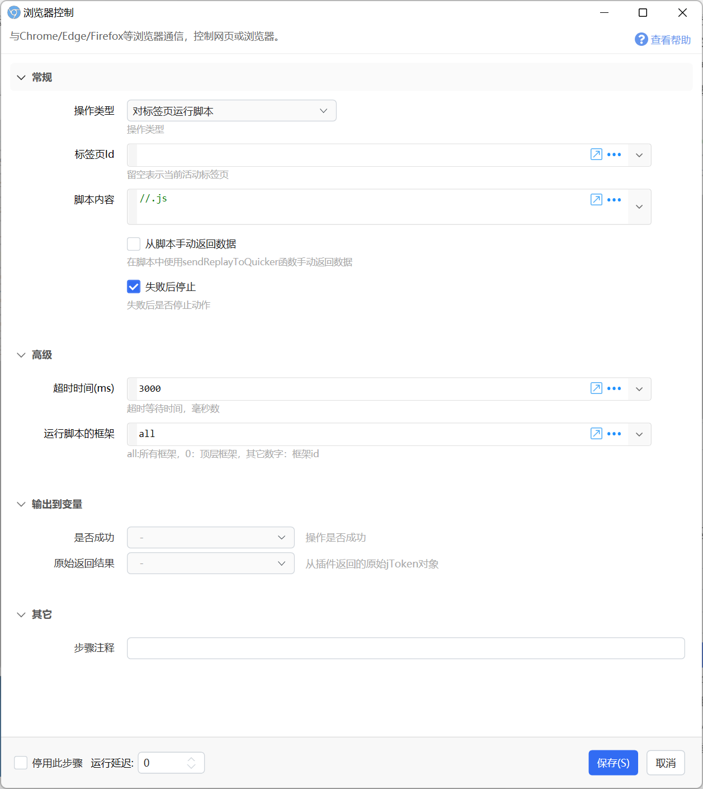


【操作类型】此步骤的目的。

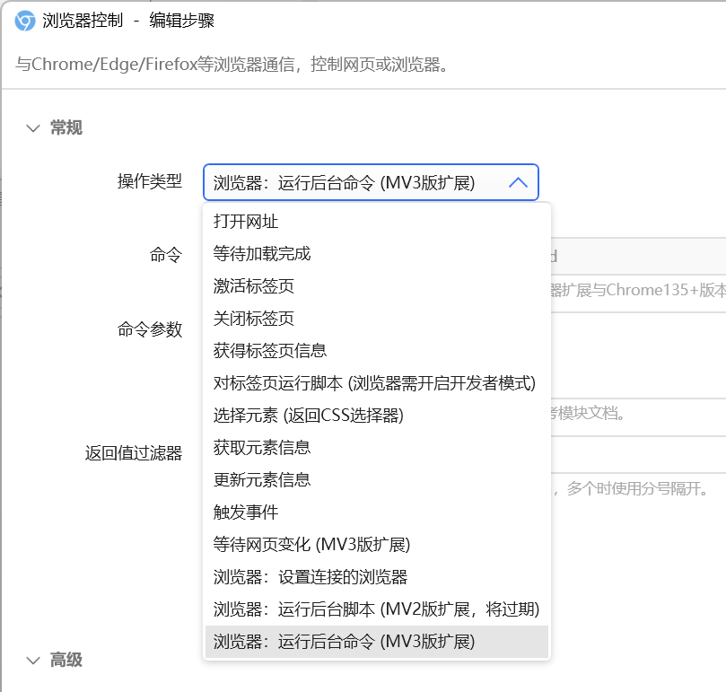

【**标签页ID**】指定要操作的标签页，如果留空，则表示操作当前活动标签页。

在连续多个步骤操作同一个标签页时使用（如：前面的步骤打开了新的标签页，后面的步骤操作此标签页）。


【**选择器**】用于指定要操作的网页元素的[CSS选择器](https://www.runoob.com/cssref/css-selectors.html)。

选择器对于操作网页是极其基础和重要的知识，请务必了解：[https://www.runoob.com/cssref/css-selectors.html](https://www.runoob.com/cssref/css-selectors.html) 同一个元素有多个CSS选择器可以表示，选择其中的一种即可。

获取选择器的方式请参考本文[后面的章节](/v2/xaction/modules/chromecontrol)。


如果需要通过xpath的方式指定元素，以`xpath:`开始，如：

```
xpath://*[@id="lark-text-editor"]/div/div/div[2]/div[1]/div[2]/div[1]/a[11]
```

如果要选择一类元素，比如所有的链接或图片，就需要手写选择器了。


【修正选择器文本】(1.10.3版本提供)从Chrome中复制的选择器文本，如果含有\\字符，需要将其替换成\\\\才能正常定位。此参数可选：

-   自动：自动判断是否需要将\\替换为\\\\。
-   不修正：不替换\\字符。
-   替换\\为\\\\：将\\替换为\\\\。

MV3版本浏览器不再需要此功能。


## 打开网址

打开一个网址，并获得其“标签页id”，以方便后续对此标签页进行其他自动化操作。

如果浏览器未启动，quicker会尝试运行浏览器名称启动浏览器，请确保浏览器程序所在目录已经加入PATH环境变量中。

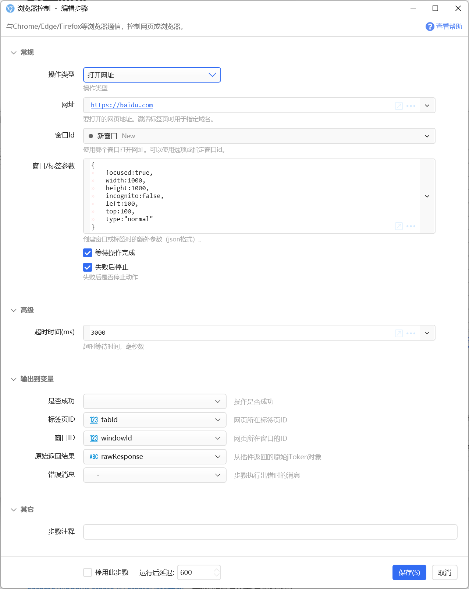

【网址】要打开的完整网址。需要带有协议头（http://或https://）。


【窗口ID】使用哪个窗口打开网址。可选值：

-   新窗口；
-   当前窗口；
-   也可以通过指定窗口id，使用之前打开的窗口。

【窗口/标签参数】可选。

-   使用新窗口时，指定`chrome.windows.create()`方法的参数（除去url属性）。参数请参考Chrome API 文档[chrome.windows.create 的 createData参数](https://developer.chrome.com/extensions/windows#method-create)。示例(所有字段都是可选的)：

```
{
    "left": 100,
    "top": 100,
    "width": 400,
    "height": 400,
    "incognito": true,
    "type": "popup"
}
```

-   不使用新窗口时，指定`chrome.tabs.create()`方法的参数（除去url属性），[参考文档](https://developer.chrome.com/docs/extensions/reference/api/tabs#method-create)。

【等待操作完成】等待网页加载完成（标签页前面不转圈了）。资源比较多的网页加载时间会比较长，有的带有长连接的网页，会一直是加载不完成的状态，后续的操作不一定要等待加载完成。


【超时时间】等待网页加载的时间。


**输出**

【是否成功】操作是否出错。

【标签页ID】新打开的标签页ID号数字。后续如果需要对打开的网页进行操作，需要提供此标签页ID。

【窗口ID】打开新窗口时，输出新打开的窗口的编号。

【原始返回结果】从浏览器插件返回的原始结果反序列化后的[JToken](https://www.newtonsoft.com/json/help/html/T_Newtonsoft_Json_Linq_JToken.htm)对象。JToken可以用来方便的访问Json内容。


**相关后台命令**

对MV3版本扩展，您也可以通过“后台命令”功能创建标签页或窗口。

-   [api\_tabs\_create](https://quickerconnectortests.getquicker.cn/docs/commands.html#api_tabs_create)
-   [api\_windows\_create](https://quickerconnectortests.getquicker.cn/docs/commands.html#api_windows_create)
-   [scripts\_createNewWindowWithUrls](https://quickerconnectortests.getquicker.cn/docs/commands.html#scripts_createNewWindowWithUrls) 创建窗口并打开多个网址


**相关子程序**

-   [切换标签或打开网址](https://getquicker.net/subprogram?id=2e862e5b-3a0e-45ee-b3fc-08db05106307) 如果浏览器中已经打开此网址，则不再打开新的标签页，而是将已有标签页激活。


## 等待加载完成

等待某个标签页的内容加载完成。（标签页的status变为‘**complete**’）

通常用于使用脚本提交了表单等造成页面刷新或表单提交的情况。根据网页资源的多少，加载完成时间可能比较长。

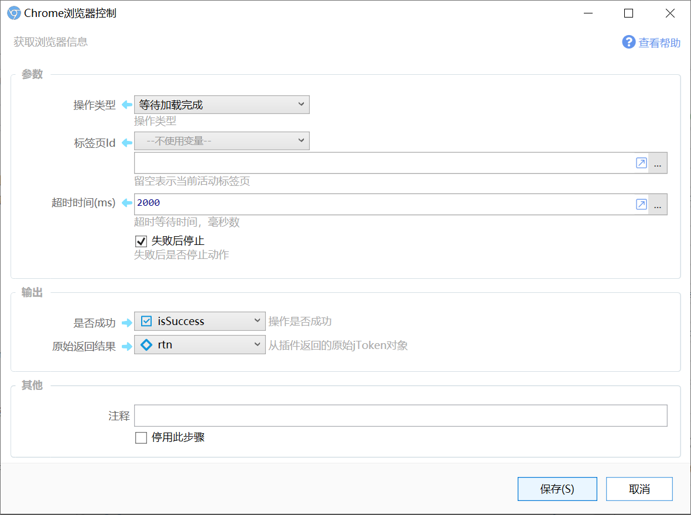

**参数**

【标签页Id】要操作的标签页编号。如果为空，表示当前活动标签页。

【超时时间】等待网页状态变为加载完成状态。

【失败后停止】超时后是否停止动作。注：不是所有的操作都需要彻底加载完成才能继续。


**输出**

【原始返回结果】空。


## 激活标签页

（需MV3版本扩展）

激活（切换到）Chrome浏览器中的特定标签页，并返回标签页信息。它有两种主要的定位标签页的方式：

1.  通过标签ID（`tabId`）：如果提供了有效的标签ID，会直接查找并激活该标签页。
2.  通过【网址】查找标签页并激活。可以传入两种值：

-   如果参数值包含通配符（\*），如`https://*.google.com/foo*bar`，表示是一个[网址匹配模式](https://developer.chrome.com/docs/extensions/develop/concepts/match-patterns)，使用Chrome API的URL匹配功能查找。
-   如果不包含通配符，则查找实际网址包含参数值的标签页。
-   如如果未找到，且参数值是一个常规网址，则会自动创建一个标签页打开此网址。

函数执行成功后，会激活找到的标签页（使其成为当前活动标签）并使其所在的窗口获得焦点。

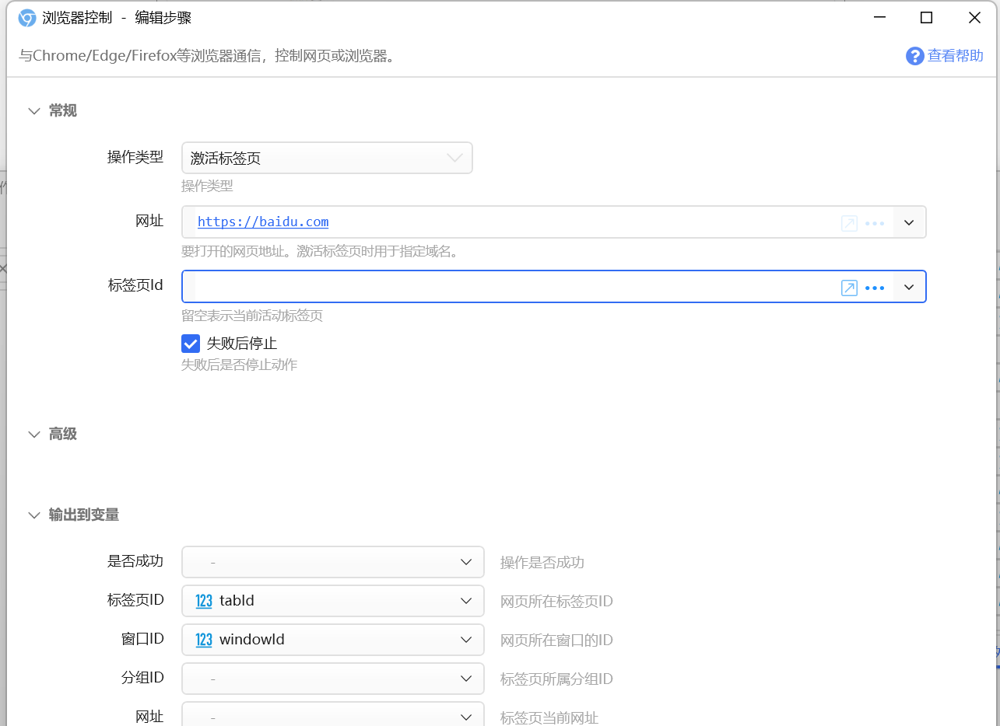


## 获得标签页信息

获得某个标签页的信息。不指定标签页ID时，获取当前活动标签页的信息和扩展本身的信息。

MV3版本扩展中新增输出Manifest版本，可以用以判断是否为新版本扩展、是否支持运行后台脚本。

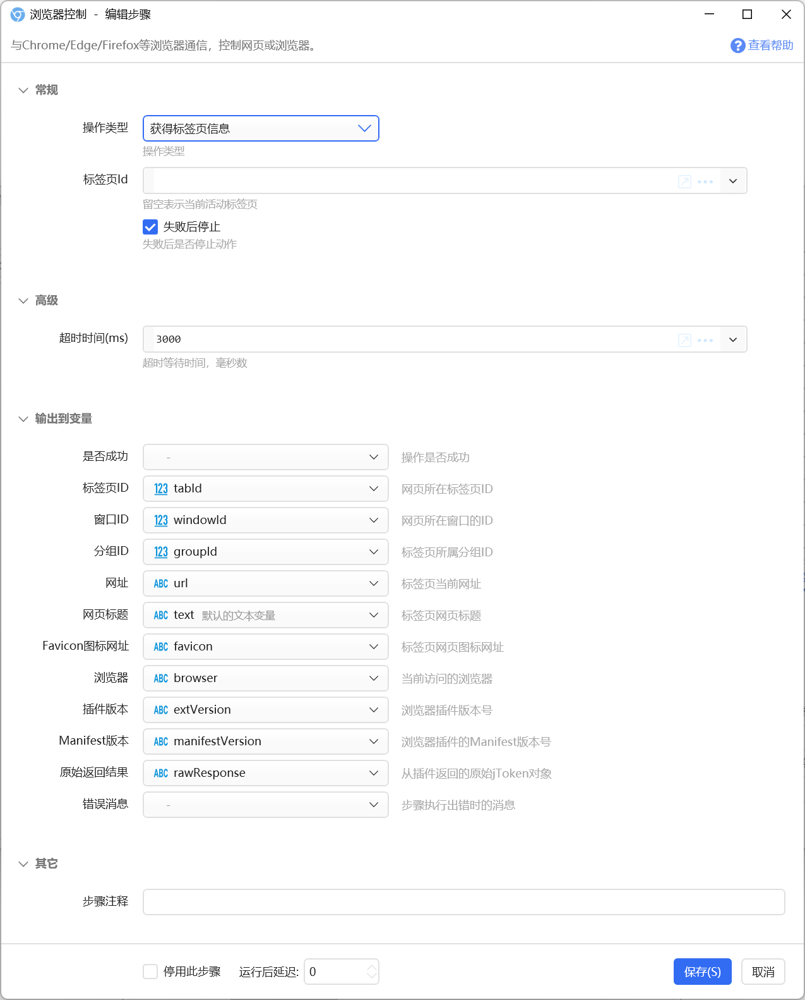


**输入**

【标签页Id】要获取信息的标签页序号。 不填写时表示获取当前活动标签页的信息。


**输出**

【标签页Id】在获取当前活动标签页信息时，得到标签页的Id。

【窗口Id】标签页所在窗口的Id。

【网址】标签页所打开的网址。

【网页标题】网页的标题文字。

【Favicon图标网址】网页图标的网址。

【浏览器】当前连接的浏览器名称，支持chrome/msedge。

【插件版本】浏览器扩展的版本号。

【Manifest版本】返回浏览器扩展的Manifest版本号，值为2或3。

【原始返回结果】当前标签页的[Tab对象信息](https://developer.chrome.com/extensions/tabs#type-Tab)。


## 关闭标签页

关闭指定的标签页。

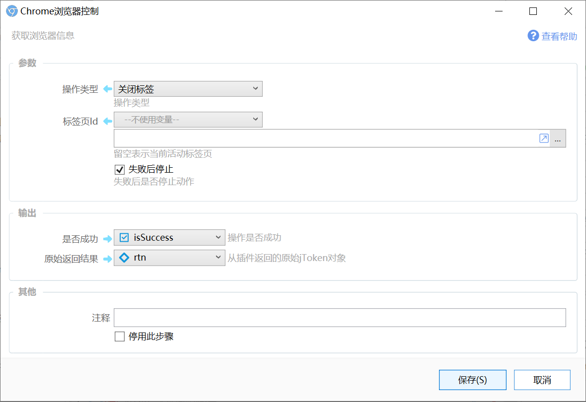


**输入**

【标签页Id】要关闭的标签页。未指定标签页Id时，关闭当前活动标签页。


## 对标签页运行脚本

对指定的标签页网页运行js脚本。

📢MV3版本扩展的重要变化：

-   需要在浏览器扩展设置中开启**开发者模式**或在扩展详情设置中开启**“允许运行用户脚本”**选项（浏览器138以后的版本）才能使用此功能。
-   新增支持“运行环境”参数。使用`MAIN`时，可访问网页中的js变量。

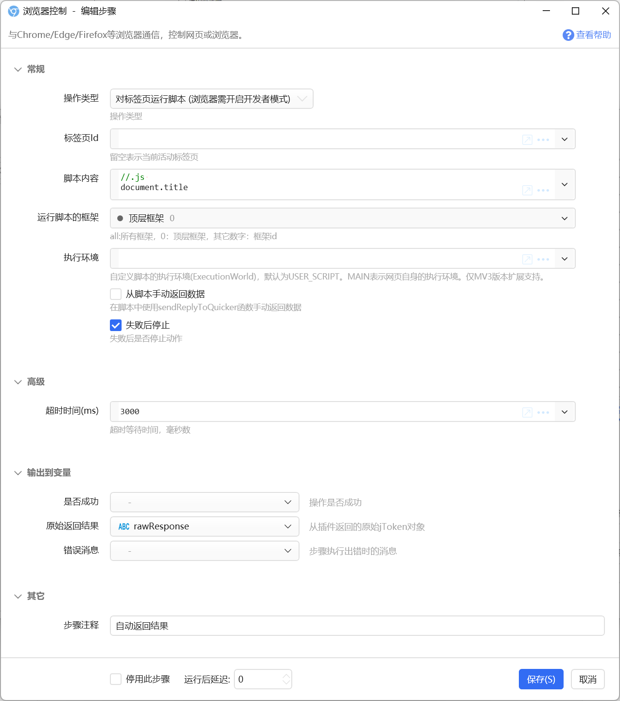

**输入**

【标签页Id】要运行脚本的标签页，未指定时，对当前活动标签页运行脚本。

【脚本内容】要运行的js脚本内容。

-   脚本中可以使用jquery库，如`$('#input')`。
-   最后一个语句的结果将作为值返回。不要写`return`关键词。
-   可使用异步方法或返回Promise。代码将会在Promise得到解析后返回。

js脚本的值通常是脚本中最后一个语句的返回值。

如下面的脚本返回网页的文本内容：

```
document.body.innerText;
```

返回复杂对象：

```
//.js
let result = {name: '张三', age: 20};
result;
```


使用异步方法示例：

```
//.js
// 定义一个等待指定毫秒数的函数，返回一个 Promise
function wait(ms) {
  return new Promise(resolve => setTimeout(resolve, ms));
}

// 异步函数，等待 2 秒后返回字符串
async function fetchValue() {
  console.log('开始等待 2 秒…');
  await wait(2000);  // 暂停 2 秒
  return '这是异步返回的值';
}

fetchValue();
```

【从脚本手动返回数据】有的情况运行脚本不能直接得到结果，需要等到回调函数执行/元素更新等情况，这时候可以开启“从脚本手动返回数据”选项，并在脚本中调用sendReplyToQuicker方法手动返回数据。也可以考虑使用上面的异步方法直接返回结果。

```
// 参数中需要启用“从脚本手动返回数据”选项。
// sendReplyToQuicker(是否成功, '失败时提示消息', 数据对象, 回复的消息序号qk_msg_serial宏)

setTimeout(function(){
  sendReplyToQuicker(
    true,
    'ok',
    {'key':'value','name':'zhangsan'},
    qk_msg_serial
  );
}, 1000);
```

注：脚本中的 `qk_msg_serial` 会被自动替换成消息编号数字。

【超时时间】等待返回结果的最长时间（毫秒数）。

【运行脚本的框架】在哪些frame中运行此脚本。`all`表示所有框架。`0`表示主页面框架。其他数字表示对应的框架序号。

注：默认框架为all。有时候运行脚本超时，可能是有一些框架增加了保护，这时候可以尝试将运行脚本的框架改为0，限制在主框架中运行。

【运行环境】可选，默认为`USER_SCRIPT`。指代码执行的上下文，可选值为`USER_SCRIPT`或`MAIN`。值为`MAIN`时，使用网页自身的上下文执行js代码，此时可访问网页中的全局变量信息。


**输出**

【原始返回结果】js脚本的返回值JToken对象。可以输出给文本变量获得原始json。

实际值是一个数组（JAarry类型），表示每个Frame的运行结果。如果网页只有一个Frame，则该数组只有一项。


## 选择元素

从网页中选择一个HTML元素，返回这个元素的css选择器。通常用于在后续步骤中使用此选择器对目标元素执行操作。

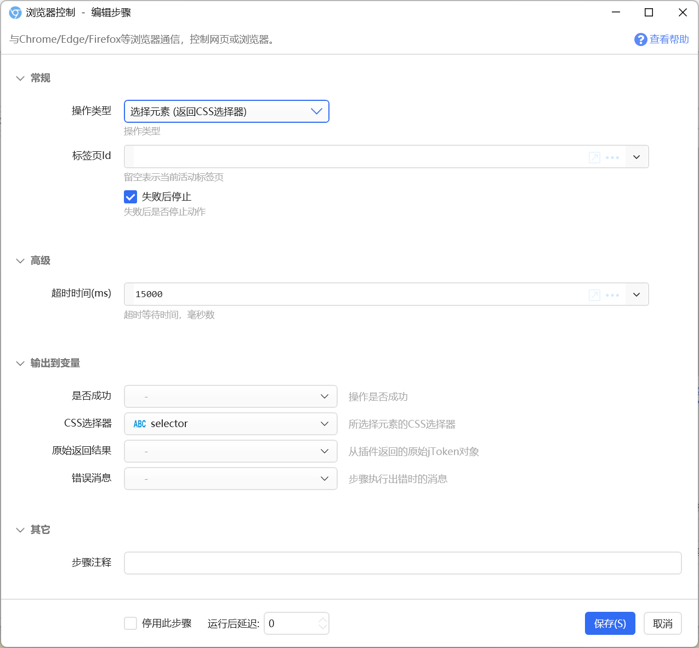


**输出**

【CSS选择器】目标元素的css选择器。

注意：如果网页是变化的，css选择器可能会失效。


## 获取元素信息

获取网页元素的信息。

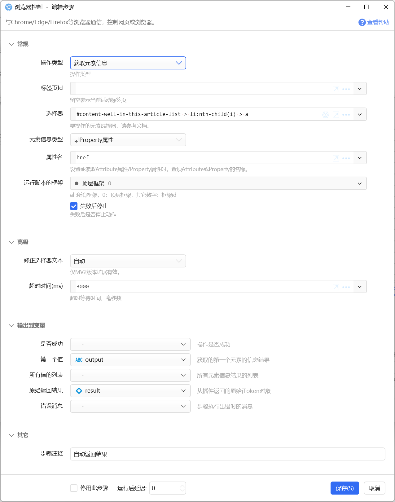

**输入**

【标签页ID】要获取信息的标签页，未指定时，获取前活动标签页中的网页元素。

【选择器】用于选择要操作元素的[CSS选择器](https://www.runoob.com/cssref/css-selectors.html)。


【元素信息类型】要获取元素哪方面的信息。

支持的类型有：

-   值：通过jquery的[val()](https://api.jquery.com/val/)方法获取元素的值。主要用于获取input、select和textarea类型元素的值。要获取选中的radio button或 checkbox的值，需要在选择器中使用**:checked**修饰符，如：

-   select#foo option:checked 获得一个下拉框的选中项的值
-   select#foo 获得一个下拉框的值
-   input\[type=checkbox\]\[name=bar\]:checked 获得某个选中的检查框的值
-   input\[type=radio\]\[name=baz\]:checked 获得某个选中的单选按钮的值

-   某个Attribute属性：通过jquery的[attr()](https://api.jquery.com/attr/)方法获取元素的属性值。attr通常是网页代码里设置的属性值。
-   某个Property属性：通过jquery的[prop()](https://api.jquery.com/prop/)方法获取元素的属性值。prop通常是属性运行时的值，如果链接的网址，在href='/index'的情况下，attr得到的是'/index'，prop得到的是根据当前网址计算得到的完整网址。
-   innerText：元素节点及其后代（子节点）的“渲染”文本内容。此信息通过jquery的[text()](https://api.jquery.com/text/)方法获取。
-   innerHTML：元素内的HTML内容。此信息通过jquery的[html()](https://api.jquery.com/html/)方法获取。
-   outerHTML：包含元素自身的HTML内容。此方法通过DOM元素的[outerHTML](https://developer.mozilla.org/zh-CN/docs/Web/API/Element/outerHTML)属性获得。


【属性名】当要获取的元素信息类型位“某个Attribute”或“某个Property”时，指定属性名。如链接的网址属性为“href”。


**输出**

【第一个值】获取第一个符合选择器条件的元素的指定信息。一般用于取某一个特定元素的信息。

【所有的值】所有符合选择器条件的元素的值的列表。一般用于取某一类元素的信息。


**示例动作**

-   获取网页里的所有链接地址和图片网址：[https://getquicker.net/sharedaction?code=68da9f93-57ee-4465-058e-08d823a26917](https://getquicker.net/sharedaction?code=68da9f93-57ee-4465-058e-08d823a26917)


## 更新元素信息

更新元素某方面的信息。参数输入请参考“[获取元素信息](/v2/xaction/modules/chromecontrol)”。

更新元素时，所有符合“选择器”条件的元素的对应信息都会被更新。


参考文档：[使用浏览器控制的一些示例](/v2/xaction/guides/web-page-control)

示例动作：[用百度特定搜索关键词](https://getquicker.net/Sharedaction?code=9e70fb7f-b85e-4b21-1b7a-08da8ae0e8b9)


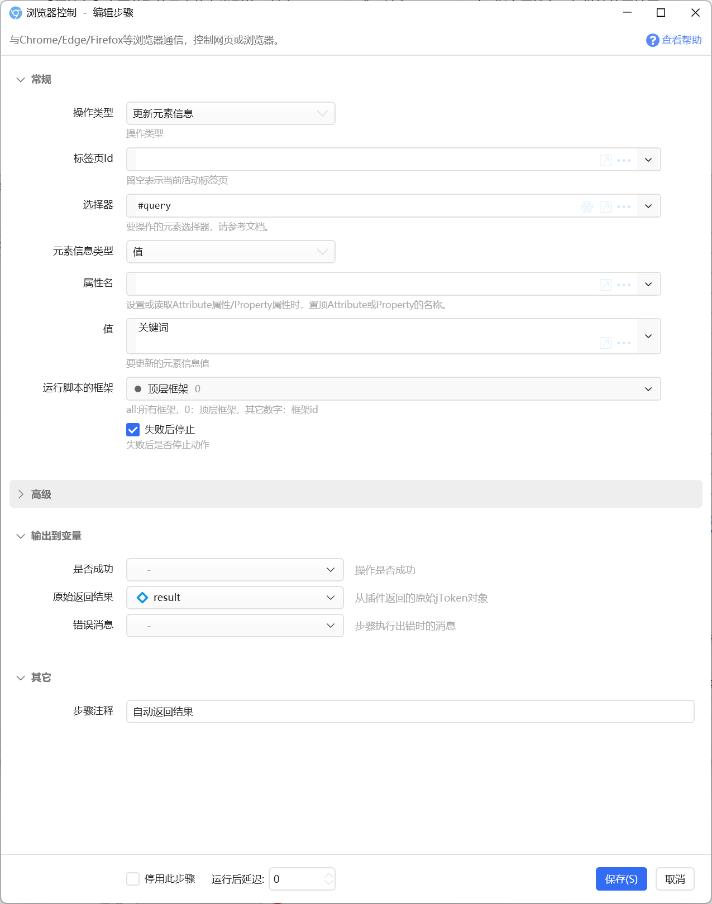


**对于input、textarea等元素**

【元素信息类型】选择“值”，然后在【值】参数中填写目标值即可。


**更新下拉框select元素的值**

首先请确定要设置的选项的值（value）


然后使用“更新元素信息”操作，元素信息类型为“值”


**更新选择检查框和单选框的选择状态**

可以通过更新**checked** 的属性（Property）选择或取消选择checkbox 或 radio 的选择状态。


更早的版本，可以使用在对标签页运行js代码：

```
$('选择器').prop('checked', true);  //选择检查框
$('选择器').prop('checked', false);  //取消选择
```

需要使用input元素本身的选择器来更新选中状态。


## 触发事件

对指定的元素触发事件，如实现点击按钮、设置焦点、提交表单、触发变更等功能。

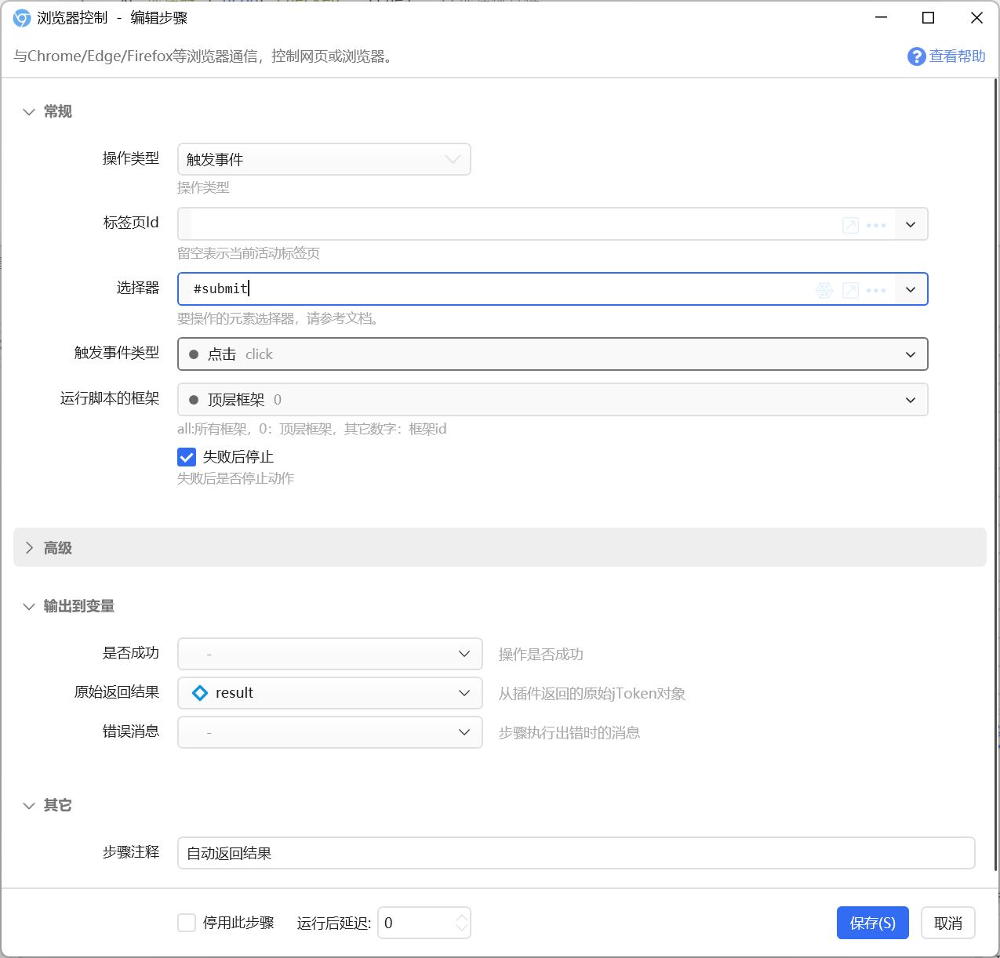

**输入**

【标签页ID】要操作的标签页，未指定时表示操作当前活动标签页。

【选择器】要操作的网页元素。

【触发事件类型】要触发的事件。可以选择预置的事件，也可以直接写事件名称。

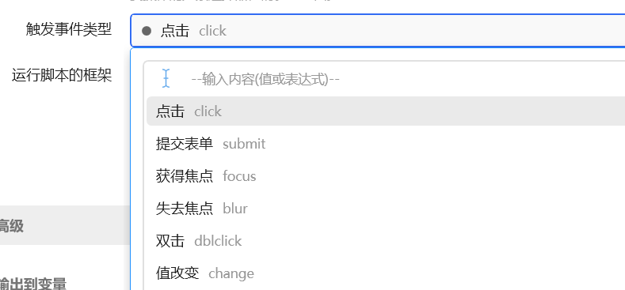

或指定自定义的事件类型。


-   支持以`native.`前缀表示使用javascript原生`dispatchEvent`方式触发事件。如`native.focus`表示`.dispatchEvent(new Event('focus') )`。
-   `change`事件使用`dispatchEvent`方式触发。
-   `click`事件直接调用DOM的[click()方法](https://developer.mozilla.org/zh-CN/docs/Web/API/HTMLElement/click) 实现。
-   其它事件通过[jquery.trigger()](https://api.jquery.com/trigger/)方法实现。
-   提交表单时，需要使用form元素本身的选择器。


## 等待网页变化

(MV3版本扩展新增功能）

等待动态网页发生特定的变化，比如某个元素出现或消失、某个文字出现或消失等。

本功能仅适用于不会跳转到新页面的网页（因为新页面会造成嵌入的js代码丢失）。

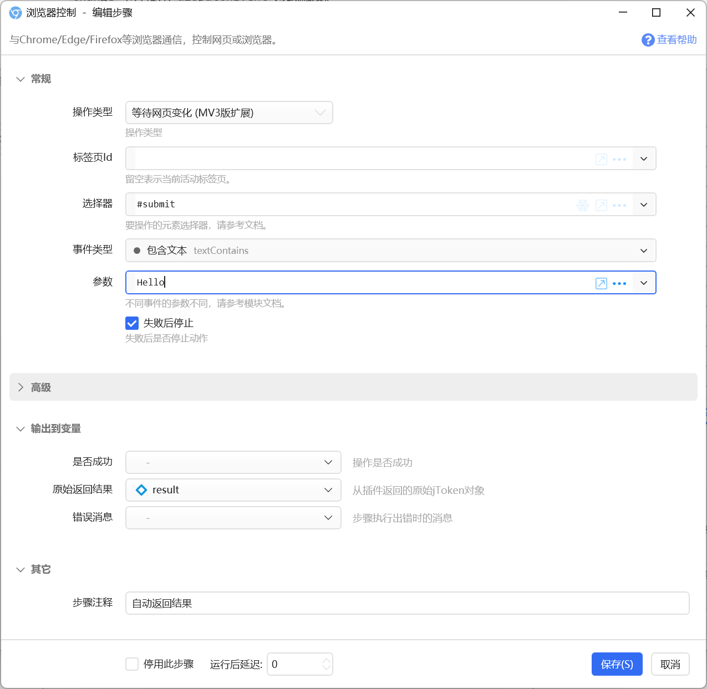

【选择器】所需要判断的目标元素。

【事件类型】要等待的事件类型，见下表。

【参数】对于某些事件，需要指定参数。

| 事件名称 | 事件说明 | 参数说明 | 示例参数 |
| --- | --- | --- | --- |
| elementExists | 元素存在 | 不需要参数 | \- |
| elementNotExists | 元素不存在 | 不需要参数 | \- |
| elementVisible | 元素在网页可见 | 不需要参数 | \- |
| elementNotVisible | 元素在网页不可见 | 不需要参数 | \- |
| elementClickable | 元素可点击 | 不需要参数 | \- |
| elementNotClickable | 元素不可点击 | 不需要参数 | \- |
| textContains | 包含文本 | 字符串类型，表示要查找的文本内容 | `登录` |
| textNotContains | 不包含文本 | 字符串类型，表示不应包含的文本内容 | `错误` |
| textMatches | 文本匹配表达式 | 正则表达式字符串 | `用户\d+` |
| textNotMatches | 文本不匹配表达式 | 正则表达式字符串 | `error\s:` |
| urlMatches | 网址匹配表达式(PWA应用) | 正则表达式字符串 | `login\.html` |
| urlNotMatches | 网址不匹配表达式(PWA应用) | 正则表达式字符串 | `error\.html` |
| titleMatches | 标题匹配表达式(PWA应用) | 正则表达式字符串 | `主页\s-` |
| titleNotMatches | 标题不匹配表达式(PWA应用) | 正则表达式字符串 | `加载中` |
| attributeMatches | 属性匹配表达式 | 格式为"属性名:正则表达式" | `data-status:success` |
| attributeNotMatches | 属性不匹配表达式 | 格式为"属性名:正则表达式" | `aria-disabled:true` |
| elementHasClass | 元素包含类名 | 字符串，表示要检查的类名 | `active` |
| elementNotHasClass | 元素不包含类名 | 字符串，表示不应存在的类名 | `disabled` |
| elementHasAttribute | 元素包含属性 | 字符串，表示要检查的属性名 | `checked` |
| elementNotHasAttribute | 元素不包含属性 | 字符串，表示不应存在的属性名 | `disabled` |
| elementCountGt | 元素数量大于 | 数字，表示元素数量的下限 | `5` |
| elementCountLt | 元素数量小于 | 数字，表示元素数量的上限 | `10` |
| elementCountEq | 元素数量等于 | 数字，表示期望的确切元素数量 | `3` |
| elementEvent | 元素事件触发 | 字符串类型，表示要监听的事件名称 | `click` |

【超时时间】最长等待时间。


## 设置连接的浏览器

设置当前动作要控制的浏览器。后续步骤的浏览器控制将会使用此浏览器。

如果总是操作前台窗口浏览器，不需要使用此步骤。


## 运行后台命令


通过调用浏览器API，实现对浏览器自身的控制。

分为两个大类：

-   以`api_`前缀开始的命令，是对浏览器API的封装。如`api_tabs_create`对应于`chrome.tabs.create()`方法。
-   以`scripts_`前缀开始的命令，是一些预先写好的后台脚本。

后台命令参考：

-   [在线文档](https://quickerconnectortests.getquicker.cn/docs/commands.html)
-   扩展内置文档：1）点击浏览器扩展图标；2）点击“文档”；3）进入后点击“后台命令参考”链接。
    


步骤截图：

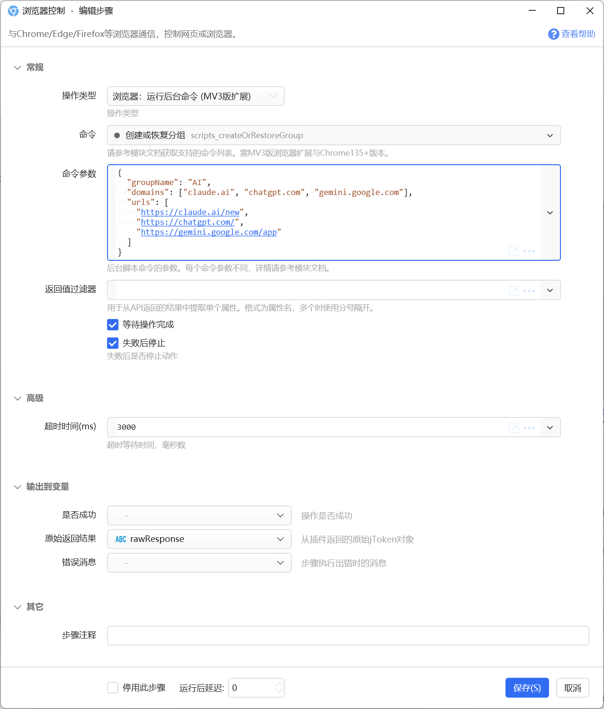

**参数**

【命令】要执行的后台命令。

【命令参数】根据需要填写给该命令传入的参数。

-   对于需要`tabId``tabIds``windowId``groupId`参数的命令，通常可以**省略**这些参数，表示当前标签页id、当前标签页所在窗口id、当前标签页所在分组id。

指定参数值的方法：

1）直接传递json文本。

2）使用表达式创建匿名c#对象，如：

```
$= new {
    tabId = {数字变量},
    updateProperties = new {
        mute = true
    }
}
```


【等待操作完成】如果需要返回值，请选择此项。

【返回值过滤器】对于命令返回的数据，如果仅需要其中一部分属性，可以设置本参数。参数值为分号隔开的属性名。如，下面的步骤返回所有打开的网址：

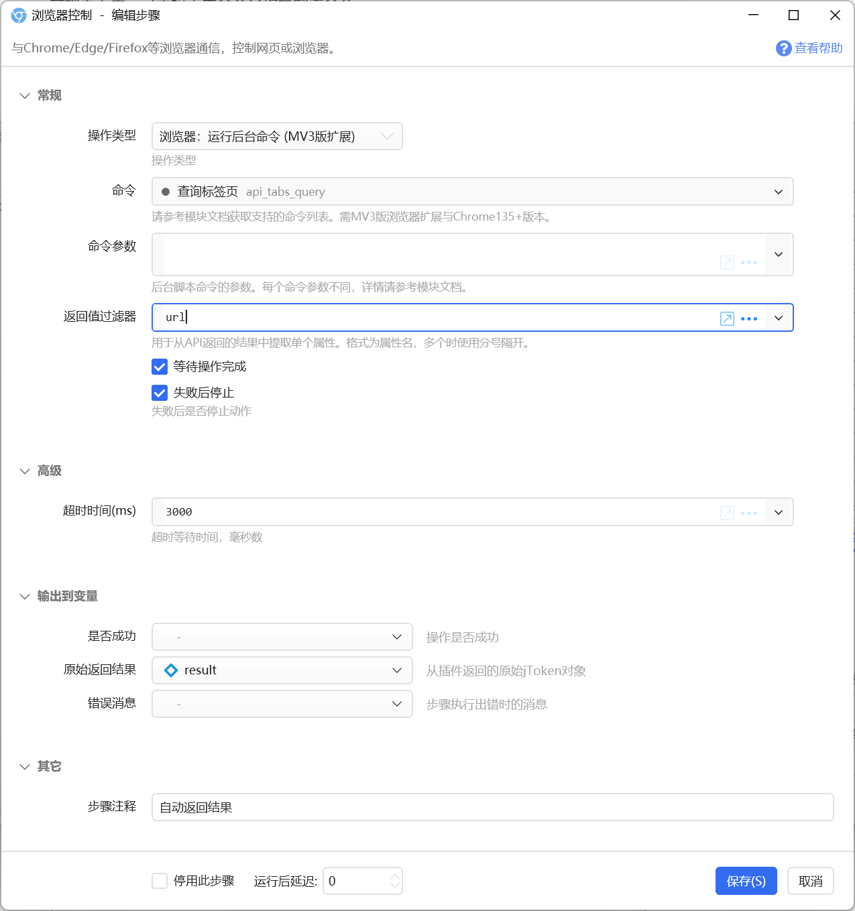


示例动作：

-   [测试后台命令 - by CL - 动作信息 - Quicker](https://getquicker.net/Sharedaction?code=64f1cc94-8261-4e3e-d379-08dd85c4ca35)


### 使用后台命令实现后台脚本相关功能

后台脚本与后台命令的区别如下：

-   后台脚本可以多次调用浏览器API，实现完整的自定义逻辑。
-   后台命令每次只能调用一个API，可以看做使用了一次`await`方式调用API，因此可能需要多次调用后台命令实现原有单个后台脚本的功能。


## 运行后台脚本

🚨 MV3版本浏览器扩展已不支持此功能。相关需求请使用“运行后台命令”功能实现。

1.44.10+版本实现了在MV3扩展上执行后台脚本的功能，此功能可继续使用。如果您在使用后台脚本的时候遇到了问题，欢迎在讨论区反馈，谢谢！

### 迁移后台脚本动作

可以在Quicker 1.44.5+版本搜索框搜索“CONTAINS:BackgroundScript”查找使用后台脚本功能的动作。


如需兼容MV2版本扩展，可通过“获取标签页信息”得到Manifest版本号。 然后判断如果Manifest版本为3，则使用后台命令，否则使用后台脚本。


示例动作：[查看Cookie - by CL - 动作信息 - Quicker](https://getquicker.net/Sharedaction?code=287ef444-8487-471d-e118-08d82862a3c3)


### 后台脚本的编写

#### MV2版本扩展(0.7.4版本，即将不被支持)

使用回调方式调用chrome API，完成对浏览器的控制。具体API，请参考[官方文档](https://developer.chrome.com/docs/extensions/mv2/reference)。

下面的示例用于获取当前标签页中网址的cookie。

```
chrome.tabs.query({ lastFocusedWindow: true, active: true }, function (tabs) {
    if (tabs.length < 1) {
        sendReplyToQuicker(false, '未找到当前页', {}, qk_msg_serial)
    }

    var url = tabs[0].url;

    chrome.cookies.getAll({
        url: url
    }, function (cookies) {
        sendReplyToQuicker(true, 'ok', cookies, qk_msg_serial)
    });

});
```

#### MV3版本扩展(1.0.0+版本)

由于MV3已经不支持直接运行自定义的后台脚本，MV3版本的扩展通过兼容方式实现后台脚本功能。其原理是，在quicker进程解析脚本，在遇到API调用时，转换成后台命令发送到浏览器执行并返回数据。

在MV3版本中，除了支持MV2中的回调模式，自Quicker **1.44.12+**版本，也支持异步方式调用。用异步模式可以大幅简化代码。上述获取cookie的脚本可使用异步方式编写：

```
//.js
const tabs = await chrome.tabs.query({ lastFocusedWindow: true, active: true });

if (tabs.length < 1) {
  throw new Error('未找到当前页');
}

const url = tabs[0].url;

// 获取cookies
return await chrome.cookies.getAll({ url: url });
```

此时，不需要再调用`sendReplyToQuicker`方法，直接在末尾return目标值即可。

MV3版浏览器API请参考[官方文档](https://developer.chrome.com/docs/extensions/reference/api)。

注意：

-   Quicker浏览器扩展仅申请了一些常用功能的权限，通过后台命令封装了一部分API，因此不是所有的API都可以调用。具体可参考后台命令了解可使用的API。
-   由于quicker的内置js环境，可能会缺少一些浏览器中支持的类型，因此，不一定所有脚本都可以正常运行，如果您遇到问题，请反馈。
-   异步方式时，请确保代码内不包含`sendReplyToQuicker`方法。

### 从后台脚本返回内容


**1）选中“等待操作完成”选项。**


**2）返回结果**

【使用异步方式async/await时】，请直接在代码末尾return 目标值。遇到错误时可throw new Error('message')。

【使用回调方式时】在脚本内容中使用`sendReplyToQuicker(isSuccess, message, data, qk_msg_serial)` 返回自定义内容（0.3.0版本插件+1.9.3版本Quicker）。

-   isSuccess：表示操作是否成功，布尔类型，可选值true/false。
-   message：消息内容。在操作失败时返回错误消息。
-   data：返回的数据内容。
-   qk\_msg\_serial：quicker的消息序号。在执行脚本时会被添加到window窗口，所以在脚本中直接写此变量名即可。

```
//.js  获取当前窗口的所有网址。动作网址：
chrome.windows.getLastFocused({populate:true}, function(win){
    var urlList = win.tabs.map(x=>x.url);
    sendReplyToQuicker(true, "ok", urlList, qk_msg_serial)
});
```

返回数据的示例动作：

-   返回当前窗口的所有标签页网址 [https://getquicker.net/sharedaction?code=e0e854ea-5d36-4dd9-14fc-08d8255d6cc9](https://getquicker.net/sharedaction?code=e0e854ea-5d36-4dd9-14fc-08d8255d6cc9)
-   返回TopSites（常用网址。需开通topSites权限）：[https://getquicker.net/sharedaction?code=a17f1c61-26b5-4013-14ff-08d8255d6cc9](https://getquicker.net/sharedaction?code=a17f1c61-26b5-4013-14ff-08d8255d6cc9)


**3）输出返回结果**

在脚本中使用sendReplyToQuicker返回的data参数，如果是object类型，将会直接返回；

如果对象是简单类型（如数字、字符串等），会封装为一个对象返回（MV3版本扩展不再封装，而是直接返回）：

```
{
  "data":qk_bgmsg_result
}
```


输出结果为JToken对象。请参考后面的“从JToken提取数据”章节。


其他后台脚本示例动作：

-   关闭左侧标签页：[https://getquicker.net/sharedaction?code=315a8235-e00a-4b89-8236-08d8246a94ad](https://getquicker.net/sharedaction?code=315a8235-e00a-4b89-8236-08d8246a94ad)
-   弹出此页：[https://getquicker.net/sharedaction?code=bed4a309-2d20-47cb-8238-08d8246a94ad](https://getquicker.net/sharedaction?code=bed4a309-2d20-47cb-8238-08d8246a94ad)


## 将动作关联到浏览器右键菜单

-   浏览器右键菜单不支持显示图标。
-   本功能使用了[chrome.contextMenus API](https://developer.chrome.com/docs/extensions/reference/contextMenus/)，更多信息可参考谷歌官方文档。


可以将动作关联到浏览器右键菜单中，效果如下图所示：


**设置方法**

-   编辑动作。
-   在动作的“关联”标签页中，点击“浏览器右键菜单”下面的“设置...”按钮（1）。
-   在弹出的窗口设置各项参数：

-   【关联上下文】设置什么地方的右键菜单出现此项（[官方文档](https://developer.chrome.com/docs/extensions/reference/contextMenus/#type-ContextType)），如`selection`是指在选中的内容上的右键菜单中出现此项，`all`表示在大部分情况下都出现此此项。
-   【匹配网址】设置匹配的网址条件。`*://*/*`表示不限制。注意这里的匹配不是正则匹配，具体可参考[官方文档](https://developer.chrome.com/docs/extensions/mv3/match_patterns/)。
-   【匹配目标地址】匹配img、video、audio的src，或者链接的href地址。匹配方式同上。
-   【动作参数】需要传递给动作的参数内容。使用`%s`可以表示浏览器中选择的文本内容。


设置完成后需重新连接浏览器方可生效。可重启浏览器或Quicker，或在“修复浏览器扩展连接”窗口中点击“更新右键菜单”按钮。


动作关联到浏览器右键菜单时，通过菜单触发动作，可以在表达式中通过\_context.ExtraData.BrowserMenuClickData 获取菜单点击上下文信息。能获取到的数据可参考[chrome API文档](https://developer.chrome.com/docs/extensions/reference/contextMenus/#type-OnClickData)。 使用场景：获取右键点击的图片、视频、链接的网址等。

示例动作：[https://getquicker.net/Sharedaction?code=d1650c2d-f913-4959-3931-08d9f928b257](https://getquicker.net/Sharedaction?code=d1650c2d-f913-4959-3931-08d9f928b257)


## 排错

### 查看日志


#### 查看背景页面控制台信息

在浏览器扩展页面中开启“开发者模式”。然后点击扩展的“背景页”


在背景页的控制台可以看到一些log输出。


#### 查看ChromeAgent日志

ChromeAgent.exe是与浏览器通信的中间件程序，由浏览器启动。ChromeAgent启动后会主动连接Quicker。

为避免更新Quicker软件时文件被锁定，ChromeAgent.exe将会在Quicker安装后首次启动时，由Quicker程序复制到应用数据文件夹下并注册。位置为：`Quicker应用数据文件夹\bin\NativeMessageHost`（一般为：C:\\Users\\用户名\\AppData\\Local\\Quicker\\bin\\NativeMessageHost）


log文件的存储位置为`Quicker应用数据文件夹\logs`，文件名为`quickerhost_浏览器名称.log`


## 扩展连接问题排查


如果消息代理未连接，请参考如下顺序排查：

0）请确保浏览器已开启开发者模式。

1）确认您的扩展是从官方商店安装。 如果以crx方式安装，请直接拖动到扩展管理界面中完成安装，不要解压缩。

2）确认Quicker未使用管理员身份方式运行。

-   确认未设置Quicker.exe等相关程序使用兼容模式，未选择以管理员身份运行选项。
    
-   确认系统UAC为默认状态。
    

3）确认环境变量ComSpec存在


4）确认C:\\Windows\\System32\\cmd.exe文件存在，通过Win+R可正常运行cmd.exe命令。


5）尝试修复扩展连接：


6）控制台的默认代码页为正常值。（现象：消息代理一会儿可以连上又马上自动断开）


7）如果有任何安全、管家类软件，彻底退出后测试排查。

[腾讯管家](https://getquicker.net/KC/Kb/Article/1118)的某些版本可能会影响扩展正常链接，卸载管家后测试。（正常后可重新下载安装管家最新版解决。）

8）如果仍然无法连接，请联系CL。

## 其它信息


### 如何获取页面元素的CSS选择器或XPATH

注：同一个元素可以有多种CSS选择器表示方式。

有很多获取CSS选择器的方法：

（1）通过浏览器获取

在网页中安Ctrl+Shift+C开启选择模式(F12关闭)，选择节点后，在开发工具窗格中元素上右键，复制选择器。


（2）Quicker扩展右键菜单


（3）第三方浏览器扩展，如ChroPath、SelectorsHub。


### 组件构成

**Quicker**：发送指令并获取返回结果；

**ChromeAgent.exe**：消息代理程序，连接Quicker和浏览器插件。会在Quicker安装或升级版本后首次启动时拷贝到“应用数据文件夹\\bin\\NativeMessageHost”子文件夹下。

**Chrome浏览器插件**：负责接收指令、执行指令，并返回结果。


### 从JToken中提取信息

注意：

-   对标签页运行脚本，返回的结果是数组，表示每个Frame框架中的运行结果。
-   运行后台脚本返回的是通过qk\_bgmsg\_result变量设置的object类型的结果或者封装的&#123;data: qk\_bgmsg\_result&#125;封装的简单值结果。


[JToken](https://www.newtonsoft.com/json/help/html/T_Newtonsoft_Json_Linq_JToken.htm)可以在表达式中使用 **\[数组的序号\]** 和 **\[对象的属性名\]** 访问到某个值，然后通过.ToString() 方法得到文本。

下图的表达式，得到了返回结果数组第0个对象的title属性的值。


也可以使用[SelectToken](https://www.newtonsoft.com/json/help/html/SelectToken.htm)获取对象（或SelectTokens获取数组）。


也可以获取其原始类型的值（根据实际的类型），下面的表达式得到 "val" 属性的整数值：


### 如何开启浏览器的开发者模式

“对标签页运行脚本”需要开启浏览器开发者模式(浏览器138之前版本)或对扩展开启“允许运行用户脚本”(浏览器138之后的版本)。

开启“允许运行用户脚本”选项的步骤：

1）打开扩展详情页面：在扩展按钮上右键，选择“管理扩展程序”


2）开启选项


开启开发者模式请参考如下步骤设置：

1）打开浏览器扩展管理页面。


2）在右上角，点击打开开发者模式。


3） 重启Quicker Connector扩展。


### 参考文档

-   HTML教程：[https://www.w3school.com.cn/html/index.asp](https://www.w3school.com.cn/html/index.asp)
-   CSS选择器：[https://www.w3school.com.cn/cssref/css\_selectors.asp](https://www.w3school.com.cn/cssref/css_selectors.asp)
-   Javascript教程：

-   [https://www.w3school.com.cn/js/index.asp](https://www.w3school.com.cn/js/index.asp)
-   [https://www.runoob.com/js/js-tutorial.html](https://www.runoob.com/js/js-tutorial.html)
-   [https://www.liaoxuefeng.com/wiki/1022910821149312](https://www.liaoxuefeng.com/wiki/1022910821149312)

-   JQuery教程：

-   [https://www.runoob.com/jquery/jquery-tutorial.html](https://www.runoob.com/jquery/jquery-tutorial.html)
-   [https://www.liaoxuefeng.com/wiki/1022910821149312/1023022609723552](https://www.liaoxuefeng.com/wiki/1022910821149312/1023022609723552)

-   Chrome开发文档：

-   API：[https://developer.chrome.com/extensions/api\_index](https://developer.chrome.com/extensions/api_index)
-   API文档国内镜像：[http://docs.getquicker.cn/chrome/developer.chrome.com/extensions.html](http://docs.getquicker.cn/chrome/developer.chrome.com/extensions.html)

## 更新说明

-   20230207 增加无法连接问题排查。
-   20230203 增加切换标签或打开网址的子程序链接。
-   20230316 增加触发事件支持native方式的说明。
-   20231015 去除创建新窗口时的实例参数中active字段（浏览器不支持）。
-   20231203 更新显示在浏览器右键菜单的匹配网址说明。
-   20240529 修正拼写。
-   20250203 完善连接排查中Quicker未使用管理员身份运行的检查说明。
-   202505 更新MV3版本浏览器扩展。
