# 浏览器控制

通过 Quicker 动作控制 Chrome / Edge / Firefox 等浏览器或当前网页。灵活使用需要一定的 HTML / CSS / JavaScript / jQuery 知识。只要读取当前标签网址，用 [获取浏览器网址](/v2/xaction/modules/getchromeurl)。

## 当前模块定义

<XActionModuleMeta moduleKey="sys:chromecontrol" />

## 概述

### MV3 版本浏览器扩展

目前进展：

- Chrome / Edge 均已发布 1.0.0 版扩展。
- 1.0.1 已提交审核，主要解决 XPath 支持和网页浮标不能保存位置。

参考：

- [浏览器扩展升级的相关问题](https://mp.weixin.qq.com/s/iKq88JGN8CrSUYX3n457dg)（公众号）
- [什么是 MV3？升级有哪些影响？](https://getquicker.net/KC/Kb/Article/1156)

MV3 的重要变化：

- 不再支持「运行后台脚本」（已通过 PC 端解析脚本兼容）。
- 「对标签页运行脚本」需要开启浏览器开发者模式（Chrome 138 之前），或在扩展详情里开启「允许运行用户脚本」（Chrome / Edge 138 及以后）。设置步骤见 [设置浏览器扩展](/v2/xaction/guides/chrome-ext-settings)。
- 需要 Chrome / Edge 135+。目前不支持 Firefox。
- 需要 Quicker 1.44.5+。

MV3 新增：

- **后台命令**：替代部分「运行后台脚本」。包含常用浏览器 API 封装和常用功能。命令列表见 [后台命令参考](https://quickerconnectortests.getquicker.cn/docs/commands.html)。
- **激活标签页**：按网址或 ID 激活；不存在则自动打开。
- **等待网页变化**：等元素或文字出现、消失等。
- 对标签页运行脚本可选 `MAIN` 执行环境，访问网页 JS 变量。
- 增加标签页分组 API。

**延期使用 MV2**

Chrome 已开始禁用 MV2。如需继续使用，可通过注册表开启（预计约 1 年有效期）。点击下面按钮导入注册表后重启浏览器：

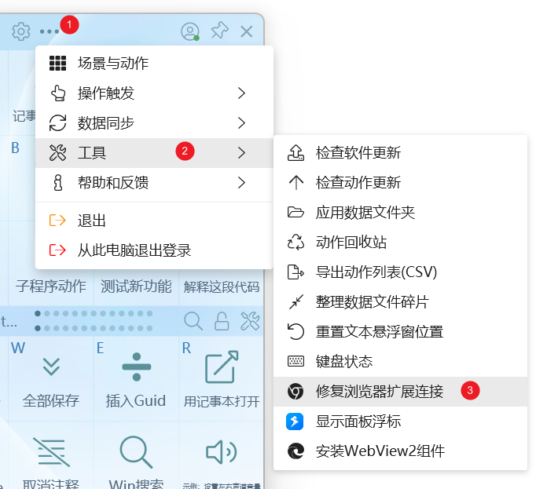

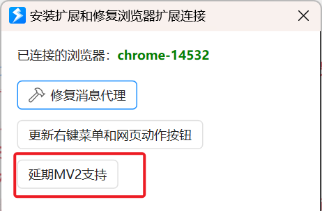

### 安装浏览器扩展

请从 [网站下载页面](https://getquicker.net/Download) 获取各浏览器的扩展地址或 crx。方便的话请在商店给扩展评分，有助于更新审核。

「紫鸟」浏览器需自行联系客服加白名单后才能用 Quicker 扩展。

### 界面说明

点击扩展图标会显示弹窗。

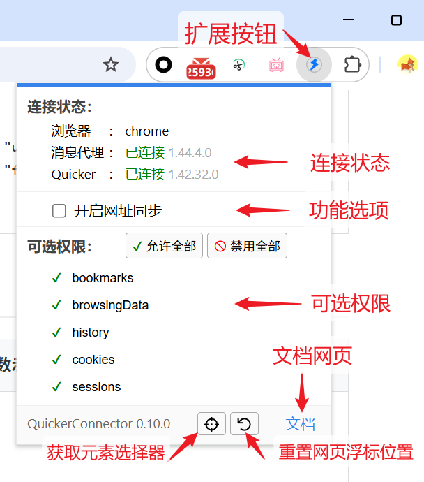

**连接状态**：是否连上消息代理和 Quicker。

- 两个已连接：正常。
- 消息代理已连接、Quicker 未连接：可能 Quicker 未启动或版本过旧（需 1.29.3+）。
- 两者都未连接：未安装 Quicker 或版本过旧。

**功能选项**

- **开启网址同步**：为后期基于网址的动作页预留，目前不要开启。

**可选权限**

- 要跑需要特殊权限的后台脚本时，在这里开启（直接通过 chrome API 控制浏览器自身，如浏览历史、Cookie）。

**文档**：打开扩展文档。MV3 把部分文档嵌进扩展，包括「后台命令参考」「更新历史」。

**获取元素选择器**：在网页里点选一个元素，自动复制它的 CSS 选择器。

**重置网页浮标位置**：把浮标恢复到默认位置。

### 多浏览器支持

- Quicker 可同时连接不同类型的浏览器（按进程名判断），如同时连 Chrome / Edge / Firefox / Vivaldi。
- 暂不支持同一个浏览器用 `--user-data-dir` 跑多个副本。多 Profile 的区分见 [一个浏览器多个 Profile](/v2/xaction/guides/browser-multiprofile)。

动作里第一次跑到「浏览器控制」时，Quicker 按前台窗口进程决定连接哪个浏览器，后续步骤沿用。

若第一次运行时前台不是已连接的浏览器，则使用配置里的「默认连接的浏览器」。

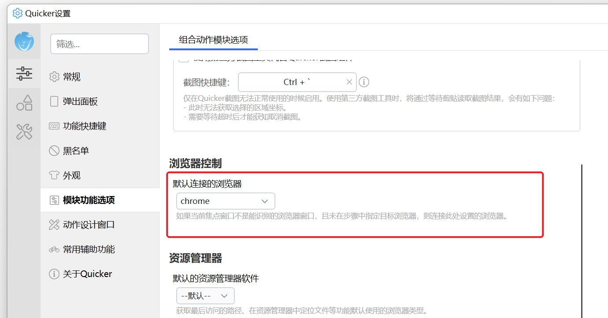

也可在其它浏览器步骤之前加一步「设置连接的浏览器」。

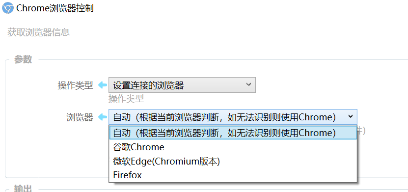

## 通用参数

操作类型不同，显示的参数也不同。

<ModuleParamPreview
  moduleKey="sys:chromecontrol"
  focusKeys={[
    'operation',
    'tabId',
    'script',
    'waitManualReturn',
    'stopIfFail',
    'timeoutMs',
    'frame',
    'isSuccess',
    'rawResponse',
  ]}
  values={{
    operation: 'RunScript',
    tabId: '',
    script: '//.js',
    waitManualReturn: 'false',
    stopIfFail: 'true',
    timeoutMs: '3000',
    frame: 'all',
  }}
/>

**操作类型**：此步骤要做的事。

<ModuleParamPreview
  moduleKey="sys:chromecontrol"
  focusKeys={['operation']}
  values={{operation: 'BackgroundCommand'}}
/>

**标签页Id**：要操作的标签页。留空表示当前活动标签页。连续多步操作同一标签时使用（例如前面刚打开的新标签）。

**选择器**：要操作的网页元素的 [CSS 选择器](https://www.runoob.com/cssref/css-selectors.html)。同一个元素可以有多种写法，选一种即可。获取方式见文末「如何获取 CSS 选择器」。

若用 XPath，以 `xpath:` 开头，例如：

```text
xpath://*[@id="lark-text-editor"]/div/div/div[2]/div[1]/div[2]/div[1]/a[11]
```

要选一类元素（所有链接、所有图片）需要手写选择器。

**修正选择器文本**（1.10.3+，仅 MV2）：从 Chrome 复制的选择器若含 `\`，需要换成 `\\` 才能定位。

- **自动**：自行判断是否替换
- **不修正**
- **\\替换为\\\\**

MV3 不再需要此项。

**失败后停止**：失败后是否中止动作。默认开启。

**超时时间(ms)**：等待上限，默认 `3000`。

**原始返回结果**：插件返回的原始 [JToken](https://www.newtonsoft.com/json/help/html/T_Newtonsoft_Json_Linq_JToken.htm)。提取方法见文末。

## 打开网址

打开一个网址，并得到 **标签页ID**，方便后续操作该标签。浏览器未启动时，Quicker 会按浏览器名称尝试启动，请确保浏览器目录已加入 PATH。

<ModuleParamPreview
  moduleKey="sys:chromecontrol"
  focusKeys={[
    'operation',
    'url',
    'windowId',
    'windowInfo',
    'waitComplete',
    'stopIfFail',
    'timeoutMs',
    'isSuccess',
    'tabId',
    'rawResponse',
  ]}
  values={{
    operation: 'OpenUrl',
    url: 'https://baidu.com',
    windowId: 'New',
    windowInfo: `{
  focused: true,
  width: 1000,
  height: 1000,
  incognito: false,
  left: 100,
  top: 100,
  type: "normal"
}`,
    waitComplete: 'true',
    stopIfFail: 'true',
    timeoutMs: '3000',
  }}
  outputVars={{tabId: 'tabId', windowId: 'windowId', rawResponse: 'rawResponse'}}
/>

**网址**：完整网址，需带 `http://` 或 `https://`。

**窗口Id**：在哪个窗口打开。可选 **新窗口**、**当前窗口**，或填之前打开的窗口 id。

**窗口/标签参数**：可选。

- 新窗口时，对应 `chrome.windows.create()` 的参数（不含 url）。见 [chrome.windows.create](https://developer.chrome.com/extensions/windows#method-create)。示例（字段都可选）：

```json
{
  "left": 100,
  "top": 100,
  "width": 400,
  "height": 400,
  "incognito": true,
  "type": "popup"
}
```

- 不使用新窗口时，对应 `chrome.tabs.create()` 的参数（不含 url），见 [tabs.create](https://developer.chrome.com/docs/extensions/reference/api/tabs#method-create)。

**等待操作完成或返回数据**：等待网页加载完成（标签页不再转圈）。资源多的页面会较久；有的长连接页面会一直处于加载中，后续步骤不一定要等完。

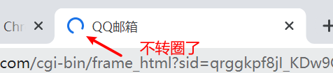

**超时时间(ms)**：等待网页加载的上限。

### 输出

- **是否成功**
- **标签页ID**：新标签的数字 ID，后续操作该页时传入。
- **窗口ID**：打开新窗口时，新窗口的编号。
- **原始返回结果**

MV3 也可用后台命令创建标签或窗口：[api_tabs_create](https://quickerconnectortests.getquicker.cn/docs/commands.html#api_tabs_create)、[api_windows_create](https://quickerconnectortests.getquicker.cn/docs/commands.html#api_windows_create)、[scripts_createNewWindowWithUrls](https://quickerconnectortests.getquicker.cn/docs/commands.html#scripts_createNewWindowWithUrls)。

<ShareLinkCard
  href="https://getquicker.net/subprogram?id=2e862e5b-3a0e-45ee-b3fc-08db05106307"
  title="切换标签或打开网址"
  description="已打开则激活，否则新开标签。"
/>

## 等待加载完成

等待某个标签页的 `status` 变为 **complete**。常用于脚本提交表单、页面刷新之后。

<ModuleParamPreview
  moduleKey="sys:chromecontrol"
  focusKeys={['operation', 'tabId', 'timeoutMs', 'stopIfFail', 'isSuccess', 'rawResponse']}
  values={{operation: 'WaitTabComplete', tabId: '', timeoutMs: '2000', stopIfFail: 'true'}}
  outputVars={{isSuccess: 'isSuccess', rawResponse: 'rtn'}}
/>

**标签页Id**：留空表示当前活动标签页。

**超时时间(ms)**：等到加载完成的上限。

**失败后停止**：超时后是否中止。不是所有操作都必须等彻底加载完。

**原始返回结果**：空。

## 激活标签页

需 MV3 扩展。激活指定标签并返回信息。定位方式：

1. **标签页Id**：有有效 ID 时直接激活。
2. **网址**：
   - 含通配符 `*`（如 `https://*.google.com/foo*bar`）按 [网址匹配模式](https://developer.chrome.com/docs/extensions/develop/concepts/match-patterns) 查找。
   - 不含通配符则查找实际网址包含该值的标签。
   - 找不到且参数是常规网址时，自动新建标签打开它。

成功后会激活该标签，并让所在窗口获得焦点。

<ModuleParamPreview
  moduleKey="sys:chromecontrol"
  focusKeys={[
    'operation',
    'url',
    'tabId',
    'stopIfFail',
    'isSuccess',
    'windowId',
    'groupId',
    'title',
    'favicon',
    'rawResponse',
  ]}
  values={{operation: 'ActivateTab', url: 'https://baidu.com', tabId: '', stopIfFail: 'true'}}
  outputVars={{tabId: 'tabId', windowId: 'windowId'}}
/>

## 获得标签页信息

获得某个标签页的信息。不指定 **标签页Id** 时，取当前活动标签和扩展本身的信息。

MV3 新增输出 **Manifest版本**，可判断是否为新版扩展、是否还支持后台脚本。

<ModuleParamPreview
  moduleKey="sys:chromecontrol"
  focusKeys={[
    'operation',
    'tabId',
    'stopIfFail',
    'timeoutMs',
    'isSuccess',
    'windowId',
    'groupId',
    'url',
    'title',
    'favicon',
    'browser',
    'extVersion',
    'manifestVersion',
    'envName',
    'rawResponse',
  ]}
  values={{operation: 'GetTabInfo', tabId: '', stopIfFail: 'true', timeoutMs: '3000'}}
  outputVars={{
    tabId: 'tabId',
    windowId: 'windowId',
    groupId: 'groupId',
    url: 'url',
    title: 'text',
    favicon: 'favicon',
    browser: 'browser',
    extVersion: 'extVersion',
    manifestVersion: 'manifestVersion',
    rawResponse: 'rawResponse',
  }}
/>

**标签页Id**：不填表示当前活动标签。

### 输出

- **标签页ID**：当前活动标签的 Id
- **窗口ID**
- **分组ID**：标签所属分组
- **网址**
- **网页标题**
- **Favicon图标网址**
- **浏览器**：当前连接的浏览器名，如 chrome / msedge
- **插件版本**
- **Manifest版本**：`2` 或 `3`
- **环境名称**：浏览器 Profile 的自定义环境名
- **原始返回结果**：当前标签的 [Tab 对象](https://developer.chrome.com/extensions/tabs#type-Tab)

## 关闭标签页

关闭指定标签。未指定 **标签页Id** 时关闭当前活动标签。

<ModuleParamPreview
  moduleKey="sys:chromecontrol"
  focusKeys={['operation', 'tabId', 'stopIfFail', 'isSuccess', 'rawResponse']}
  values={{operation: 'CloseTab', tabId: '', stopIfFail: 'true'}}
  outputVars={{isSuccess: 'isSuccess', rawResponse: 'rtn'}}
/>

## 对标签页运行脚本

对指定标签的网页运行 JS。

MV3 注意：

- 需在浏览器扩展设置中开启**开发者模式**，或在扩展详情开启**允许运行用户脚本**（浏览器 138 以后）。
- 新增 **执行环境**。值为 `MAIN` 时可访问网页里的 JS 变量。

<ModuleParamPreview
  moduleKey="sys:chromecontrol"
  focusKeys={[
    'operation',
    'tabId',
    'script',
    'frame',
    'executionWorld',
    'waitManualReturn',
    'stopIfFail',
    'timeoutMs',
    'isSuccess',
    'rawResponse',
  ]}
  values={{
    operation: 'RunScript',
    tabId: '',
    script: '//.js\ndocument.title',
    frame: '0',
    executionWorld: '',
    waitManualReturn: 'false',
    stopIfFail: 'true',
    timeoutMs: '3000',
  }}
  outputVars={{rawResponse: 'rawResponse'}}
/>

**标签页Id**：未指定则对当前活动标签运行。

**脚本内容**：要运行的 JS。

- 脚本里可用 jQuery，如 `$('#input')`。
- 最后一个语句的结果作为返回值。不要写 `return`。
- 可用异步方法或返回 Promise，会等 Promise 解析后再返回。

返回网页文本：

```javascript
document.body.innerText;
```

返回复杂对象：

```javascript
//.js
let result = {name: '张三', age: 20};
result;
```

异步示例：

```javascript
//.js
function wait(ms) {
  return new Promise(resolve => setTimeout(resolve, ms));
}

async function fetchValue() {
  console.log('开始等待 2 秒…');
  await wait(2000);
  return '这是异步返回的值';
}

fetchValue();
```

**从脚本手动返回数据**：结果要等回调或元素更新时，开启此项，并在脚本里调用 `sendReplyToQuicker`。也可改用上面的异步写法。

```javascript
// 参数中需要启用「从脚本手动返回数据」。
// sendReplyToQuicker(是否成功, '失败时提示消息', 数据对象, 回复的消息序号qk_msg_serial宏)

setTimeout(function () {
  sendReplyToQuicker(
    true,
    'ok',
    {key: 'value', name: 'zhangsan'},
    qk_msg_serial
  );
}, 1000);
```

脚本里的 `qk_msg_serial` 会被自动替换成消息编号。

**超时时间(ms)**：等待返回的最长时间。

**运行脚本的框架**：在哪些 frame 里跑。`all` 表示所有框架（默认），`0` 表示主框架，其它数字是框架序号。有的框架有保护会导致超时，可改成 `0` 只跑主框架。

**执行环境**：可选，默认 `USER_SCRIPT`。`MAIN` 表示用网页自身上下文执行，可访问网页全局变量。仅 MV3。

### 输出

**原始返回结果**：JS 返回值的 JToken。输出给文本变量可得到原始 JSON。

实际值是数组（JArray），每一项是一个 Frame 的结果。网页只有一个 Frame 时数组只有一项。

## 选择元素

从网页里选一个 HTML 元素，返回它的 CSS 选择器，供后续步骤使用。

<ModuleParamPreview
  moduleKey="sys:chromecontrol"
  focusKeys={['operation', 'tabId', 'stopIfFail', 'timeoutMs', 'isSuccess', 'selector', 'rawResponse']}
  values={{operation: 'PickElement', tabId: '', stopIfFail: 'true', timeoutMs: '15000'}}
  outputVars={{selector: 'selector'}}
/>

**CSS选择器**：目标元素的选择器。网页结构一变，选择器可能失效。

## 获取元素信息

获取网页元素的信息。

<ModuleParamPreview
  moduleKey="sys:chromecontrol"
  focusKeys={[
    'operation',
    'tabId',
    'selector',
    'elementInfo',
    'attrName',
    'frame',
    'stopIfFail',
    'fixSelector',
    'timeoutMs',
    'isSuccess',
    'firstValue',
    'allValues',
    'rawResponse',
  ]}
  values={{
    operation: 'GetElementInfo',
    tabId: '',
    selector: '#content-well-in-this-article-list > li:nth-child(1) > a',
    elementInfo: 'Property',
    attrName: 'href',
    frame: '0',
    stopIfFail: 'true',
    fixSelector: 'auto',
    timeoutMs: '3000',
  }}
  outputVars={{firstValue: 'output', rawResponse: 'result'}}
/>

**标签页Id**：未指定则取当前活动标签。

**选择器**：要操作元素的 CSS 选择器。

**元素信息类型**：

- **值**：jQuery [val()](https://api.jquery.com/val())。主要用于 input、select、textarea。取选中的 radio / checkbox 时，选择器要加 `:checked`，例如：
  - `select#foo option:checked` 下拉框选中项
  - `select#foo` 下拉框的值
  - `input[type=checkbox][name=bar]:checked` 选中的复选框
  - `input[type=radio][name=baz]:checked` 选中的单选按钮
- **某Attribute属性**：jQuery [attr()](https://api.jquery.com/attr())，一般是源码里写的值。
- **某Property属性**：jQuery [prop()](https://api.jquery.com/prop())，一般是运行时的值。例如 `href='/index'` 时，attr 得到 `/index`，prop 得到按当前网址算出的完整地址。
- **innerText 内部文本**：jQuery [text()](https://api.jquery.com/text())
- **innerHTML 内部HTML**：jQuery [html()](https://api.jquery.com/html())
- **outerHTML 全部HTML**：DOM [outerHTML](https://developer.mozilla.org/zh-CN/docs/Web/API/Element/outerHTML)

**属性名**：类型为 Attribute / Property 时填写，如链接的 `href`。

### 输出

- **第一个值**：第一个匹配元素的信息。
- **所有值的列表**：所有匹配元素的值列表。

<ShareLinkCard
  code="68da9f93-57ee-4465-058e-08d823a26917"
  title="获取网页里的所有链接和图片网址"
/>

## 更新元素信息

更新元素某方面的信息。输入参数请参考「获取元素信息」。所有匹配 **选择器** 的元素都会被更新。

示例见 [使用浏览器控制的一些示例](/v2/xaction/guides/web-page-control)。

<ShareLinkCard
  code="9e70fb7f-b85e-4b21-1b7a-08da8ae0e8b9"
  title="用百度特定搜索关键词"
/>

<ModuleParamPreview
  moduleKey="sys:chromecontrol"
  focusKeys={[
    'operation',
    'tabId',
    'selector',
    'updateElementInfo',
    'attrName',
    'updateElementValue',
    'frame',
    'stopIfFail',
    'isSuccess',
    'rawResponse',
  ]}
  values={{
    operation: 'UpdateElement',
    tabId: '',
    selector: 'query',
    updateElementInfo: 'Value',
    attrName: '',
    updateElementValue: '关键词',
    frame: '0',
    stopIfFail: 'true',
  }}
  outputVars={{rawResponse: 'result'}}
/>

**元素信息类型**（更新）：值、数组值、某 Attribute、某 Property、InnerText、InnerHtml。

**值**：要写入的内容。

对 input、textarea 等：类型选「值」，在 **值** 里填写目标内容。

更新下拉框：先确认选项的 value：

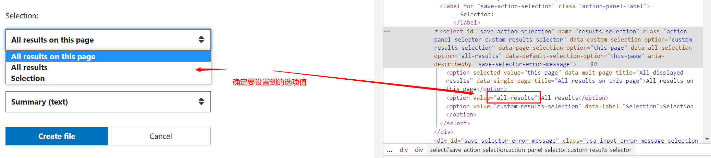

再用「更新元素信息」，类型为「值」：

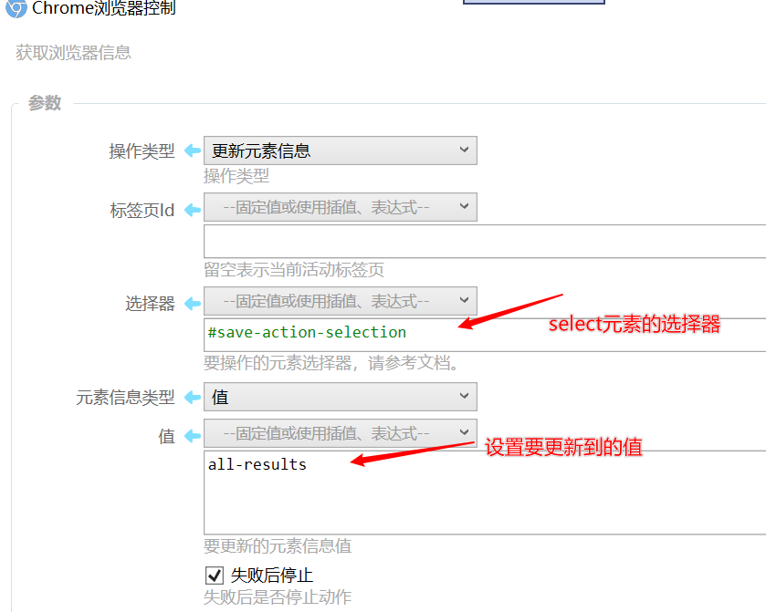

更新复选框 / 单选框：改 **checked** 的 Property。

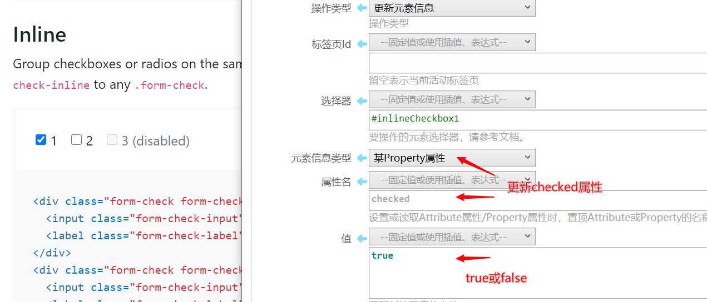

更早版本可对标签页跑 JS：

```javascript
$('选择器').prop('checked', true);  // 选中
$('选择器').prop('checked', false); // 取消
```

要用 input 元素本身的选择器，不要选到外层。

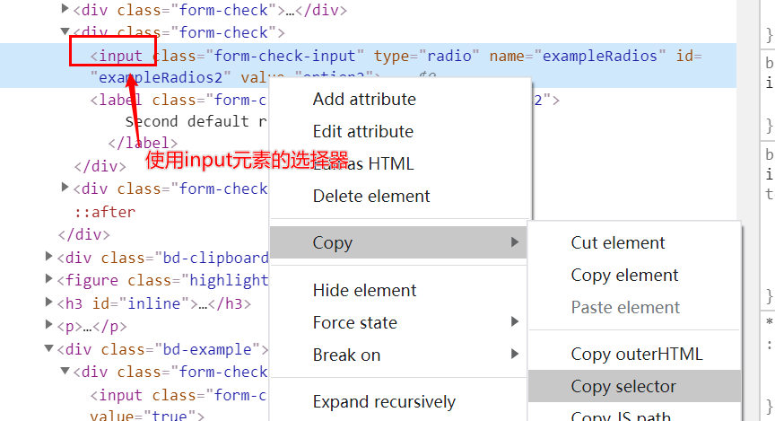

## 触发事件

对指定元素触发事件，如点击、聚焦、提交表单、触发变更。

<ModuleParamPreview
  moduleKey="sys:chromecontrol"
  focusKeys={[
    'operation',
    'tabId',
    'selector',
    'triggerEventType',
    'frame',
    'stopIfFail',
    'isSuccess',
    'rawResponse',
  ]}
  values={{
    operation: 'TriggerEvent',
    tabId: '',
    selector: '#submit',
    triggerEventType: 'click',
    frame: '0',
    stopIfFail: 'true',
  }}
  outputVars={{rawResponse: 'result'}}
/>

**标签页Id**：未指定则操作当前活动标签。

**选择器**：要操作的元素。

**触发事件类型**：可选预置项，也可直接写事件名。

<ModuleParamPreview
  moduleKey="sys:chromecontrol"
  focusKeys={['triggerEventType']}
  values={{operation: 'TriggerEvent', triggerEventType: 'click'}}
/>

或指定自定义事件：

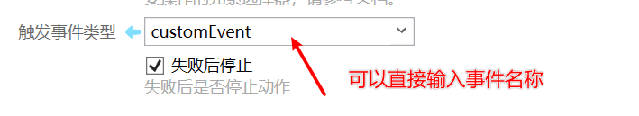

- 以 `native.` 前缀表示用原生 `dispatchEvent`，如 `native.focus` 相当于 `.dispatchEvent(new Event('focus'))`。
- `change` 用 `dispatchEvent`。
- `click` 直接调 DOM [click()](https://developer.mozilla.org/zh-CN/docs/Web/API/HTMLElement/click)。
- 其它事件用 [jquery.trigger()](https://api.jquery.com/trigger/)。
- 提交表单要用 form 元素本身的选择器。

## 等待网页变化

MV3 新增。等待动态网页发生特定变化（元素出现 / 消失、文字出现 / 消失等）。只适用于不会跳到新页面的网页（跳转会丢掉嵌入的 JS）。

<ModuleParamPreview
  moduleKey="sys:chromecontrol"
  focusKeys={[
    'operation',
    'tabId',
    'selector',
    'waitEventType',
    'waitEventParams',
    'stopIfFail',
    'isSuccess',
    'rawResponse',
  ]}
  values={{
    operation: 'Wait',
    tabId: '',
    selector: '#submit',
    waitEventType: 'textContains',
    waitEventParams: 'Hello',
    stopIfFail: 'true',
  }}
  outputVars={{rawResponse: 'result'}}
/>

**选择器**：要判断的目标元素。

**事件类型**：见下表。

**参数**：部分事件需要额外参数。

| 事件名称 | 说明 | 参数 | 示例 |
| --- | --- | --- | --- |
| elementExists | 元素存在 | 无 | - |
| elementNotExists | 元素不存在 | 无 | - |
| elementVisible | 元素在网页可见 | 无 | - |
| elementNotVisible | 元素在网页不可见 | 无 | - |
| elementClickable | 元素可点击 | 无 | - |
| elementNotClickable | 元素不可点击 | 无 | - |
| textContains | 包含文本 | 要查找的文本 | `登录` |
| textNotContains | 不包含文本 | 不应包含的文本 | `错误` |
| textMatches | 文本匹配表达式 | 正则 | `用户\d+` |
| textNotMatches | 文本不匹配表达式 | 正则 | `error\s:` |
| urlMatches | 网址匹配（PWA） | 正则 | `login\.html` |
| urlNotMatches | 网址不匹配（PWA） | 正则 | `error\.html` |
| titleMatches | 标题匹配（PWA） | 正则 | `主页\s-` |
| titleNotMatches | 标题不匹配（PWA） | 正则 | `加载中` |
| attributeMatches | 属性匹配 | `属性名:正则` | `data-status:success` |
| attributeNotMatches | 属性不匹配 | `属性名:正则` | `aria-disabled:true` |
| elementHasClass | 包含类名 | 类名 | `active` |
| elementNotHasClass | 不包含类名 | 类名 | `disabled` |
| elementHasAttribute | 包含属性 | 属性名 | `checked` |
| elementNotHasAttribute | 不包含属性 | 属性名 | `disabled` |
| elementCountGt | 元素数量大于 | 下限 | `5` |
| elementCountLt | 元素数量小于 | 上限 | `10` |
| elementCountEq | 元素数量等于 | 期望数量 | `3` |
| elementEvent | 元素事件触发 | 事件名 | `click` |

**超时时间(ms)**：最长等待时间。

## 设置连接的浏览器

设置当前动作要控制的浏览器。后续浏览器控制步骤都走这个连接。如果总是操作前台窗口浏览器，不必加这一步。多 Profile 见 [一个浏览器多个 Profile](/v2/xaction/guides/browser-multiprofile)。

<ModuleParamPreview
  moduleKey="sys:chromecontrol"
  focusKeys={['operation', 'browser', 'mainProcessId', 'envName', 'stopIfFail']}
  values={{operation: 'SetBrowser', browser: 'auto', mainProcessId: '0', envName: '*'}}
/>

**浏览器**：要连接的浏览器进程名（需已安装 Quicker 扩展）。默认 `auto`。

**主进程ID**：可选。同一个浏览器用 `user-data-dir` 跑多个实例时，指定主进程 ID。默认 `0`。

**自定义环境名**：扩展里设置的环境名，用来区分同一浏览器的不同 Profile。`*` 表示不判断环境名。

## 运行后台命令

通过浏览器 API 控制浏览器自身。需 MV3 扩展与 Chrome 135+。

两类命令：

- `api_` 前缀：对浏览器 API 的封装，如 `api_tabs_create` 对应 `chrome.tabs.create()`。
- `scripts_` 前缀：预先写好的后台脚本。

后台命令参考：

- [在线文档](https://quickerconnectortests.getquicker.cn/docs/commands.html)
- 扩展内置：点扩展图标 → 文档 → 后台命令参考

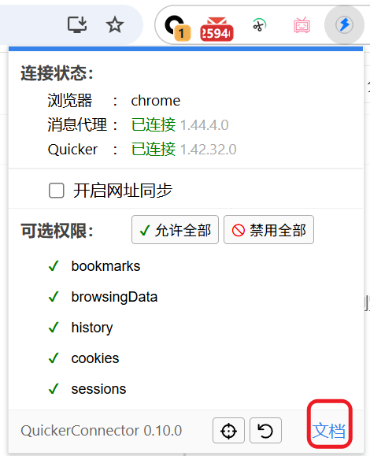

<ModuleParamPreview
  moduleKey="sys:chromecontrol"
  focusKeys={[
    'operation',
    'command',
    'commandParams',
    'valueFilter',
    'waitComplete',
    'stopIfFail',
    'timeoutMs',
    'isSuccess',
    'rawResponse',
  ]}
  values={{
    operation: 'BackgroundCommand',
    command: 'scripts_createOrRestoreGroup',
    commandParams: `{
  "groupName": "AI",
  "domains": ["claude.ai", "chatgpt.com", "gemini.google.com"],
  "urls": [
    "https://claude.ai/new",
    "https://chatgpt.com/",
    "https://gemini.google.com/app"
  ]
}`,
    valueFilter: '',
    waitComplete: 'true',
    stopIfFail: 'true',
    timeoutMs: '3000',
  }}
  outputVars={{rawResponse: 'rawResponse'}}
/>

**命令**：要执行的后台命令。

**命令参数**：传给该命令的参数。需要 `tabId` / `tabIds` / `windowId` / `groupId` 的命令通常可省略，表示当前标签、所在窗口、所在分组。

指定参数：

1. 直接写 JSON 文本。
2. 用表达式创建匿名 C# 对象：

```csharp
$= new {
    tabId = {数字变量},
    updateProperties = new {
        mute = true
    }
}
```

**等待操作完成或返回数据**：需要返回值时请勾选。

**返回值过滤器**：只要结果里的部分属性时填写。多个属性名用分号分隔。下面返回所有打开的网址：

<ModuleParamPreview
  moduleKey="sys:chromecontrol"
  focusKeys={[
    'operation',
    'command',
    'commandParams',
    'valueFilter',
    'waitComplete',
    'stopIfFail',
    'timeoutMs',
    'isSuccess',
    'rawResponse',
  ]}
  values={{
    operation: 'BackgroundCommand',
    command: 'api_tabs_query',
    commandParams: '',
    valueFilter: 'url',
    waitComplete: 'true',
    stopIfFail: 'true',
    timeoutMs: '3000',
  }}
  outputVars={{rawResponse: 'result'}}
/>

<ShareLinkCard
  code="64f1cc94-8261-4e3e-d379-08dd85c4ca35"
  title="测试后台命令"
  author="CL"
/>

### 后台命令与后台脚本

- 后台脚本可多次调用浏览器 API，写完整自定义逻辑。
- 后台命令每次只调一个 API（相当于一次 `await`），原来一个后台脚本可能要拆成多步命令。

## 运行后台脚本

MV3 扩展已不支持直接跑自定义后台脚本，相关需求请改用「运行后台命令」。1.44.10+ 在 MV3 上用兼容方式继续支持后台脚本；遇到问题欢迎在讨论区反馈。

### 迁移后台脚本动作

在 Quicker 1.44.5+ 搜索框搜 `CONTAINS:BackgroundScript`，可找出仍使用后台脚本的动作。

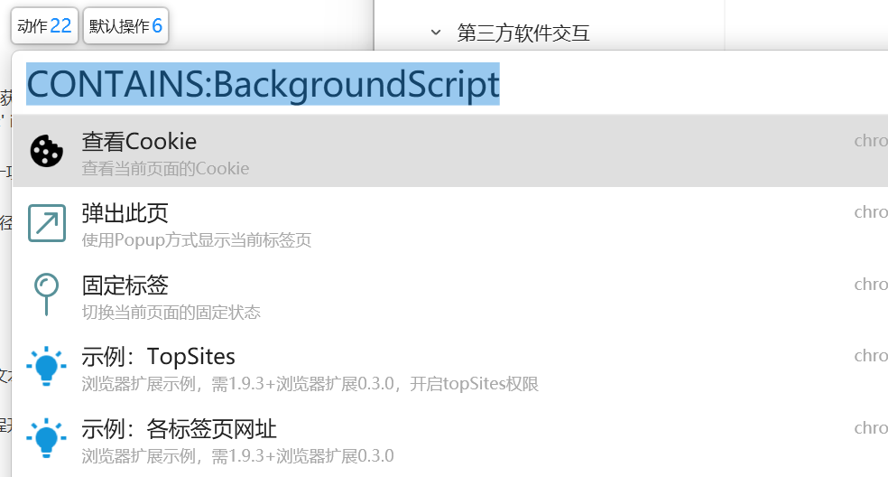

要兼容 MV2，可先「获得标签页信息」取 Manifest 版本：为 3 则走后台命令，否则走后台脚本。

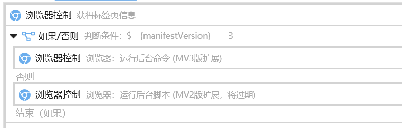

<ShareLinkCard
  code="287ef444-8487-471d-e118-08d82862a3c3"
  title="查看 Cookie"
  author="CL"
/>

### 后台脚本的编写

#### MV2 扩展（0.7.4，即将不被支持）

用回调调用 chrome API。API 见 [官方文档](https://developer.chrome.com/docs/extensions/mv2/reference)。

获取当前标签网址的 Cookie：

```javascript
chrome.tabs.query({ lastFocusedWindow: true, active: true }, function (tabs) {
    if (tabs.length < 1) {
        sendReplyToQuicker(false, '未找到当前页', {}, qk_msg_serial)
    }

    var url = tabs[0].url;

    chrome.cookies.getAll({
        url: url
    }, function (cookies) {
        sendReplyToQuicker(true, 'ok', cookies, qk_msg_serial)
    });

});
```

#### MV3 扩展（1.0.0+）

MV3 不能直接跑自定义后台脚本。兼容方式是：在 Quicker 进程里解析脚本，遇到 API 调用时转成后台命令发给浏览器。

除 MV2 的回调模式外，Quicker **1.44.12+** 也支持异步。上面的 Cookie 示例可写成：

```javascript
//.js
const tabs = await chrome.tabs.query({ lastFocusedWindow: true, active: true });

if (tabs.length < 1) {
  throw new Error('未找到当前页');
}

const url = tabs[0].url;

return await chrome.cookies.getAll({ url: url });
```

此时不必再调 `sendReplyToQuicker`，末尾 `return` 目标值即可。

MV3 API 见 [官方文档](https://developer.chrome.com/docs/extensions/reference/api)。

注意：

- 扩展只申请了部分常用权限，不是所有 API 都能调。可调用的范围以后台命令为准。
- Quicker 内置 JS 环境可能缺少浏览器里的某些类型，不是所有脚本都能跑。遇到问题请反馈。
- 异步方式时，代码里不要包含 `sendReplyToQuicker`。

### 从后台脚本返回内容

**1）选中「等待操作完成或返回数据」。**

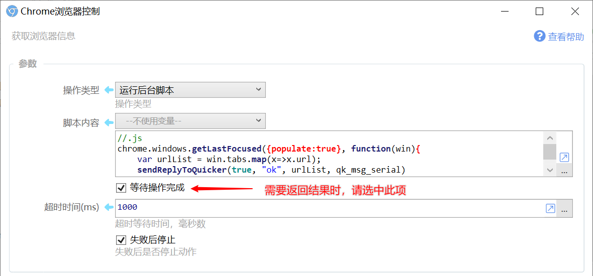

**2）返回结果**

异步 `async/await`：在代码末尾 `return` 目标值；出错时 `throw new Error('message')`。

回调方式：在脚本里用 `sendReplyToQuicker(isSuccess, message, data, qk_msg_serial)` 返回（扩展 0.3.0 + Quicker 1.9.3）。

- **isSuccess**：是否成功
- **message**：失败时的错误消息
- **data**：返回数据
- **qk_msg_serial**：Quicker 消息序号，脚本里直接写这个名字即可

```javascript
//.js  获取当前窗口的所有网址
chrome.windows.getLastFocused({populate:true}, function(win){
    var urlList = win.tabs.map(x=>x.url);
    sendReplyToQuicker(true, "ok", urlList, qk_msg_serial)
});
```

<ShareLinkCard
  items={[
    {
      code: 'e0e854ea-5d36-4dd9-14fc-08d8255d6cc9',
      title: '返回当前窗口的所有标签页网址',
    },
    {
      code: 'a17f1c61-26b5-4013-14ff-08d8255d6cc9',
      title: '返回 TopSites（需开通 topSites 权限）',
    },
  ]}
/>

**3）输出返回结果**

`sendReplyToQuicker` 的 `data` 若是 object，会直接返回；若是数字、字符串等简单类型，会封装后再返回（MV3 不再封装，直接返回）：

```json
{
  "data": "qk_bgmsg_result"
}
```

输出是 JToken，见下文「从 JToken 提取信息」。

<ShareLinkCard
  items={[
    {
      code: '315a8235-e00a-4b89-8236-08d8246a94ad',
      title: '关闭左侧标签页',
    },
    {
      code: 'bed4a309-2d20-47cb-8238-08d8246a94ad',
      title: '弹出此页',
    },
  ]}
/>

## 将动作关联到浏览器右键菜单

- 浏览器右键菜单不支持显示图标。
- 使用 [chrome.contextMenus API](https://developer.chrome.com/docs/extensions/reference/contextMenus/)。

效果：

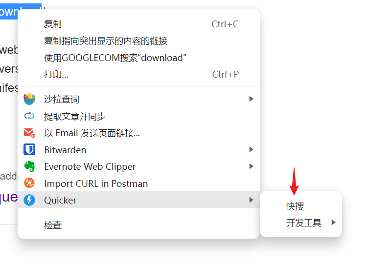

**设置方法**

1. 编辑动作。
2. 在「关联」标签页点击「浏览器右键菜单」下的「设置...」。
3. 在弹出窗口里设置：
   - **关联上下文**：在什么地方出现此项（[ContextType](https://developer.chrome.com/docs/extensions/reference/contextMenus/#type-ContextType)）。`selection` 表示选中内容上的右键，`all` 表示大多数情况。
   - **匹配网址**：网址条件。`*://*/*` 表示不限制。这里不是正则，见 [match patterns](https://developer.chrome.com/docs/extensions/mv3/match_patterns/)。
   - **匹配目标地址**：匹配 img / video / audio 的 src，或链接的 href。匹配方式同上。
   - **动作参数**：传给动作的内容。`%s` 表示浏览器里选中的文本。

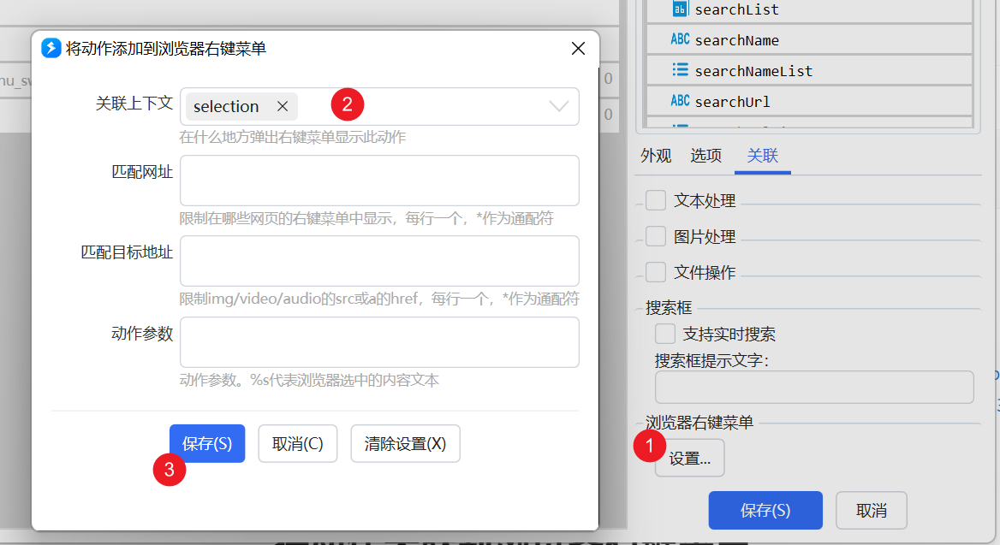

设置后需重新连接浏览器才生效。可重启浏览器或 Quicker，或在「修复浏览器扩展连接」里点「更新右键菜单」。

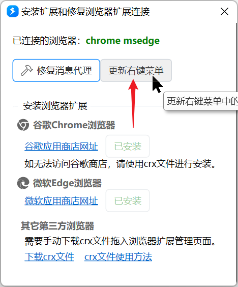

由菜单触发动作时，表达式里可通过 `_context.ExtraData.BrowserMenuClickData` 取得点击上下文，字段见 [OnClickData](https://developer.chrome.com/docs/extensions/reference/contextMenus/#type-OnClickData)。可用来取右键点击的图片、视频、链接网址。

<ShareLinkCard
  code="d1650c2d-f913-4959-3931-08d9f928b257"
  title="浏览器右键菜单示例"
/>

## 如何获取页面元素的 CSS 选择器或 XPath

同一个元素可以有多种 CSS 选择器。

**（1）通过浏览器获取**

在网页里按 Ctrl+Shift+C 开启选择模式（F12 关闭），选中节点后，在开发工具里对元素右键 → 复制选择器。

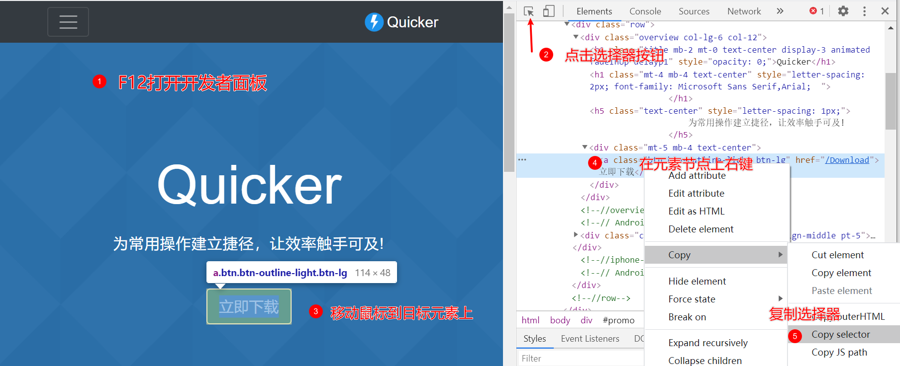

**（2）Quicker 扩展右键菜单**

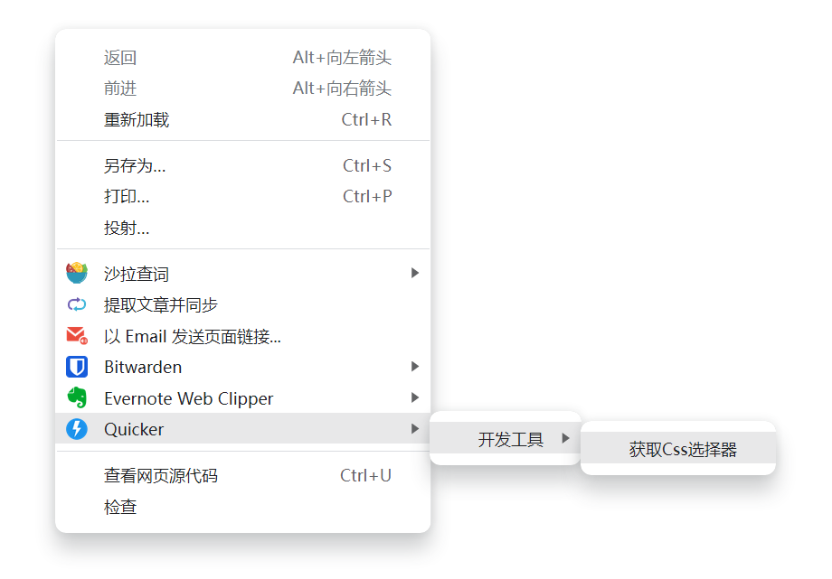

**（3）第三方扩展**，如 ChroPath、SelectorsHub。

## 从 JToken 中提取信息

- 对标签页运行脚本返回的是数组，每一项是一个 Frame 的结果。
- 运行后台脚本返回的是 `qk_bgmsg_result` 对应的 object，或封装后的简单值。

JToken 可在表达式里用 **\[数组序号\]** 和 **\[对象属性名\]** 取值，再 `.ToString()` 得到文本。

下图得到返回数组第 0 项的 `title`：

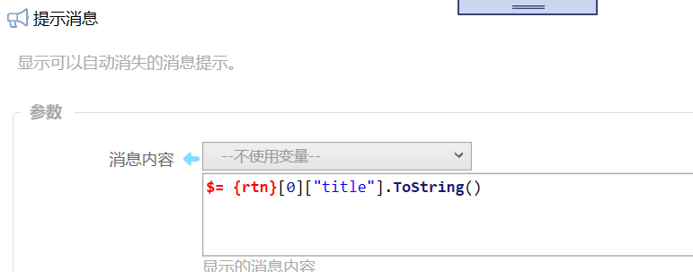

也可用 [SelectToken](https://www.newtonsoft.com/json/help/html/SelectToken.htm)（或 SelectTokens 取数组）：

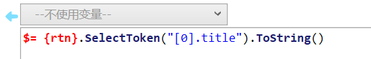

也可取原始类型。下图得到 `val` 的整数值：

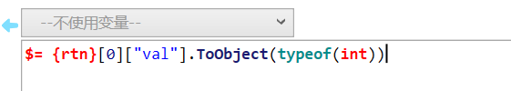

## 如何开启浏览器的开发者模式

「对标签页运行脚本」需要开发者模式（浏览器 138 之前）或扩展的「允许运行用户脚本」（138 之后）。完整步骤见 [设置浏览器扩展](/v2/xaction/guides/chrome-ext-settings)。

开启「允许运行用户脚本」：

1. 打开扩展详情：在扩展按钮上右键 → 管理扩展程序


2. 开启选项

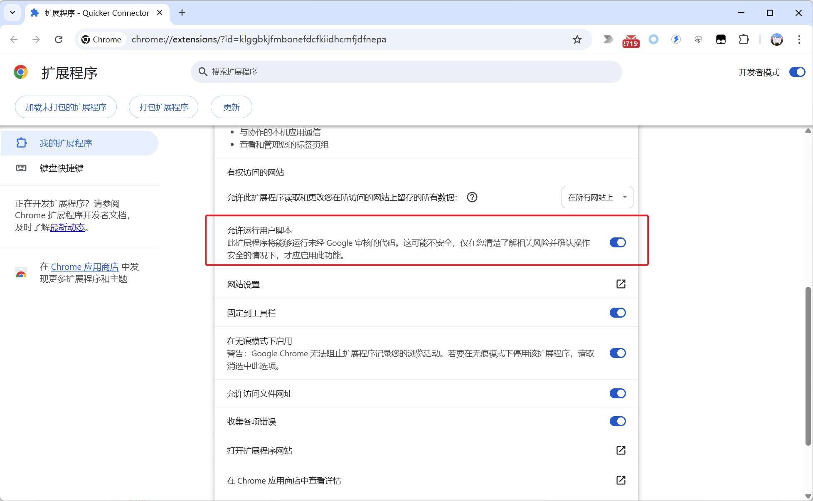

开启开发者模式：

1. 打开浏览器扩展管理页面。

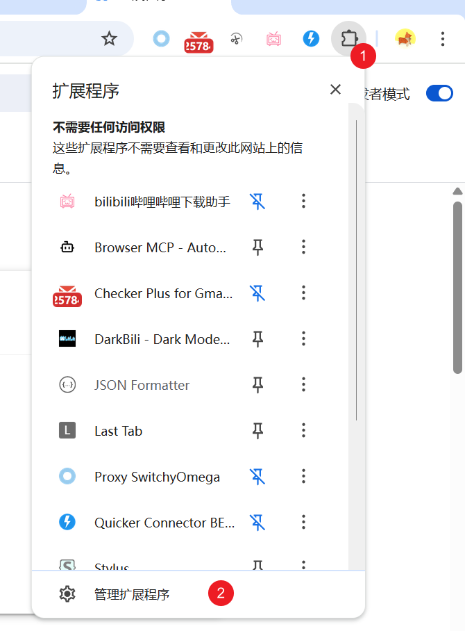

2. 在右上角打开开发者模式。

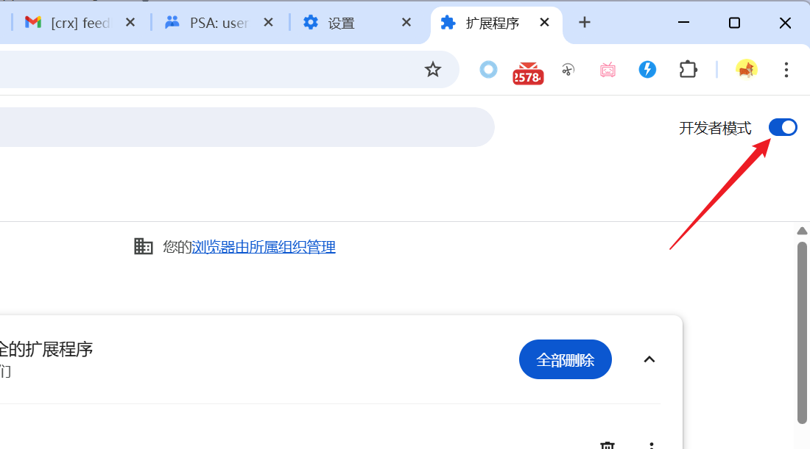

3. 重启 Quicker Connector 扩展。

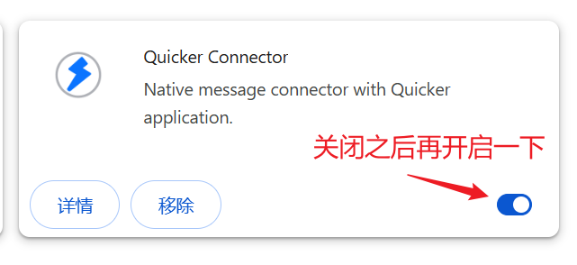

## 限制与排障

### 脚本限制

1. 浏览器自身功能页（`chrome://` 开头或应用商店页）通常无法工作。

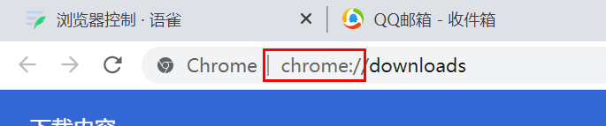

2. 无痕模式默认不可用。如需使用，在扩展设置里开启允许。

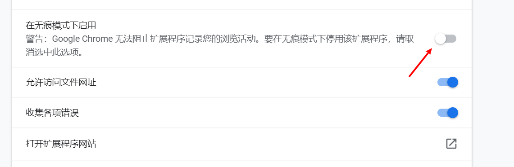

3. 文件网址默认不可用，同样要在扩展设置里开启。
4. 浏览器安全限制还可能导致：
   - 部分交互必须人工触发，如文件上传、`document.execCommand`（有的操作在人工点一次页面后就能用脚本触发）。
   - 有些脚本在 iframe 里无法执行。
5. 消息传递会转成文本，部分内容可能传不过去。

### 查看日志

**背景页控制台**

在扩展管理页开启开发者模式，再点扩展的「背景页」：

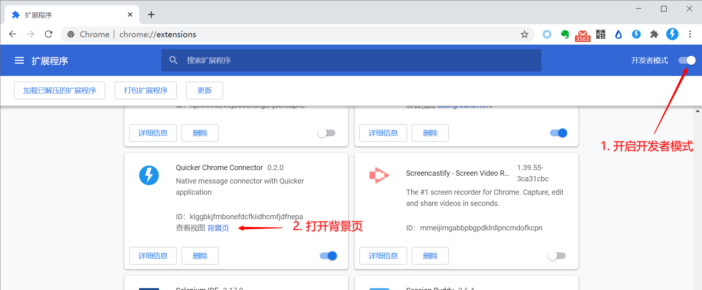

控制台里可以看到部分 log。

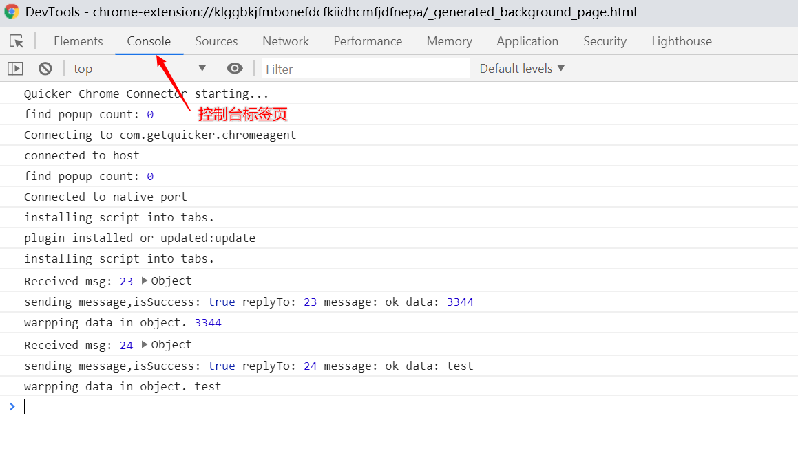

**ChromeAgent 日志**

ChromeAgent.exe 是浏览器和 Quicker 之间的消息代理，由浏览器启动后主动连接 Quicker。

为避免更新时文件被锁，Quicker 会在安装后首次启动时把 ChromeAgent 复制到应用数据目录并注册，路径一般为 `Quicker应用数据文件夹\bin\NativeMessageHost`（如 `C:\Users\用户名\AppData\Local\Quicker\bin\NativeMessageHost`）。

日志在 `Quicker应用数据文件夹\logs`，文件名 `quickerhost_浏览器名称.log`。

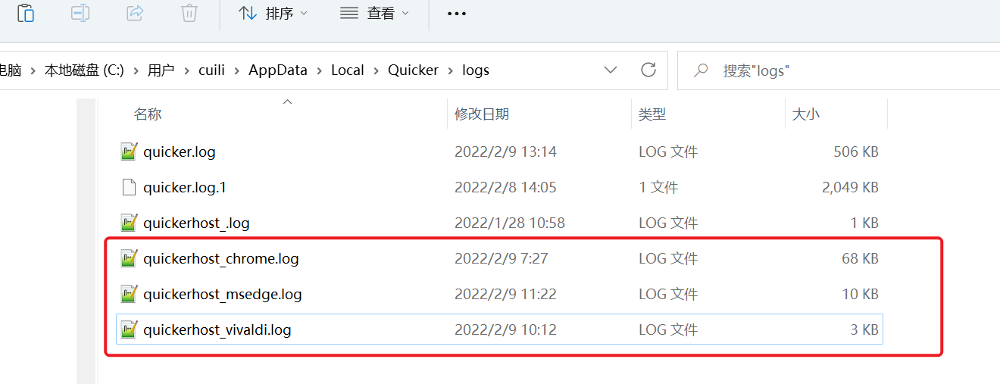

### 扩展连接问题排查

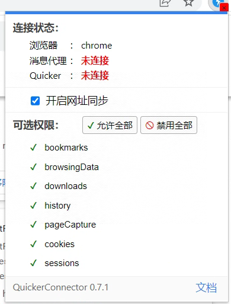

消息代理未连接时，按这个顺序查：

0. 浏览器已开启开发者模式。
1. 扩展来自官方商店。若用 crx，请拖到扩展管理页安装，不要解压。
2. Quicker 不要用管理员身份运行。
   - 未给 Quicker.exe 等勾选兼容模式或以管理员身份运行。
     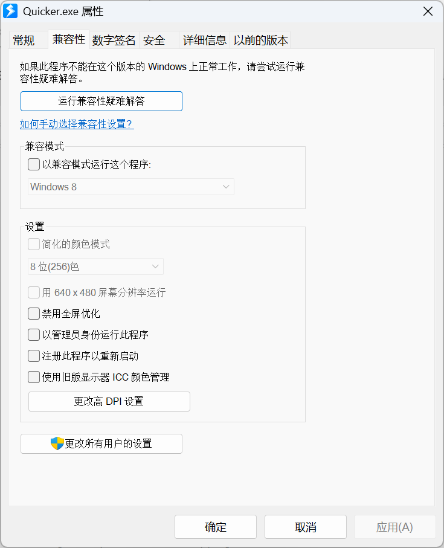
   - 系统 UAC 保持默认。
     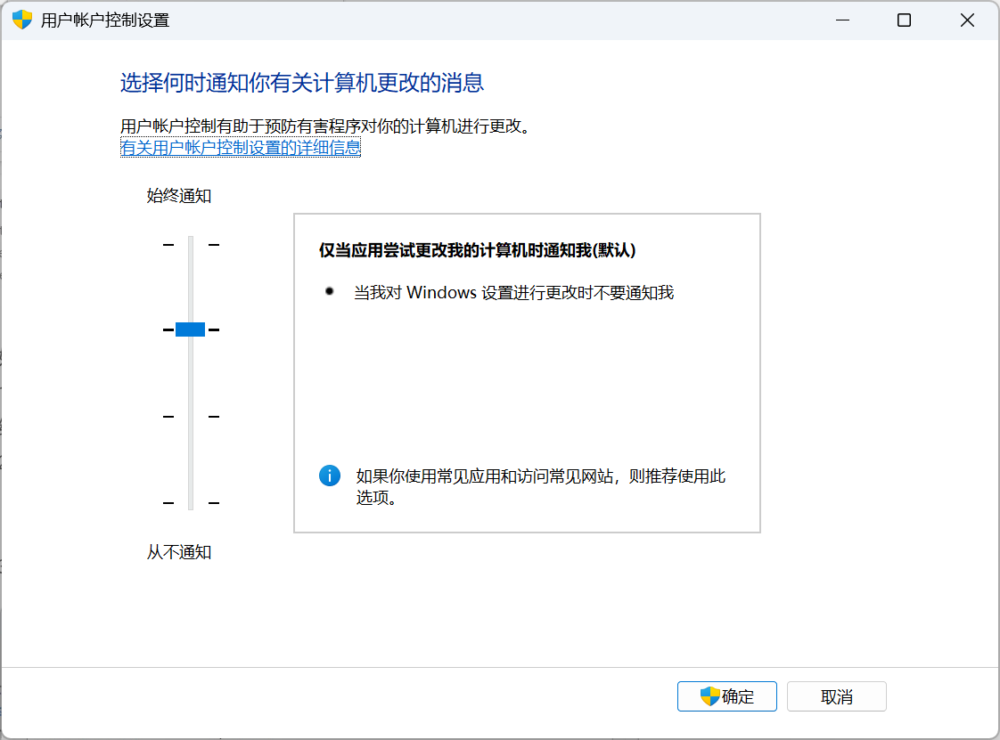
3. 环境变量 `ComSpec` 存在。
   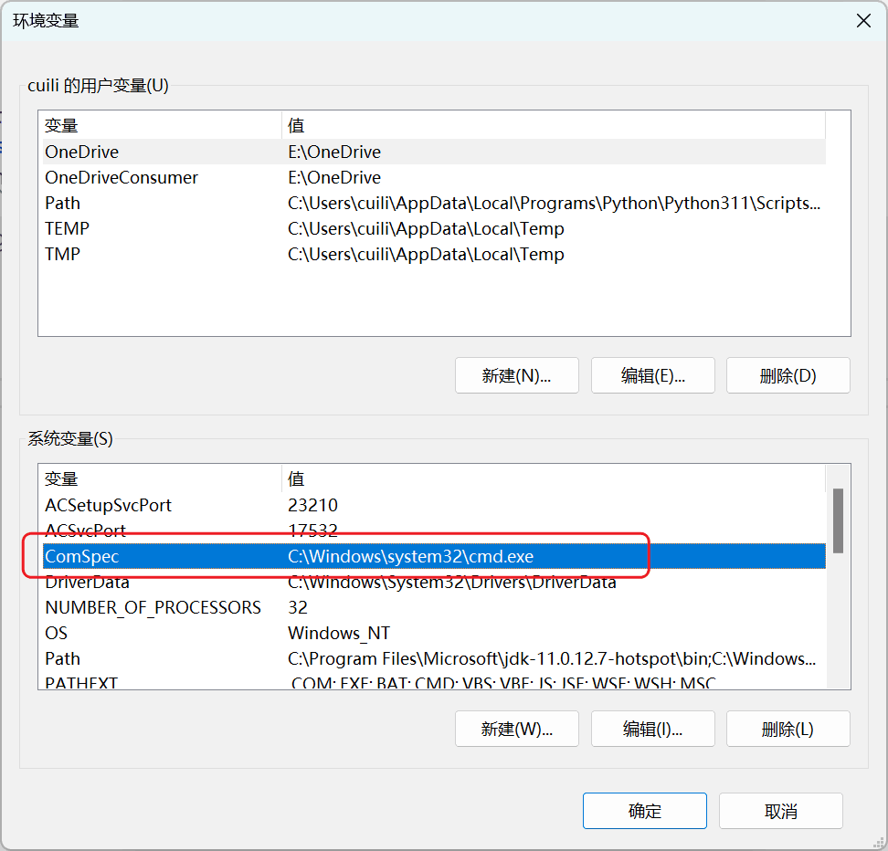
4. `C:\Windows\System32\cmd.exe` 存在，Win+R 能打开 cmd。
   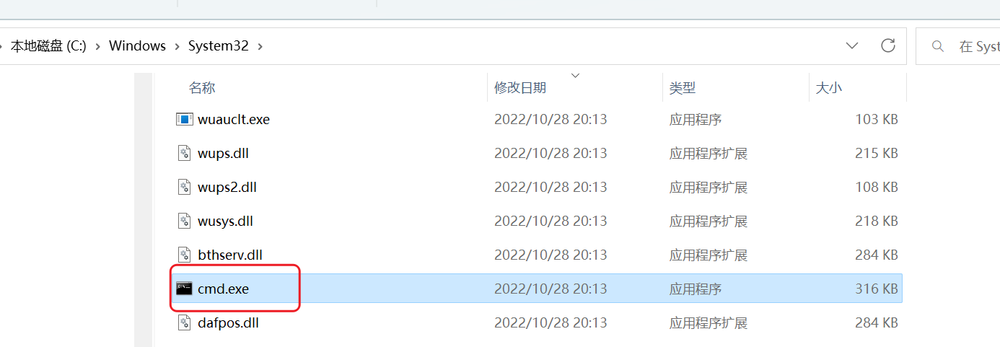
5. 尝试修复扩展连接：
   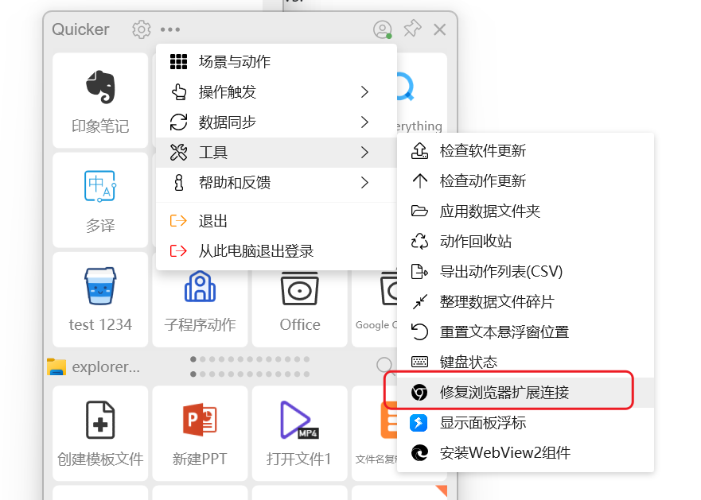
6. 控制台默认代码页正常（现象：消息代理连上又马上断开）。
   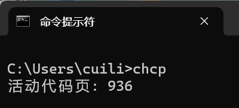
7. 彻底退出安全 / 管家类软件后再试。[腾讯管家](https://getquicker.net/KC/Kb/Article/1118) 某些版本会影响连接，可卸载后测试，正常后再装最新版。
8. 仍无法连接请联系 CL。

### 组件构成

- **Quicker**：发指令并取回结果。
- **ChromeAgent.exe**：消息代理，连接 Quicker 和浏览器扩展。安装或升级后首次启动时拷到「应用数据文件夹\bin\NativeMessageHost」。
- **浏览器扩展**：收指令、执行、返回结果。

## 相关链接

<RelatedDocs
  items={[
    {
      href: '/v2/xaction/modules/getchromeurl',
      label: '获取浏览器网址',
      description: '只读当前标签网址。',
    },
    {
      href: '/v2/xaction/guides/web-page-control',
      label: '网页控制示例',
      description: '填表、勾选、多选列表。',
    },
    {
      href: '/v2/xaction/guides/chrome-ext-settings',
      label: '设置浏览器扩展',
      description: '开发者模式与允许运行用户脚本。',
    },
    {
      href: '/v2/xaction/guides/browser-multiprofile',
      label: '多个 Profile',
      description: '同一浏览器多个账号时怎么连。',
    },
  ]}
/>

### 参考文档

- HTML：[W3School](https://www.w3school.com.cn/html/index.asp)
- CSS 选择器：[W3School](https://www.w3school.com.cn/cssref/css_selectors.asp)
- JavaScript：[W3School](https://www.w3school.com.cn/js/index.asp)、[菜鸟教程](https://www.runoob.com/js/js-tutorial.html)、[廖雪峰](https://www.liaoxuefeng.com/wiki/1022910821149312)
- jQuery：[菜鸟教程](https://www.runoob.com/jquery/jquery-tutorial.html)
- Chrome API：[官方](https://developer.chrome.com/extensions/api_index)、[国内镜像](http://docs.getquicker.cn/chrome/developer.chrome.com/extensions.html)

## 更新说明

- 20230207 增加无法连接问题排查。
- 20230316 触发事件支持 native 方式。
- 20231015 去除创建新窗口实例参数中的 active 字段（浏览器不支持）。
- 202505 更新 MV3 版本浏览器扩展。
