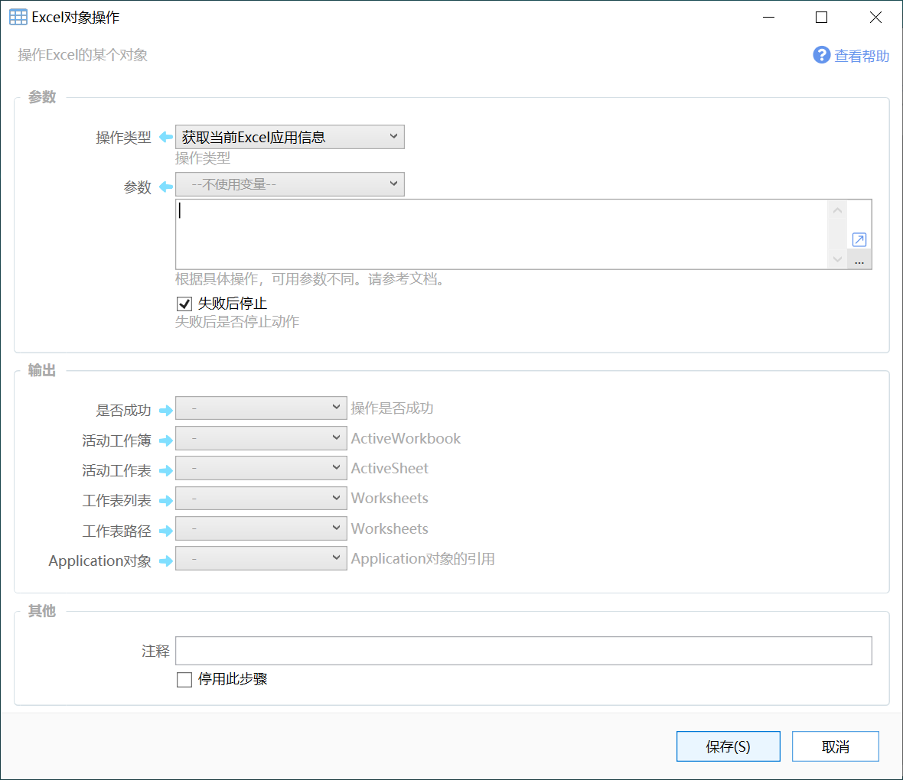
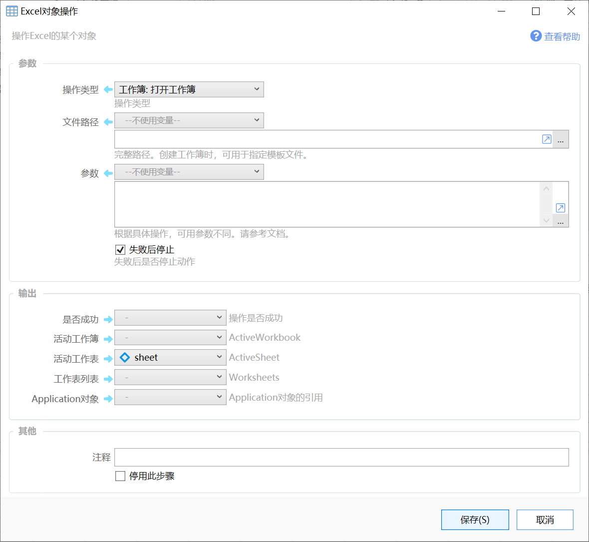
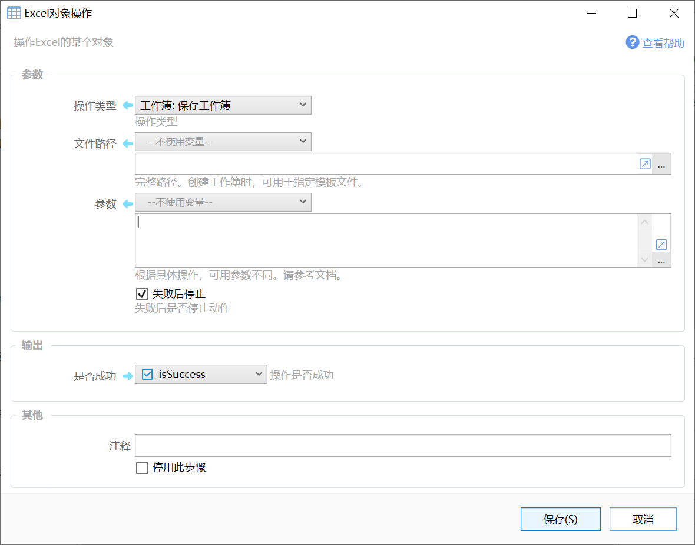
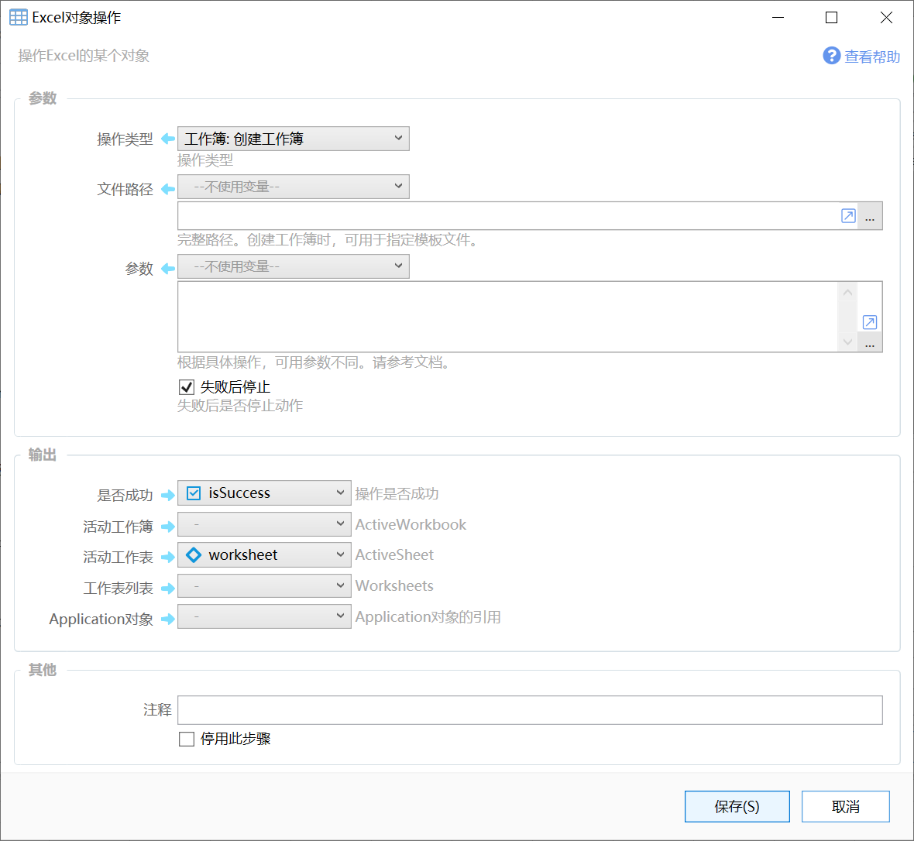

# Excel对象操作

操作Excel的某个对象

{/* xaction-metadata:start */}
## 当前模块定义

- 模块 Key：`sys:excelObjects`
- 分类：第三方软件交互（`SoftInteraction`）
- 类型：`Action`
- 风险操作：否
- 专业版：否

## 输入参数

| Key | 名称 | 类型 | 默认值 | 必填 | 变量模式 | 条件 | 说明 |
| --- | --- | --- | --- | --- | --- | --- | --- |
| `operation` | 操作类型 | `Enum` |  | 是 | `Input` |  | 操作类型 |
| `workbook` | 工作簿对象 | `Object` |  | 否 | `UseVarOrInput` | 仅：SaveWorkbook, CloseWorkbook, SelectWorksheet | 根据具体操作，可用参数不同。请参考文档。 |
| `params` | 参数 | `Text` |  | 否 | `UseVarOrInput` |  | 根据具体操作，可用参数不同。请参考文档。 |
| `path` | 文件/模板路径 | `Text` |  | 否 | `UseVarOrInput` | 仅：OpenFile, SaveWorkbook, CreateWorkbook | 完整路径。创建工作簿时，用于指定模板文件。 |
| `stopIfFail` | 失败后停止 | `Boolean` | true | 否 | `Input` |  | 失败后是否停止动作 |

## 输出参数

| Key | 名称 | 类型 | 条件 | 说明 |
| --- | --- | --- | --- | --- |
| `isSuccess` | 是否成功 | `Boolean` |  | 操作是否成功 |
| `application` | Application对象 | `Object` | 仅：ApplicationInfo, OpenFile, CreateWorkbook | Application对象的引用 |
| `activeWorkbook` | 活动工作簿 | `Object` | 仅：ApplicationInfo, OpenFile, CreateWorkbook | ActiveWorkbook |
| `activeSheet` | 活动工作表 | `Object` | 仅：ApplicationInfo, OpenFile, CreateWorkbook | ActiveSheet |
| `worksheets` | 工作表对象列表 | `Object` | 仅：ApplicationInfo, OpenFile, CreateWorkbook | Worksheets |
| `worksheetNames` | 工作表名称的列表 | `List` | 仅：ApplicationInfo, OpenFile | Worksheets |
| `workbookPath` | 工作簿路径 | `Text` | 仅：ApplicationInfo | Worksheets |

## 选项值

### `operation` 操作类型

| Value | 名称 | 说明 |
| --- | --- | --- |
| `ApplicationInfo` | 获取当前Excel应用信息 |  |
| `OpenFile` | 工作簿: 打开工作簿 |  |
| `SaveWorkbook` | 工作簿: 保存工作簿 |  |
| `CloseWorkbook` | 工作簿: 关闭工作簿 |  |
| `CreateWorkbook` | 工作簿: 创建工作簿 |  |
| `SelectWorksheet` | 工作表：选择工作表 |  |
{/* xaction-metadata:end */}

用于打开或创建工作簿。

注：

-   本模块仍在开发中，目前为预览状态。
-   因为权限原因，Quicker的Excel相关模块不支持对资源管理器或开始菜单中打开的Excel窗口进行操作。
    需要使用本模块“打开工作簿”或“创建工作簿”操作得到的Excel窗口才能进行其他自动化控制。
    可使用此动作：[https://getquicker.net/Sharedaction?code=efa8a4af-4a87-4d52-d718-08d827485760](https://getquicker.net/Sharedaction?code=efa8a4af-4a87-4d52-d718-08d827485760)
-   通过编程方式修改Excel工作簿后，将无法撤销修改。
-   可能需要一定的c#和VBA知识才能方便的使用本模块。

## 各操作类型

### 获取当前Excel应用信息

获取当前打开的Excel软件窗口的信息。

（由于权限不同的原因，只能访问到通过本模块打开的Excel窗口）

在内部使用 `(Excel.Application)Marshal.GetActiveObject("Excel.Application")` 得到相关信息。

**输入**

【参数】不适用于本操作。

**输出**

【是否成功】操作是否成功。

【活动工作簿】当前活动的Workbook对象（[Application.ActiveWorkbook](https://docs.microsoft.com/en-us/dotnet/api/microsoft.office.interop.excel._application.activeworkbook?view=excel-pia)）。

【活动工作表】当前活动的WorkSheet对象（[Application.ActiveSheet](https://docs.microsoft.com/en-us/dotnet/api/microsoft.office.interop.excel._application.activesheet?view=excel-pia)）。

【工作表列表】当前工作簿的WorkSheet对象列表（[\_Application.Worksheets](https://docs.microsoft.com/en-us/dotnet/api/microsoft.office.interop.excel._application.worksheets)）。

【工作簿路径】当前窗口的文件路径（通过\_Application.ActiveWorkbook.FullName得到）。

【Application对象】Marshal.GetActiveObject("Excel.Application")得到的对象本身。

### 打开工作簿

打开指定的excel文件。

**输入**

【文件路径】要打开的Excel文件完整路径。

【参数】可选。每行一个参数（仅提供必要的参数内容），格式为“参数名=参数值”，支持的参数如下：

-   Visible=窗口是否可见 可选值：true/false
-   Password=文件密码
-   Readonly=是否以只读方式打开 可选值：true/false
-   Format=格式。用于打开文本文件时指定分隔字符。可选值为下列数字之一：

-   1 Tabs
-   2 Commas
-   3 Spaces
-   4 Semicolons
-   5 Nothing

**输出**

【活动工作簿】当前活动的Workbook对象（[Application.ActiveWorkbook](https://docs.microsoft.com/en-us/dotnet/api/microsoft.office.interop.excel._application.activeworkbook?view=excel-pia)）。

【活动工作表】当前活动的WorkSheet对象（[Application.ActiveSheet](https://docs.microsoft.com/en-us/dotnet/api/microsoft.office.interop.excel._application.activesheet?view=excel-pia)）。

【工作表列表】当前工作簿的WorkSheet对象列表（[\_Application.Worksheets](https://docs.microsoft.com/en-us/dotnet/api/microsoft.office.interop.excel._application.worksheets)）。

【工作簿路径】当前窗口的文件路径（通过\_Application.ActiveWorkbook.FullName得到）。

【Application对象】打开此文件的Application对象。如果之前已经存在Application对象，则使用已存在的，否则创建一个新的Application对象。通常每个Application对象对应一个Excel进程。

### 保存工作簿

保存当前工作簿。

输入

【工作簿】（1.9.5）要保存的工作簿，如果未指定，则保存当前活动工作簿。

【文件路径】要保存到的位置。如果路径为空，则效果类似于按下Excel的保存按钮。

【参数】使用“参数=值”的形式设置保存参数，每行一个。支持的参数如下：

-   SaveCopy=是否保存副本。 可选值为true/false。保存副本时不支持其他参数。
-   CloseWorkbook=是否关闭工作簿。可选值true/false。
-   CloseApplication=是否关闭Excel。可选值true/false。
-   Password=密码。
-   FileFormat=保存文件格式，可选值请参考：[https://docs.microsoft.com/en-us/dotnet/api/microsoft.office.interop.excel.xlfileformat?view=excel-pia](https://docs.microsoft.com/en-us/dotnet/api/microsoft.office.interop.excel.xlfileformat?view=excel-pia)

### 创建工作簿

创建一个新的工作簿。

输入

【文件路径】可选。在需要时指定模板文件完整路径。

【参数】（需1.9.5+）在不指定模板文件的情况下，设定初始创建的工作表名称。每行一个，格式为“+:工作表名称”，例如：

+:工作表1
+:工作表2

### 选择工作表

（1.9.5+）选择（激活）某个工作表。

输入

【工作簿对象】指定要激活哪个工作簿对象的工作表。留空表示操作当前活动工作簿。

【参数】指定激活的工作表，可以使用如下方式：

-   index=工作表序号（从1开始）
-   name=工作表名称

请确保工作表是存在的。

## 示例动作

-   自动生成乘法口诀，写入d:\\test.xlsx文件。[https://getquicker.net/sharedaction?code=8a38e78c-2edf-4c8b-1506-08d8255d6cc9](https://getquicker.net/sharedaction?code=8a38e78c-2edf-4c8b-1506-08d8255d6cc9)
-   打开Excel文件：[https://getquicker.net/sharedaction?code=efa8a4af-4a87-4d52-d718-08d827485760](https://getquicker.net/sharedaction?code=efa8a4af-4a87-4d52-d718-08d827485760)
-   选择工作表：[https://getquicker.net/sharedaction?code=5a3e75ce-5a1c-4d1d-d71a-08d827485760](https://getquicker.net/sharedaction?code=5a3e75ce-5a1c-4d1d-d71a-08d827485760)
