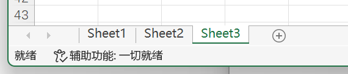
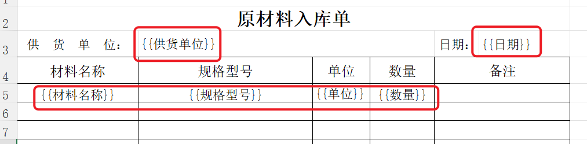

# Excel文件读写

不启动 Excel，用 [NPOI](https://github.com/nissl-lab/npoi) 直接读写 `.xls` / `.xlsx`（1.32.6+）。不需要安装 Office 或 WPS。要控制已经打开的 Excel 窗口，用 [Excel对象操作](/v2/xaction/modules/excelobjects) 或 [Excel区域操作](/v2/xaction/modules/excelrange)——两边的工作簿 / 工作表对象互不通用。

## 当前模块定义

<XActionModuleMeta moduleKey="sys:excelreadwrite" />

## 概述

- **工作簿**（Workbook）：一个 Excel 文件。
- **工作表**（Worksheet / Sheet）：文件里的一张表。下图这个文件有 Sheet1、Sheet2、Sheet3。



## 限制与排障

- 改文件前先备份。本模块方便读写数据，不是完整的 Excel 排版工具。
- 列标题两侧不要有空格；尽量用文本格式，减少转换丢精度。
- 工作表参数若是数字，按序号找；否则按名称。数字当名称时写成 `:2`。
- 覆盖已有文件可能丢掉 NPOI 不支持的特性，重要文档不要直接覆盖。
- 打开时报「已存在具有相同键的条目」，多半有完全空白的 Sheet，见 [讨论](https://getquicker.net/QA/Question/18876)。

## 操作类型

### 打开Workbook

打开一个Excel文件，并返回工作簿(Workbook)对象（用于在后面的步骤中对其内容进行操作）。

<ModuleParamPreview
  moduleKey="sys:excelreadwrite"
  focusKeys={[
    'operation',
    'filePath',
    'isSuccess',
    'workbook',
    'numberOfSheets',
    'worksheetNameList',
    'sheet',
    'firstRow',
    'lastRow',
  ]}
  values={{operation: 'load'}}
  inputVars={{filePath: 'rowFilePath'}}
  outputVars={{workbook: 'workbook', sheet: 'sheet'}}
/>

**输入参数**

**文件路径**：要打开的Excel文件路径。支持Excel 2003格式(.xls) 和 Excel2007格式(.xlsx)。

**输出参数**

**工作簿对象**：生成的工作簿对象。使用此对象在后续步骤对文档内容进行读写。

**工作表个数**：文档中的工作表Sheet个数。

**工作表名称列表**：文档中工作表的名称列表。

**工作表对象**：返回工作簿中的第一个工作表对象。因为多数情况是对工作簿中的第一个工作表进行读写操作，这里直接返回该工作表对象，可以减少一个获取工作表的步骤。

**首行序号**：第一个工作表的首行数据序号（以0开始计算）。

**末行序号**：第一个工作表的末行数据序号（以0开始计算）。

### 创建工作簿

创建一个新的Excel文档。

<ModuleParamPreview
  moduleKey="sys:excelreadwrite"
  focusKeys={['operation', 'fileType', 'isSuccess', 'workbook']}
  values={{operation: 'newWorkbook', fileType: 'XSSF'}}
  outputVars={{workbook: 'workbook'}}
/>

**输入参数**

**工作簿类型**：文档类型。

-   建议使用XSSF类型。此处的类型需要和保存文件时使用的文件扩展名匹配。
-   HSSF（Excel 2003版本）格式有一些功能限制（如不支持设置格式。）

**输出参数**

**工作簿对象**：创建的Workbook对象。

### 保存工作簿

将工作簿对象存入Excel文件中。

注意事项：

-   在更新工作簿内容后，需要使用保存工作簿的步骤之后，才会实际写入excel文档中。
-   因为NPOI组件可能无法支持所有的Excel功能，如果覆盖已有文件可能导致部分信息丢失，所以通常仅用此功能写入完全自动生成的Excel文档，重要的Excel文档请提前做好备份。

<ModuleParamPreview
  moduleKey="sys:excelreadwrite"
  focusKeys={['operation', 'filePath', 'workbook', 'isSuccess']}
  values={{operation: 'save', filePath: 'd:\\test.xlsx'}}
  inputVars={{workbook: 'workbook'}}
/>

**输入参数**

**文件路径**：保存的目标文件路径。

-   如果路径已存在，将会被覆盖。
- 文件名后缀需要与文档类型一致（HSSF 对应 `.xls`，XSSF 对应 `.xlsx`）。

**工作簿对象**：要保存的Workbook对象。将此对象的内容存入路径生成Excel文件。

### 获取Sheet（工作表）

从工作簿中获取一个工作表对象（以便于在后续步骤中读取或写入内容）。

<ModuleParamPreview
  moduleKey="sys:excelreadwrite"
  focusKeys={[
    'operation',
    'workbook',
    'sheetIndex',
    'isSuccess',
    'sheet',
    'firstRow',
    'lastRow',
  ]}
  values={{operation: 'getSheet', sheetIndex: '0'}}
  inputVars={{workbook: 'workbook'}}
  outputVars={{sheet: 'sheet'}}
/>

**输入参数**

**工作簿对象**：要从哪个Workbook对象中读取工作表。

**工作表序号或名称**：设定更要读取的序号或名称。

-   如果参数值是数字，则按序号查找工作表。如果该序号不存在，则将其当做工作表名称查找工作表。
-   如果参数值不是数字，则按名称查找。
-   如果希望返回某个以数字命名的工作表，可以使用 `:数字` 的格式指定。如`:2`将会返回名称为“2”的工作表，而不是序号为2的。
-   尽量避免使用纯数字的工作表名称。

**输出参数**

**工作表对象**：返回找到的Worksheet对象。

**首行序号**：Worksheet数据范围的第一行序号（从0开始）。

**末行序号**：Worksheet数据范围的最后一行序号（从0开始）。

注：如果工作区还没有数据，首行行号和末行行号都会返回0。

### 创建Sheet（工作表）

在指定的工作簿中创建一个新的工作表。

<ModuleParamPreview
  moduleKey="sys:excelreadwrite"
  focusKeys={['operation', 'workbook', 'sheetName', 'isSuccess', 'sheet']}
  values={{operation: 'createSheet', sheetName: 'Sheet1'}}
  inputVars={{workbook: 'workbook'}}
  outputVars={{sheet: 'sheet'}}
/>

**输入参数**

**工作簿对象**：指定要创建工作表的工作簿对象。

**工作表名称**：要创建的工作表名称。

-   不能含有这些字符： `[ ] * / \ ? :`。
-   工作表名称不能重复。

**输出参数**

**工作表对象**：创建好的工作表对象。

### 获取行

返回工作表的某一行的信息。通常用于遍历工作表内所有单元格时使用。

注：如果指定的行不存在，则本步骤会执行失败。

<ModuleParamPreview
  moduleKey="sys:excelreadwrite"
  focusKeys={[
    'operation',
    'worksheet',
    'rowIndex',
    'isSuccess',
    'firstCellNum',
    'lastCellNum',
  ]}
  values={{operation: 'getRow', rowIndex: '0'}}
  inputVars={{worksheet: 'sheet'}}
  outputVars={{firstCellNum: 'firstCol', lastCellNum: 'lastCell'}}
/>

**输入参数**

**工作表对象**：要读取的工作表。

**行序号**：要读取信息的行序号（从0开始）。

**输出参数**

**是否成功**：如果行不存在，返回失败。（需取消选中“失败后停止”选项，否则动作本身会停止也就不会输出是否成功了。）

**首个单元格序号**：行内第一个单元格的序号（从0开始）。

**末个单元格序号**：行内最后一个单元格的序号（从0开始）。

注：Excel在保存数据时，仅仅保存那些可能有数据的单元格而不是所有单元格。因此某些单元格可能是“不存在”的。

### 查找单元格

查找首个具有特定值的单元格。（1.33.12+版本）

<ModuleParamPreview
  moduleKey="sys:excelreadwrite"
  focusKeys={[
    'operation',
    'worksheet',
    'cellValue',
    'isSuccess',
    'firstRow',
    'firstCellNum',
    'cellAddress',
  ]}
  values={{operation: 'getCellByValue', cellValue: 'NS XIAMEN'}}
  inputVars={{worksheet: 'sheet'}}
  outputVars={{
    firstRow: 'row',
    firstCellNum: 'col',
    cellAddress: 'cellAddress',
  }}
/>

**输入参数**

**工作表对象**：要读取的工作表。

**值**：要查找的内容。查找将按照从上到下、从左到右的顺序进行，完全相等的情况下才判断为匹配。

注：对于非文本类型单元格，如 日期、时间、数字等，请先使用“读取单元格”操作获得“文本值”，再通过此文本值查找定位单元格。 [参考讨论](https://getquicker.net/QA/Question/17639)

**输出参数**

**是否成功**：如果行不存在，返回失败。（需取消选中“失败后停止”选项，否则动作本身会停止也就不会输出是否成功了。）

**首行序号**：单元格所在行号（从0开始）。

**首个单元格序号**：单元格所在列号（从0开始）。

**单元格地址**：类似于`B2`这样格式的单元格地址值（文本类型）。

### 读取单元格

读取单元格的数据。

<ModuleParamPreview
  moduleKey="sys:excelreadwrite"
  focusKeys={[
    'operation',
    'worksheet',
    'cellAddress',
    'rowIndex',
    'cellIndex',
    'isSuccess',
    'hasValue',
    'cellValue',
    'cellTextValue',
    'cellType',
    'cellFormula',
    'cellDataFormatString',
  ]}
  values={{operation: 'getCell', rowIndex: '0', cellIndex: '0'}}
  inputVars={{worksheet: 'sheet'}}
  outputVars={{
    hasValue: 'hasValue',
    cellValue: 'cellValue',
    cellTextValue: 'text',
    cellType: 'valueType',
    cellFormula: 'formula',
    cellDataFormatString: 'format',
  }}
/>

**输入参数**

**工作表对象**：要读取的工作表对象。

**单元格地址**：以Excel单元格地址的方式指定要读取的单元格。如“A1”（表示工作表左上角单元格）等。指定此值时，忽略“行序号”和“列序号”。

**行序号** / **列序号**：通过数字序号指定要读取的单元格，从 0 开始。

**输出参数**

**是否有值**：所指定的单元格是存在并且非空白。

**值**：单元格的值，可能为文本、数字、布尔或日期时间类型。

**文本值**：转换为文本格式后的值。

**类型**：单元格类型，可能为 `Numeric`、`String`、`Formula`、`Blank`、`Boolean`、`Error` 等值。（Excel中的日期时间是用数字类型存储的）

**公式**：对于公式类型的单元格，返回其公式内容（不带开始的“=”字符）。

**数据格式字符串**：单元格的数据格式信息。

### 写入单元格

向指定单元格写入数据。

<ModuleParamPreview
  moduleKey="sys:excelreadwrite"
  focusKeys={[
    'operation',
    'worksheet',
    'cellAddress',
    'rowIndex',
    'cellIndex',
    'cellType',
    'cellValue',
    'dataFormat',
    'cellLink',
    'isSuccess',
  ]}
  values={{
    operation: 'setCell',
    rowIndex: '0',
    cellIndex: '0',
    cellType: 'Numeric',
    cellValue: '$=DateTime.Now',
    dataFormat: 'yyyy年MM月dd日',
  }}
  inputVars={{worksheet: 'sheet'}}
/>

**输入参数**

**工作表对象**：要读取的工作表对象。

**单元格地址**：以Excel单元格地址的方式指定要写入的单元格。如“A1”（表示工作表左上角单元格）等。指定此值时，忽略“行序号”和“列序号”。

**行序号** / **列序号**：通过数字序号指定要写入的单元格，从 0 开始。

**单元格类型**：指定单元格的类型。

**值**：向单元格写入的值。如果单元格类型为公式时，指定去除“=”开始字符的公式内容。

**数据格式**：数字和日期时间格式的格式化字符串。

**链接**：为单元格设置链接。支持如下类型的链接：

-   邮件，格式为`mailto:user@domina.com`。
-   网址，以 `http://`或`https://`开始。
-   文件路径：以`file:`前缀开始的完整路径或相对路径。如：`file:D:\Docs\Sunlogin Files\sunlogin_20220405100851.bmp` 或 `file:模板文件.xlsx`
-   其它内容作为文档内链接。

-   如果链接内容为某个Sheet的名称，则自动转换为对该Sheet第一个单元格的引用。例如`Sheet2`自动转换为`'Sheet2'!A1`
-   其他内容直接作为链接值存入，请自行确定引用位置的合法性。

### 写入多行数据

将多行数据内容写入工作表的指定列中。

<ModuleParamPreview
  moduleKey="sys:excelreadwrite"
  focusKeys={[
    'operation',
    'sourceData',
    'columnMapping',
    'worksheet',
    'rowIndex',
    'writeTitleRow',
    'isSuccess',
  ]}
  values={{
    operation: 'writeData',
    columnMapping: '#\nF:红\nG:橙\nH:黄\nI:绿',
    rowIndex: '6',
    writeTitleRow: 'false',
  }}
  inputVars={{sourceData: 'sourceSheet', worksheet: 'targetSheet'}}
/>

**输入参数**

**源数据**：数据源对象，可以为：

-   另一个工作表对象。要求：工作表的首行应该标题行，有数据的行第一列不应该为空。各标题前后应避免有空格造成无法匹配。
-   表格类型的变量（DataTable对象）。

**字段映射**：设定应该把哪个字段的数据放入哪一列中。

（1）在目标表存在标题行（目标区域的第一行为标题行），此时的设定方式：

-   字段映射第一行写`=`
-   如果目标表标题和源数据的各字段标题一致，则不需要做其他设置。
-   对于两边标题不一致的列，每个需要转换的列标题写一行规则，格式为：`目标列标题:源数据列标题`

（2）复制所有字段到目标表中。此时设定方式：

-   字段映射第一行写`*`
-   需要更改字段标题的列，每一个创建一行规则，格式为：`目标列标题:源数据列标题`

（3）复制某些字段到指定的列中。此时目标列可以不连续。此时设定方式：

-   字段映射第一行写`#`
-   每个要复制的列创建一行规则，格式为`列序号或列名:源数据列名`，列序号为从0开始的数字，列名为ABCD这样的字符(就像在Excel中显示的那样)。

（4）复制某些指定的列，设定方式：

-   每行指定一个要复制的列。
-   如果列名不需要改变，直接写列名，如果需要改变，则按格式`目标列名:源列名`填写。

**工作表对象**：要写入的工作表。

**行序号**：从哪一行开始写入数据。

**写入标题行**：是否在目标位置第一行各列写入标题（否则直接写数据）。如果目标表已经存在标题行（字段映射设置首行为“=”，则忽略此选项）。

### 合并单元格

<ModuleParamPreview
  moduleKey="sys:excelreadwrite"
  focusKeys={['operation', 'worksheet', 'cellRange', 'isSuccess']}
  values={{operation: 'mergeCells', cellRange: 'A1:F1'}}
  inputVars={{worksheet: 'sheet'}}
/>

输入参数

**工作表对象**：要操作的工作表对象。

**单元格范围**：指定要合并的单元格范围，支持两种格式：

-   Excel范围地址格式，如`A1:F2`
-   4个数字，分别指以0开始的“开始行号,结束行号,开始列号,结束列号”，如：`0,0,0,5`

### 冻结窗格

锁定行列禁止滚动。

<ModuleParamPreview
  moduleKey="sys:excelreadwrite"
  focusKeys={['operation', 'worksheet', 'rowIndex', 'cellIndex', 'isSuccess']}
  values={{operation: 'freezePane', rowIndex: '1', cellIndex: '1'}}
  inputVars={{worksheet: 'sheet'}}
/>

**输入参数**

**工作表对象**：需要冻结窗格的工作表对象。

**行序号**：冻结到哪一行（从0开始）。

**列序号**：冻结到哪一列（从0开始）。

### 自动筛选

设定列标题单元格自动筛选。

<ModuleParamPreview
  moduleKey="sys:excelreadwrite"
  focusKeys={['operation', 'worksheet', 'cellRange', 'isSuccess']}
  values={{operation: 'autoFilter', cellRange: 'A1:E1'}}
  inputVars={{worksheet: 'sheet'}}
/>

**输入参数**

**工作表对象**：要建立筛选的工作表。

**单元格范围**：指定位筛选单元格的范围。

### 设置区域单元格样式

设置某个区域中单元格的外观样式，如字体、边框、对齐等。

仅支持对Excel2007格式的工作簿对象设置样式。

<ModuleParamPreview
  moduleKey="sys:excelreadwrite"
  focusKeys={['operation', 'worksheet', 'cellRange', 'styleData', 'isSuccess']}
  values={{
    operation: 'setStyle',
    cellRange: 'A1:F8',
    styleData:
      'font.Name:仿宋\nfont.Height:30\nfont.Italic:true\nfont.Strikeout:true\nfont.Color:#FF0000\nfont.Bold:true\nfont.underline:2\nborder.All:Thin,#00FF00\nborder.Bottom:Double,#0000FF\nhorz:right',
  }}
  inputVars={{worksheet: 'sheet'}}
/>

**输入参数**

**工作表对象**：要操作的工作表对象。

**单元格范围**：需要更新样式的单元格范围。

**样式设置**：

-   仅设置需要更改的样式；
-   这些代码规则可以组合在一起使用，但不需要全部使用；
-   底层库在更新样式时可能存在一些BUG，请测试验证；
-   尽量先设置样式后更新数据，更新数据时可能会对样式有所影响；

```text
font.Name:仿宋
font.Height:30
font.Italic:true
font.Strikeout:true
font.Color:#FF0000
font.Bold:true
font.underline:2
border.All:Thin,#00FF00
border.Bottom:Double,#0000FF
horz:right
vert:bottom
fillpattern:SolidForeground
background:#F0F0F0
foreground:#FFFAFA
wraptext:true
border.outside:Thick,#FF0000
```

格式说明（实际填写时避免空格）：

-   字体相关

-   `font.name:字体名称`
-   `font.height:字号点数`(数字)
-   `font.italic:是否斜体`(true/false)
-   `font.strikeout:是否删除线`(true/false)
-   `font.color:文字颜色` 格式为#RRGGBB
-   `font.underline:下划线`可选值：0（无下划线），1（单下划线），2（双下划线），33（每个字符的单下划线），34（每字符双下划线）。

-   边框相关：

-   `border.all:边框风格,边框颜色` 统一设定区域内所有单元格的边框风格设置。边框风格请参考下面内容，边框颜色格式为#RRGGBB。
-   `border.top:边框风格,边框颜色` 单独设定顶部边框的风格和颜色
-   `border.right:边框风格,边框颜色` 单独设定右边框的风格和颜色
-   `border.bottom:边框风格,边框颜色` 单独设定底部边框的风格和颜色
-   `border.left:边框风格,边框颜色` 单独设定左边框的风格和颜色
-   `border.outside:区域外观风格,颜色`区域外边框风格和颜色（建议放在风格设置的末尾）
-   边框风格可选值：`None`无 `Thin`细`Medium`中等 `Dashed`虚线 `Dotted`点线 `Thick`厚 `Double`双线 `Hair`无 `MediumDashed` `DashDot` `MediumDashDot` `DashDotDot``MediumDashDotDot` `SlantedDashDot`，请[参考这里](https://github.com/nissl-lab/npoi/blob/37a8435dc4d613d9cf6145d044e4bf28bdfc3e4e/main/SS/UserModel/BorderStyle.cs)。

-   背景填充

-   `fillpattern:NoFill` 填充风格，可选值请[参考这里](https://github.com/nissl-lab/npoi/blob/37a8435dc4d613d9cf6145d044e4bf28bdfc3e4e/main/SS/UserModel/FillPattern.cs)，默认为不填充（NoFill）。如需使用纯色填充，请使用模式`SolidForeground`，结合下面的`foreground`参数设置颜色。
-   `background:#F0F0F0` 填充花纹背景色。
-   `foreground:#FFFAFA` 填充填充花纹前景色。

-   其它

-   `horz:水平对齐` 可选值`General` `Left``Center` `Right``Justify``Fill``CenterSelection` `Distributed`，请[参考这里](https://github.com/nissl-lab/npoi/blob/37a8435dc4d613d9cf6145d044e4bf28bdfc3e4e/main/SS/UserModel/HorizontalAlignment.cs)，可以填写名称也可以填写对应的数字值。
-   `vert:垂直对齐` 可选值`None` `Top` `Center` `Bottom` `Justify` `Distributed`, 请参考这里，可以填写名称也可以填写对应的数字值，请[参考这里](https://github.com/nissl-lab/npoi/blob/37a8435dc4d613d9cf6145d044e4bf28bdfc3e4e/main/SS/UserModel/VerticalAlignment.cs)，可以填写名称也可以填写对应数字值。
-   `wraptext:true` 单元格内的内容是否自动换行。

### 批量提取数据

将工作簿中指定位置的数据提取到词典的对应键值中。

<ModuleParamPreview
  moduleKey="sys:excelreadwrite"
  focusKeys={['operation', 'workbook', 'readDataMap', 'isSuccess', 'dictData']}
  values={{
    operation: 'readData',
    readDataMap: 'table:A1:D4\ntest:[Sheet2]A1',
  }}
  inputVars={{workbook: 'workbook'}}
  outputVars={{dictData: 'dictData'}}
/>

**输入参数**

**工作簿对象**：要读取数据的工作簿对象。

**提取数据定义**：指定哪个位置的数据放入词典的哪个键的值中。

-   每行一条规则，格式为`词典键名:数据位置`。
-   数据位置：使用`[工作表序号或名称]单元格位置`的形式定义。“工作表序号或名称”如果指定了一个数字，将被优先当做从0开始的工作表序号处理。
-   如果是第一个工作表中的单元格，可以省略工作表部分，直接指定单元格位置，如：`Name:B2`。
-   支持单值和表格形式的数据。表格数据时，指定所在区域。如`[Sheet1]A1:D10`，该区域的第一行应为标题行。表格数据将使用DataTable类型对象保存在词典的值中， 在使用时需强制转换一下。

### 批量模板替换

将表格中的模板字段替换为实际的值。



用于根据汇总表及模板表批量生成Excel文件。实际的使用过程大概为：对于汇总表中的每行数据，创建一个模板文件的副本。将该行数据的每一列填充的副本文件的模板字段中。

<ModuleParamPreview
  moduleKey="sys:excelreadwrite"
  focusKeys={[
    'operation',
    'worksheet',
    'replaceDict',
    'replacePrefixSuffix',
    'isSuccess',
  ]}
  values={{
    operation: 'batchReplace',
    replaceDict: '供货单位:立冶合讯科技有限公司\n单位:套\n数量:5',
    replacePrefixSuffix: '{{\n}}',
  }}
  inputVars={{worksheet: 'sheet'}}
/>

**输入参数**

**工作表对象**：要填充数据的工作表对象。

**替换数据词典**：词典格式的数据，键为模板文件中的字段名，值为要实际填充的内容。

**占位符前后缀**：在模板文件中，使用类似于 `{{字段名}}`的形式定义要填充的位置。我们称 `{{字段名}}`为占位符，其中`{{`便是占位符的前缀，`}}`便是占位符的后缀。可以根据需要自定义占位符的前后缀，避免它和文档中的其它内容有冲突。定义式分两行填写，第一行填写前缀，第二行填写后缀。

## 示例动作

这些动作步骤较多，用卡片打开即可。

<ShareLinkCard
  code="bb16cf76-5b79-4327-4cdf-08da16aad73c"
  title="示例：乘法口诀2"
  description="生成一个乘法口诀表"
  author="CL"
/>

<ShareLinkCard
  code="5d5f0aa4-29fd-4db3-5f2a-08da0ff5530e"
  title="模板生成Excel"
  description="按汇总表和模板，为每行生成单独文件"
  author="CL"
/>

<ShareLinkCard
  code="63e550e1-aa9f-478e-f824-08da38cccadf"
  title="表格数据提取"
  description="按某一列的值，从 Excel 提取其它列"
  author="CL"
/>

## 通过表达式调用NPOI对象的方法

本模块仅封装了NPOI对象的一部分方法，如果需要更多的控制，可以在表达式中对工作簿和工作表对象的方法进行调用。

如：

**设置列宽**

`**$=****{worksheet}**.**SetColumnWidth**(1, 20*256);`

列宽的单位是 **1/256 个字符宽度**。上面的表达式将从0开始的序号为1的列设置为 20 个字符宽（20 \* 256）。&#123;worksheet&#125;为工作表对象。

**设置行高**

`**$=****{worksheet}**.**GetRow**(2).Height = 40*20;`

行高的单位是 **1/20 个点（twips）**。上面的表达式将从0开始的序号为2的行高设置行为 40 点。&#123;worksheet&#125;为工作表对象。

**自动列宽**

`$= {worksheet}.AutoSizeColumn(0);` // 自动调整第1列的宽度。&#123;worksheet&#125;为工作表对象。

## 相关链接

<RelatedDocs
  items={[
    {
      href: '/v2/xaction/modules/excelrange',
      label: 'Excel区域操作',
      description: '控制已打开的 Excel 窗口。对象不通用。',
    },
    {
      href: '/v2/xaction/modules/excelobjects',
      label: 'Excel对象操作',
      description: '工作簿 / 工作表对象（Interop）。',
    },
    {
      href: '/v2/xaction/modules/officehelper',
      label: 'Office软件辅助',
      description: 'VBA 和功能区命令。',
    },
  ]}
/>

## 更新历史

-   20230623 增加写入Workbook的注意信息、打开Workbook的一种错误原因的说明。
-   20250803 增加wraptext设置的说明、表达式调用npoi方法的说明。
