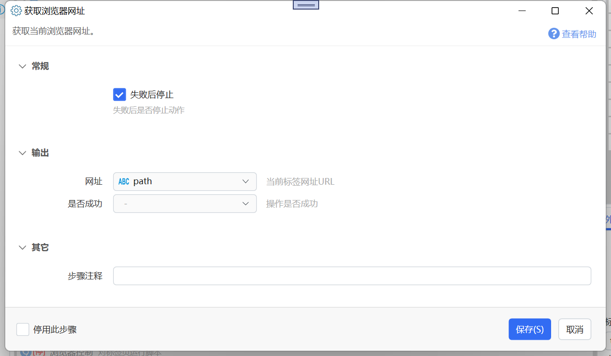

# 获取浏览器网址

获取当前浏览器网址。

{/* xaction-metadata:start */}
## 当前模块定义

- 模块 Key：`sys:getChromeUrl`
- 分类：第三方软件交互（`SoftInteraction`）
- 类型：`Action`
- 风险操作：否
- 专业版：否

## 输入参数

| Key | 名称 | 类型 | 默认值 | 必填 | 变量模式 | 条件 | 说明 |
| --- | --- | --- | --- | --- | --- | --- | --- |
| `stopIfFail` | 失败后停止 | `Boolean` | true | 否 | `Input` |  | 失败后是否停止动作 |

## 输出参数

| Key | 名称 | 类型 | 条件 | 说明 |
| --- | --- | --- | --- | --- |
| `isSuccess` | 是否成功 | `Boolean` |  | 操作是否成功 |
| `output` | 网址 | `Text` |  | 当前标签网址URL |
{/* xaction-metadata:end */}

## 使用说明

获取当前浏览器窗口的网址。

对于chrome、msedge和firefox进程，它会首先尝试通过浏览器扩展接口获取网址。

如果失败了，会尝试模拟Ctrl+L跳转到地址栏复制网址。

