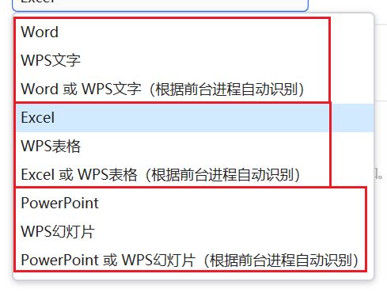
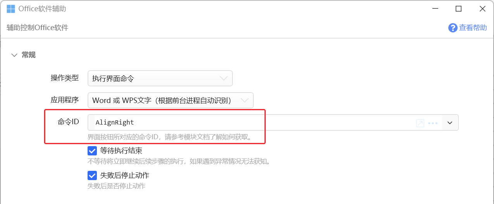
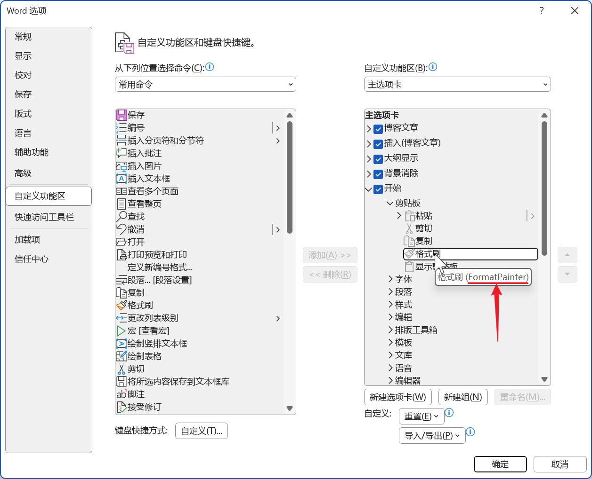
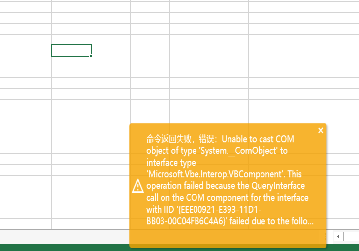
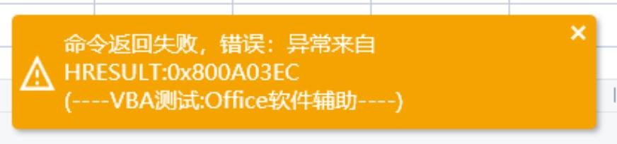

# Office软件辅助

辅助控制Office软件

## 当前模块定义

<XActionModuleMeta moduleKey="sys:officehelper" />

本模块为测试状态，欢迎反馈问题。

对当前Office软件窗口执行VBA宏代码、对文档或选定对象设置格式等。

特别感谢网友**@Zetalpha**，执行VBA脚本功能主要参考Zetalpha的子程序实现。

如果您在使用中遇到什么问题，欢迎通过官网讨论区反馈。

提示：

-   本步骤使用低权限方式运行，不能用于使用“管理员身份”启动的Office或wps程序。
-   如果禁用系统UAC（用户账户控制设置），可能会影响本模块的运行。

## 执行VBA代码

**前置条件：**

-   Office 系列软件需要开启**【信任对 VBA 工程对象模型的访问】**选项。
-   WPS 软件需要安装VBA模块，并开启【信任对于“Visual Basic项目”的访问】选项。
-   以上选项开启方法请[参考本文](https://getquicker.net/KC/Kb/Article/1049)。

**注意事项：**

-   WPS产品因为其版本众多，每个版本所包含的组件不同，兼容性差异较大，不一定能正常运行。
-   因为底层COM接口的限制，如果同时开启了多个同名进程，可能会获取到错误的活动文档。
-   Excel 软件执行VBA代码后，将会丢失撤销(undo)历史，无法进行撤销操作。因此，请先备份好重要数据，再使用VBA代码。
-   通过Quicker启动运行的Excel程序会被提权，导致[无法控制](https://getquicker.net/QA/Question/16310)。请从Windows启动Excel，或通过打开Excel文档的方式开启Excel。

参考演示：[录制宏并转换为动作](https://getquicker.net/Sharedaction?code=4d774256-f3fa-4c61-72c6-08dac59559d0)

### 参数


**【应用程序】**选择要执行VBA代码的程序。

支持如下选项：



**【VBA宏名称或代码】**

-   如需执行文档中已有的宏，填写宏的名称。
-   否则填写完整的宏代码。通常是这样的格式：

```
Sub 宏名称()
    '宏代码
End Sub
```

您可以在Excel、Word中录制宏，然后将代码修剪后（录制的代码经常会有一些没有什么用的部分）复制到动作中使用。

如需返回内容，请声明Function。如下示例返回Word文档路径：

```
Function GetDocumentFullName() As String
   GetDocumentFullName = ActiveDocument.FullName
End Function
```

自1.39.32版本起，VBA脚本支持不在第一行的sub、function，会自动查找到第一个。支持在第一行使用`'main:主程序sub或function名`的方式指定要执行的主要sub或function。(建议不要修改已有动作，避免旧版本Quicker无法支持）

**【等待执行结束】**

是否等待执行结束后再继续后面的步骤。

如果不等待，在VBA代码执行中遇到的问题将不会有提示和报错。

**【失败后停止动作】**

执行出错后是否停止动作的运行。

【返回内容】

从`Function`方法中返回的内容。1.39.31+版本支持。

## 设置格式、设置对象属性

概述：

-   本功能有点复杂，需要手写对象名称。需要您对VBA对象模型有一定的了解，并且善于查阅微软官方文档以了解各个对象类型的属性和方法。
-   用于对Word/WPS文字、PowerPoint/WPS演示的特定对象设置属性（如对选中文字设置字体、段落格式）。本功能暂**不支持Excel/WPS表格**。
-   本功能**不需要**在Office软件中开启【信任对 VBA 工程对象模型的访问】选项。

-   可参考通过录制宏得到的代码。

### 参数


**【应用程序】**

选择程序类型。目前不支持Excel和WPS表格。

**【格式设置/对象属性赋值】**

用于设置对象属性值的代码。其语法如下：

-   顶格写对象名称。（支持的对象请参考本文后续章节说明）
-   通过**缩进**方式指定要设置的属性（以及下一级属性）。也可以将多个层级的属性名合并在一行，如`.Font.Fill.ForeColor.RGB = #FF0000`（设置字体的颜色）。缩进字符的数量没有限制，只要同一级别的内容缩进位置相同即可。
-   通过`.属性名 = 属性值`的方式赋值。
-   对象名、属性名大小写不敏感。
-   每个对象类型所支持的属性，可以参考VBA文档，或通过查看录制宏所生成的代码了解。
-   也可以通过`.方法名: 参数1,参数2,....`的形式调用参数类型明确的简单方法。
-   对可枚举类型(IEnumerable)类型的对象，可以使用`.*`表示其每个元素。用于对该枚举对象的每个元素调用相同的处理。
-   可以在行的开始使用`//`注释一行
-   布尔类型属性，可以使用`!`表示对当前值取反。[示例动作](https://getquicker.net/Sharedaction?code=dd32199e-8d36-465a-b13d-08dac77c5292)

注：本功能通过c#的反射机制查找属性和方法名称，并根据其类型定义转换属性值。有的参数类型可能无法正常转换。

**【等待执行结束】**

是否等待执行结束后再继续后面的步骤。如果不等待，将会忽略所遇到的任何错误。

### Word 支持说明

#### 所支持的对象列表

| **对象名称** | **说明** | **文档链接** |
| --- | --- | --- |
| Application | Word应用程序对象。 | [VBA](https://learn.microsoft.com/en-us/office/vba/api/word.application) |
| Doc | 当前活动文档。<br />为Application.ActiveDocument的别名。 | [VBA](https://learn.microsoft.com/en-us/office/vba/api/word.application.activedocument) |
| PageSetup | 当前文档的页面设置。<br />为Application.ActiveDocument.PageSetup 的别名。 | [VBA](https://learn.microsoft.com/en-us/dotnet/api/microsoft.office.interop.word.pagesetup?view=word-pia) |
| Selection | 当前选择的内容。<br />为Application.Selection的别名。 | [VBA](https://learn.microsoft.com/en-us/office/vba/api/word.application.selection) |
| Selection.Font | 当前选择内容的字体格式设置。<br />为Application.Selection.Font的别名。 | [VBA](https://learn.microsoft.com/en-us/office/vba/api/word.selection.font) |
| Selection.P | 当前选择内容的段落格式设置。<br />为Application.Selection.ParagraphFormat的别名。 | [VBA](https://learn.microsoft.com/en-us/office/vba/api/word.selection.paragraphformat) |
| Styles.样式名<br />如：styles.标题 1 | 某个样式。<br />用于更新文档中某个样式的字体、段落等设置。 | [VBA](https://learn.microsoft.com/en-us/office/vba/api/word.style) |
| StyleByText | 根据段落文本内容设置段落的样式。用于自动排版功能中，识别标题段落并自动设置成对应的标题样式。 | 见本文后面部分。 |

#### Styles.样式名 ：设置样式的文字和段落格式

样式名可以使用Word的[内置样式名](https://learn.microsoft.com/en-us/dotnet/api/microsoft.office.interop.word.wdbuiltinstyle?view=word-pia)（如`wdStyleHeading1`对应于“标题 1”）或中文样式名（如“标题 1”）。注意，样式名中间的空格需要保留，不然无法匹配。

示例：

```
Styles.正文
  .Font
    .Name = "仿宋"
    .Size = 16
    .Color = wdColorAutomatic
  .ParagraphFormat
    .Alignment = wdAlignParagraphLeft
    .LineSpacingRule = wdLineSpaceExactly
    .LineSpacing = 29
    // 首行缩进
    .CharacterUnitFirstLineIndent = 0
    .MirrorIndents = 0
    .SpaceBefore = 0
    .SpaceAfter = 0

Styles.标题 1
  .Font
    .Name = "黑体"
    .Size = 16

Styles.标题 2
  .Font
    .Name = "楷体"
    .Size = 16

Styles.标题 3
  .Font
    .Name = "仿宋"
    .Size = 16
```

#### StyleByText ：根据文字内容设置段落样式

公文排版标准对各级别标题的样式做了规定。 因此，可以根据段落的文字内容倒推判断其所对应的标题级别，。设置方法：

```
StyleByText
  .样式名1 = "正则表达式(C#语法)"
  .样式名2 = "正则表达式(C#语法)"
  ...更多规则
```

示例：

```
StyleByText
  .标题 1 = "^\s*[一二三四五六七八九十]{1,3}、[^\r]*"
  .标题 2 = "^\s*（[一二三四五六七八九十]{1,3}）[^\r]*"
  .标题 3 = "^\s*\d+[\.]([^。\\r：])*[。]{0,1}"
  .标题 4 = "^\s*（\d+）([^。\\r：])*"
```

#### Selection 选中区域

设置选中内容的样式：

```
selection
  .style = "标题 1"
```

清除选中内容的格式 (结尾的冒号表示调用方法）：

```
Selection
  .ClearFormatting:
```

设置高亮显示颜色（[可选值](https://learn.microsoft.com/en-us/office/vba/api/word.wdcolorindex)）：

```
selection
  .Range.HighlightColorIndex = wdYellow
```

#### PageSetup 页面设置

```
PageSetup
        .LineNumbering.Active = False
        .Orientation = wdOrientPortrait
        .TopMargin =  CentimetersToPoints(2)
        .BottomMargin = CentimetersToPoints(3)
        .LeftMargin = CentimetersToPoints(4)
        .RightMargin = CentimetersToPoints(5)
        .Gutter = CentimetersToPoints(0)
        .HeaderDistance = CentimetersToPoints(1.5)
        .FooterDistance = CentimetersToPoints(1.75)
        .PageWidth = CentimetersToPoints(21)
        .PageHeight = CentimetersToPoints(29.7)
        .FirstPageTray = wdPrinterDefaultBin
        .OtherPagesTray = wdPrinterDefaultBin
        .SectionStart = wdSectionNewPage
        .OddAndEvenPagesHeaderFooter = False
        .DifferentFirstPageHeaderFooter = False
        .VerticalAlignment = wdAlignVerticalTop
        .SuppressEndnotes = False
        .MirrorMargins = False
        .TwoPagesOnOne = False
        .BookFoldPrinting = False
        .BookFoldRevPrinting = False
        .BookFoldPrintingSheets = 1
        .GutterPos = wdGutterPosLeft
        .LayoutMode = wdLayoutModeLineGrid
```

注：上面的代码主体是通过录制宏得到的。

长度/尺寸数值可以直接使用VBA代码中的`CentimetersToPoints(厘米数)`，也可以使用`5.2cm`这样的格式。如使用下面的代码设置一个常规公文文档的页边距：

```
PageSetup
        .TopMargin = 3.7cm
        .BottomMargin = 3.5cm
        .LeftMargin = 2.8cm
        .RightMargin = 2.6cm
```

### PowerPoint 支持说明

#### 所支持的对象列表

| **对象名称** | **说明** | **文档链接** |
| --- | --- | --- |
| Application | PowerPoint应用程序对象。 | [VBA](https://learn.microsoft.com/en-us/office/vba/api/powerpoint.application) |
| Presentation | 当前活动动幻灯片。<br />为Application.ActivePresentation的别名。 | [VBA](https://learn.microsoft.com/en-us/office/vba/api/powerpoint.application.activepresentation) |
| PageSetup | 当前活动幻灯片的页面设置。<br />为Application.ActivePresentation.PageSetup 的别名。 | [VBA](https://learn.microsoft.com/en-us/office/vba/api/powerpoint.presentation.pagesetup) |
| Selection | 当前选择的内容。<br />为Application.ActiveWindow.Selection的别名。 | [VBA](https://learn.microsoft.com/en-us/office/vba/api/powerpoint.selection) |
| Selection.Font | 当前选择内容的字体格式设置。<br />为Application.Selection.TextRange2.Font的别名。 | [VBA](https://learn.microsoft.com/en-us/office/vba/api/office.textrange2.font) |
| Selection.P | 当前选择内容的段落格式设置。<br />为Application.Selection.TextRange2.ParagraphFormat的别名。 | [VBA](https://learn.microsoft.com/en-us/office/vba/api/office.textrange2.paragraphformat) |
| selection.shapes | 当前所选中的图形。为Application.Selection.ShapeRange的别名。 | [VBA](https://learn.microsoft.com/en-us/office/vba/api/powerpoint.selection.shaperange) |

#### 示例

设置幻灯片大小为A4纸张，水平方向：

```
pagesetup
  .SlideSize = ppSlideSizeA4Paper
  .Slideorientation = msoOrientationHorizontal
```

设置选中对象的文字字体

```
selection.font
    .name = "黑体"
    .size = 20
    .fill.forecolor.rgb = #FF0000
```

选中的图形快速对齐到左半屏：

```
selection.shapes
  .left = 0
  .top = 0
  .width = 50%
  .height = 100%
```

注：ShapeRange对象的Left、Top、Width、Height 支持使用百分比数字指定位置和大小。

相对于幻灯片横向分布选中的图形（调用[ShapeRange.Distribute](https://learn.microsoft.com/en-us/office/vba/api/powerpoint.shaperange.distribute)方法）：

```
selection.shapes
  .Distribute: msoDistributeHorizontally, msoTrue
```

### 示例动作

-   [冻结窗格](https://getquicker.net/Sharedaction?code=dd32199e-8d36-465a-b13d-08dac77c5292)

## 获取ProgId

主要用于编写同时兼容Office和WPS的c#代码。

当“应用程序”参数选择“xxxx 或 xxxx”时，模块会判断前台进程名称返回对应的ProgID。


示例动作：

-   [示例：C#冻结窗格](https://getquicker.net/Sharedaction?code=3737b0c5-e216-4f76-b13e-08dac77c5292)

## 执行界面命令

Office软件上每个按钮通常对应一个ID字符串，如格式刷按钮对应的ID为`FormatPainter`。本操作类型可以根据给定的命令ID触发对应的功能。



可以从如下渠道获取某个功能对应的ID：

1）从Office软件的“选项”设置窗中“自定义功能区”设置中找到对应的功能，查看其Tooltip提示。



2）从微软提供的文档（英文）中查找，文档仓库地址：[https://github.com/OfficeDev/office-fluent-ui-command-identifiers](https://github.com/OfficeDev/office-fluent-ui-command-identifiers)

## 故障排查

**（1）异常来自HRESULT：0x800401E1**


原因：

-   当前未启动目标程序；
-   或者目标程序以不同安全级别启动了（如以管理员身份启动了Excel等软件，用Quicker启动也可能造成这种情况）；
-   修改了Windows用户账户控制。

（2）现象：无法将类型为“System.\_\_ComObject”的 COM 对象强制转换为接口类型“Microsoft.Vbe.Interop.VBComponent”。或 Unable to cast COM object of type 'System.\_\_ComObject' to interface type 'Microsoft.Vbe.Interop.VBComponent'.



原因：

安装的Office缺少组件或VBA环境异常。

尝试参考：[https://getquicker.net/Common/Topics/ViewTopic/21592](https://getquicker.net/Common/Topics/ViewTopic/21592) 重装VBA环境。

如果仍未解决，可能是因为使用第三方精简Office版本安装，或第三方工具安装的Office版本。 请使用微软官方安装程序按默认安装或选择所有组件。 推荐使用Office365。

**(2) 异常来自HRESULT:0x800A03EC**



-   有可能启动了多个Excel进程。 可以在任务管理器中关闭所有Excel进程，然后通过开始菜单或双击文件再打开一次。
-   如果文档保存在共享目录中，确保文档没有被其他人打开。
-   确保文档没有处于只读、密码保护等非正常编辑状态。

可以参考这个帖子：[https://stackoverflow.com/questions/7099770/hresult-0x800a03ec-on-worksheet-range](https://stackoverflow.com/questions/7099770/hresult-0x800a03ec-on-worksheet-range)

（3）异常来自 HRESULT：0x800AC472


-   如果Excel中有打开的对话框，关闭这些对话框窗口；
-   如果有已打开的Excel，从任务管理器中找到并退出这些进程。

## 更新历史

-   20221116 1.36.7

-   增加“获取ProgId”操作类型；
-   设置对象属性：对布尔类型支持使用`!`对当前值取反。

-   20230204 增加故障排查说明
-   20230213 增加一个故障排查说明
-   20230301 增加说明：通过Quicker启动的Excel进程因为会被提权，会导致无法使用的情况。
-   20230312 补充0x800A03EC错误的说明。
-   20230914 1.39.31版本支持VBA返回内容。
-   20230916 1.39.32 VBA脚本支持不在第一行的sub、function，自动查找到第一个。支持在第一行使用'main:主程序sub或function名的方式指定要执行的主要sub或function。(建议不要修改已有动作，避免旧版本Quicker无法支持）
-   20240808 1.43.16 增加“执行界面命令”操作类型。
