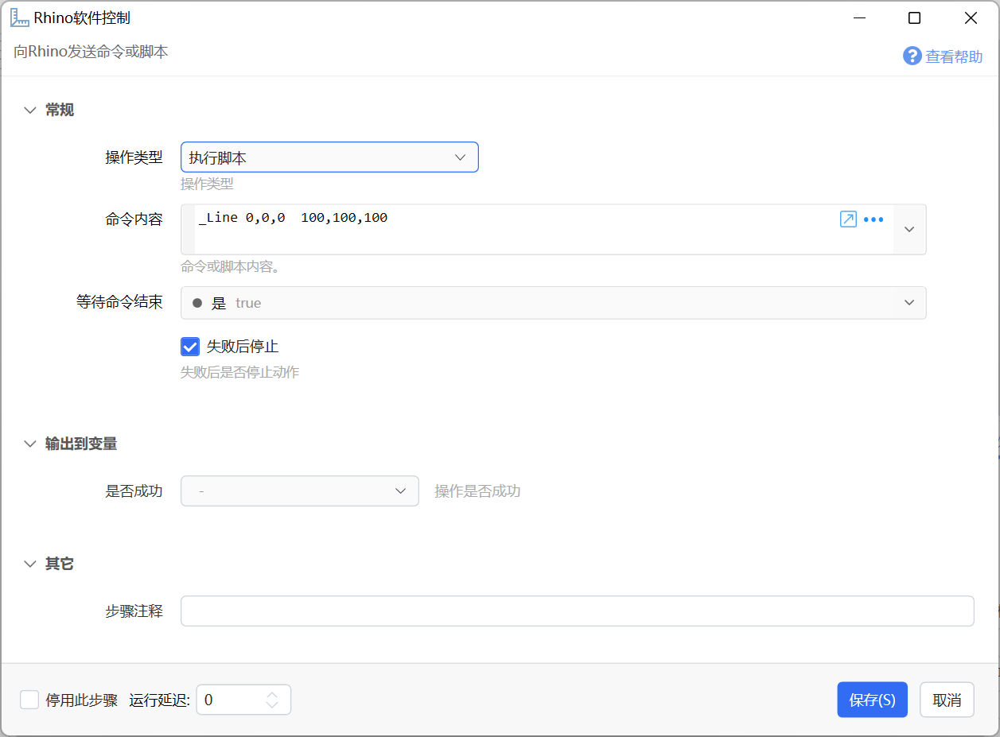
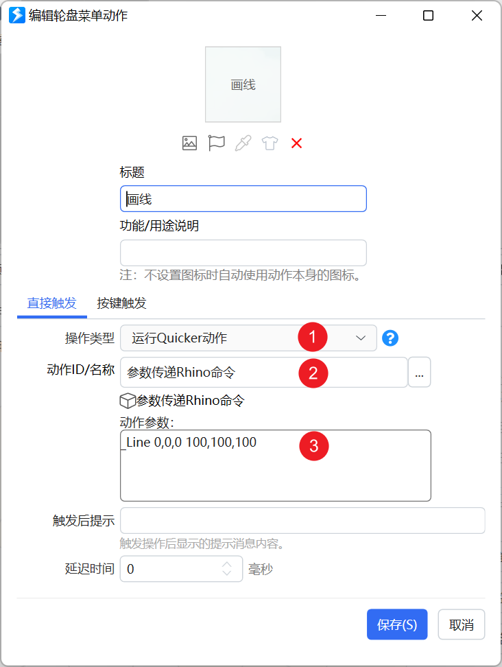

# Rhino软件控制

向Rhino发送命令或脚本

## 当前模块定义

<XActionModuleMeta moduleKey="sys:rhinocontrol" />

## 概述

向Rhino软件发送命令或脚本。

【操作类型】

可选的操作类型，目前仅支持“执行命令”。

【命令内容】

要执行的命令。

**示例动作**

-   [https://getquicker.net/Sharedaction?code=4e40c634-8eca-4515-6b7e-08da4f3f8574](https://getquicker.net/Sharedaction?code=4e40c634-8eca-4515-6b7e-08da4f3f8574)

## 通过手势、轮盘等执行命令或脚本

因为轮盘等快速触发不能直接向Rhino发送命令，需要通过一个单独的动作来中转。实现步骤如下：

（1）先在合适的位置安装此动作：[参数传递Rhino命令](https://getquicker.net/Sharedaction?code=ff3309da-7c30-4655-6b7d-08da4f3f8574)

（2）在轮盘、手势等位置，使用下面的设定方式调用动作，并将要执行的命令作为参数传递给动作。

设置方法：1、操作类型选择“运行Quicker动作”。2、输入动作名称“参数传递Rhino命令”。3、动作参数中输入要执行的命令。
