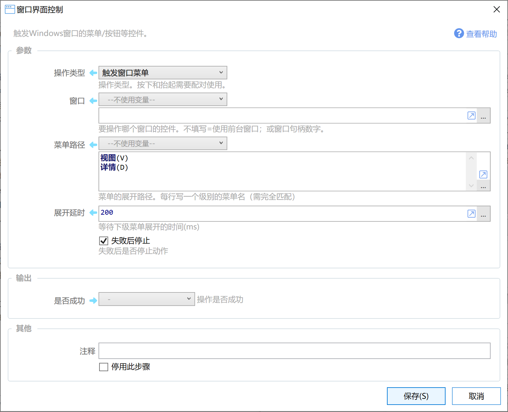
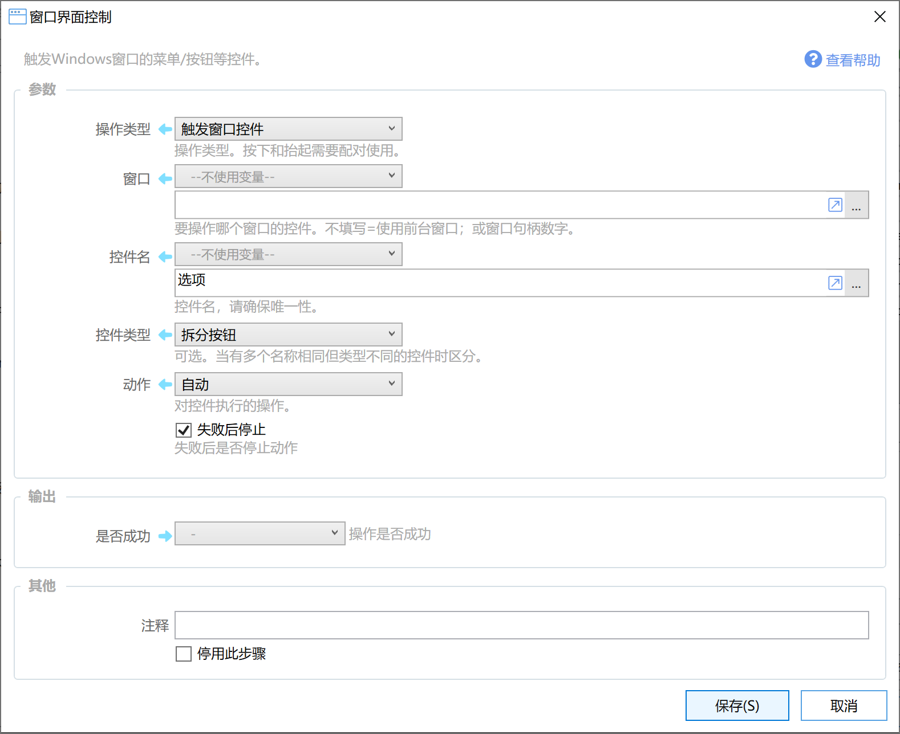
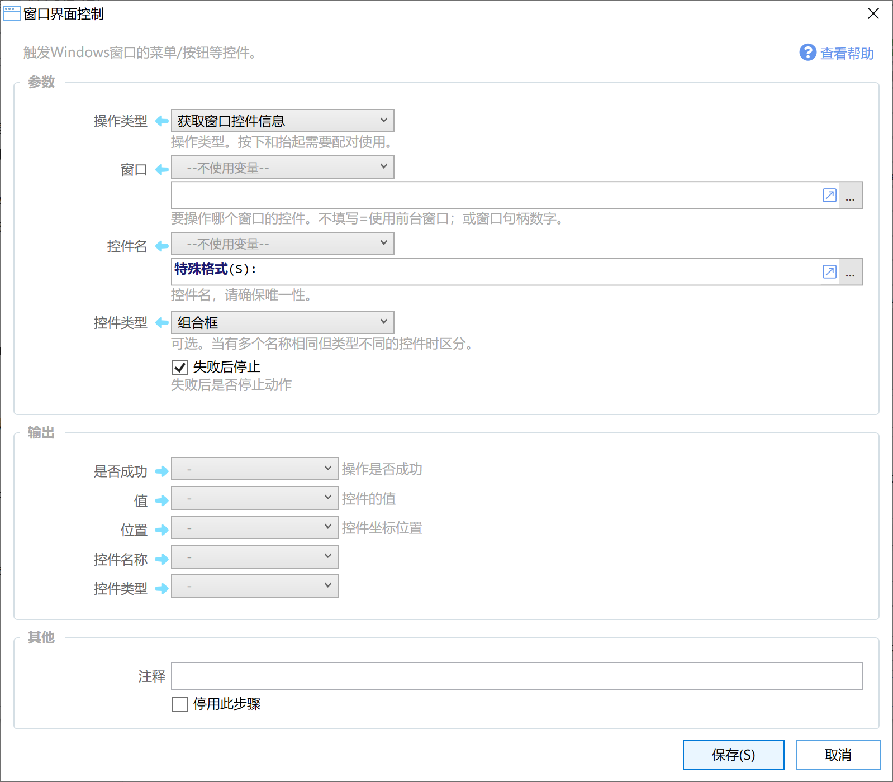
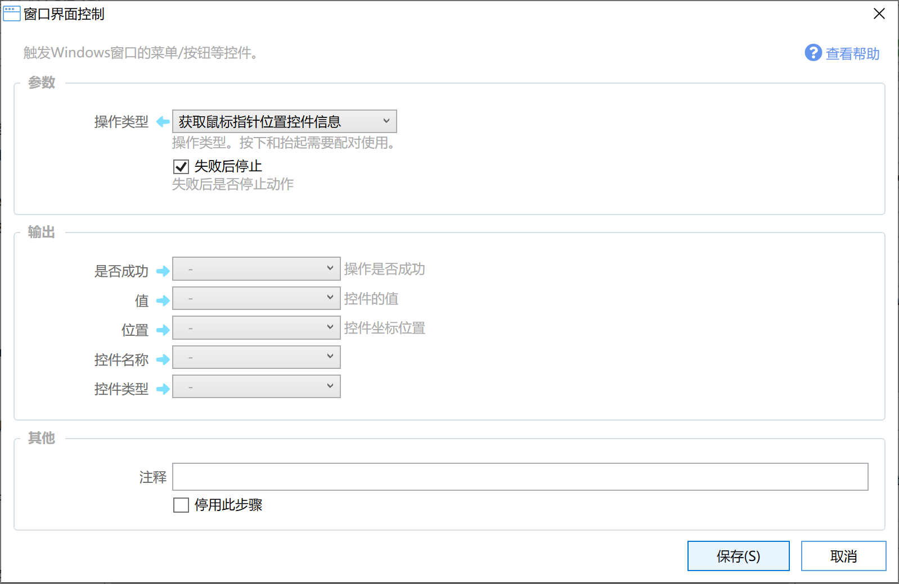
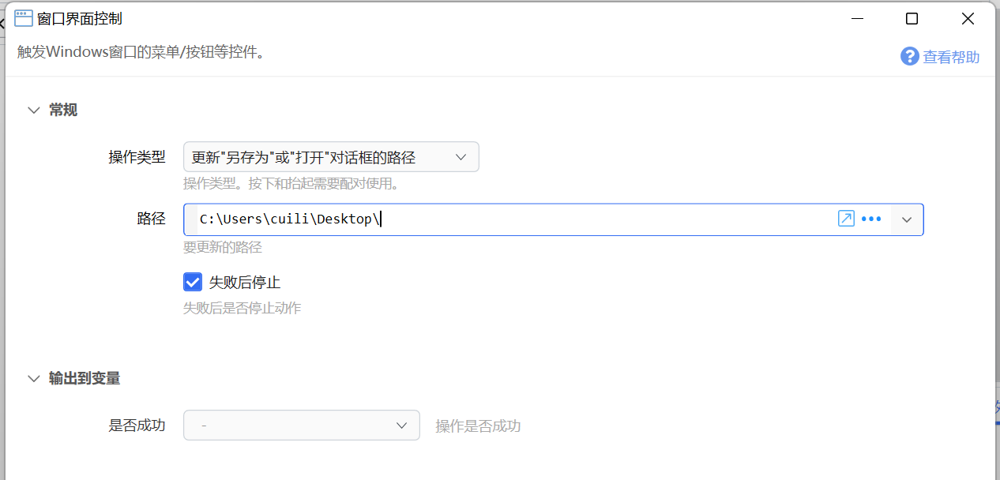
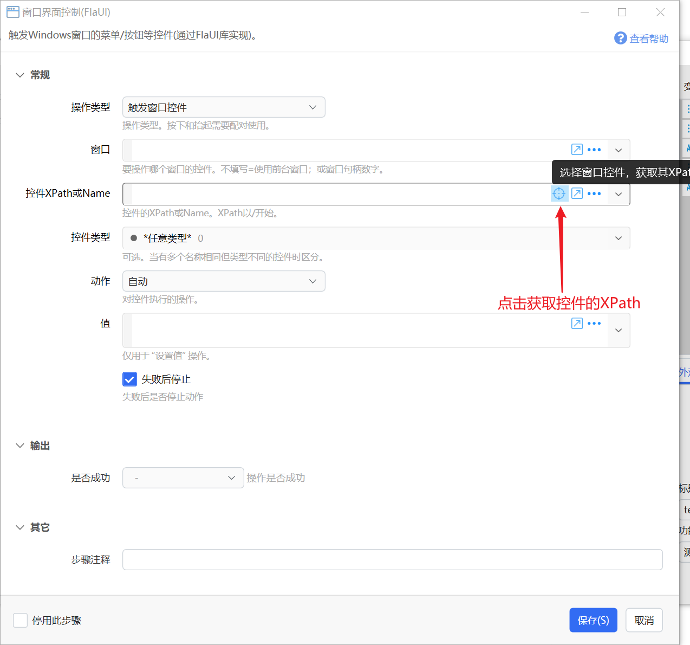

# 窗口界面控制

触发Windows窗口的菜单/按钮等控件。

{/* xaction-metadata:start */}
## 当前模块定义

- 模块 Key：`sys:uiautomation`
- 分类：第三方软件交互（`SoftInteraction`）
- 类型：`Action`
- 风险操作：否
- 专业版：否

## 输入参数

| Key | 名称 | 类型 | 默认值 | 必填 | 变量模式 | 条件 | 说明 |
| --- | --- | --- | --- | --- | --- | --- | --- |
| `type` | 操作类型 | `Enum` | TriggerMenu | 是 | `Input` |  | 操作类型。按下和抬起需要配对使用。 |
| `window` | 窗口句柄 | `Text` |  | 否 | `UseVarOrInput` | 仅：TriggerMenu, TriggerControl, GetControlInfo | 要操作哪个窗口的控件。不填写=使用前台窗口；或窗口句柄数字。 |
| `menuPath` | 菜单路径 | `Text` |  | 否 | `UseVarOrInput` | 仅：TriggerMenu | 菜单的展开路径。每行写一个级别的菜单名（需完全匹配） |
| `expandDelay` | 展开延时 | `Integer` | 200 | 否 | `Input` | 仅：TriggerMenu | 等待下级菜单展开的时间(ms) |
| `control` | 控件名 | `Text` |  | 否 | `UseVarOrInput` | 仅：TriggerControl, GetControlInfo | 控件名，请确保唯一性。 |
| `controlType` | 控件类型 | `Enum` | 0 | 否 | `UseVarOrInput` | 仅：TriggerControl, GetControlInfo | 可选。当有多个名称相同但类型不同的控件时区分。 |
| `controlOperation` | 动作 | `Enum` | Auto | 否 | `Input` | 仅：TriggerControl | 对控件执行的操作。 |
| `value` | 值 | `Text` |  | 否 | `UseVarOrInput` | 仅：TriggerControl | 仅用于 "设置值" 操作。 |
| `pointLocation` | 坐标位置 | `Text` |  | 否 | `UseVarOrInput` | 仅：GetControlInfoByPosition | 指定要检查的控件的屏幕坐标位置，格式为"x,y" |
| `path` | 路径 | `Text` |  | 否 | `UseVarOrInput` | 仅：UpdateSaveAsDialogPath | 要更新的路径 |
| `autoCreateDir` | 自动创建文件夹 | `Enum` | no | 否 | `Input` | 仅：UpdateSaveAsDialogPath | 如果目录不存在则自动创建。 |
| `stopIfFail` | 失败后停止 | `Boolean` | true | 否 | `Input` |  | 失败后是否停止动作 |

## 输出参数

| Key | 名称 | 类型 | 条件 | 说明 |
| --- | --- | --- | --- | --- |
| `isSuccess` | 是否成功 | `Boolean` |  | 操作是否成功 |
| `value` | 值 | `Text` | 仅：GetControlInfo, GetCursorPointControlInfo, GetFocusedControlInfo, GetControlInfoByPosition | 控件的值 |
| `controlText` | 文本 | `Text` | 仅：GetControlInfo, GetCursorPointControlInfo, GetFocusedControlInfo, GetControlInfoByPosition | 获取控件上的文本。根据控件不同，可能从Value、Text、Name等信息获取。 |
| `rect` | 位置 | `Text` | 仅：GetControlInfo, GetCursorPointControlInfo, GetFocusedControlInfo, GetControlInfoByPosition | 控件坐标位置 |
| `controlName` | 控件名称 | `Text` | 仅：GetControlInfo, GetCursorPointControlInfo, GetFocusedControlInfo, GetControlInfoByPosition |  |
| `controlType` | 控件类型 | `Text` | 仅：GetControlInfo, GetCursorPointControlInfo, GetFocusedControlInfo, GetControlInfoByPosition |  |
| `controlTypeId` | 控件类型ID | `Integer` | 仅：GetControlInfo, GetCursorPointControlInfo, GetFocusedControlInfo, GetControlInfoByPosition |  |
| `controlIsEnabled` | 是否启用 | `Boolean` | 仅：GetControlInfo, GetCursorPointControlInfo, GetFocusedControlInfo, GetControlInfoByPosition | 控件未处于禁用状态 |
| `controlIsVisible` | 是否可见 | `Boolean` | 仅：GetControlInfo, GetCursorPointControlInfo, GetFocusedControlInfo, GetControlInfoByPosition | 控件是否在屏幕上。 |
| `controlNativeWindowHandle` | 原始句柄 | `Integer` | 仅：GetControlInfo, GetCursorPointControlInfo, GetFocusedControlInfo, GetControlInfoByPosition | 控件的原始窗口句柄(NativeWindowHandle) |

## 选项值

### `type` 操作类型

| Value | 名称 | 说明 |
| --- | --- | --- |
| `TriggerMenu` | 触发窗口菜单 |  |
| `TriggerControl` | 触发窗口控件 |  |
| `GetControlInfo` | 获取窗口控件信息 |  |
| `GetCursorPointControlInfo` | 获取鼠标指针位置控件信息 |  |
| `GetFocusedControlInfo` | 获取焦点控件信息 |  |
| `GetControlInfoByPosition` | 获取指定位置控件信息 |  |
| `UpdateSaveAsDialogPath` | 更新"另存为"或"打开"对话框的路径 |  |

### `controlType` 控件类型

| Value | 名称 | 说明 |
| --- | --- | --- |
| `0` | *任意类型* |  |
| `50000` | 按钮 |  |
| `50001` | 日历 |  |
| `50002` | 复选框 |  |
| `50003` | 组合框 |  |
| `50025` | 自定义 |  |
| `50028` | 数据网格 |  |
| `50029` | 数据项 |  |
| `50030` | 文档 |  |
| `50004` | 编辑 |  |
| `50026` | 组 |  |
| `50034` | 标头 |  |
| `50035` | 标头项 |  |
| `50005` | 超链接 |  |
| `50006` | 图像 |  |
| `50008` | 列表视图 |  |
| `50007` | 列表项 |  |
| `50009` | 菜单 |  |
| `50010` | 菜单栏 |  |
| `50011` | 菜单项 |  |
| `50033` | 窗格 |  |
| `50012` | 进度栏 |  |
| `50013` | 单选按钮 |  |
| `50014` | 滚动条 |  |
| `50038` | 分隔符 |  |
| `50015` | 滑块 |  |
| `50016` | 微调框 |  |
| `50031` | 拆分按钮 |  |
| `50017` | 状态栏 |  |
| `50018` | 选项卡 |  |
| `50019` | 选项卡项 |  |
| `50036` | 表 |  |
| `50020` | 文本 |  |
| `50027` | 缩略 |  |
| `50037` | 标题栏 |  |
| `50021` | 工具栏 |  |
| `50022` | 工具提示 |  |
| `50023` | 树视图 |  |
| `50024` | 树视图项 |  |
| `50032` | 窗口 |  |

### `controlOperation` 动作

| Value | 名称 | 说明 |
| --- | --- | --- |
| `Auto` | 自动 |  |
| `Invoke` | 调用（按钮、菜单项等） |  |
| `LeftClick` | 鼠标左键单击 |  |
| `MiddleClick` | 鼠标中键单击 |  |
| `RightClick` | 鼠标右键单击 |  |
| `LeftDoubleClick` | 鼠标左键双击 |  |
| `Select` | 单选：选择（单选框、标签页等） |  |
| `AddToSelection` | 多选：添加到多选（多选列表等） |  |
| `RemoveFromSelection` | 多选：从多选中移除（多选列表） |  |
| `ToggleItemSelection` | 多选：切换选中状态 |  |
| `Expand` | 展开折叠：展开（菜单等） |  |
| `Collapse` | 展开折叠：折叠（菜单等） |  |
| `ToggleExpandCollapse` | 展开折叠：切换展开折叠（菜单等） |  |
| `Toggle` | 切换：切换（检查框等） |  |
| `ToggleOn` | 切换：开（检查框等） |  |
| `ToggleOff` | 切换：关（检查框等） |  |
| `SetValue` | 设置值 |  |

### `autoCreateDir` 自动创建文件夹

| Value | 名称 | 说明 |
| --- | --- | --- |
| `no` | 不自动创建 |  |
| `auto` | 自动创建：自动（根据后缀自动判断路径为文件还是文件夹路径） |  |
| `asFilePath` | 自动创建：给定文件路径 |  |
| `asFolderPath` | 自动创建：给定文件夹路径 |  |
{/* xaction-metadata:end */}

## 概述

使用Windows UIAutomation技术触发窗口界面元素。

Quicker目前提供了两个窗口界面控制模块。

**窗口界面控制：**

-   基于.Net自带接口实现。
-   通过控件名称和类型定位控件。有的界面需要较长定位时间，这期间会造成界面卡顿。
-   不支持有多个控件同名的情况。

**窗口界面控制（FlaUI）：**

-   基于[FlaUI库](https://github.com/FlaUI/FlaUI)实现。
-   提供了通过XPath来定位控件的能力。

本文档包含这两个模块的内容说明。

**注意：**

-   由于每个软件实现方式不同，对UIAutomation支持程度不同，此功能只能在一部分软件中、或者软件的一部分界面中使用。具体是否可用，需要您测试判断。
-   即便在可用的软件中，根据窗口状态的不同，也可能无法正常触发。
-   如果有多个步骤，需要在步骤中间增加必要的等待时间，等待界面准备好接受下一步的操作。
-   对于比较复杂的界面，查找控件的时间可能会比较长。

#### 辅助工具

-   可以使用Windows SDK中提供的inspect.exe程序查看界面元素的信息（特别是控件的“名称”）。详见本页面底部的下载链接。

## A. 窗口界面控制

### 主要参数

【操作类型】选择要执行的操作。可选的操作类型有：

-   触发窗口菜单
-   触发窗口控件
-   获取窗口控件信息
-   获取鼠标指针位置控件信息
-   获取焦点控件信息
-   更新“另存为”或“打开”对话框的路径。

【窗口】要操作哪个窗口的控件。不填写表示使用前台窗口；也可以输入窗口句柄数字。

### 触发窗口菜单

用于触发软件的菜单项。

上图的设置用于触发下面的菜单。

**参数**

【菜单路径】需要展开或点击的所有菜单项的名称，每行指定一个。菜单名称需要完全匹配。菜单名称不能存在重复。

【展开延时】上级菜单展开后到下级菜单可用中间需要等待的时间。每个软件可能需要等待的时间不同。

### 触发窗口控件

上面的截图用于定位资源管理器里的“选项”按钮。

**参数**

【控件名】

使用inspect.exe 查看到的控件名。如果有重复，会返回查找到的第一个控件。

控件名通常是控件上显示的文字，可能会随按钮状态改变而改变。

可能有多个控件具有相同的名字，但是他们类型不同。这时候可以使用“控件类型”参数进一步筛选。

【控件类型】

要查找控件的类型，用于在有名称相同类型不同的控件时加以区分。

如果希望通过变量动态传递控件类型，需要传入这样的值（类型后面的数字）：

internal enum ControlTypes
    &#123;
      Button = 50000, // 0x0000C350
      Calendar = 50001, // 0x0000C351
      CheckBox = 50002, // 0x0000C352
      ComboBox = 50003, // 0x0000C353
      Edit = 50004, // 0x0000C354
      Hyperlink = 50005, // 0x0000C355
      Image = 50006, // 0x0000C356
      ListItem = 50007, // 0x0000C357
      List = 50008, // 0x0000C358
      Menu = 50009, // 0x0000C359
      MenuBar = 50010, // 0x0000C35A
      MenuItem = 50011, // 0x0000C35B
      ProgressBar = 50012, // 0x0000C35C
      RadioButton = 50013, // 0x0000C35D
      ScrollBar = 50014, // 0x0000C35E
      Slider = 50015, // 0x0000C35F
      Spinner = 50016, // 0x0000C360
      StatusBar = 50017, // 0x0000C361
      Tab = 50018, // 0x0000C362
      TabItem = 50019, // 0x0000C363
      Text = 50020, // 0x0000C364
      ToolBar = 50021, // 0x0000C365
      ToolTip = 50022, // 0x0000C366
      Tree = 50023, // 0x0000C367
      TreeItem = 50024, // 0x0000C368
      Custom = 50025, // 0x0000C369
      Group = 50026, // 0x0000C36A
      Thumb = 50027, // 0x0000C36B
      DataGrid = 50028, // 0x0000C36C
      DataItem = 50029, // 0x0000C36D
      Document = 50030, // 0x0000C36E
      SplitButton = 50031, // 0x0000C36F
      Window = 50032, // 0x0000C370
      Pane = 50033, // 0x0000C371
      Header = 50034, // 0x0000C372
      HeaderItem = 50035, // 0x0000C373
      Table = 50036, // 0x0000C374
      TitleBar = 50037, // 0x0000C375
      Separator = 50038, // 0x0000C376
      SemanticZoom = 50039, // 0x0000C377
      AppBar = 50040, // 0x0000C378
    &#125;

【动作】

找到控件后需要执行的操作。每个控件所支持的操作类型有所不同，您需要进行测试以判断使用哪个操作可以达到目标结果。

选择“自动”类型，将会依次尝试这些操作，直到其中的一个执行成功：调用、切换选中状态、选择、展开、点击。

### 获取窗口控件信息

获取指定控件的信息。

【位置】输出控件的范围，格式为：Left,Top,Right,Bottom

【值】控件的值或文字等信息。

【控件类型】输出控件类型的名称。此名称不一定和inspect.exe程序中得到的一样😂。

【控件类型ID】表示控件类型的ID数字。

### 获取鼠标位置的控件信息

获取当前鼠标位置界面元素的信息。

### 获得焦点控件信息

获得当前拥有输入焦点的控件信息。

### 更新“另存为”或“打开”对话框的路径

用于快速更改保存或打开路径、文件名。

有这些用法：

-   路径参数为一个文件夹的完整路径：自动切换到这个文件夹下。
-   路径参数为一个带文件名的完整路径：自动保存或打开对应的文件。
-   路径参数为一个文件名：自动另存或打开这个文件名。
-   在支持打开多个文件的对话框中，可以用 "文件名1" "文件名2" 的格式，选择多个文件。

注：有的软件使用非Windows标准文件对话框可能无法控制。如果您遇到请报告给我们以便于寻找兼容方案。

### 示例：

-   将资源管理器切换为大图标模式：[https://getquicker.net/sharedaction?code=891b5c11-8f82-4dfd-2e10-08d809d218a4](https://getquicker.net/sharedaction?code=891b5c11-8f82-4dfd-2e10-08d809d218a4)
-   切换Win10的蓝牙开关：[https://getquicker.net/sharedaction?code=03585a9b-3378-4f4a-2e14-08d809d218a4](https://getquicker.net/sharedaction?code=03585a9b-3378-4f4a-2e14-08d809d218a4)

## B. 窗口界面控制FlaUI版

基本原理与基础版“窗口界面控制”相同。

### 参数

【控件XPath或Name】控件相对于窗口的XPath或空间名。使用空间名时将遍历查找控件，会有和基础版“窗口界面控制”相同的限制。

点击右侧的定位按钮，可以从窗口选择控件，获取其XPath。

点击查看视频演示：

[https://player.bilibili.com/player.html?bvid=BV1S54y1J79d](https://player.bilibili.com/player.html?bvid=BV1S54y1J79d)

### 一些示例场景

更新另存窗口的文件类型：

## 相关资源

-   inspect.exe 程序下载：

-   x64版本：[https://files.getquicker.net/\_sitefiles/\_tools/inspect\_x64.exe](https://files.getquicker.net/_sitefiles/_tools/inspect_x64.exe)
-   x86版本：[https://files.getquicker.net/\_sitefiles/\_tools/inspect\_x86.exe](https://files.getquicker.net/_sitefiles/_tools/inspect_x86.exe)

-   FlaUInspect 程序：

-   官网：[https://github.com/FlaUI/FlaUInspect](https://github.com/FlaUI/FlaUInspect)
-   下载：[https://files.getquicker.net/\_sitefiles/\_tools/FlaUInspect\_1.3.0.zip](https://files.getquicker.net/_sitefiles/_tools/FlaUInspect_1.3.0.zip)

#### 如何通过FlaUInspect获得控件的XPath

启动FlaUInspect时，选择UIA3

在Mode菜单中开启HoverMode和ShowXPath

然后鼠标移动到某个窗口上时，按ctrl，FlaUInspect会更新当前位置的窗口、控件信息。

窗口底部会显示该位置的XPath。

此XPath会包含窗口本身的路径（第一段，如上图的/Window）。Quicker模块中查找XPath时是从窗口本身开始查找，因此需要将此XPath的第一段去除后使用。
