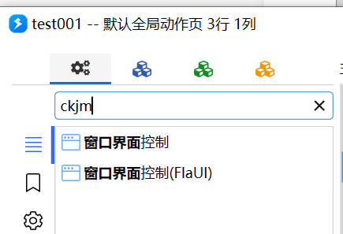
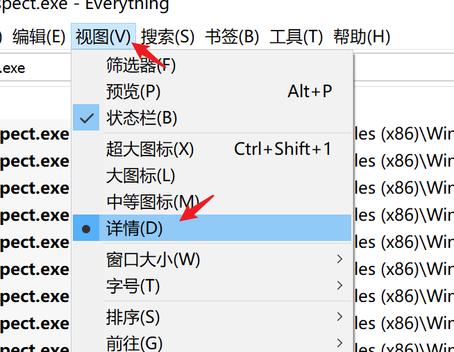
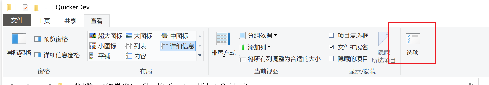
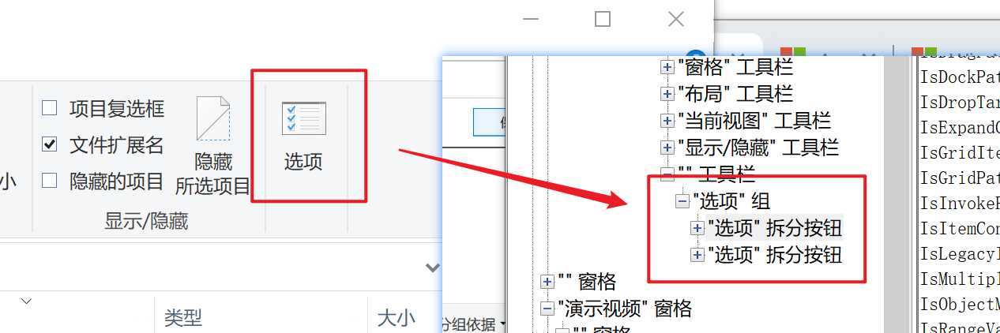
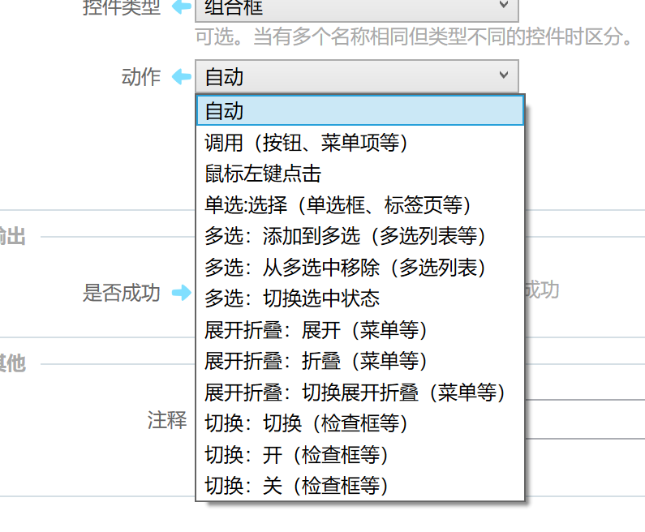
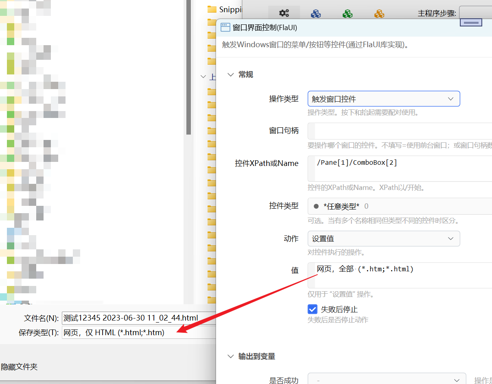
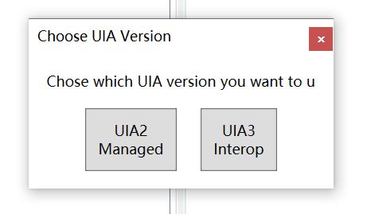
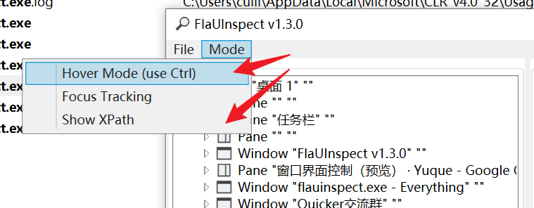
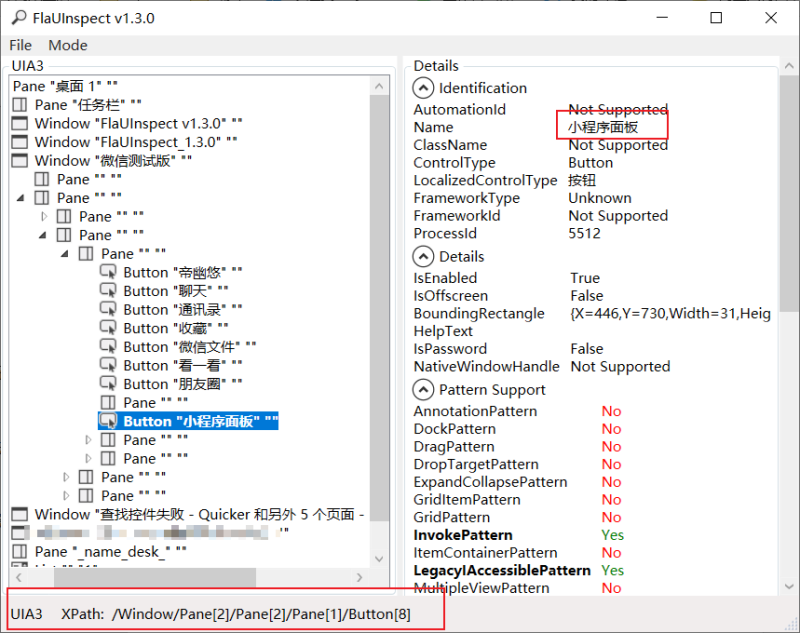

# 窗口界面控制

用 Windows UI Automation 触发窗口里的菜单、按钮等控件。需要按 XPath 定位时，用 [窗口界面控制(FlaUI)](/v2/xaction/modules/flauiautomation)。

## 当前模块定义

<XActionModuleMeta moduleKey="sys:uiautomation" />

## 概述

Quicker 提供两套窗口界面控制：

**窗口界面控制**

- 基于 .NET 自带接口。
- 用控件名称和类型定位。有的界面查找较久，期间会卡顿。
- 不支持多个同名控件。

**窗口界面控制（FlaUI）**

- 基于 [FlaUI](https://github.com/FlaUI/FlaUI)。
- 可用 XPath 定位控件。

每个软件对 UI Automation 的支持不同，只能在一部分软件、一部分界面上使用，需要实测。窗口状态不对时也可能失败。多步操作中间要留等待，等界面准备好。复杂界面查找控件可能较慢。

可用 Windows SDK 的 `inspect.exe` 查看控件「名称」。下载见文末相关链接。

<ModuleParamPreview
  moduleKey="sys:uiautomation"
  values={{type: 'TriggerControl'}}
/>

## 参数说明

**操作类型**：触发窗口菜单、触发窗口控件、获取窗口控件信息、获取鼠标指针位置控件信息、获取焦点控件信息、获取指定位置控件信息、更新「另存为」或「打开」对话框的路径。

**窗口句柄**：要操作哪个窗口。不填表示前台窗口；也可填窗口句柄数字。显示于触发菜单 / 触发控件 / 获取窗口控件信息。

**失败后停止**：出错后是否中止动作。默认开启。

## 触发窗口菜单

用于触发软件的菜单项。

<ModuleParamPreview
  moduleKey="sys:uiautomation"
  focusKeys={['type', 'window', 'menuPath', 'expandDelay', 'stopIfFail', 'isSuccess']}
  values={{
    type: 'TriggerMenu',
    menuPath: '视图(V)\n详情(D)',
    expandDelay: '200',
  }}
/>

上图设置用于触发下面的菜单。

**菜单路径**：要展开或点击的各级菜单名称，每行一个。必须完全匹配，且名称不能重复。

**展开延时**：上级菜单展开后等到下级可用的毫秒数，默认 `200`。各软件需要的等待不同。

## 触发窗口控件

<ModuleParamPreview
  moduleKey="sys:uiautomation"
  focusKeys={[
    'type',
    'window',
    'control',
    'controlType',
    'controlOperation',
    'value',
    'stopIfFail',
    'isSuccess',
  ]}
  values={{
    type: 'TriggerControl',
    control: '选项',
    controlType: '50031',
    controlOperation: 'Auto',
  }}
/>

上面用于定位资源管理器里的「选项」按钮。

**控件名**：`inspect.exe` 里看到的名称，一般是控件上的文字，可能随状态变化。有重名时返回找到的第一个。名称相同、类型不同时再用 **控件类型** 区分。

**控件类型**：可选。有同名不同类型控件时用来筛选。下拉项对应的数字可在变量里传递，例如拆分按钮 `50031`、组合框 `50003`、按钮 `50000`。

**动作**：找到控件后要执行的操作。各控件支持的动作不同，需要实测。

选「自动」会依次尝试：调用、切换选中状态、选择、展开、点击，直到其中一个成功。

**值**：仅「设置值」动作使用。

## 获取窗口控件信息

获取指定控件的信息。

<ModuleParamPreview
  moduleKey="sys:uiautomation"
  focusKeys={[
    'type',
    'window',
    'control',
    'controlType',
    'stopIfFail',
    'isSuccess',
    'value',
    'controlText',
    'rect',
    'controlName',
    'controlTypeId',
    'controlIsEnabled',
    'controlIsVisible',
    'controlNativeWindowHandle',
  ]}
  values={{
    type: 'GetControlInfo',
    control: '特殊格式(S):',
    controlType: '50003',
  }}
/>

### 输出

- **值**：控件的值。
- **文本**：控件上的文字；按控件不同，可能来自 Value、Text 或 Name。
- **位置**：范围，格式 `Left,Top,Right,Bottom`。
- **控件名称**
- **控件类型**：类型名称，不一定和 `inspect.exe` 里完全一致。
- **控件类型ID**：类型数字。
- **是否启用**：控件未处于禁用状态。
- **是否可见**：控件是否在屏幕上。
- **原始句柄**：控件的 NativeWindowHandle。

下面几种「获取信息」操作的输出字段相同。

## 获取鼠标指针位置控件信息

获取当前鼠标位置界面元素的信息。不需要填写窗口或控件名。

<ModuleParamPreview
  moduleKey="sys:uiautomation"
  focusKeys={[
    'type',
    'stopIfFail',
    'isSuccess',
    'value',
    'controlText',
    'rect',
    'controlName',
    'controlType',
  ]}
  values={{type: 'GetCursorPointControlInfo'}}
/>

## 获取焦点控件信息

获得当前拥有输入焦点的控件信息。输出字段同上。

<ModuleParamPreview
  moduleKey="sys:uiautomation"
  focusKeys={['type', 'stopIfFail', 'isSuccess', 'value', 'controlText', 'rect', 'controlName']}
  values={{type: 'GetFocusedControlInfo'}}
/>

## 获取指定位置控件信息

按屏幕坐标读取该位置的控件信息。

<ModuleParamPreview
  moduleKey="sys:uiautomation"
  focusKeys={['type', 'pointLocation', 'stopIfFail', 'isSuccess', 'value', 'controlText', 'rect']}
  values={{type: 'GetControlInfoByPosition', pointLocation: '100,200'}}
/>

**坐标位置**：屏幕坐标，格式 `x,y`。

## 更新「另存为」或「打开」对话框的路径

用来快速改保存 / 打开路径或文件名。有的软件使用非 Windows 标准文件对话框，可能无法控制。

<ModuleParamPreview
  moduleKey="sys:uiautomation"
  focusKeys={['type', 'path', 'autoCreateDir', 'stopIfFail', 'isSuccess']}
  values={{
    type: 'UpdateSaveAsDialogPath',
    path: 'C:\\Users\\cuili\\Desktop\\',
  }}
/>

**路径**：

- 文件夹完整路径：切换到该文件夹。
- 带文件名的完整路径：保存或打开该文件。
- 只有文件名：另存或打开这个文件名。
- 支持多选的对话框可用 `"文件名1" "文件名2"` 选多个文件。

**自动创建文件夹**：目录不存在时是否创建。可选不自动创建、自动（按后缀判断是文件还是文件夹）、按文件路径创建、按文件夹路径创建。

## 示例动作

<ShareLinkCard
  code="891b5c11-8f82-4dfd-2e10-08d809d218a4"
  title="资源管理器切换为大图标"
  author="CL"
/>

<ShareLinkCard
  code="03585a9b-3378-4f4a-2e14-08d809d218a4"
  title="切换 Win10 蓝牙开关"
  author="CL"
/>

## 窗口界面控制 FlaUI 版

基本原理与本模块相同，参数以 [窗口界面控制(FlaUI)](/v2/xaction/modules/flauiautomation) 为准。XPath 语法见 [窗口界面控制的 XPATH 简介](/v2/xaction/guides/flaui-xpath-intro)。

<PreviewMarks marks={[{key: 'control', label: '点击右侧按钮获取控件 XPath'}]}>
  <ModuleParamPreview
    moduleKey="sys:flauiautomation"
    focusKeys={['type', 'window', 'control', 'controlOperation']}
    values={{type: 'TriggerControl'}}
  />
</PreviewMarks>

**控件XPath或Name**：相对窗口的 XPath，或控件名 / AutomationId。XPath 以 `/` 开头。可写多行，前一个找不到时自动试下一行。用名称遍历查找时，限制与基础版相同。

点右侧定位按钮，可从窗口拾取控件并得到 XPath。

[视频演示](https://player.bilibili.com/player.html?bvid=BV1S54y1J79d)

更新另存窗口的文件类型：

### 用 FlaUInspect 取得 XPath

启动 FlaUInspect 时选择 UIA3：

在 Mode 菜单中开启 HoverMode 和 ShowXPath：

鼠标移到某个窗口上后按 Ctrl，FlaUInspect 会更新当前位置的窗口、控件信息。窗口底部显示 XPath。

此 XPath 会包含窗口本身（第一段，如上图的 `/Window`）。Quicker 从窗口本身开始查找，需要去掉第一段再使用。

## 限制与排障

- 并非所有软件、所有界面都支持 UI Automation，需要实测。
- 多步之间要加等待，等界面准备好。
- 复杂界面查找控件可能较久并造成卡顿。
- 非标准「另存为 / 打开」对话框可能无法改路径。

## 相关链接

<RelatedDocs
  items={[
    {
      href: '/v2/xaction/modules/flauiautomation',
      label: '窗口界面控制(FlaUI)',
      description: '用 XPath 定位控件的另一套实现。',
    },
    {
      href: '/v2/xaction/guides/flaui-xpath-intro',
      label: 'XPATH 简介',
      description: 'FlaUI 定位路径的写法。',
    },
    {
      href: '/v2/xaction/modules/textselecttools',
      label: '辅助选择工具',
      description: '可用「选择窗口控件」拾取 XPath。',
    },
    {
      href: '/v2/xaction/modules/windowoperations',
      label: '窗口操作',
      description: '激活、移动、关闭窗口本身。',
    },
  ]}
/>

## 相关资源

- inspect.exe
  - [x64](https://files.getquicker.net/_sitefiles/_tools/inspect_x64.exe)
  - [x86](https://files.getquicker.net/_sitefiles/_tools/inspect_x86.exe)
- FlaUInspect
  - [GitHub](https://github.com/FlaUI/FlaUInspect)
  - [1.3.0 下载](https://files.getquicker.net/_sitefiles/_tools/FlaUInspect_1.3.0.zip)
