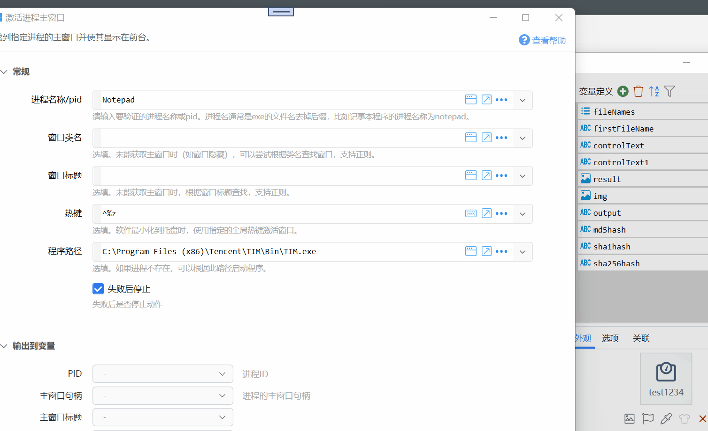

# 激活进程主窗口

找到指定进程的主窗口并使其显示在前台。

## 当前模块定义

<XActionModuleMeta moduleKey="sys:activateProcessMainWindow" />

尝试使用多种方式激活某个进程的主窗口。

## 概述

<ModuleParamPreview moduleKey="sys:activateProcessMainWindow" />

找到指定进程的主窗口并使其显示在前台。

如果窗口已隐藏到系统托盘，则尝试发送全局热键激活（需要软件本身支持，如QQ等）。

不是所有的软件都可以得到进程主窗口。

**注意：**

部分软件的进程没有主窗口句柄，所以可能会产生判断错误的情况。（已知QQ有此问题）

## 参数

### 输入

【进程名称/pid】

指定要激活主窗口的进程。必须提供此参数。

进程名通常为软件的应用程序.exe文件名去除.exe。如记事本的进程名为`notepad`。可以直接点击输入框右侧的窗口工具选择进程名：

如果未找到进程，则使用“程序路径”参数中提供的路径启动程序。

如果找到了进程，并且获取了主窗口句柄，则直接激活该窗口。如果未能获取主窗口句柄，则尝试根据“窗口类名”“窗口标题”来确定该进程的主窗口。如果根据窗口类名和标题未找到窗口，则尝试查找该进程在桌面上显示的窗口中的第一个。

【窗口类名】指定要查找窗口的类名。支持正则表达式匹配。

【窗口标题】指定要查找窗口的标题。支持正则表达式匹配。

**【热键】**

（需软件自身支持）用于激活软件窗口的全局热键（在软件最小化到托盘后使用）。定义格式请参照：[模拟按键B](/v2/xaction/modules/sendkeys)。

在根据进程和窗口信息未找到窗口时，尝试使用发送此处设定的热键激活窗口。

**【程序路径】**

（选填）在进程未启动时，自动启动程序。

### 输出

【是否成功】是否找到了主窗口并激活了。

【PID】进程ID。

【主窗口句柄】窗口句柄数据。

【主窗口标题】窗口的标题。
