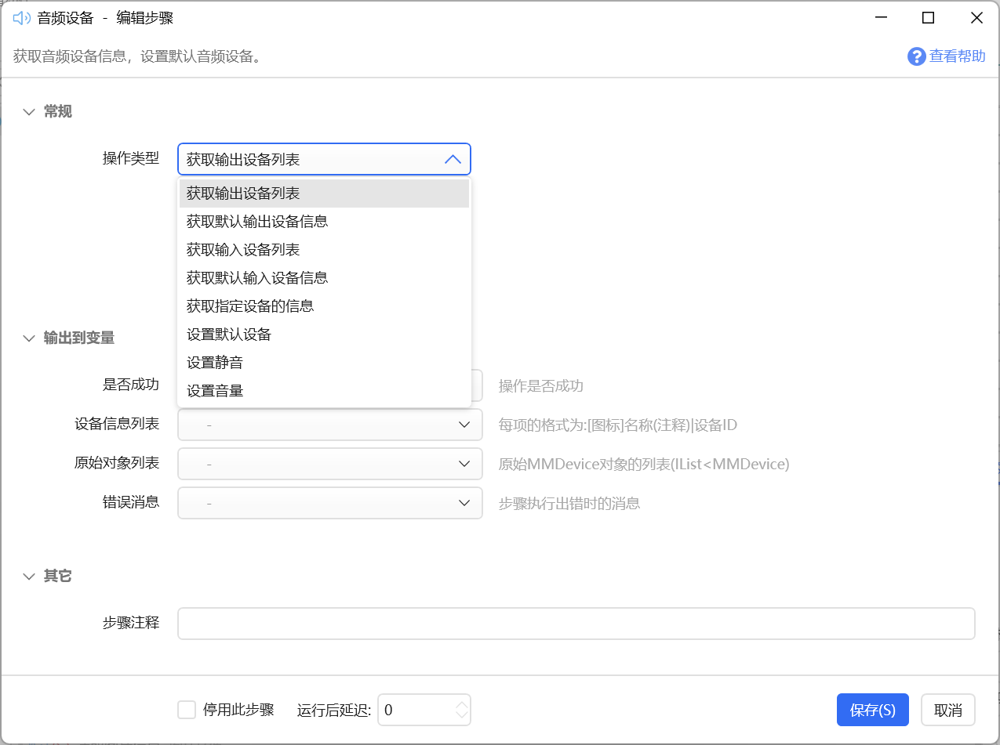
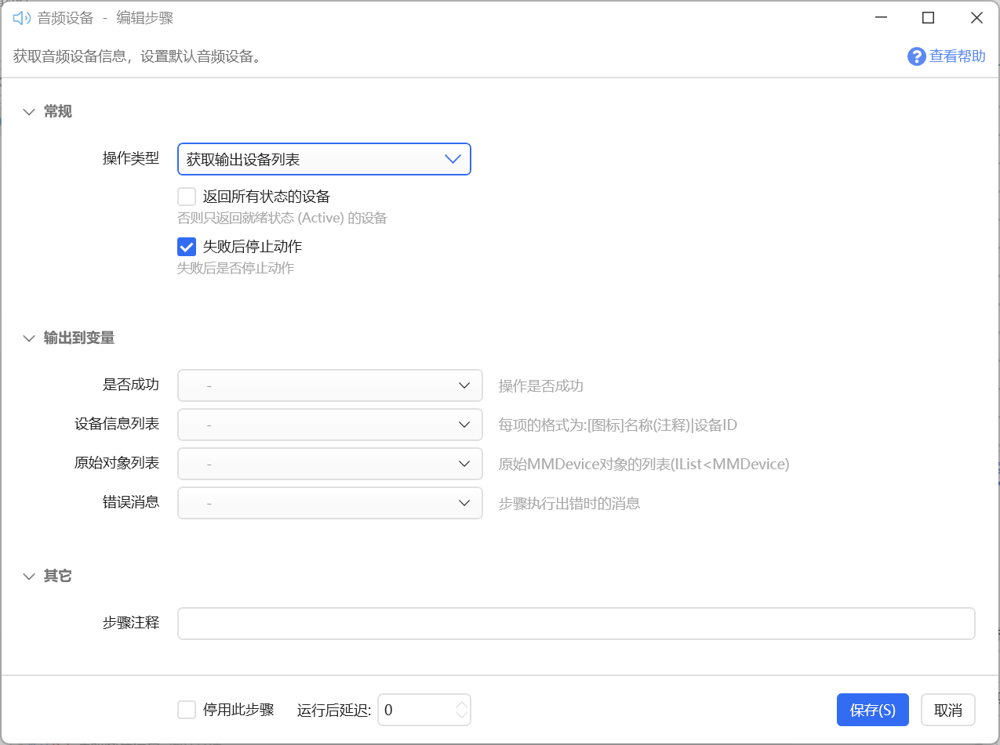
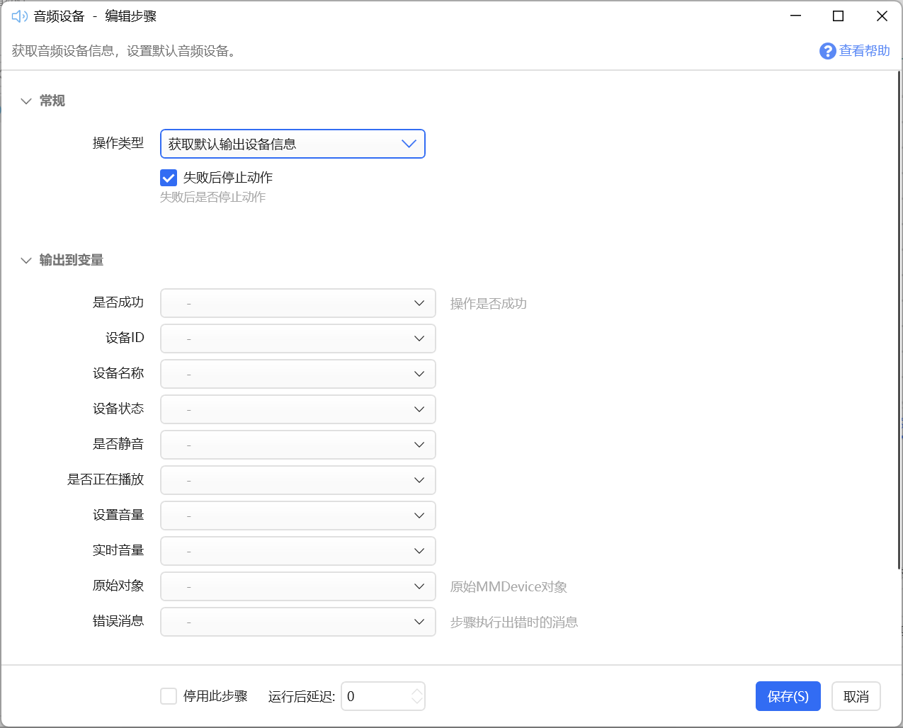
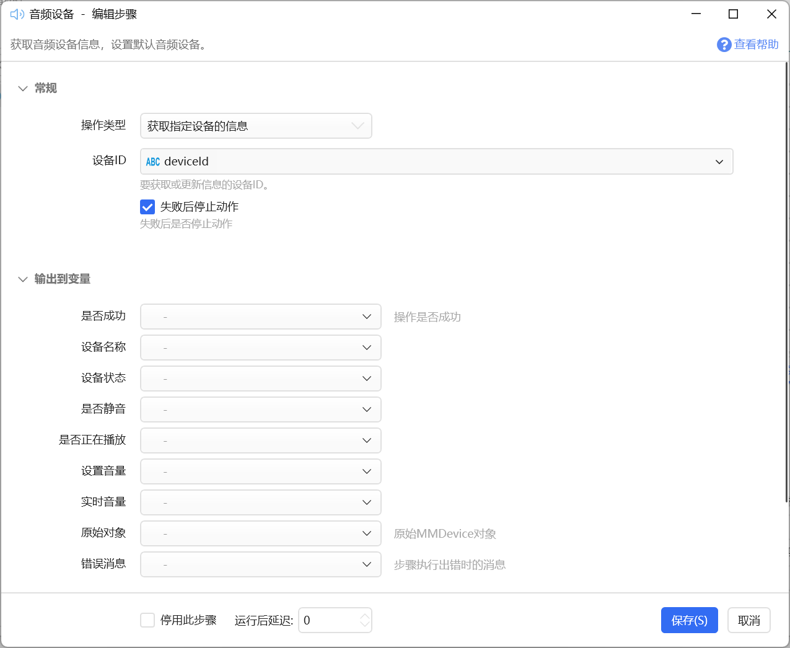
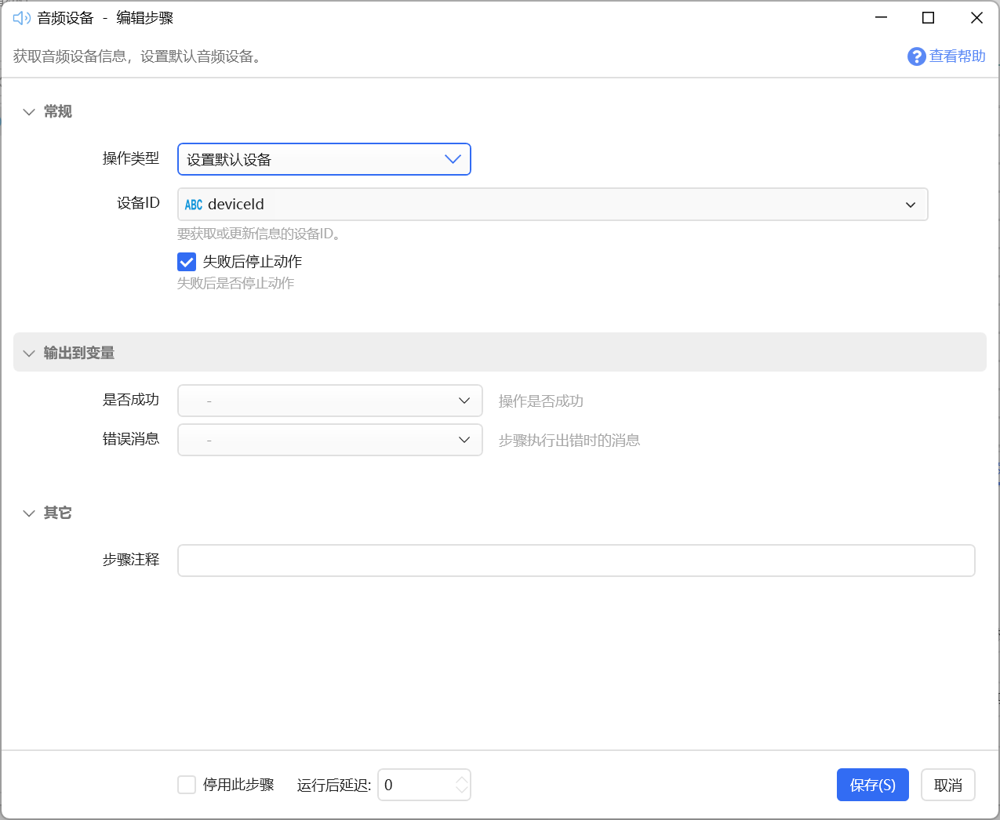
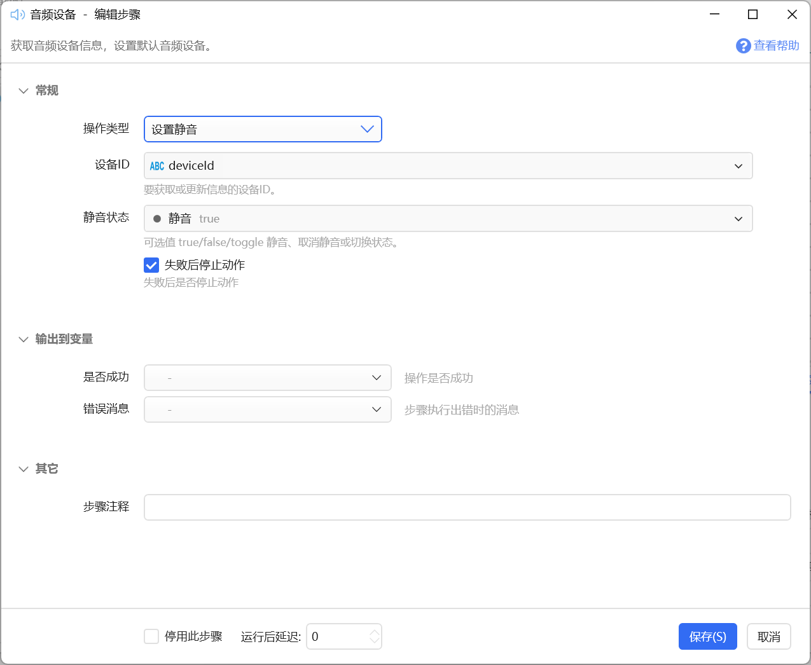
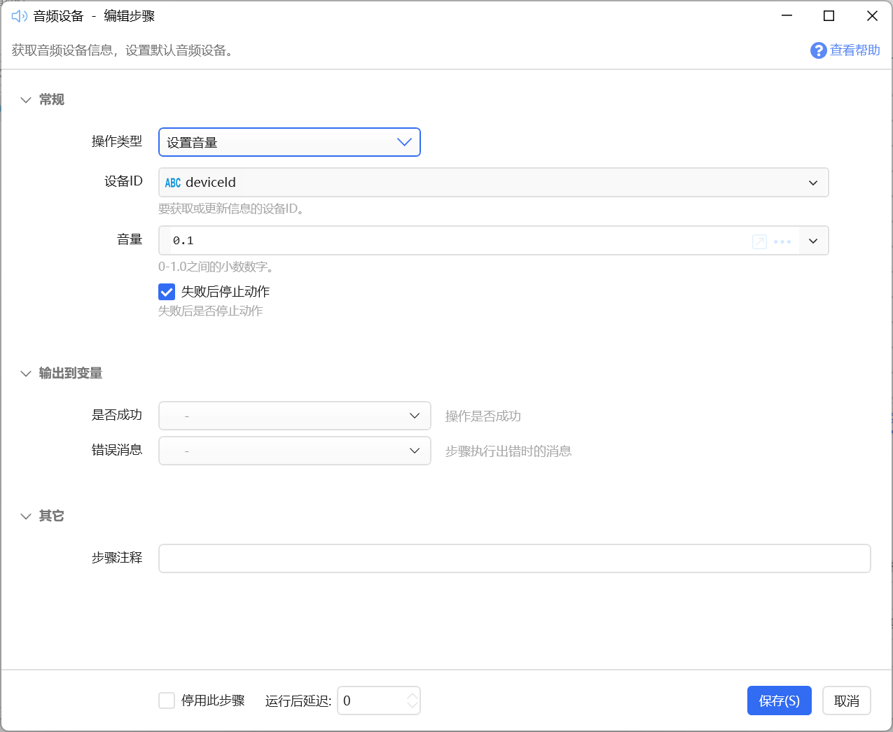

# 音频设备

获取音频设备信息，设置默认音频设备。

## 当前模块定义

<XActionModuleMeta moduleKey="sys:audioControl" />

用于获取音频设备信息或设置默认设备、调整静音、音量。

## 支持的操作类型

### 获取设备列表

【获取输出设备列表】

【获取输入设备列表】

输出：

【设备信息列表】

返回系统内当前可用的输入和输出设备的列表。

每项格式为： `[图标]设备名|设备ID` 

可以直接将得到的列表作为“用户选择”模块的“选项”参数的值。

【原始对象列表】表示设备的内部c#对象列表。类型为（List&lt;NAudio.CoreAudioApi.MMDevice&gt;）

### 获取默认设备

【获取默认的输出设备信息】

【获取默认的输入设备信息】

获取系统里当前选择的默认输出和输入设备，并且得到设备ID、设备名称、是否静音、音量等信息。原始对象为C#的NAudio.CoreAudioApi.MMDevice类型。

### 获取指定设备的信息

根据提供的设备ID，获取其信息。

设备ID是一个类似于这样的文本： `{0.0.0.00000000}.{2c3a51b4-780e-4290-bc03-8c25dfed52d1}` 

可以从“获取设备列表”等操作方式里得到。

### 设置默认设备

将指定的设备设置为默认的输出或输入设备。

### 设置设备静音

可选值：true（静音）、false（取消静音）、toggle（切换静音状态）。

当设备ID为空时，设置当前默认输出设备。

### 设置设备音量

设置指定设备的音量。当设备ID为空时，设置当前默认输出设备的音量。

**音量值参数：**0-1.0之间的小数。

## 示例动作

-   [音频设备操作示例](https://getquicker.net/sharedaction?code=0cf96600-866a-4eac-7f44-08d8fe1fe745)
-   [将输出设置为指定的设备](https://getquicker.net/sharedaction?code=789bfd8d-3ef0-43c9-7f48-08d8fe1fe745)
-   [在两个音频设备之间切换](https://getquicker.net/sharedaction?code=d4eab7c4-b53e-4fd9-7f4a-08d8fe1fe745)
-   [选择音频设备](https://getquicker.net/sharedaction?code=8139f36b-059a-49a6-9f64-08d8ff04bb1d)（选择复制设备ID 或 传递设备ID参数可直接设置设备为默认输出设备）

## 更新历史

-   20250120 更新文档，以匹配实际功能。
