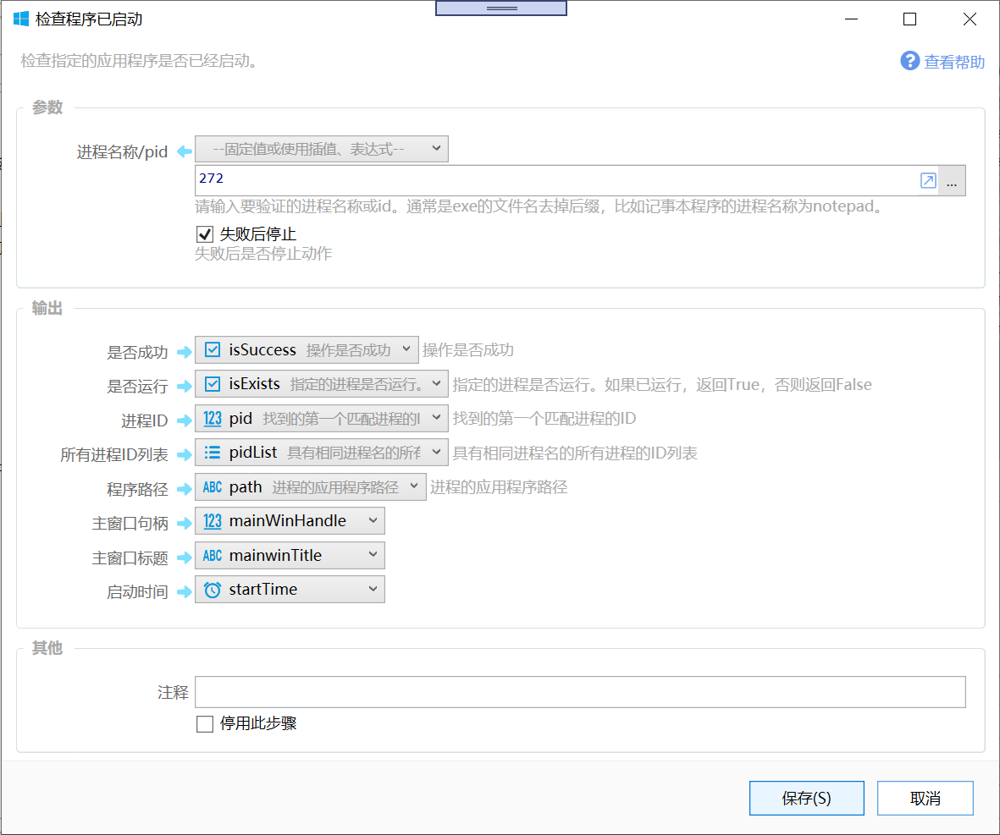

# 检查程序已启动/获取进程信息

检查指定的应用程序是否已经启动。

{/* xaction-metadata:start */}
## 当前模块定义

- 模块 Key：`sys:checkProcessExists`
- 分类：Windows系统（`System`）
- 类型：`Action`
- 风险操作：否
- 专业版：否

## 输入参数

| Key | 名称 | 类型 | 默认值 | 必填 | 变量模式 | 条件 | 说明 |
| --- | --- | --- | --- | --- | --- | --- | --- |
| `process` | 进程名称/pid | `Text` |  | 是 | `UseVarOrInput` |  | 请输入要验证的进程名称或id。通常是exe的文件名去掉后缀，比如记事本程序的进程名称为notepad。 |
| `stopIfFail` | 失败后停止 | `Boolean` | true | 否 | `Input` |  | 失败后是否停止动作 |

## 输出参数

| Key | 名称 | 类型 | 条件 | 说明 |
| --- | --- | --- | --- | --- |
| `isSuccess` | 操作是否成功 | `Boolean` |  | 可能会因为无法访问高权限进程等原因而失败。进程未启动不会导致操作失败。 |
| `isExists` | 是否运行 | `Boolean` |  | 指定的进程是否运行。如果已运行，返回True，否则返回False |
| `pid` | 进程ID | `Integer` |  | 找到的第一个匹配进程的ID |
| `pidList` | 所有进程ID列表 | `List` |  | 具有相同进程名的所有进程的ID列表 |
| `path` | 程序路径 | `Text` |  | 进程的应用程序路径 |
| `mainWinHandle` | 主窗口句柄 | `Integer` |  |  |
| `mainwinTitle` | 主窗口标题 | `Text` |  |  |
| `startTime` | 启动时间 | `DateTime` |  |  |
{/* xaction-metadata:end */}

检查某个软件是否在运行中（检查系统中存在指定名称的进程）。

## 参数

【进程名称/pid】要检查的进程名称或ID。

进程名称通常为应用程序文件.exe去除.exe后缀的部分。如quicker软件主程序为“quicker.exe”，对应的进程名为“quicker”；Word软件对应的进程名为“winword”。

可以通过“窗口进程名”菜单直接获取：按住并拖放到目标软件窗口上松开。

【失败后停止】获取失败后是否停止动作。

### 输出

【操作是否成功】是否成功得到了数据。此操作可能因为权限等原因无法访问某些进程的信息。注意：此输出不代表程序是否在运行，只是代表本次检测操作没有遇到异常。

【是否运行】进程是否在运行。

【进程ID】进程的id数字。

【所有进程id列表】对于有多个同名进程同时运行的情况，返回这些进程id的列表。

【程序路径】进程所对应的exe文件路径。

【主窗口句柄】进程的主窗口句柄（MainWinHandle）数字。不是所有的进程都有此数据。

【主窗口标题】进程的主窗口标题文字。不是所有的进程都有此信息。

【启动时间】进程开始运行的时间。

## 版本历史

-   1.9.13 增加根据pid获取进程信息的功能；增加进程信息的输出。
