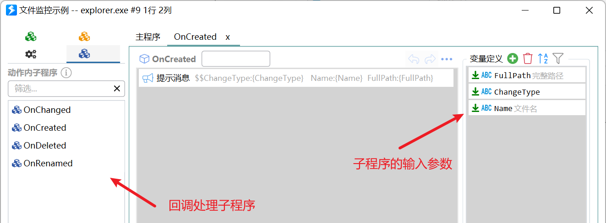
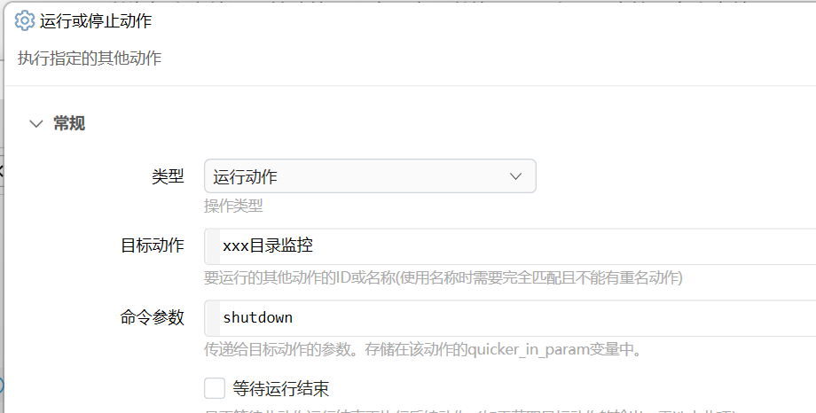

# 文件系统监控

监控文件创建/变更/删除等事件。

{/* xaction-metadata:start */}
## 当前模块定义

- 模块 Key：`sys:fileSystemWatch`
- 分类：Windows系统（`System`）
- 类型：`Action`
- 风险操作：否
- 专业版：否

## 输入参数

| Key | 名称 | 类型 | 默认值 | 必填 | 变量模式 | 条件 | 说明 |
| --- | --- | --- | --- | --- | --- | --- | --- |
| `operation` | 操作类型 | `Enum` | wait | 是 | `Input` |  | 时间数据来源 |
| `path` | 文件夹路径 | `Text` |  | 否 | `UseVarOrInput` |  | 要监控的文件夹路径 |
| `filter` | 文件筛选 | `Text` | *.* | 否 | `UseVarOrInput` |  | 筛选要监控的文件。可指定文件名（如foo.txt），或使用通配符（如*.txt） |
| `notifyFilter` | 通知筛选 | `Text` |  | 否 | `UseVarOrInput` |  | 可选，可选值请参考文档。留空表示默认设置(LastWrite,FileName,DirectoryName)。 |
| `includeSubdirectories` | 包含子文件夹 | `Boolean` | true | 否 | `Input` |  |  |
| `waitEvents` | 等待的事件 | `Text` | created | 否 | `UseVarOrInput` | 仅：wait |  |
| `waitSeconds` | 等待秒数 | `Number` | 0.0 | 否 | `UseVarOrInput` | 仅：wait | 最长等待时间。0表示不限时间。 |
| `createdCallback` | [创建] 处理子程序 | `Text` |  | 否 | `UseVarOrInput` | 仅：callback | 文件或文件创建时调用的子程序 |
| `changedCallback` | [变更] 处理子程序 | `Text` |  | 否 | `UseVarOrInput` | 仅：callback | 文件或文件夹变更时调用的子程序 |
| `deletedCallback` | [删除] 处理子程序 | `Text` |  | 否 | `UseVarOrInput` | 仅：callback | 文件或文件被删除时调用的子程序 |
| `renamedCallback` | [重命名] 处理子程序 | `Text` |  | 否 | `UseVarOrInput` | 仅：callback | 文件或文件重命名时调用的子程序 |
| `stopIfFail` | 失败后停止 | `Boolean` | true | 否 | `Input` |  | 失败后是否停止动作 |

## 输出参数

| Key | 名称 | 类型 | 条件 | 说明 |
| --- | --- | --- | --- | --- |
| `isSuccess` | 是否成功 | `Boolean` |  | 操作是否成功 |
| `fullPath` | 变更的路径 | `Text` | 仅：wait | 发生变更的文件(夹)路径，或重命名后的新路径 |
| `changedType` | 变更类型 | `Text` | 仅：wait | 变更类型 |
| `oldFullPath` | 旧路径 | `Text` | 仅：wait | 重命名时的原始路径 |

## 选项值

### `operation` 操作类型

| Value | 名称 | 说明 |
| --- | --- | --- |
| `wait` | 等待事件发生 |  |
| `callback` | 持续监控（事件发生后调用子程序） |  |
{/* xaction-metadata:end */}

监控指定文件夹下文件或目录的变化（创建/删除/变更/重命名）。（1.31.0+版本提供。欢迎反馈问题）

支持两种工作方式：

1）等待事件发生后继续运行动作。

2）持续监控，事件发生后调用设定好的子程序。

本模块内部使用了[FileSystemWatcher](https://docs.microsoft.com/en-us/dotnet/api/system.io.filesystemwatcher?view=netframework-4.7.2)类，如有需要请参考微软官方文档。

## 等待事件发生

*【操作类型】选择“等待事件发生”。*

类似于“等待剪贴板改变”模块，等待目录中发生预期的事件后继续运行动作的后续步骤。

**参数**

【文件夹路径】需要监控的文件夹路径。

【包含子文件夹】是否监控子文件夹。

【文件筛选】设定需要监控的文件或文件夹。

支持使用通配符`*`(匹配任意多字符)和`?`(匹配单个字符)。对应于[FileSystemWatcher.Filter](https://docs.microsoft.com/zh-cn/dotnet/api/system.io.filesystemwatcher.filter?view=netframework-4.7.2)属性。

-   监控所有文件：`*.*` (不支持无后缀文件）
-   监控*所有*的文件（或子文件夹）：留空。
-   监控某类型文件：填写“\*.后缀”，如 `*.txt` 。不支持使用多个筛选器，例如“\*.txt|\*.doc”。
-   以“recipe”结尾的所有doc文件：`*recipe.doc`
-   以“win”开头的所有xml文件：`win*.xml`
-   监控某个*特定*的文件：填写文件名，如`MyDoc.txt`
-   监控某些特定文件：使用通配符，如`销售*202?.xlsx`匹配 “销售\_北方区2021.xslx”、“销售\_南方2022.xslx”等。

【通知筛选】设定要监控的变更类型，对应于[FileSystemWatcher.NotifyFilter](https://docs.microsoft.com/en-us/dotnet/api/system.io.filesystemwatcher.notifyfilter?view=netframework-4.7.2)属性。

可以为使用英文半角逗号(,)连接的这些选项的组合：

-   `Attributes` 文件或文件夹的属性
-   `CreationTime` 文件或文件夹的创建时间
-   `DirectoryName` 文件夹的名称
-   `FileName` 文件的名称
-   `LastAccess` 文件或文件夹的最后打开时间
-   `LastWrite` 文件或文件夹的最后写入时间
-   `Security` 文件或文件夹的安全设置
-   `Size` 文件或文件夹的大小

留空时表示默认值 `LastWrite,FileName,DirectoryName`。

【等待的事件】设置要监控的事件类型。使用英文半角逗号连接多个类型，例如：`created,deleted`。

支持的事件类型：

-   `created` 文件或文件夹被创建了。
-   `deleted` 文件或文件夹被删除了。
-   `changed` 文件或文件夹发生了变更。
-   `renamed` 文件或文件夹被重命名了。

【等待秒数】最长等待时间，0表示永久等待。

## 持续监控文件夹，事件发生后调用子程序进行处理

*【操作类型】选择“持续监控”。*

持续监控，在事件发生后调用设定的子程序。

注意：动作将停在此步骤，后续步骤不会被运行。请设定好停止动作的快捷键以方便在必要的时候快速停止动作。

参考动作：[文件监控示例](https://getquicker.net/Sharedaction?code=27d4c30d-803e-473e-4296-08da08643be0&fromMyShare=True)

【文件夹路径】请参考上面章节的说明。

【包含子文件夹】请参考上面章节的说明。

【文件筛选】请参考上面章节的说明。

【通知筛选】请参考上面章节的说明。

【\[创建\] 处理子程序】设定文件或文件夹被创建时调用的子程序。

【\[变更 处理子程序】设定文件或文件夹有变化时调用的子程序。

【\[删除\] 处理子程序】设定文件或文件夹被删除时调用的子程序。

【\[重命名\] 处理子程序】设定文件或文件夹被重命名时调用的子程序。

### 设置事件回调子程序

设置注意事项：

-   需要监控某个事件时，填写该事件的回调子程序名称。
-   不填写表示不需要监控此事件。
-   可以为每个事件设置单独的子程序，也可以使用同一个子程序处理多个事件。

所有事件类型回调子程序的通用参数（作为输入的变量名称）：

-   `ChangeType` 事件类型。可能的值为：`Changed`,`Created`,`Deleted`,`Renamed`。
-   `FullPath` 发生事件的文件或文件夹完整路径（重命名时 FullPath 为更改后的完整路径）。
-   `Name` 发生事件的文件或文件夹名称（重命名时 Name 为更改后的名称）。

重命名事件会传入额外的两个参数：

-   `OldFullPath` 文件或文件夹的原始完整路径。
-   `OldName` 文件或文件夹的原始名称。

### 其它

如果需要在自定义的时候停止监控，可以使用这样的实现方法：

1.  再次调用本动作，并且传递一个特定的参数，例如`shutdown`。

2.  动作启动时判断一下参数，如果是这个特定内容`shutdown`的话，就停止本动作的其他实例：

