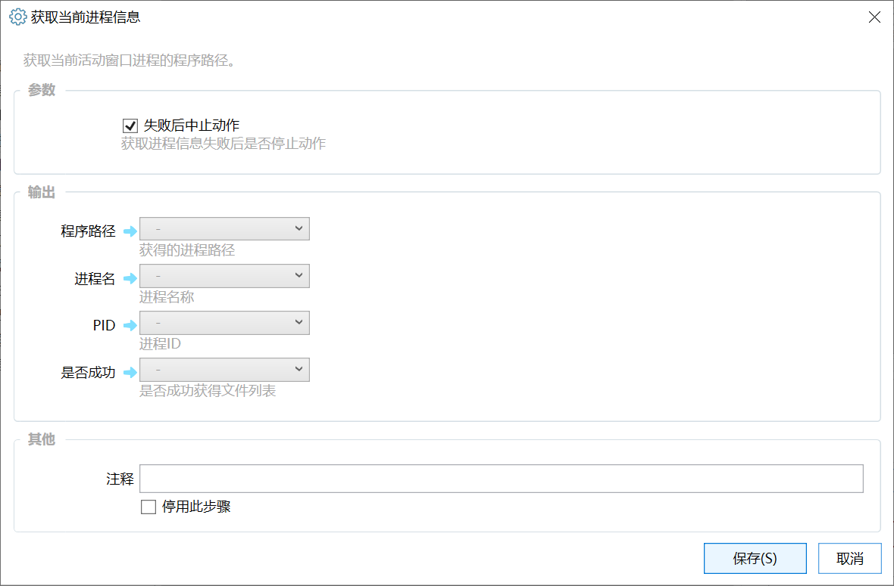

# 获取前台进程信息

获取当前活动窗口进程的信息。

## 当前模块定义

<XActionModuleMeta moduleKey="sys:getActiveProcessInfo" />

获取Windows活动窗口所属进程的信息。

## 参数

### 输出

【程序路径】进程exe文件的完整路径。

【进程名】进程名称，通常为去掉扩展名的exe文件名。比如记事本的进程名为“notepad”。

【PID】进程ID

【是否成功】是否获取成功。有时候会因为权限原因无法获得进程信息。
