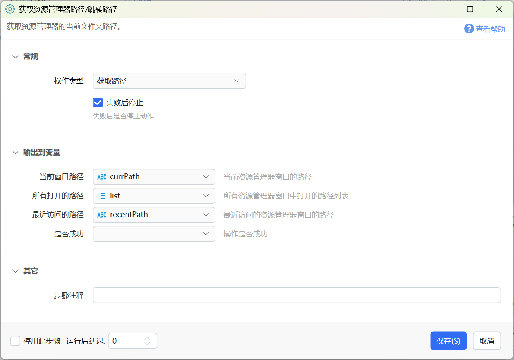
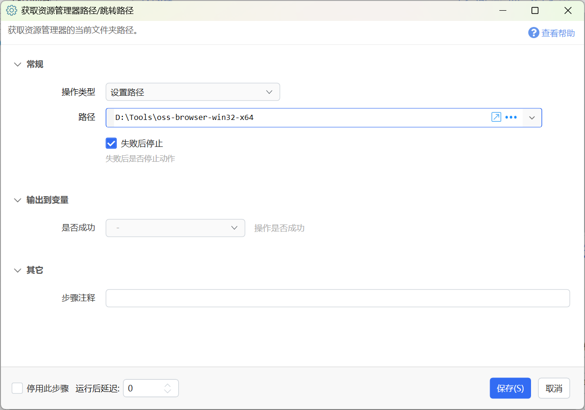

# 获取资源管理器路径/跳转路径

获取资源管理器的当前文件夹路径。

{/* xaction-metadata:start */}
## 当前模块定义

- 模块 Key：`sys:getExplorerPath`
- 分类：Windows系统（`System`）
- 类型：`Action`
- 风险操作：否
- 专业版：否

## 输入参数

| Key | 名称 | 类型 | 默认值 | 必填 | 变量模式 | 条件 | 说明 |
| --- | --- | --- | --- | --- | --- | --- | --- |
| `operation` | 操作类型 | `Enum` | getPath | 是 | `Input` |  |  |
| `path` | 路径 | `Text` |  | 否 | `Input` | 仅：setPath |  |
| `stopIfFail` | 失败后停止 | `Boolean` | true | 否 | `Input` |  | 失败后是否停止动作 |

## 输出参数

| Key | 名称 | 类型 | 条件 | 说明 |
| --- | --- | --- | --- | --- |
| `isSuccess` | 是否成功 | `Boolean` |  | 操作是否成功 |
| `output` | 当前窗口路径 | `Text` | 仅：getPath | 当前资源管理器窗口的路径 |
| `allPathList` | 所有打开的路径 | `List` | 仅：getPath | 所有资源管理器窗口中打开的路径列表 |
| `lastPath` | 最近访问的路径 | `Text` | 仅：getPath | 最近访问的资源管理器窗口的路径 |

## 选项值

### `operation` 操作类型

| Value | 名称 | 说明 |
| --- | --- | --- |
| `getPath` | 获取路径 |  |
| `setPath` | 设置路径 |  |
{/* xaction-metadata:end */}

用于获取当前资源管理器窗口的路径，或跳转到指定路径。

## 获取路径

获取资源管理器窗口所打开的目录路径。

输出参数

【当前窗口路径】当前具有焦点的资源管理器窗口路径。

【所有打开的路径】所有资源管理器窗口打开的路径的列表。

【最近访问的路径】（在使用其它软件时）获取最近打开的资源管理器窗口的路径。示例动作：[切换](https://getquicker.net/Sharedaction?code=b7a369da-ec8e-4d0f-764b-08d950c2afd2)

## 设置路径

用于跳转前台资源管理器窗口到指定的目录。

输入参数

【路径】需要跳转到的目标目录路径。
