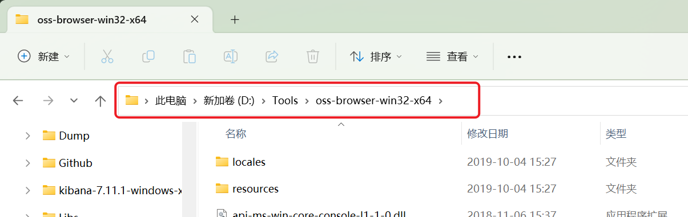

# 获取资源管理器路径/跳转路径

读取资源管理器当前目录，或让前台资源管理器跳到指定路径。要拿窗口里选中的文件，用 [获取选择的文件(夹)/选择特定文件](/v2/xaction/modules/getselectedfiles)。

## 当前模块定义

<XActionModuleMeta moduleKey="sys:getExplorerPath" />

## 概述

<ModuleParamPreview moduleKey="sys:getExplorerPath" />

## 参数说明

**操作类型**：获取路径、设置路径。

**路径**：仅 **设置路径**。要跳转到的目标目录。

**失败后停止**：失败是否中止动作。默认开启。

### 获取路径

<ModuleParamPreview
  moduleKey="sys:getExplorerPath"
  focusKeys={['operation', 'output', 'allPathList', 'lastPath']}
  values={{operation: 'getPath'}}
  outputVars={{output: 'currPath', allPathList: 'list', lastPath: 'recentPath'}}
/>

输出：

- **当前窗口路径**：当前具有焦点的资源管理器窗口路径。
- **所有打开的路径**：所有资源管理器窗口打开的路径列表。
- **最近访问的路径**：最近打开过的资源管理器窗口路径（在别的软件里也能取）。

### 设置路径

<ModuleParamPreview
  moduleKey="sys:getExplorerPath"
  focusKeys={['operation', 'path']}
  values={{operation: 'setPath', path: 'D:\\Tools\\oss-browser-win32-x64'}}
/>

让前台资源管理器跳到 **路径**。

## 输出

- **是否成功**：操作是否成功。
- 其余输出见上面「获取路径」。

## 示例

把另存为 / 打开对话框切到最近用过的资源管理器目录：

<StepProgramView example="b7a369da-ec8e-4d0f-764b-08d950c2afd2" />

<ShareLinkCard
  code="b7a369da-ec8e-4d0f-764b-08d950c2afd2"
  title="切换"
  description="另存、打开对话框，切换到最后打开的资源管理器目录"
  author="CL"
/>

## 限制与排障

只对 Windows 资源管理器窗口有效。第三方文件管理器通常读不到。设置路径时，目标目录需要存在。

## 相关链接

<RelatedDocs
  items={[
    {
      href: '/v2/xaction/modules/getselectedfiles',
      label: '获取选择的文件(夹)/选择特定文件',
      description: '读或改窗口里选中的文件。',
    },
    {
      href: '/v2/xaction/modules/selectfileinexplorer',
      label: '在资源管理器中定位文件',
      description: '打开所在目录并选中文件。',
    },
  ]}
/>
