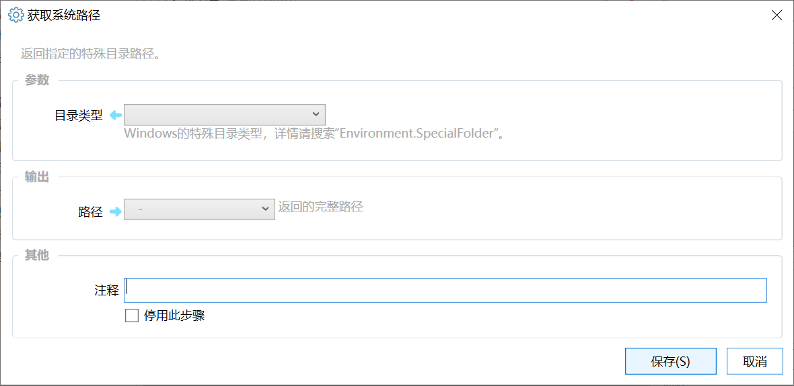

# 获取系统路径

返回指定的特殊目录路径。

{/* xaction-metadata:start */}
## 当前模块定义

- 模块 Key：`sys:getFolderPath`
- 分类：Windows系统（`System`）
- 类型：`Action`
- 风险操作：否
- 专业版：否

## 输入参数

| Key | 名称 | 类型 | 默认值 | 必填 | 变量模式 | 条件 | 说明 |
| --- | --- | --- | --- | --- | --- | --- | --- |
| `folder` | 目录类型 | `Enum` |  | 是 | `Input` |  | Windows的特殊目录类型，详情请搜索"Environment.SpecialFolder"。 |

## 输出参数

| Key | 名称 | 类型 | 条件 | 说明 |
| --- | --- | --- | --- | --- |
| `path` | 路径 | `Text` |  | 返回的完整路径 |

## 选项值

### `folder` 目录类型

| Value | 名称 | 说明 |
| --- | --- | --- |
| `AdminTools` | AdminTools |  |
| `ApplicationData` | ApplicationData 应用数据 |  |
| `CDBurning` | CDBurning |  |
| `CommonAdminTools` | CommonAdminTools |  |
| `CommonApplicationData` | CommonApplicationData |  |
| `CommonDesktopDirectory` | CommonDesktopDirectory |  |
| `CommonDocuments` | CommonDocuments |  |
| `CommonMusic` | CommonMusic |  |
| `CommonOemLinks` | CommonOemLinks |  |
| `CommonPictures` | CommonPictures |  |
| `CommonProgramFiles` | CommonProgramFiles |  |
| `CommonProgramFilesX86` | CommonProgramFilesX86 |  |
| `CommonPrograms` | CommonPrograms |  |
| `CommonStartMenu` | CommonStartMenu 通用开始菜单 |  |
| `CommonStartup` | CommonStartup 通用启动 |  |
| `CommonTemplates` | CommonTemplates |  |
| `CommonVideos` | CommonVideos |  |
| `Cookies` | Cookies |  |
| `Desktop` | Desktop 桌面 |  |
| `DesktopDirectory` | DesktopDirectory |  |
| `Downloads` | Downloads 下载 |  |
| `Favorites` | Favorites 收藏夹 |  |
| `Fonts` | Fonts 字体 |  |
| `History` | History 网络历史 |  |
| `InternetCache` | InternetCache 网络缓存 |  |
| `LocalApplicationData` | LocalApplicationData 本地应用数据 |  |
| `LocalizedResources` | LocalizedResources |  |
| `MyComputer` | MyComputer 我的电脑 |  |
| `MyDocuments` | MyDocuments 我的文档 |  |
| `MyMusic` | MyMusic 我的音乐 |  |
| `MyPictures` | MyPictures 我的照片 |  |
| `MyVideos` | MyVideos 我的视频 |  |
| `NetworkShortcuts` | NetworkShortcuts 网络位置 |  |
| `Personal` | Personal |  |
| `PrinterShortcuts` | PrinterShortcuts 打印机 |  |
| `ProgramFiles` | ProgramFiles |  |
| `ProgramFilesX86` | ProgramFilesX86 |  |
| `Programs` | Programs |  |
| `Recent` | Recent 最近 |  |
| `Resources` | Resources |  |
| `SendTo` | SendTo 发送到 |  |
| `StartMenu` | StartMenu 开始菜单 |  |
| `Startup` | Startup 启动 |  |
| `System` | System System目录 |  |
| `SystemX86` | SystemX86 |  |
| `Templates` | Templates 文档模版 |  |
| `UserProfile` | UserProfile |  |
| `Windows` | Windows Windows根目录 |  |
{/* xaction-metadata:end */}

用于获取特定的Windows系统文件夹路径。

## 参数

### 输入

【目录类型】指定要获取的系统目录类型。

可选值请参考[https://docs.microsoft.com/zh-cn/dotnet/api/system.environment.specialfolder](https://docs.microsoft.com/zh-cn/dotnet/api/system.environment.specialfolder?f1url=https%3A%2F%2Fmsdn.microsoft.com%2Fquery%2Fdev15.query%3FappId%3DDev15IDEF1%26l%3DEN-US%26k%3Dk\(System.Environment.SpecialFolder\);k\(TargetFrameworkMoniker-.NETFramework,Version%3Dv4.6.1\);k\(DevLang-csharp\)%26rd%3Dtrue%26f%3D255%26MSPPError%3D-2147217396&view=netframework-4.8)

### 输出

【路径】文件夹对应的实际路径。
