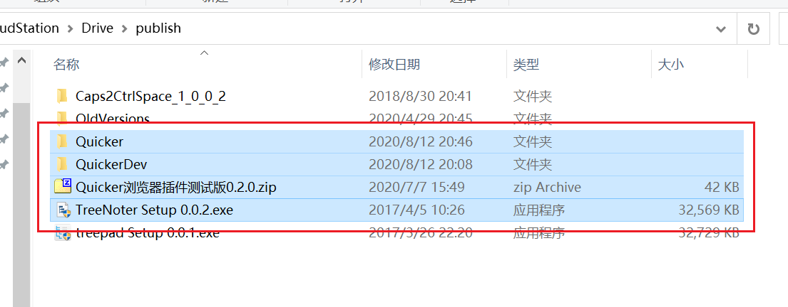

# 获取选择的文件(夹)/选择特定文件

读取资源管理器、桌面等处当前选中的文件，或在已打开的资源管理器窗口里改选中项。要新开窗口并定位到某个文件，用 [在资源管理器中定位文件](/v2/xaction/modules/selectfileinexplorer)。

## 当前模块定义

<XActionModuleMeta moduleKey="sys:getSelectedFiles" />

## 概述

<ModuleParamPreview moduleKey="sys:getSelectedFiles" />

## 参数说明

**操作类型**：获取选择的文件、设置选择的文件。

**失败后中止动作**：失败是否停止后续步骤。默认开启。

### 获取选择的文件

支持资源管理器、桌面，或其它文件管理软件。接口拿不到时，会尝试模拟 Ctrl+C 再读剪贴板。

<ModuleParamPreview
  moduleKey="sys:getSelectedFiles"
  focusKeys={['operation', 'waitMs', 'sortType']}
  values={{operation: 'getSelection', waitMs: '200', sortType: 'Default'}}
/>

**等待剪贴板时间**：走复制方式时，等待剪贴板变化的超时毫秒数。默认 `200`。

**排序文件列表**：多个文件时的排序。仅支持文件。点开下拉看当前全部选项。

输出：

- **是否成功**：是否拿到文件列表。
- **路径列表**：选中文件或文件夹的完整路径列表。
- **首个路径**：只选 1 个时就是它；多选时是第一个（不一定等于资源管理器里的视觉顺序）。
- **文件(夹)名列表**：不含所在目录。
- **首个文件(夹)名**：第一个的名称。
- **文件个数**：选中的个数。

### 设置选择的文件

让当前（或句柄指定的）资源管理器窗口选中某些文件。目录里文件很多时会比较慢。

<ModuleParamPreview
  moduleKey="sys:getSelectedFiles"
  focusKeys={['operation', 'pathList', 'winHandle', 'fileCount']}
  values={{operation: 'setSelection', pathList: 'filename.txt\nregex:exe$\npinyin:llq'}}
  outputVars={{fileCount: 'strValue'}}
/>

**路径或文件名**：每行一条规则：

- 完整路径（文件须在当前窗口目录里）
- 文件名
- `regex:正则` 匹配文件名
- `pinyin:拼音筛选词` 匹配文件名

**指定窗口句柄**：要操作的资源管理器窗口，留空表示前台窗口。仅支持资源管理器。

输出 **文件个数**：最终选中的个数。

## 限制与排障

设置选择不会自动打开新窗口。获取失败时先加大 **等待剪贴板时间**，并确认目标窗口仍在前台。

## 相关链接

<RelatedDocs
  items={[
    {
      href: '/v2/xaction/modules/selectfileinexplorer',
      label: '在资源管理器中定位文件',
      description: '打开所在目录并选中文件。',
    },
    {
      href: '/v2/xaction/modules/getexplorerpath',
      label: '获取资源管理器路径/跳转路径',
      description: '读或跳转当前目录。',
    },
  ]}
/>
