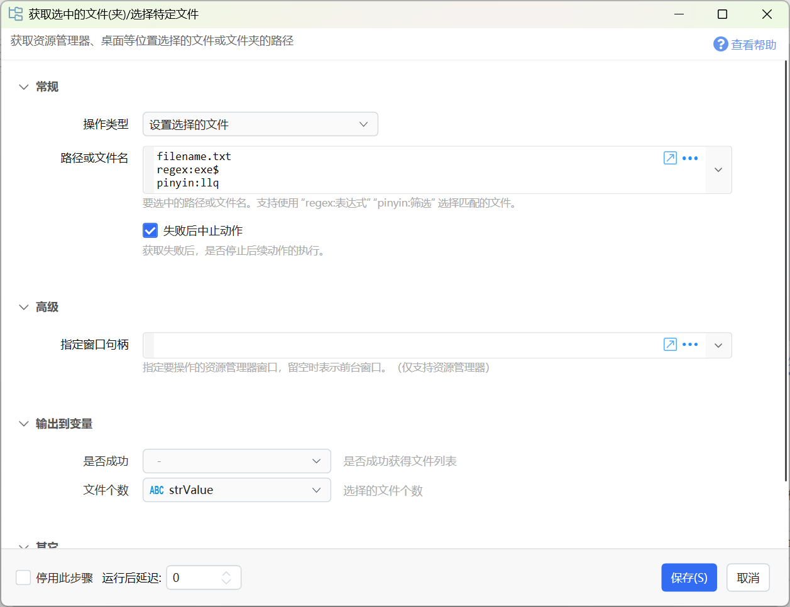

# 获取选择的文件(夹)/选择特定文件

获取资源管理器、桌面等位置选择的文件或文件夹的路径

{/* xaction-metadata:start */}
## 当前模块定义

- 模块 Key：`sys:getSelectedFiles`
- 分类：Windows系统（`System`）
- 类型：`Action`
- 风险操作：否
- 专业版：否

## 输入参数

| Key | 名称 | 类型 | 默认值 | 必填 | 变量模式 | 条件 | 说明 |
| --- | --- | --- | --- | --- | --- | --- | --- |
| `operation` | 操作类型 | `Enum` | getSelection | 是 | `Input` |  |  |
| `waitMs` | 等待剪贴板时间 | `Integer` | 200 | 否 | `UseVarOrInput` | 仅：getSelection | 通过复制方式获取选择文件时，等待剪贴板变化的最长时间毫秒数。 |
| `sortType` | 排序文件列表 | `Enum` | Default | 否 | `UseVarOrInput` | 仅：getSelection | 获取多个文件时，根据需要可以对文件列表进行排序。仅支持文件。 |
| `pathList` | 路径或文件名 | `Text` |  | 否 | `Input` | 仅：setSelection | 要选中的路径或文件名。支持使用 "regex:表达式" "pinyin:筛选" 选择匹配的文件。 |
| `winHandle` | 指定窗口句柄 | `Integer` |  | 否 | `UseVarOrInput` | 仅：setSelection | 指定要操作的资源管理器窗口，留空时表示前台窗口。（仅支持资源管理器） |
| `stopIfFail` | 失败后中止动作 | `Boolean` | true | 否 | `Input` |  | 获取失败后，是否停止后续动作的执行。 |

## 输出参数

| Key | 名称 | 类型 | 条件 | 说明 |
| --- | --- | --- | --- | --- |
| `isSuccess` | 是否成功 | `Boolean` |  | 是否成功获得文件列表 |
| `files` | 路径列表 | `List` | 仅：getSelection | 所有选中的文件和文件夹的路径列表 |
| `firstFile` | 首个路径 | `Text` | 仅：getSelection | 选择1个文件(夹)时，返回其路径；选择多个时，返回第一个的路径。 |
| `fileNames` | 文件(夹)名列表 | `List` | 仅：getSelection | 所有选中的文件和文件夹的名称的列表（不包含所在路径） |
| `firstFileName` | 首个文件(夹)名 | `Text` | 仅：getSelection | 选择1个文件(夹)时，返回其名称；选择多个时，返回第一个的名称。 |
| `fileCount` | 文件个数 | `Integer` | 仅：getSelection, setSelection | 选择的文件个数 |

## 选项值

### `operation` 操作类型

| Value | 名称 | 说明 |
| --- | --- | --- |
| `getSelection` | 获取选择的文件 |  |
| `setSelection` | 设置选择的文件 |  |

### `sortType` 排序文件列表

| Value | 名称 | 说明 |
| --- | --- | --- |
| `Default` | 默认（文件名自然排序） |  |
| `Origin` | 原始（系统返回顺序） |  |
| `FileName` | 文件名（字母顺序） |  |
| `FileNameNature` | 文件名（自然顺序） |  |
| `FileSizeAsc` | 文件大小（从小到大） |  |
| `FileSizeDesc` | 文件大小（从大到小） |  |
| `CreationTimeDesc` | 创建时间（从新到旧） |  |
| `CreationTimeAsc` | 创建时间（从旧到新） |  |
| `LastAccessTimeDesc` | 最后访问时间（从晚到早） |  |
| `LastAccessTimeAsc` | 最后访问时间（从早到晚） |  |
| `LastWriteTimeDesc` | 最后写入时间（从晚到早） |  |
| `LastWriteTimeAsc` | 最后写入时间（从早到晚） |  |
{/* xaction-metadata:end */}

支持两种操作类型：

-   获取当前选择的文件列表，支持资源管理器、桌面，或其它文件管理软件。
-   对当前资源管理器窗口，设置要选择的文件。

## 获取选择的文件

输入参数

【等待剪贴板时间】当无法通过接口获取选中的文件时，会尝试使用模拟Ctrl+C复制后读取剪贴板的方式。此参数设置等待剪贴板变化的超时时间。

【排序文件列表】如果需要，可以对获取的文件列表按指定方式排序。

【失败后中止动作】如果没有得到文件列表，是否中止动作。

输出参数

【是否成功】是否成功获得了文件列表。

【路径列表】获取到的选中文件或文件夹的完整路径列表。

【首个路径】选中1个文件或文件夹时，返回其完整路径；选择多个时，返回第一个路径（不一定对应于资源管理器里的顺序）。

【文件(夹)名列表】仅文件名的列表，不包含所在目录的路径。

【单个文件(夹)名】返回第一个文件或文件夹的名称（不一定对应于资源管理器中的顺序）。

【文件个数】所选择文件或文件夹的个数。

## 设置选择的文件

让当前（或通过句柄指定的）资源管理器窗口选中某些文件。

注：

-   如果目录中的文件较多，选择可能会需要比较长的时间。
-   对比“[在资源管理器中定位文件](/v2/xaction/modules/selectfileinexplorer)”：该模块可自动打开资源管理器窗口并选中指定文件。本模块仅用于选中当前（或指定的）资源管理器窗口中的文件。

输入参数

【路径或文件名】指定要选择的文件，每行一条规则，可以是这些：

-   文件的完整路径（文件存在于当前资源管理器窗口里）；
-   文件名；
-   通过`regex:正则表达式`设定要匹配的文件名。
-   通过`pinyin:拼音筛选词`设定要匹配的文件名。

【指定窗口句柄】特定需求情况下，可以指定要操作的具体窗口。

输出参数

【文件个数】最终选择的文件个数。
